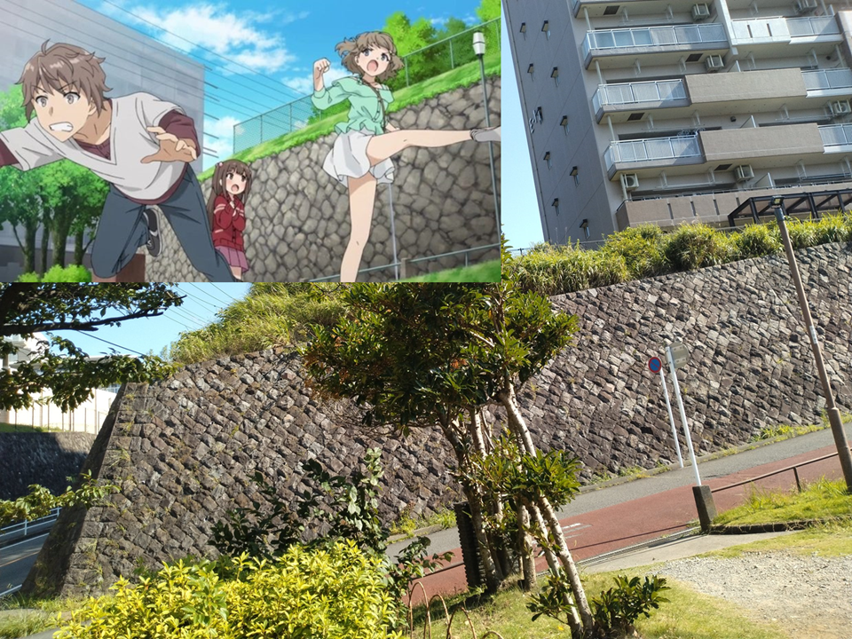

三連休の最終日の午前中を使って藤沢、七里ヶ浜、江ノ島へ行ってきた。

私の住む上野から彼らの暮らす藤沢へと向かう上野東京ラインに乗りながら『青春ブタ野郎』シリーズ（以下、青ブタ）のヒロインたちについてじっと考えていた。

桜島麻衣さんは普通に好きすぎる（一本筋の通った、タフなメインヒロインとして、読者の眼前に登場したときから完成されている）ので特に今回は書かない。牧之原さんはちょっと苦手かもしれない。

さて、もし私が高校生のころに青ブタを読んでいたら、双葉理央さんにメチャ萌え萌えしていた気がする（『キミキス』の二見瑛理子さんと同じラインのキャラクターとして）のだけれど、三十路のいまヒロインについて改めてじっと考えてみると、古賀朋絵さんのことをかなり好ましく思っている自分を発見した。

好ましく、というか、三十路のおじさん目線として「咲太くん、古賀ちゃんみたいな子は大切にしなきゃいけないんだよ」って言いたくなってしまうというか。ああいう、きっかけはよくわかんねーけど偶然にもなんとなくお互いを意識し続ける（必ずしも恋愛感情の意識だけではなくね）ような後輩先輩関係、男女関係――「ファジーな人間関係」ってこのエントリでは呼ぶけど――って、たぶん、高校生までにしかないものなので。（あくまで一般論として）大学生になると（主人公たる男性がどんな態度を取ろうが）もっと打算的な関係になってしまいがちだ（青ブタの大学生編は未読なのでどんな人間関係がそこにあるかはまだ知らない）。

さて、『プチデビル後輩』の後半の古賀ちゃんと咲太くんだが、古賀ちゃんが咲太くんに対して恋愛感情を抱いているのは明らかなのだが、対して咲太くんが古賀ちゃんに対してどんな感情を抱いているのかは読者からは見えにくいところにある。私としては、後半の咲太くんは、彼女に対して好感情――ウソの交際相手以上の感情を抱いていたように見える。二人が交際しなかったのは、単に咲太くんに桜島先輩がいたからだけであろう（ところで、青ブタのすごいところは、咲太くんの人間性も桜島先輩の人間性も二人の関係も『バニーガール先輩』の時点でソリッドにほぼ完成されているがゆえに、続刊ではそのソリッドさの上にファジーな人間関係をゆらゆらと積み重ねていけるところだろう）。

要するに、咲太くんが桜島先輩と抜き差しならない関係になっていなかったとしても咲太くんは古賀ちゃんに手を貸していただろうし、二人はウソの交際をしていただろうし、その当然の結果として二人の感情は変化していただろうし、抜き差しならない関係になっていなかったら二人が交際していることはぜんぜんあり得たよね、ということです。もっと噛み砕くと、桜島先輩に先に出会ったから（先に桜島先輩の思春期症候群を解消したから）桜島先輩と付き合うことになったのであって、古賀ちゃんに先に出会っていたとしたら（先に古賀ちゃんの思春期症候群を解消していたら）古賀ちゃんと付き合っていただろう、ということです。

咲太くんは、双葉さんとは（桜島先輩と交際していても）友情のようなものを持ち続けられるだろう（国見くん次第でどうなるかは本当はわからないのだが）。そう思えるほどには、咲太くんー双葉さんラインはソリッドであると思う（さもなくば『ゆめみる少女』でああも泣いてあげることはできないよね）。

一方の古賀ちゃんである。

咲太くんー古賀ちゃんラインは、咲太くんが古賀ちゃんときちんと「そうありたい」と願って、きちんとそのためのアクションをして、きちんと人間関係に手入れをし続けないと、いずれ消えてしまうような関係であると思っている。そういう、ファジーな人間関係が二人の間にはある。

私がもっと若い頃には「いっときのファジーな人間関係をいっときのままに消えるままにしてしまうのも青春」と宣っていた気もするけれど、いま切に感じるのは、青春の総決算とは、そういうファジーな人間関係をどれだけ大人に持ち越すことができたかにあるかに掛かっているということだ。ファジーな人間関係を「そういえばそういうこともあったね」と、思い出の箱に仕舞って、たまに思い出し、思い出さなくなり、やがて忘れる――それってかなり寂しいことだと思うのだ。私の反省だ。

まだ『おでかけシスター』までしか観てないから適当に書くけれど、花楓ちゃんもパソコンでお友だちとメールできるようになったことだし、咲太くんもカッコつけずにスマホを持って古賀ちゃんの話をたまに聞いてあげると――そうやって人間関係の手入れをするといいと思う。せめてイエデンを教えてあげてさ。桜島先輩はいい顔しないだろうけれど。桜島先輩がいい顔しなかったとしても、古賀ちゃんこそが『ゆめみる少女』でリョーシ的な存在になった咲太くんが頼ることのできた唯一の人物だった事実を、咲太くんにはそれなり以上の重みで受け止めてほしい（ああいうことしてくれる人間なんて、単なる後輩以上の存在ですよ）。

咲太くんと古賀ちゃんは、客観的な人間関係としては学校とバイト先の先輩後輩でしかなくて（フったフられたもループの彼方に消えてしまったことだしね）全くソリッドじゃない。普通だったらどちらかが卒業したらすぐに忘れてしまうような関係だ。

でも、やっぱり、二人の間には、先輩後輩以上の言葉にし難い人間関係がある。ファジーな人間関係、とは、言葉にし難いその人間関係だ。誰からも見えなくなった自分を観測して発見してくれる後輩なんて、タダ者ではないんだぜ。咲太くんは「ケツを蹴り合った仲」なんて茶化さずに、もっと真剣に古賀ちゃんとの人間関係について考えてあげた方がいい。

咲太くんが古賀ちゃんについて真剣に考えれば考えるほど桜島先輩はいい顔をしなくなるだろうが、だからと言って、古賀ちゃんから距離を置いたり茶化して見せたりするのは、古賀ちゃんと桜島先輩の両者にとって「逃げ」だろう。逃げるな。戦え。

咲太くんは、古賀ちゃんとの間に存在するファジーな人間関係を、彼なりに言葉を尽くして桜島先輩に説明する責任がある。人助けには、その後のフォローまで含めて責任が伴う。その責任を果たすことが（迂闊にも）助けてしまった二人への誠実さなのではないかね、と私は思います。


