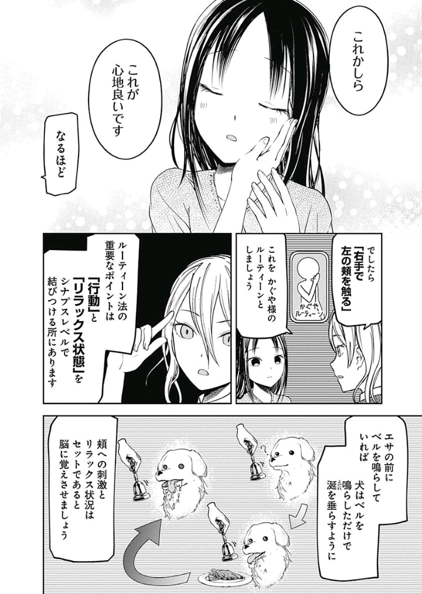

今回のエントリは、元から精神と身体を関連付ける訓練（＝瞑想）をしていた私が本格的に肉体を動かし始めたら（＝ジム）様々な発見が得られ、より発展的な訓練（＝ルーチン）を目指すようになるまでの日々を綴ったものです。

今年の5月末から身体の健康のためにジムに通っています。今日まで暦で約100日の間に約60日行ったことになります（全日メニューを記録しています）。

55日目ごろまでずっと「クロストレーナー」（足と手を連動させて動かすやつ、たぶん見たことあるから画像検索してね）を1回35分300kcal心拍数130～140BPMを目安にやっていたのですが、最近はマシントレーニング（胸を鍛える「チェストプレス」、背中を鍛える「ローロー」）を始めました。下半身（クロストレーナー）の休息日に上半身を鍛える目的でしたが、なんとなく両方やる日も多いですね。

クロストレーナーは虚空を見つめながら虚無を漕ぐトレーニングなので、その間に考え事できるのが長所ですね。ずっと次の小説の構想、ネタ出し、その思い出しニタニタをしているんですが……。とにかく、下半身を鍛えながらも頭と手元が空くのがいいところ。

さて、マシントレーニングは、基本的にはゆっくりと息を吸って重りを押すなり引くなりして、ゆっくりと息を吐いて重りを引くなり押すなりするトレーニングです。ポイントは、ゆっくりとした呼吸を繰り返す点。重りを動かした回数を数えることになるので、必然、そのゆっくりとした呼吸で数を数えることになります。10回1セット×3セットの30カウント。チェストプレスは30カウント、ローローは両腕でやるやつと、片手ずつでやるやつの3つで90カウント。

要するに、マシントレーニングでは、30～90カウントをゆっくり数えるってことです。

ところで、私は今年の3月半ばから精神の安定のために瞑想を行っています。今日まで暦で約170日の間に約150日実施しています（これも全日記録しています）。私の瞑想は「数息法」と呼ばれる、ゆっくりとしたスピードで呼吸（だいたい、3～4秒で吸ってて、それより少し短い秒数で吐く）を繰り返し、その数を頭の中で数える瞑想です。

「（吸って）い～～～（吐いて）～～～ち」「（吸って）に～～～（吐いて）～～～い」……ってイメージ。

これを150日くらい続けてるとどうなるかって、20カウントくらいゆっくり数えると心が凪いで集中できるようになるんですよね。鍛えたので。最短で10カウントもあれば平常心になれます。時間にして2～3分ですかね。ここでの集中力の向上や平常心の回復は「マインドフルネス」とか呼ばれたりもしますね。このエントリでもそう呼びます。

要するに、瞑想では、20カウントをゆっくり数えるってことです。

オッ、似てますね……。マシントレーニングのカウントと瞑想のカウント。どちらもゆっくりと呼吸しながら数える点で似通っているんですよね。瞑想の素地を整えた人がマシントレーニングをすると、両者とも同じプロセスを経るので、同じ結果＝マインドフルネスが得られるんです。いや、マジで。

そういうわけで、私はいま、マシントレーニングによる瞑想効果と、瞑想そのものによる瞑想効果との二つを手にしたワケです。瞑想効果は、マインドフルネスをもたらしてくれます。

この話、まだ発展します。

ところで、皆さんは「ルーチン」ってメンタルコントロールをご存じでしょうか？　マインドフルネスを得るための予め決められた一連の手続き（＝ルーチン）を身体と精神に日常から染み込ませておき、本番でもそのルーチンを行うことで、本番でもマインドフルネスを得られる……というような手法です。漫画『かぐや様は告らせたい～天才たちの恋愛頭脳戦～』でも、恋に乱れる四宮かぐやちゃんが平常心を取り戻すために習得していましたね。



このルーチンの習得、応用方法のひとつに、マインドフルネスと結びつけられる（ある程度の長さを持った）一連の手続きを身体に染み込ませた後に、その一連の手続きを短縮していく、というものがあります。例えば、手続きA～Dを必要としていたものを、手続きA～C、手続きA～B、手続きAのみへと縮めるってやり方です。

本番のまさにその一瞬のマインドフルネスを得るために1時間も必要だったら意味ないですからね。一連の手続きを短く、単純にしましょうって発想です。『BLEACH』の「詠唱破棄」とかイメージして下さい。読んだことないんで知らないんですけど、たぶんそんな感じです。

私はいま、このルーチンを習得しようと試みています。マシントレーニングと瞑想をガッチャンコさせて、より効果の高いマインドフルネスを得ようって発想です。

ジムから帰宅後の流れは後述の手続きから構成されています。この手続きのおかげで自分がマインドフルネスを得られることは実感しています。ただ、長いんですよね。

ジム→帰宅、手洗い→プロテインシェイカーのシェイク→目薬1→瞑想→目薬2

これ、だいたい1時間近く掛かります。

そこで先述の「詠唱破棄」の登場です。

最終的には「目薬1→瞑想→目薬2」まで縮めて、しかも、瞑想単体の瞑想効果ではなく、マシントレーニングによる瞑想効果と瞑想による瞑想効果の二重の瞑想効果を得たいと思っています。習得するまでには何十回という訓練が必要でしょうし、ジムって1日1回しか行けないので、それだけの何十日という日数が必要になってくるでしょう。

しかし、習得できた暁には、今よりも遙かにタフなメンタルが得られると信じています。

結果は追って報告します。

参考文献

「ルーチン」の「詠唱破棄」について

『習得への情熱　チェスから武術へ――上達するための、僕の意識的学習法』（ジョッシュ・ウェイツキン）



「ルーチン」の例について

『かぐや様は告らせたい～天才たちの恋愛頭脳戦～　9』収録「第81話☆かぐや様は触りたい」（赤坂アカ）


