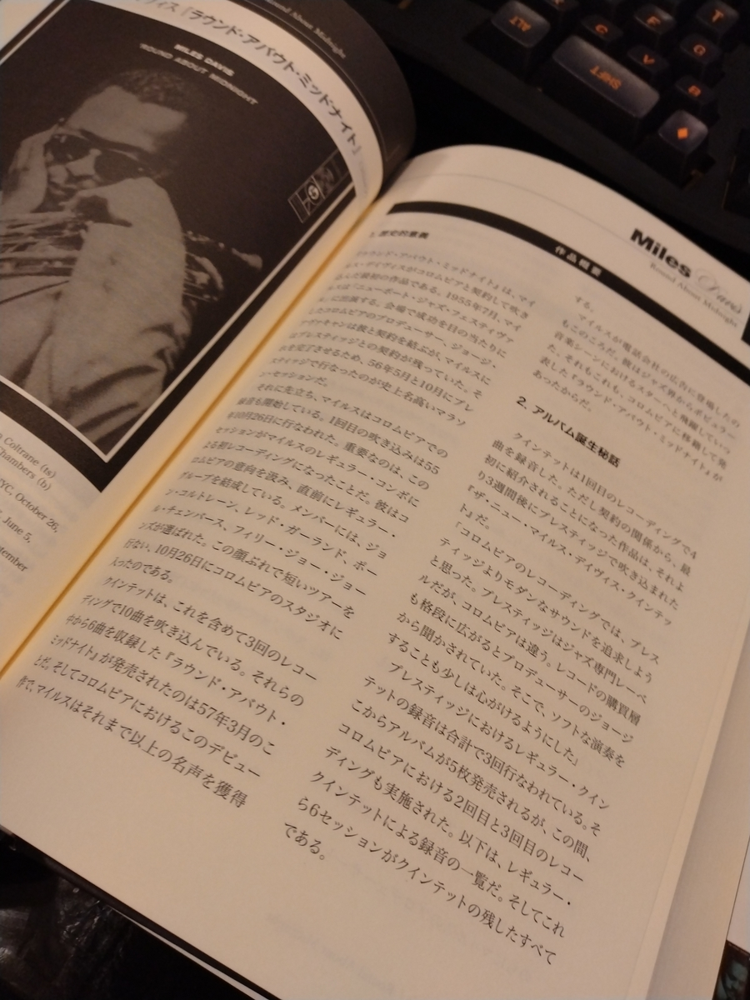
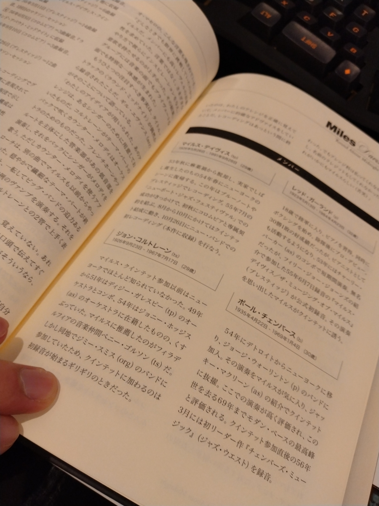
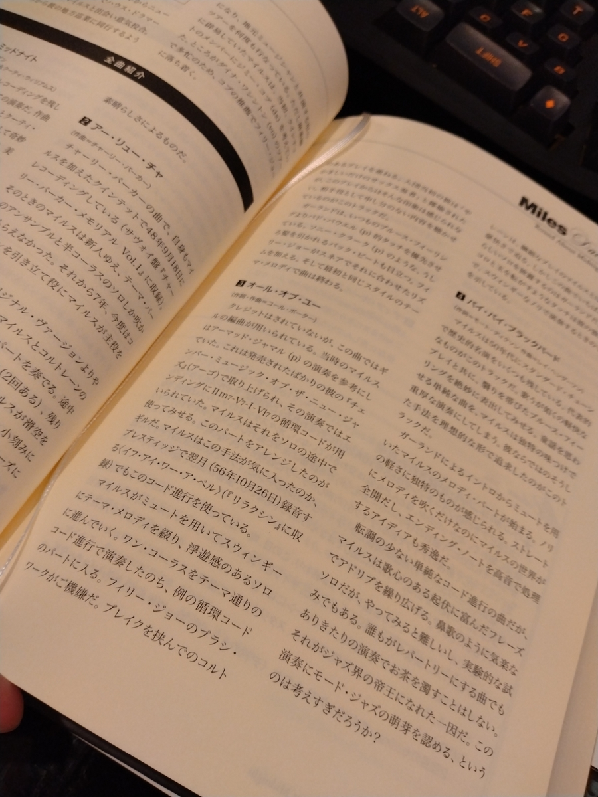

音楽、聴いてますか？

私は聴いています。この11月からジャズを本格的に聴き始めました。

思い返すと、10代半ばに伊坂幸太郎の小説になんだか出てきたのをスポット的に聞こうとしたり、10代後半に舞台で使おうとちょっと聞いたりと、ジャズとはつまみ食いの付き合いでした。

今回はガチです。

なんか、Spotifyって音楽聴き放題サービスあるじゃないですか。いっっつもアニメの音楽と電子の音楽とディスコの音楽を流していたんですよね。コロナ禍前後から追いかけてる音楽家もジャンルも変わってなかったんですよね。でも、ある日ふと気付いたんですよね。

ずっとやりたかったジャズの勉強、できるんじゃね？って。

つーわけで、ジャズ本を本屋で片っ端から調べて、ちょうどいい一冊――『ジャズ超名盤研究』（小川隆夫）を教科書とすることにしました。

本書の選定理由は、

- 元は雑誌『スイングジャーナル』に連載されていたレビューであるため、信頼できる。
- 各レビューがアルバムのリーダーおよび各曲について過不足ない記述でまとまっているため、読みやすい。
- 1冊で紹介しているアルバムの数が34枚であるため、全部聴くのが現実的な数字である。
- 34枚が古い順に並んでいてるため、演奏技法の発展を時系列的に追いかけることができる。

という点で類書より圧倒的に優れているためでした。

↓こんなのが34枚分あります。









ということで、少なくとも34枚は聴いていく予定です。

ってのを旧Twitterやマストドンでワーワーやってたらどんどんオススメを教えてもらったので、どんどん増える見込みです。

11月に聴いたアルバムは以下の9枚です。

①『Kind Of Blue』（Miles Davis）
気怠げで落ち着く。

②『Strange Fruit』（Billie Holiday）
歌モノはちょっとよくわからなかった。

③『Surf Ride』（Art Pepper）
「Surf Ride」がアッパーで気持ちいい。

④『The Genius Of Charlie Parker #3』（Charlie Parker）
「Now's The Time」から「Confirmation」の流れがエグいて。

⑤『A Night At Birdland Vol.1 & Vol.2』（Art Blakey）
「Quicksilver」がヘビロテ。

⑥『A Night In Tunisia』（Art Blakey）
『A Night At Birdland Vol.1 & Vol.2』があまりにも良かったので別のアルバムも。
「A Night In Tunisia」のドラムが格好良すぎる。

⑦『Helen Merrill』（Helen Merrill）
「You'd Be So Night Nice To Come Home To」で歌モノの良さが分かってきた気がする。

⑧『'Round About Midnight』（Miles Davis）
「'Round Midnight」で「表現力」という概念を知りました。

⑨『Saxophone Colossus』（Sonny Rollins）
サクソフォンの評判の高いアルバムだが、ドラムも気持ちいい。
