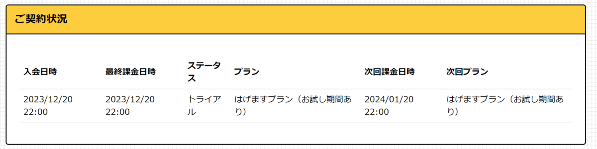

デイリーポータルZが独立するらしいので、「はげます会」（月額1100円）に入会しました。







公開インターネットで発信する手段をこのブログしか持たないのでこのブログで書きます（この報告は公開インターネットでしなければならない報告だと思いますし）。

デイリーポータルZのことは、新卒で入った会社の昼休みには読んでいた記憶があるので、少なくとも7年は読み続けていることになります。毎日、デイリーポータルZの「愉快な気分になりますが、役に立つことはありません」のキャッチコピーの通り、まさにその「役に立たなさ」に愉快さを感じていました。ありがとうございます。メンタルを崩してグズグズになってる時にもデイリーポータルZでちょっと元気になったりしました。むしろ、そういうときにはデイリーポータルZしか読めなかったと言っても過言ではない。

ありがとうの気持ちを込めて「はげます会」の会員になりました。

これからも応援しています。
