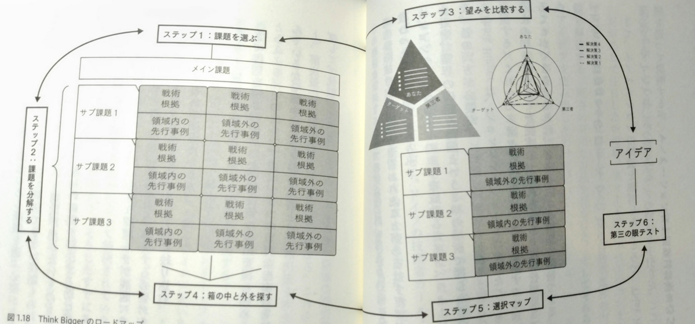

本の感想のリアルタイムなまとめは Mastodon 限定コンテンツですが、外向けにもまとめておきたくなったので。定期的にやるかは不明です。

①『小説集　Twitter終了』 （青井タイル、他）
②『日本のものづくりを支えた　ファナックとインテルの戦略（柴田友厚）
③『THINK BIGGER 「最高の発想」を生む方法』（シーナ・アイエンガー）
④『流体力学超入門』（エリック・ラウガ） 
⑤『ギケイキ　千年の流転』（町田康）
⑥『うどん陣営の受難』（津村記久子）

## ①『小説集　Twitter終了』 （青井タイル、他）

Twitterは死に体で延命し、『小説集　Twitter終了』という商業で本が出たことで作者らはTwitterの外への可能性を感じさせている、というのは皮肉なシチュエーションなのかもしれない。そういうことを感じながら読みました。そして、何人かは実際にTwitterの外へ出ることに成功している。
私がTwitterでビッグリスペクトしていた何人かは表舞台に出ることに成功し、何人か失敗し、何人かはそういう「表舞台」を目指す価値観それ自体から離れた。
価値観が近くて味わい深かったのは、やはり今もつきあいのある青井タイル「オタクどもの聖霊降臨日」と根谷はやね「もう一人のあなたを作る方法」、それからTwitterってこうあってほしかったなと思わせる乙宮月子「近くて遠い二人の距離」。



## ②『日本のものづくりを支えた　ファナックとインテルの戦略（柴田友厚）

読み物として面白かった。
ハードウェア（工作機械）とソフトウェア（半導体）とが融合し、新たな産業が立ち上がっていく様子が克明に描かれる。富士通からスピンアウトして誕生したファナックと当時ベンチャーだったインテルとの協業の産物がCNC工作機械なんですね。両社とも、CNC工作機械のコンセプトが商品化されるときには新興のメーカーだったが、著者によるとむしろそれが功を奏したと。
工作機械は、NC工作機械（真空管入り）からCNC工作機械（半導体入り）へと進化した。この際に、NC工作機械で勝っていたアメリカの工作機械メーカーは、当時の基準で高品質な工作精度を求める自動車産業・航空機産業の既存の顧客を優先していたためにいわゆる「イノベーションのジレンマ」に陥っていた。一方のファナックはある意味では身軽だったおかげで、新技術である半導体を貪欲に採用することができた。
ファナックの躍進が幸運の産物であり結果論も多い（著者自身も認めている）のだが、製品の機能のモジュール化、インターフェースの共通化、密接なフィールドエンジニアリングについてはいま読んでも学ぶ所はあるだろう。



## ③『THINK BIGGER 「最高の発想」を生む方法』（シーナ・アイエンガー）

本書のエッセンスは、究極的には下図だろう。



私たちは何を求めて「最高の発想」のための本書を手に取るだろうか？　一言で言えば「課題を解決するため」だ。では「課題」とは？　本書はつまり「課題」を特定し、解決するための手法を教える本だ。
発想を生むためのプロセスは次のようなものだ。本書は課題を「サブ課題」へと分割せよと説く。サブ課題を解決することで叶えられる望み（私の望み、当事者の望み、第三者の望み）を比較する。この望みとは、困りごとと言い換えてもいい。そのための既存の解決手法（＝選択肢）を、業界の内側と外側の両方から探す。既存の選択肢同士を掛け合わせ、新しい選択肢を生み出す。ゼロベースの発想ではない点がポイントだ。最後に、第三者からの目から見て「課題」を評価する。
ノウハウとしては、課題に対して具体化・抽象化を繰り返すことで「意味があるほどには大きいが、解決できるほどには小さい課題」に落とし込む、選択肢は5±2に絞る、アイデアは量より質（ただし、量を出した後に粘り強く考え続けることでしか質に辿り着けない）、等々。
脇に逸れるが、私の前職は特許事務所での技術者で、クライアント企業の発明者から生まれた発明（＝アイデア）を「解決したい課題」「課題を解決するための解決手段」「解決手段が奏する有利な効果」に分解する訓練を受けていた。この訓練は私の創造性を養った気がする。
つまり、発明（＝アイデア）とは、課題ファーストであって、課題を解決するための解決手段を見つけることであると叩き込まれた。そして、解決手段とは、往々にしてゼロから生み出されたものではなく、既存のアイデアの組合せである、とも多くの発明を扱うことで経験的に理解された。
もの作りに携わったことのある人なら誰でもそういう経験はあると思う。そういう経験知がより精緻に、より深く踏み込んで、より具体的に説明されていた。最高の発想の再現性を高めていこう。



## ④『流体力学超入門』（エリック・ラウガ）

大学での研究テーマが流体力学だったので手に取った一冊。よい復習＆頭の体操になった。流体力学を概観するのにちょうど良く、学部生のときの、まさに流体の研究を始めるその時に読みたい（あってほしい）一冊だった。もとはオックスフォードの「Very Short Introductions」シリーズとのことで一気読みするのにちょうどいいサイズ感。



## ⑤『ギケイキ　千年の流転』（町田康）

「これからは町田康を読もう！」と決心した一冊。

クソ笑いながら読みました。室町時代に成立した軍記物語である『義経記』を現代風にアレンジした小説なんですが、その頭で読むと書き出しから殴られます。

> 「かつてハルク・ホーガンという人気レスラーが居たが私など、その名を聞くたびにハルク判官と瞬間的に頭の中で変換してしまう」

現代である。地名もいまの四十七都道府県で書かれたりするし、西暦が使われたりもする。ぶっ飛んでいる。

しかしながら、ここが町田康のすごいところ。源義経を始めとする人物、みな「っぽい」のだ。地元のヤンキー（ジモヤン）っぽさがあるが、当時の死生観（と読者が思ってしまう価値観）がガンガン滲み出ているのです。一言で言うと、躊躇いなくめっちゃ人を殺すのです。そういう時代だったので、と。

現代の書きぶりと当時の価値観とが調和して、謎のバイブスが生まれている。それが『ギケイキ』。
小説技法の話を真面目にすると、ファンキーでぶっ飛んだ語り口の割合（っていうのかな？）がコントロールされている点が見事である。シリアスな場面でそうすることでかえって面白みを感じさせたかと思えば、本当に重要な場面では当時の価値観を強調し緊張感を与える。メリハリがあった。



## ⑥『うどん陣営の受難』（津村記久子）

新書サイズで100ページの掌編。会社の代表選挙にウンザリしている女性社員のお話。主人公は三番手の勢力に緩やかに連帯しているのだが、一番手と二番手との決選投票になってしまい、両陣営から陰に陽にアプローチを受ける。同僚はより激しく投票の誘いを受け……、ととにかく社内政治に辟易していく様子が鮮やかに描かれる。
小さな会社の社内イベントに見えるけれど、これは私たちが向き合うべき「政治」の話であると感じられた。応援したい候補は弱い。それを勢力で上回る陣営はくそである。それでも自分で考え、投票を放棄せずに誰を選ぶか決めなければいけない。コミカルな筆致だけれどシリアスなテーマでした。


