大垣にやってきた。

『青春ブタ野郎はバニーガールの夢を見ない』（以下、青ブタ）をJR東海が「推し旅」の一環として「青春ブタ野郎は大垣の街をまだ知らない」と銘打って大垣でキャンペーンしたからだ。大垣に来たのは初めてである。次に来るのはいつかわからない。だから目一杯楽しもうと朝9時から大垣入りした。部屋を出たのは朝5:30である。前夜は興奮でなかなか寝付けなかったし早期覚醒してしまった

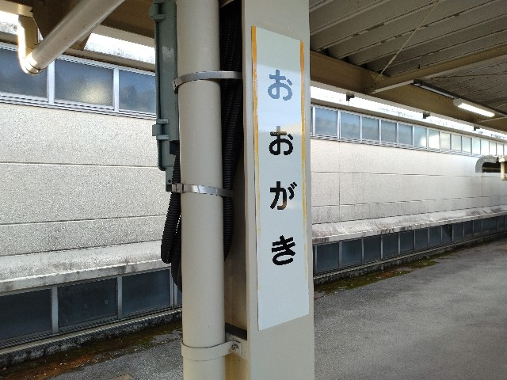

大垣駅の改札を出てメイン通路に出た瞬間に感動を覚えた。桜島麻衣さんが「いる」のである。このブログの読者には今さら説明し直す必要もないと思うが、麻衣さんは今をトキメく女優さんである。そういう彼女が駅のメイン通路を堂々と飾っている。「実在性」（という言葉も使い古されて久しいが）を感じた。

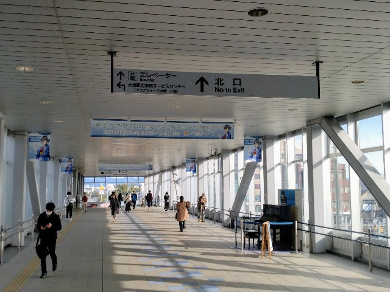

作中での大垣は、ビジネスホテルに泊まっただけの「JRの終点」に過ぎない。しかし今こうして大垣に数々のポスターが掲出されている。彼女は大垣に少なからず縁を感じて自ら企画したのかもしれない……そう思わせてくれるだけの力の入れようだった。

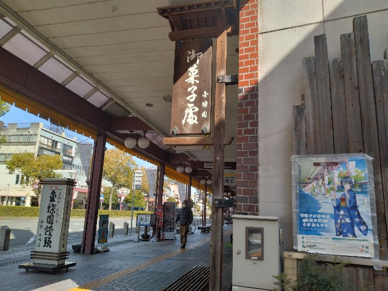

さて、大垣でのキャンペーンは、

- デジタルスタンプラリー
- ARフォトフレーム
- 飲食店コラボ

の3つからなる。

結論から言えば、デジタルスタンプラリーとARマップ（目的地で特別なフォトフレームを使える）は全て集め、飲食店コラボも3ヶ所回ることに成功した（朝の休憩、昼食、夕食。朝の休憩では印象に残ったエピソードがあるので後述する）。スタンプラリーは7ヶ所、ARマップは6ヶ所、飲食店コラボは10ヶ所、合計23ヶ所のうち16ヶ所を回ったこととなる。

これだけの数のスポットがあったが、コースはよく練られていた。大垣は「水の都」と呼ばれており、そこらここらを水路が走り、湧き水もある。それらを漏らすことなく巡るように、しかもコースが煩雑にならないように注意深く設定されていたように思う。1ヶ所漏らしたため後戻りすることになったが、一筆書きでクリアできるだろう。

ルートの中心には大垣城が位置する。

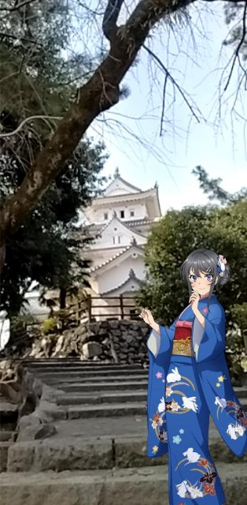

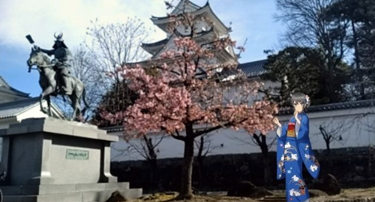

大垣城は、関ヶ原の戦いにおいて石田三成が本拠地とした城とのことで西軍びいき、特に石田三成びいきで、徳川史観とでも呼べる標準的な戦国時代とは異なっており、なかなか刺激的だった。一言で言えば、徳川家康がワルモンだった。

コースの終点は、「奥の細道むすびの地記念館」だ。大垣で最も史料の充実した記念館だろう。

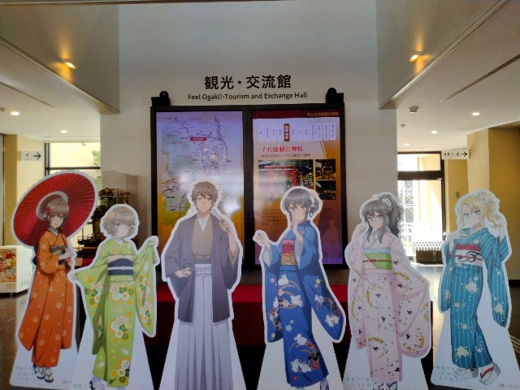

本来、スタンプラリーのついでに来るような場所ではなく、ここを目的地として来るべきところであろう。疲弊していた（5:30に起きて9:00から大垣を歩き始め、11:30に到着）ので、軽くなぞるような見学しかできなかった。心残りである。

時系列は前後するが、朝の休憩の印象的なエピソードだ。お饅頭で有名な「金蝶園総本家」を訪れた際に、お年を召された女性の店員さんから親しみを込めて「どこから来たのか」「何時に来たのか」「今日は泊まって帰るのか」と訊いてもらえた。津々浦々から「青ブタさん」（大垣を訪れる青ブタのオタクのことを私はそう呼んでいるが）が大垣に降り立ち観光していることの証左だろう。（たとえリップサービスだとしても）受け入れて頂いているようで、嬉しかった。また、（貫禄からすると店主であろう）おじいさんから「麻衣ちゃんか人気なんだって？」とコメントがあった。（やはりリップサービスだとしても）関心を示してくれていることが嬉しかった。

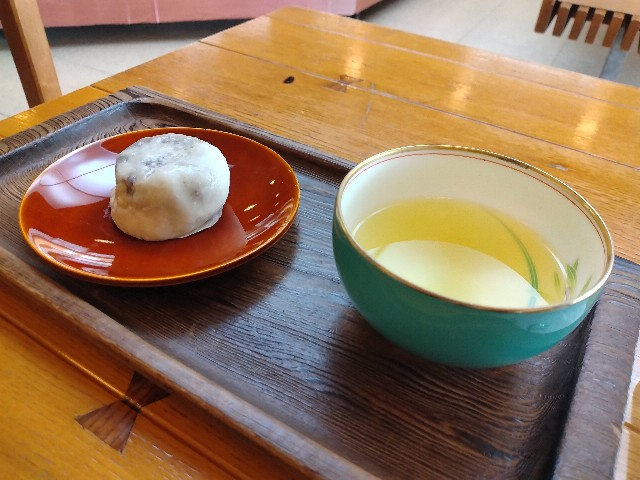

昼食は「駅前さらしな」。お客さんが途絶えることなく入っておりてんやわんやだった。

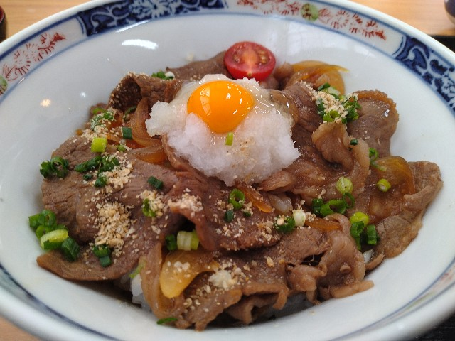

これは笑い話として受け止めてほしいエピソードだが、お会計時に何も申し出ていないのに（飲食店コラボでは、お会計時にコラボカードをもらえるのだ！）スッとコラボカードを差し出され、それだけ「青ブタさん」のオーラが醸し出されていたということだ。

夕食の「パスタハウス・スズヤ」でも同じくスッと差し出された。

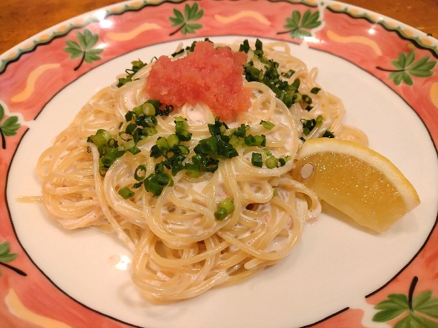

結局は、明らかにその土地のものではない一人旅の男性は「青ブタさん」ということなのだろう。逆説的に、そのような対応に至るほど多くの「青ブタさん」が大垣を訪れていたということだ（午前中に私が数えられただけでも20組の「青ブタさん」がいた。午後入りする人数を数えると、人口15万人の大垣市にとってはかなりの観光客だろう）。

泊まりは「スーパーホテル大垣駅前」だ。ここはアニメで麻衣さんと咲太が宿泊したホテルのモデルとなったホテルだ。

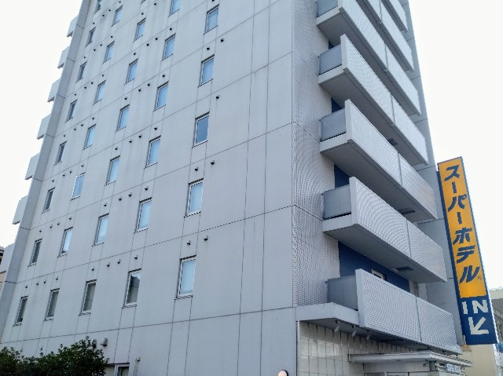

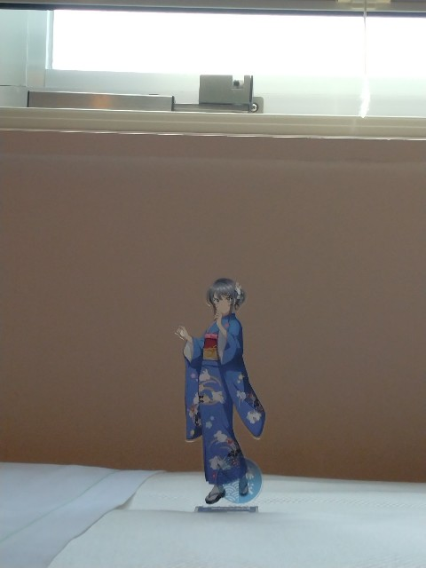

喫煙ルームで予約したのだが、幸運にも禁煙ルームに変更してもらえた。ありがたい限りである。

天候にも恵まれ、スポットを回りたいだけ回れ、ホテルではちょっと昼寝までできて、総じて朝イチから入るだけの価値のある旅行だった。

「青ブタさん」（要するに、オタク男性である）を（少なくも表面上は）受け入れてくれた大垣市に感謝である。

「青春ブタ野郎は大垣の街をまだ知らない」と銘打たれた企画だったが、少しだけ知ることができた。

良い旅行だった。

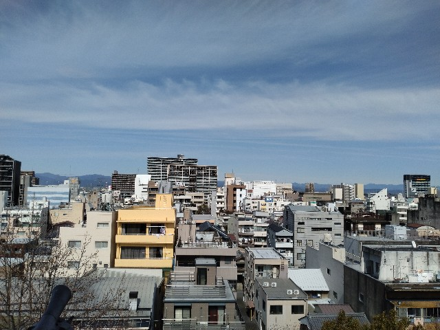

週明け月曜日に追記

大垣の街並みの記憶が「アニメ」になってきた。アニメのキャラクターのことを想いながら一日を過ごしていたからだろう。それを含めて面白い体験だった。
