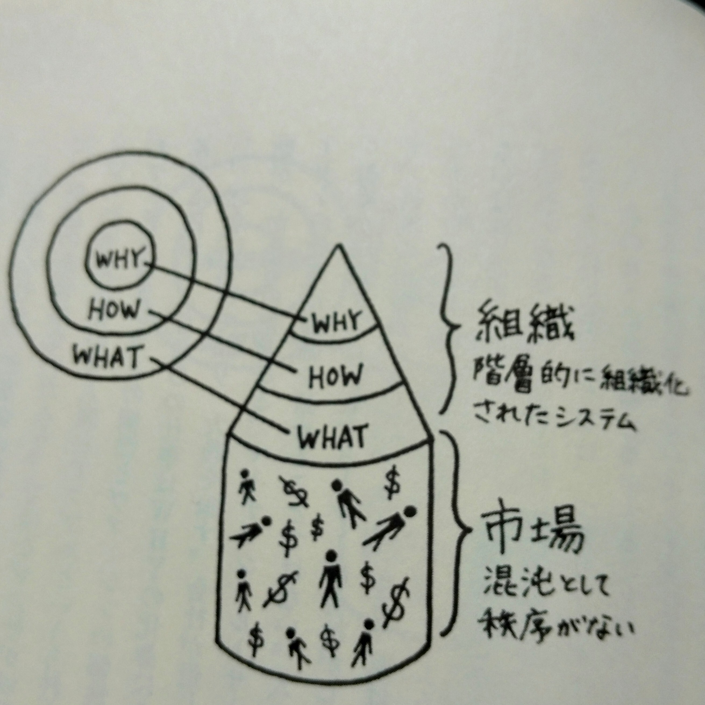
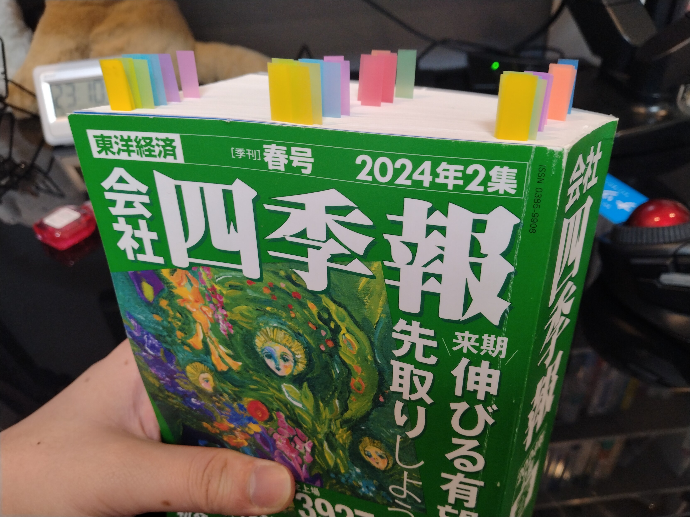

1. 趣味
2. 健康
3. 財政
4. 仕事

## 各目標の進捗状況

1. 趣味
   1. ラノベ：0文字（累計1.5万文字、ペース不足）
   2. ジャズ：8枚（昨年11月から累計56枚、累計100枚に対して目標以上のペース）
2. 健康
   1. コンビニ：夕食のために已むなく1回行った。習慣化は防げている。
   2. ジム：11回（累計40回。年間160回ペース。年間200回に対してペース不足）
ジム年間200回ペースは健康的な生活を営む上で無理がある数字だとわからせられてきました。ジム年間150回に下方修正します。
3. 財政
   1. コンビニ：同上。
   2. 本屋：行きまくった。詳細は後述。4月は当初の目標通り行かないように。
4. 仕事
   1. 外注マニュアル：PJ凍結中。
   2. 中国語：中国語会話を継続中。

4月度は旧ツイッターの使用を一時的に停止します。積ん読を猛烈に崩し、ラノベを猛烈に書いていきましょう。

## 本の感想

### ①『限りある時間の使い方』

人生の選択肢が無限に広がっているという希望を捨てよ。
覚悟を決めて、できないことをできないと認め、やらないことをやらないと決め、選択肢を減らし、残ったことに全力でコミットする。無限のやりたいことリストを「妥協」して有限に減らし、減らし、とにかく減らして残ったものに全力になる。
有限性を受け入れることで初めて残されたものに全力になれる。本当にやりたかった、残されたものをやり切るためには、やりたくもないのにやってる（意識的にか無意識的にかはわからないが）優先度の低いものを後回しにし（これもまた「妥協」のひとつである）、優先度の高いものしかできないと諦める。残されたものをやり切るためには忍耐が必要である。その瞬間の忍耐を受け入れ（他のものを差し込んで後回しにせず）、忍耐それ自体を楽しむ。
人生に準備期間はない。一瞬一瞬が本番だ。選択肢が無限に広がっているという幻想を捨て、この瞬間の有限の選択肢を決断することで、ようやく本物の人生を生きることができる。
さて、折しも私は数年前にとある資格を諦めて別の職を探して今に至った身で、去年は病気が重くなって限界を思い知らされ、人生の有限性を感じているのがここ数年でありまして、ここ半年ほどの私は、出来ること・したいことを減らすのが人生なんだなと感じておりました。ブログに目標を掲げたのも、したいことにフォーカスし続け、どうでもいいことを人生から取り除くためでもあります。



### ②『Jazz The New Chapter～ロバート・グラスパーから広がる現代ジャズの地平 』（柳樂光隆）

近年のジャズに親しみたいなら柳樂光隆さんの本から入門するとよいよと有識者から勧められて。先月聴いていたロバート・グラスパーの『Black Radio』および『同 2』はこの影響。他にもロバート・グラスパーに繋がるネットワークが紹介されていたので折に触れて読み直したい。





### ③『得する株をさがせ！会社四季報公式ガイドブック』

四季報（3月半ばに最新号が出ます）をこれから読んでみようと思うのでその予習に。自分の投資方針を云々するよりむしろ他のプレイヤーがどこを見て何を考えているのかを推し量るために読んでみた感。普通に勉強にもなりました。



### ④『図解入門　よくわかる　最新　鉄道の技術と仕組み』（秋山芳弘）

仕事のために読みました。特に感想はないけど記録のために投稿。



### ⑤『株式売買スクール』（ギル・モラレス、クリス・キャッチャー）

『オニールの成長株発掘法』をオニールの下で実践した著者によるレポート。ただ、マジで難しい。技法としては、いわゆるカップウィズハンドルを形成し切る前にエントリーする「ポケットピボット」、市場動向を探る「マーケットダイレクションモデル」、そして空売りの手法がチャートと共に紹介されているのだが、これらを念頭に置きつつ、実地でチャートを観察しなければ自分のものとは出来ないだろう。そういう意味で、本書の効果が出るには年単位の修練が必要になると感じた。ただ、理解できるようになったら何段階も強くなれるだろう。





### ⑥『ジャズ超名盤研究』（小川隆夫）

私にとって最初のジャズの教科書を遂に読破しました！　目標でした！　本書に紹介されている34枚のうちSpotifyで配信されている33枚を鑑賞し、各アルバムに対して簡単ながら感想も書き、自分のなかに（まだ弱々しいものの）ひとつの価値観が芽生えているのを感じています。解説と共に楽曲に触れるのは、私の人生でほとんど初めての体験で、とても意義深いものでした。『同 2』もあるので次はそちらを読みつつ、近年のジャズの動向については『Jazz The New Chapter』シリーズでカバーしようと思います。





### ⑦『WHYから始めよ！』（サイモン・シネック）

書名の通り「なにを」ではなく「なぜ」から始めないと価値観の共感を得て成功することができない、と伝える一冊。本書のエッセンスは画像一枚で説明できる。

成功とは、WHY＝明確な価値観を打ち出す人間、HOW＝その価値観のための手段を考える人、WHAT＝その手段を実行する人間、そのサークルから成り立っている。表現の都合、ピラミッドになっているが、上の方がエラいとかではなく、三者の協同が必要である。

さて、この手のリーダーシップ論に関する本を読むたびに野球漫画『ONE OUTS』（甲斐谷忍）のライバルチームのことを思い出す。
『ONE OUTS』は、二つの点で本書と共振する。ライバルチームは、現役最高のプレイヤーをかき集めたチームで、最強になるはずだった。メンバーは最高の個人成績を上げていた。ゆえに、最高の結果＝勝利がもたらされるはずだった。しかし、ひとたび試合が始まればライバルチームは、主人公率いる万年ビリのチームに敗れる。主人公のチームは、主人公のWHY＝「勝利のためにメンバーが最高のプレイをする」という価値観を心の底から共有して、個人成績よりも大事な勝利を求めたからだ。一方のライバルチームには「個人成績を上げる」というWHATは存在したが「勝利のために」というWHYが存在しなかった。WHAT＝個人成績は、勝利のためのピースの一つに過ぎなかった。万年ビリの主人公らが強大なライバルに勝利したまさにその理由が一つ目の共振だ。
そのライバルチームもやがて一つの価値観――「打倒主人公」という価値観を共有し、主人公を追い詰める。ライバルのうちの一人が独りで、個人成績を越えて「打倒主人公」のために動き出したからだ。その背中がチームのメンバーたちを価値観を共有する仲間たちへと昇華させる。隗より始めよ――WHYを示すためには、まずその人間が一歩を踏み出さねばならない。それが本書との二つ目の共振だ。
『ONE OUTS』の作者は、明確にいわゆるリーダーシップ論を参照している。心理戦を好んで描くが、その中でも特にリーダーシップ論を好む。もっと言うと、より広がりを持つ価値観を打ち出せたリーダーが勝つ漫画を描いている。作者、甲斐谷忍はむしろ『LIAR GAME』の作者として有名だが、あの主人公もまた明確にWHY＝悪徳マルチへの復讐、ひいては悪徳そのものへの復讐があった。
『WHYから始めよ！』に戻ると、「なぜ働くんですか？」に対して「お金をもらえるから」と答えるのは寂しいが、一方で、従業員にお金を出さない組織が従業員に信頼・忠誠心＝WHYを組織の外に広げたいと思わせられるか――を持たせられるか（あるいはそういう余裕を持てるのか）というとまた別の話でもあろう。本当に偉大なるWHYを有する組織があったとして（そこに全ベットする気持ちにさせてくれたとして）、組織には全ベットに応えるだけのリターン、食い扶持と言ってもいいですが、を示して欲しい。それがこの資本主義社会における一種の（最低限の）道徳だろう。
最後に自分の話をすると、私は自分の勤め先の会社がWHYを示せているとも、自部署が現時点で有しているとも思っていない。でも自部署では、今まさに志ある人々がWHYを打ち出し部署に根付かせようとしている。自分たちで自分たちのWHYを問い直せる、価値観を立ち上げるチャンスで、そのチャレンジに応えるのが私がいま働くWHYになっている。ありがたいことです。







### ⑧『日経　業界地図　2024』（日本経済新聞社）

個別株の銘柄選びをカードゲームのデッキに入れるカード選びだとすれば、業界選びはデッキタイプ選び。来週3/18にカードリストもとい四季報が発売されるので、その前にデッキリストもとい業界地図を読んだ次第。東洋経済のやつを読めばよかった。



### ⑨『会社四季報　2024年2集　春』（東洋経済）

投資をやるからには一度やってみたかったのでやってみた。日本には様々な企業が存在するのだが、どんな業界にどれくらいのボリュームで存在するのか規模感を把握できたのがよかった。オンリーワンの強みを持つ、投資に値する企業は少ないと肌感覚でわかったのもよい。投資の観点から言えばオンラインで検索して洗い出せば済み、紙の本で頭から尻まで読むのは「修行」以上の価値を見出せないかもしれない。次の号は通読しないと思います。



### ⑪『エッセンシャル版　マーケットの魔術師　投資で勝つ23の教え』（ジャック・D・シュワッガー）

投資で勝つために必須な能力は「規律」である。勝ち負けのルールを定めること、そしてルールを守ること。23の教えとあるが、絶対的に必須の能力は規律だ。特に耳が痛いのは「トレーディングをしたいという欲望」が生物には備わっているという事実だ。私は先月から今月に掛けてかなりの数の株本を読んでいるのだが、これは現実にお金を動かしてトレーディングする代わりに、読書を通じてその欲望を発散させることも兼ねているのかもしれない。ところで、投資の世界で問題なのは、規律を持って守るべきルールの中には「ルールを柔軟に変える」ことまで含まれていることだが……。



### ⑫『ミネルヴィニの成長株投資法』（マーク・ミネルヴィニ）

これまで読んできたオニールやそのフォロワーを、書きぶりを変えて総括するような一冊。オニールもミネルヴィニもテクニカルから入ってファンダメンタルで傍証を得る手法を採っているが、よりファンダメンタルに寄ったイメージを受けた。個人的には、テクニカルとファンダメンタルとのバランスは、ミネルヴィニがいちばん「しっくり来た」。しっくり来たという納得感は、一貫したパフォーマンスのために必須の一貫した手法を使い続ける（規律を守り続ける）ために重要な要素だろう。何度も読み直そう。
私はいわゆる順張りでいわゆるグロース株を狙う方針になると呼ばれるのだろうが、究極的には、逆張りでバリュー株を狙う方針であっても構わないのだろうと思う。いちばん大事なのは、規律（ルール）を持ち、従うことだ。



### ⑬『株式トレード　基本と原則』（マーク・ミネルヴィニ）

基本的に『ミネルヴィニの成長株投資法』を読めばよい。それに加えて、本書で特筆に値するのは、
・日々、記録せよ。
・損益分岐点（あるいは、得たい儲けの分岐点）を厳密に設けよ。
の二点に集約される。損益分岐点の話題はこれまで読んだ株本の中でほとんど触れられていなかったので新鮮に読むことができた。



### ⑭『インデックス投資は勝者のゲーム』（ジョン・C・ボーグル）

顧客から手数料を掠めとるアクティブファンドを罵り、低い手数料でインデックスをフォローすることを称揚する本。資産に関する価値観が著者（と、ウォーレン・バフェット）と私（と、私が参考にしている投資家ら）とでは決定的に異なるな、と思った。前者は資産が増えればいいと考え、後者が信じるのは確定した利益だけである。私が思うに、ローリスクローリターンでインデックスファンドに預けるか、ミドルリスクミドルリターンで個人で狙い撃ちするかがベターで、個人でインデックスファンドのまねごとをするのがハイリスクハイリターンなのだろうな。アクティブファンドのマネージャーの代わりに自分で管理するのが個人投資なので、アクティブファンドと個人投資は実は比較対象としては異なっているだろうな。



### ⑮『トレンドフォロー大全』（マイケル・C・コベル）

ありえん分厚い（900ページ超）ので必要な箇所だけ抜き読み。本書でも頻出のワードが「規律」「ルール」「測定」。 トレンドフォロー理論は、オニールのCANSLIMのMに特化しているのだが、これは個人には実行できないと感じる。トレンドフォローを実行するためには、ルールを作る（ここまでは不可能ではない）必要性に加え、それを計算機に落とし込まねばならない。この落とし込みのプロセスは、独力で達成できなかろう。そのプロセスの労力が、アクティブファンドの手数料なのであろう。



### 補足

2月度末から3月度に掛けて個別株に狂っていました……。その関係もあり株本を四季報を含めて9冊も（四季報とパンローリング社の分厚いの込みで）読みました。また2月度に読んだ『オニールの成長株発掘法【第4版】』、『1勝4敗でもしっかり儲ける新高値ブレイク投資術』をそれぞれ3回は再読しました……（今後は納得度合いが一番高かった『ミネルヴィニの成長株投資法』を繰り返し読むことになると思います）。おかげさまで最強（と思える）ポートフォリオを作り上げられました（ので、いくら株本を読んでもしばらくはポートフォリオに手を加えることができない）。
株本を1ヶ月で9冊とか読むとわかるものがあるんですが、投資のために一番大事なのは「規律」っぽいんですよね。売買のためのルール。思想的には対極に位置するはずの、トレンドフォロー系の本でもインデックス投資の本でも強調されていたので、本当に大事なんだと思う。ぎょうさん読み込むことで、自分の中に規律らしきものが確立されてきた気がします。短期的な勝敗よりも、長期的にはこの規律らしきものの方が私の有利な立場（エッジ）を作ってくれるでしょう。規律らしきものから「らしきもの」の割合を減らしていきたいですね。
また、株本を読む明確なメリットの一つには、一種の「つもりトレード」を行った気分になれることが挙げられるでしょう。これにより、なにかトレードをしたい（そして実際にしてしまう）気まぐれ、愚の骨頂を回避できます。本を買うことは出費なのだけれど、読書をすることでトレードの回数自体を減らし、さらには負けトレードを減らすことができるのであれば、ぜんぜん元は取れるでしょう。
こんな感じで、新しい趣味に「投資」が加わりまして、そのための本を買い込んでしまった、というワケです（本屋に行きまくったイイワケ）。4月度は積ん読を崩すことに集中しましょう。

## ジャズの感想

### ①『The Köln Concert』（Keith Jarrett）

ピアノが上手い！！！　ソロなのに何人で弾いているのかわからないほどでした。これまでちょっと苦手だと感じていたソロのピアノでも楽しんで聴くことができました。

### ②『Double Booked』（Robert Grasper）

いかにもジャズな前半とヒップホップな後半にきれいにわかれた一枚。「All Matter」が特に味わい深い。ただいかにもジャズとヒップホップが高度に融合した『Black Radio』を聴いた後だとやや物足りなく感じるのも事実。むしろ『Black Radio』のレベルの高さが際立った。

### ③『Things Fall Apart』（The Roots）

田我流オススメの一枚。ジャズとラップの融合は『Black Radio』で聴いてみたつもりだったが、まだそれを語るには手札が足りない気がする。



### ④『Return To Forever』（Chick Corea）

不適切な感想とわかってて書くんですが、泣きアニメの劇伴を想起させる曲調で、泣きアニメに聞こえるのは順序が逆で、チック・コリアのエレクトリックなフリー・ジャズから影響を受けたお洒落なバンドが泣きアニメをやってるってことなんだよな。

### ⑤『Live at Yoshi's』（Mulrew Miller）

「Joshua」がゴキゲンでいい感じ。けっこう前から聞いていたものの、アルバム全体で1時間12分と集中して聞き通すには長く感想も曖昧に。

### ⑥『This Here Is Bobby Timmons』（Bobby Timmons）

先日行ったビフテキ屋さんで流れていて「Moanin'」のメロディをShazamして発見した。Bobby TimmonsはJazz Messengers（代表曲に「Moanin’」が挙げられる）のメンバーであり「Moanin'」の作曲者でもある。「Lush Life」もまたいいですね。

### ⑦『CROSSING』（bohemiannvoodoo）

日本の現代のジャズバンドbohemianvoodooの最新作。fox capture planが好きならこれもどうだ、と勧められたのが本バンド。とてもメロディアスで聴きやすい。「華火夜景」が一番好きかな。自分の成長を感じられるのは、こういう聴きやすいバンドに対して「なんとなく気持ちいい～」と感じるのに留まらず、そういう気持ちよさがどの楽器から生まれているのかを分析できると感じたときだ。

### ⑧『Modern Jazz Quartet』（Modern Jazz Quartet）

ジャズバーで流してもらった一枚。管楽器ナシでミルト・ジャクソンのヴィブラフォンという構成が特徴的。室内楽的なジャズバンド。全体的にお上品な感じ。別のアルバムにはなるが「Night In Tunisia」がThe Jazz Messengersとは比較にならないくらい静かで、なんの曲かわからんくてShazamで調べてしまった。
