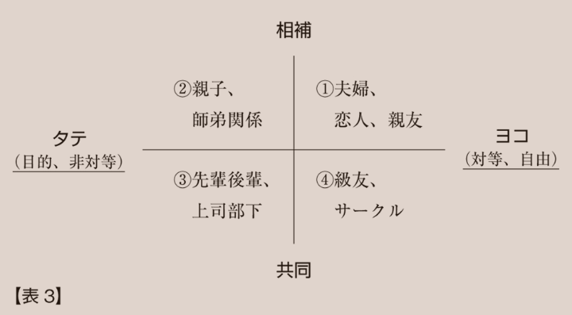

1. 趣味
2. 健康
3. 財政
4. 仕事

## 各目標の進捗状況

1. 趣味
   1. ラノベ：1.0万文字（累計2.5万文字、ペース不足）
   2. ジャズ：7枚（昨年11月から累計63枚、累計100枚に対して目標以上のペース）
2. 健康
   1. コンビニ：夕食のために已むなく2回行った。習慣化は防げている。
   2. ジム：9回（累計49回。年間150回ペース。修正目標の年間150回に対して目標通り）
3. 財政
   1. コンビニ：同上。
   2. 本屋：GWに先立ち行った。5月はもう行かないこと。
4. 仕事
   1. 外注マニュアル：PJ凍結中。
   2. 中国語：PJ凍結中。

5月度も旧ツイッターの使用を引き続き控えます。積ん読を猛烈に崩し、ラノベを猛烈に書いていきましょう。

## 本の感想

#### ①『アンソロジー　舞台！』（近藤史恵、他）

ギブ。
一本目の近藤史恵が酷すぎる。2.5次元舞台に初出演する舞台俳優が慣習の違いに戸惑って……という話なのだが、それだけで終わって、ビジョンもメッセージもなく、こぢんまりとしていると言えば聞こえはいいが、話のスケールが小さすぎる。二本目の方もリーダビリティが低く、これ以上読めなかった。テーマがテーマだけにマストリードだと思っていたのに、ここまでこうだと、流石につらい。私は私のお話を書こう。



#### ②『Z世代～若者はなぜインスタ・TikTokにハマるのか？～』（原田曜平）

ギブ。
若者が出てくる小説を書くにあたってなにか役立つかと思ったが、大掴み過ぎてあんまり役に立たなさそうなので。わたし（92年度生まれ）よりもっと上の世代向けかな。



#### ③『上達の法則』（岡本浩一）

上級者とそれ以外の質的な違いを説く。上級者に特有の人格の話題が多めで、類書とは違った読み味があった。要約すると、上級者の方が価値観が安定しており自他の価値観を弁別する能力が高く、ひいては人格的にも安定しているとのこと。
〈自分の小説〉の登場人物の人格を深めるための資料本として読んだ。作中では中級者が上級者に対して絶対的な差を感じる（そして挫折感を覚える）シーンがあるのだが、上手く中級者の心理を捉えることができず筆が止まっていたのだが、まさにこの「価値観／人格の安定」がキーワードになりそうだ。中級者には、上手くいかないゆえ不安定、不安定ゆえ上手くいかない、というフィードバックループ（スランプの一種）があろう。そのステップを乗り越えるためには、不安定な価値観を（それ以前と比べて）革命的に新しいものへと進化させ、安定させなければならない。いわば脱皮だが、それを考え抜くことができれば、中級者の心理を書き切ることができるだろう。



#### ④『熟達論』（為末大）

今年読んだ本の中で暫定ベスト！
オリンピアンである著者・為末大が自らの競技者としての経験とその道を極めた人物達との交流を基に、なにかを「熟達」するとはどのようなメカニズムであり、そこではどのような心の動きがあるのかを緻密に言語化する。
熟達への道のりは、遊・型・観・心・空の五段階に分類できると説く。それぞれの段階に共通するのは、人間の柔軟性への信頼だ。人間の心が柔軟である故に、遊んで様々な可能性を模索することができる。また、その可能性を型にはめることによって、より良い方向へと導くことができる。そうして導かれた型を観察することで、中心と周辺とを分別することができる。立ち返るべき中心が定まると、中心から外れてみる冒険ができる。やがて、それまでの四段階を意識していた自らを手放し、空＝無意識を得られる。無意識であるがままの自分・あるがままの環境を受け入れられると、遊んで可能性を模索できる領域がさらに広がる……、そうして五段階のサイクルが回っていく。
オリンピアンの説く、身体と精神とのバランスのストーリーは説得力に満ちており、読み応え十分。充実した人生の一部を垣間見させてもらったような気分で、とても満足した。
例によって〈自分の小説〉の登場人物に深みを出すための資料本としての読書。この五段階のどこに位置付けられるかを考えるだけでも、彼らの価値観を想像できるようになる気がする。登場人物には上級者と中級者がいるのだが、上級者であっても高校生なら「空」には到達していなかろうが「心」を掴んだために後輩の指導が自在にできたり、あるいは中級者でも「型」と「観」との間でグラデーションがあったり、それとも自らのことを中級者だと感じているけれど「遊」の砂浜でちゃぷちゃぷしてるだけかもしれない……。
本書の細かいエピソードを拾うと「「もし」の力」が特に創作の役に立ちそうだと感じた。ある（非言語的な）技能を言語で他者に伝える際に「もし」を使って、別のシチュエーションに置き換えて（もしもグラウンドが熱い砂浜だったら）みる。そうすると、思考の制限が取り払われて別の領域にジャンプできる。
価値観が革命的に新しいものに変化するとそれまでの自分ではいられなくなる。人間のそういう可能性を信じさせてくれる一冊だった。
上達・熟達に関しては2023年に読んだ『習得への情熱』（ジョッシュ・ウェイツキン）も説得力に富んでいましたが、『熟達論』は『習得への情熱』よりも抽象化の度合いが高くて好みでした。





#### ⑤『「若者の読書離れ」というウソ』（飯田一史）

若者（小学生～高校生）の近年（この5～10年程度）の読書傾向を詳らかに解き明かす一冊。若者向けの「型」を有し「ニーズ」を満たす本がヒットするとのこと。そこから逆算的に、若者がなにを欲しているのかを読み出すことができた。そして、〈自分の小説〉は明らかに若者向けではなく、おたくのおじさん向けの本だということと向き合うことになり、泣いています。



#### ⑥『自由が上演される』（渡辺健一郎）

難解！　教育場面において「自由」をワークショップ的に学ばせる際に、まさにその「学ばせる」という権力性が自由と矛盾するのではないか……、というところから議論がスタートするのだが、追いつけなくなった（字面は追えるが目の速度に頭の速度が追いつかなくなった）。その中でも最も印象的だったのは「演劇はいかだ」という比喩。いかだは構造的に不安定で自律性を欠いているが乗る人は方向性を欲望している。そういうイメージは腹落ちした。



#### ⑦『人間関係ってどういう関係？』（平尾昌宏）

「人間関係」を、友達／家族／恋人……といったあり物の言葉から解放して、フラットな見方で定義し直す。「個人」と「社会」との間に位置する人間関係（たとえば、友達／家族……ね）をまず「身近な関係」と名付け、精緻に分解していく。「タテ／ヨコ」の軸と「共同性／相補性」の軸とで2軸による4領域に配置し直す。「タテ／ヨコ」はその人間関係に目的が有るか／無いか、「共同性／相補性」はその人間関係の基礎が共通点に有るか／無いか、から定義される。
便宜上、4領域に分かれているが、その中でのグラデーションをさらに細かく考えていくと（創作で）役立ちそうだと感じた。



#### ⑧『ともに生きるための演劇』（平田オリザ）

読みました、といった感。基本的にこれまでの著作をコンパクトにまとめた一冊。新型コロナの話題が新しいか。プロローグの「幕はもう上がっている」のパンチラインは良かった。危機の時代にあって、我々は否応なしに演じることを迫られているのだ。



#### ⑨『青春ブタ野郎はバニーガール先輩の夢を見ない』（鴨志田一）

再読。ふつうに楽しく読んで、あと、地の文の情報量をどの程度にすべきかとエモをどの程度にすべきかとを確かめるために。
地の文：情景描写は自分のナチュラルの下限にタッチするくらいまで落としてもよいが、その分、心の声を増やす。
エモ：赤面してページをめくる手が早くなるくらい。



#### ⑩『センスの哲学』（千葉雅也）

2024年ブックオブザイヤー（暫定）！
さまざまな読みが可能なように開かれた、エッセイ風の一冊。読むときに切実な問題に引きつけて読むのがいいのではないだろうか。エッセイかつ入門書の体裁（言葉の定義→具体化⇔抽象化→例外の提示→再定義）を取っているのですごい読みやすい。読書に慣れてる人なら2時間もあれば読めるだろう。それでいて、思考を地に足の付いた日常から遠くへ離陸させてくれる。
本書は、生き方論、鑑賞論、創作論、その他「センス」がまつわるものであればどんな読み方でも許される本だと感じた。その上で、私にとっていま一番切実な創作論に引き寄せて感想を書く。
センスとは、対象物から意味を取っ払ってその物をあるがままに捉えるところから始まる。その対象物のあるがままが、存在したり、欠如したりする。その存在／欠如の「リズム」をどう捉えるかがセンスに繋がる。リズムについてより立体的に書けば、意味がある／意味がないという「ビート」、あるがままがどのようにあるかという（＝構造）「うねり」に分解できる。
対象からリズムを感じるとき「次にどんなビートが叩かれるだろう？」「どんな風にうねるだろう？」と予測をしている。対象が予測通りなら気持ちいいし、逆に、予測から外れていてもサプライズが気持ちいい。その外れ具合（リズムの遊び）を感じるのが気持ちいい。
創作論として捉えた場合には、鑑賞者が「センス」をどれくらい有しているかを見積もれるかがポイントになる気がしてて、要するに鑑賞者のニーズに応える力ということなんですが、私は意味の有無のビートよりも構造の大小のうねりで物語を作りがちで、そこはもう少し前者を意識した方がいいのかと感じた。
私はアイドルコンテンツの二次創作小説を長年書いてきたんですが、（失礼な言い方を承知で書くと）「文学クン」にはウケたけど、ウケ続けたけど、終ぞ一度もバズることはなかった。ここにヒントがある気がしていて、バズにはデカいビートが要って、文学クンには繊細なうねりが要る。このバランスですよね。
私は本来的に意味を中心に感じる感性の持ち主なので、人より少ない意味で気持ち良くなってしまう（=小説を書くときに込める意味の「ビート」が小さくても十分に大きく感じてしまう）のはあるのかもしれない。そういう意味で、意味への感性が高いがために、書くときには意味を薄味で書いてしまう、盲点だった。



#### ⑪『ダンスのメンタルトレーニング』（ジム・タイラー、セチ・タイラー）

メンタルコントロールの手法を、特にダンスにフォーカスして適用したところが読みどころ。メンタルコントロールの類書は数あれど、ここまで絞った本はない。ダンサーに「ポジティブ・チェンジ」を促すための手法を説く。ポジティブ・チェンジ=アウェアネス（気づき）+コントロール（統制）+レペティション（繰り返し）。これらの基礎には、ダンスへの執着が求められる。その執着をいかに生み、維持し、更新し続けるかがポイントとなる。
以下、関心のあった点を箇条書きで。
・レッスンではそのときのメンタルもノートテイクする。
・緊張感は逆U字（横軸を緊張レベル、縦軸をパフォーマンスレベルとして）が望ましい。
・緊張を生じさせる原因（自己評価）は①場からの期待、②期待に応える能力の有無、③期待に対処した結果、④結果によってもたらされた出来事、⑤自分の身体についての原因、に分類される。
・筋肉が緊張したときには、むしろいったん高負荷な緊張まで上げてから下げるとリラックスされる。
・イメージングコントロールを使う。具体的なイメージで、イメージの時間の流れを変えながら。
・イメージングコントロールを日々の日課に採り入れる。



#### 
⑫『舞台監督読本　舞台はこうしてつくられる』（舞台監督研究室）

読みました、といった感。物足りなさを覚えた。舞台監督の仕事を膨らませたいなら『ザ・スタッフ』を読めるならそれで事足りるか。



### ジャズ

#### ①『Genius Of Modern Music Vol.1』（Thelonious Monk）

『ジャズ超名盤研究2』の最初の1枚。最近よく聴いていた1970年代や21世紀のジャズから一気に1940年代の録音に戻りました。「'Round Midnight」は言わずもがな、「In Walked Bud」のゴキゲンな感じが印象深い。

#### ②『ラスマス・フェイバー・プレゼンツ・プラチナ・ジャズ』（ラスマス・フェイバー）

「星間飛行」が白眉。2013年のライブ盤でいま聴くとかなり懐メロ感あるが、それ込みでいいライブ。凡百のアニメソング・ジャズアレンジを圧倒する。

#### ③『Affinity』（Oscar Peterson）

ビル・エヴァンスの「Waltz for Debby」繋がりで、同曲が収録されたこのアルバムも。同じナンバーでもぜんぜん違う表情になるのがジャズの面白みだと思いますね。静かな印象のビル・エヴァンスのものよりも情熱的な感じ。他のナンバーだと「This Colud Be The Start Of Something Big」の「なにかドデカいことが起こりそうな予感」を覚えさせるイントロ、「Yours Is My Heart Alone」の物憂げそうなファーストインプレッションからの畳みかけるような曲調が好き。

#### ④『Michel Camilo』（Michel Camilo）

職場の方に勧められて。ダイナミックなピアノがそそる。1988年のアルバムだからか、良い意味で聴いたことある感のあるモダンジャズっぽい音楽の印象を受けますね。「Caribe」が白眉。

#### ⑤『In the Shadows』（Robert de Boron）

ジャズラップ。聴きました、といった感。

#### ⑥『東方爆音ジャズBEST』（東京アクティブNEETs）

聴きました。ビッグバンド的華やかさがあるわね。

#### ⑦『Now's The Times!』（Sonny Rollins）

ジャズのスタンダードナンバーを集めた一枚。表題作「Now's The Time」をきっかけに聴いたが、ソニー・ロリンズと言えばやはり「St. Thomas」か。どのナンバーも浮遊感あるサックスが気持ちいい。サックスがリーダーを務めるいわゆる名盤は久しぶりだが、良いアルバムは良いですね。

### 演劇

#### ①『S高原から』（作・演出　平田オリザ）

こまばアゴラが閉まるってんで慌てて観に。夏の高原のサナトリウムの一日を切り取る。私は昨年メンタルの調子を崩して療養をしていたのだが、その施設の同じ療養者の、特有の背景があるはずなのに明るく振る舞う光景にそっくりで驚愕した。そう、外界と時間の流れが変わるし、散歩くらいしかすることねえんだよな。
