『負けヒロインが多すぎる！』の聖地である豊橋および豊川を巡礼しました。

今回の巡礼の目的は、作中世界への理解度を高めることです。きっかけ自体は『ＪＲ東海　推し旅』でしたが、ボイスドラマやグッズの回収よりも土地を自分の足で歩くことを大切にしました。

このエントリでは、土地を自分の足で歩いたから感じたこと、気付いたことをタラタラと書きます。

私は４巻の終盤と５巻の冒頭が大好きなのでその辺のエピソードに関する気付きを中心に書いていきます。アニメ化された3巻以降のネタバレを必然的に含みます。ご容赦下さい。

## 目次

1. 名古屋駅
2. 豊橋駅周辺
3. ツワブキ高校
4. 精文館書店
5. のんほいパーク
6. 豊橋市役所
7. 向山大池
8. 豊川稲荷
9. まとめ～「噂」について

いわゆる「アニメの巡礼ルート」から外れた「６．豊橋市役所」、「７．向山大池」および「８．豊川稲荷」（４巻の終盤と５巻の冒頭に相当する）で特に気付きが多かったので、そこまで飛んでもオッケーです。

（２０２４年１０月１４日に同日に訪れた「５．のんほいパーク」を追加）

## 1. 名古屋駅

今回の巡礼は朝６時半の新幹線で新大阪発、名古屋駅経由、朝９時に豊橋駅というルートで始まりました。

旅程を組むために土地と交通を調べたんですが、まず、豊橋が名古屋とは異なる文化圏であるという点から学びでした（住んだことない地方への理解度なんてそんなもんよ）。豊橋は、鉄道で言えば名古屋と浜松の中間地点に位置し、浜名湖を挟んでこっち側に豊橋、あっち側に浜松。

名古屋とは片道１時間１３００円。お小遣いの限られた高校生には、豊橋から名古屋って別世界なのではないでしょうか。温水くんは食費をごまかしてラノベを買い、八奈見さんは小麦粉焼きとか食べてるし、小鞠ちゃんはスティックパンの子なので、遊びに行くために交通費３０００円から始まるってなかなかハードルが高かろうと思います（都心で言えば、東京ー戸塚間がだいたいそれくらいのイメージ）。

これを踏まえると、月之木先輩と会長が豊橋を離れて名古屋へと引っ越してしまう喪失感がよりシリアスに分かりますね。基本的に、先輩らが会いに来てくれないと会うのが難しい（そして、大学生はやがて地元を去るのだ……）距離でしょうね。

そんな名古屋に着いたのは朝７時半。

大画面の八奈見さんの「浮気だよっ！」がマケインさん（このエントリでは『負けヒロインが多すぎる！』をきっかけに豊橋を訪れるオタクのことを私を含めて「マケインさん」と呼びます）をお出迎え。大迫力でした。朝７時半なので他のお客さんの写り込みもなく撮影できましたが、この時点で待ち合わせであろう人々が集い始めていたので「浮気だよっ！」を撮るなら朝イチですね。

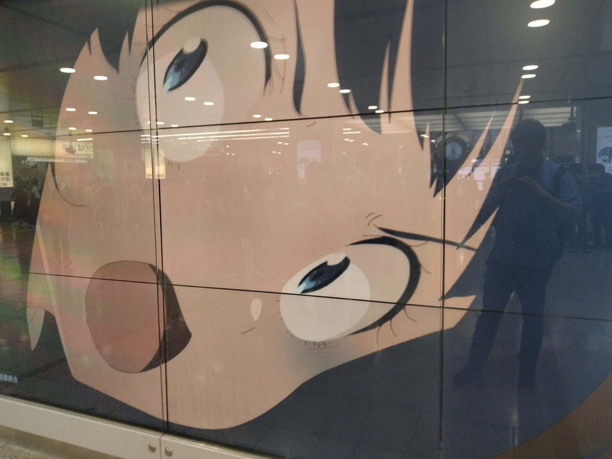

## ２．豊橋駅周辺

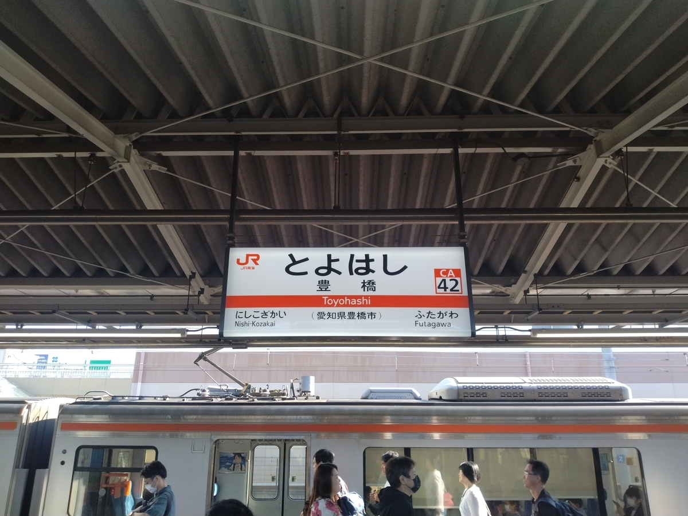

観光案内所の方からグッズを頂きながら会話したところ「土日は（マケインさんは）２００人くらい」とのこと。

豊橋は基本的に観光地ではなく普通の中核都市なので、駅前に観光資源が乏しい（あるいは、行政として観光への関心がそこまで高くない）印象を受けました。春前に訪れた大垣との比較で恐縮ですが、大垣は駅前の観光資源・商店街を総動員して、オタク１人当たり７０００円～１００００円は地元に落とすように企画を設計していたように思われました。一方の今回の豊橋は、１人当たり～５０００円なイメージ。大垣が角川資本、豊橋が小学館資本だからってのもあるかもしれないけれど。

## ３．ツワブキ高校

学校の外周のうち、大通りに面した正面玄関がない辺を歩きました。デカかった。田舎のデカいナンバースクールを卒業した私が言うので本当にデカいです。Wikipedia情報によれば、公立高校で３番目に大きい敷地を有しているらしい（マナーの良いタイプのマケインさんなのでモデルとなった学校の写真は控えています）。

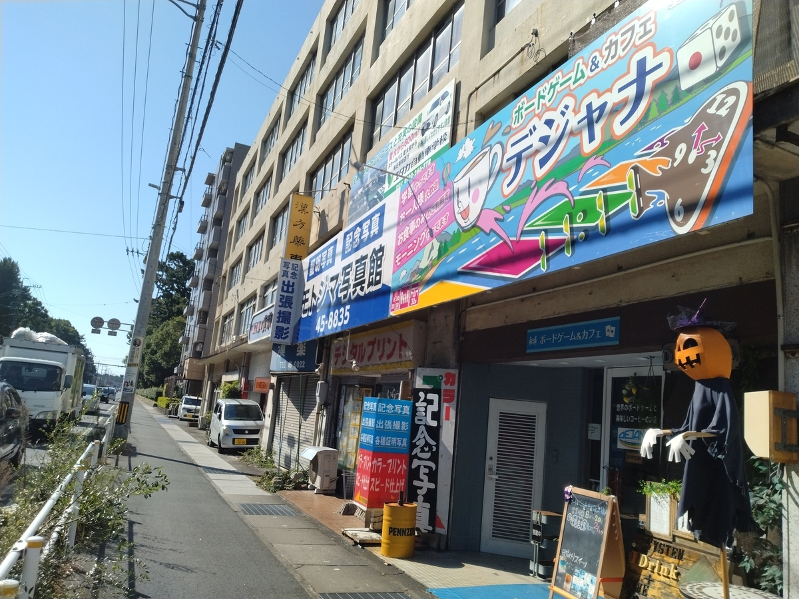

学校の屋上で食べるわけにはいかないので最寄りの駅のホームでちくわをガブリ。

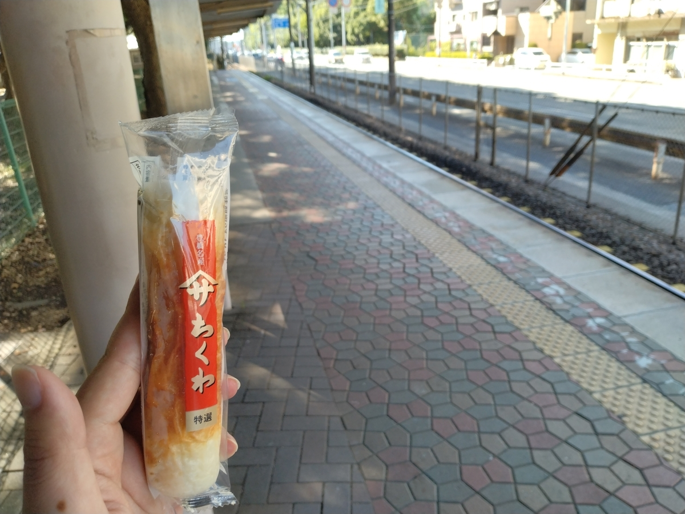

## ４．精文館書店

駅前の巡礼ルートの本拠地となる本屋さん。

４フロア使ったしっかりした品揃えで、独自のフェアも展開してました。津村記久子の持ってなかった文庫を１冊買いました。

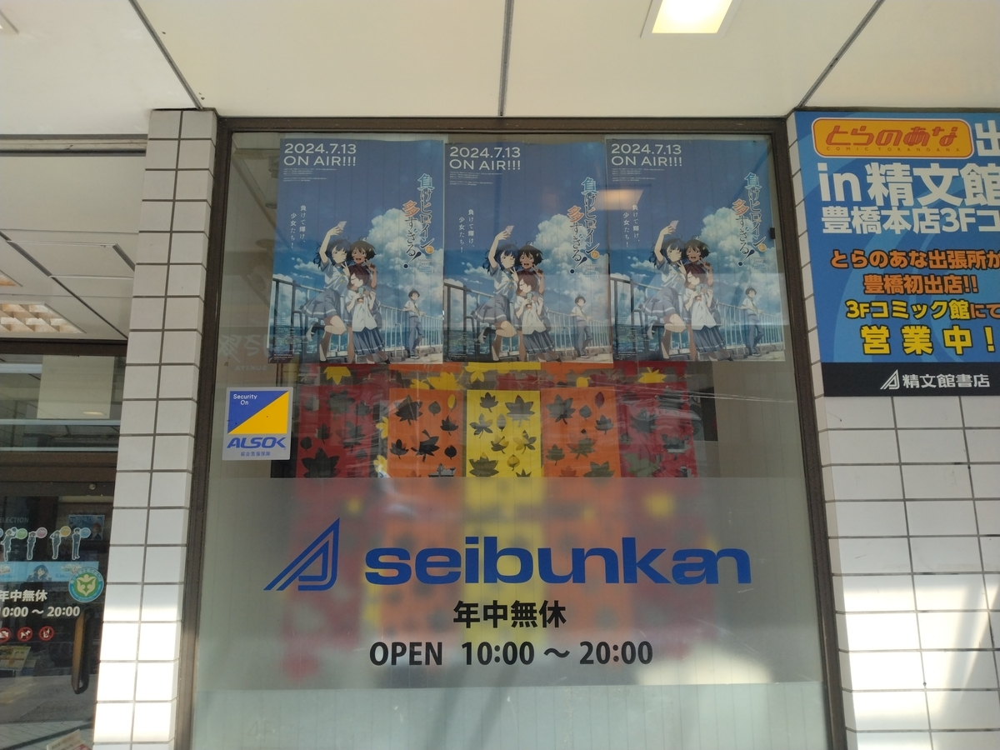

精文館書店の隣のアーケード街では、雨森たきび先生が故郷に錦を飾っていました。

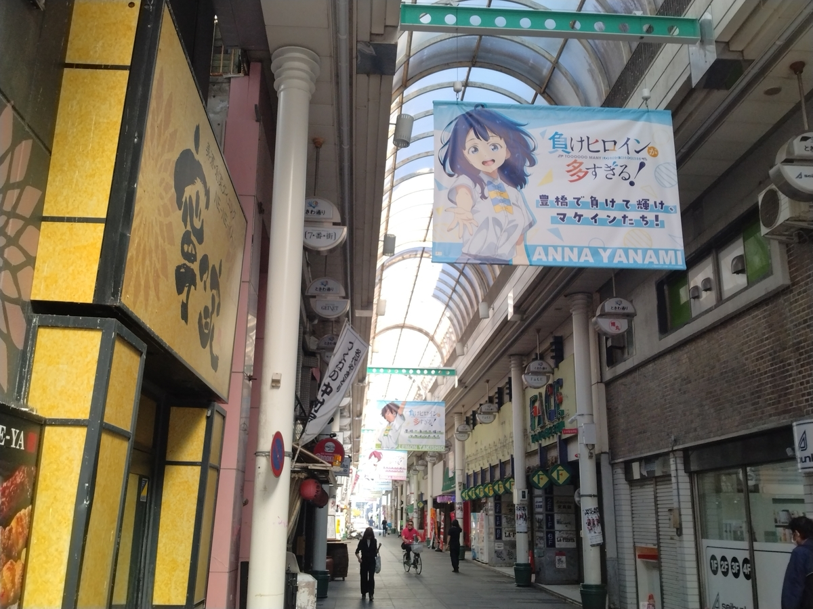

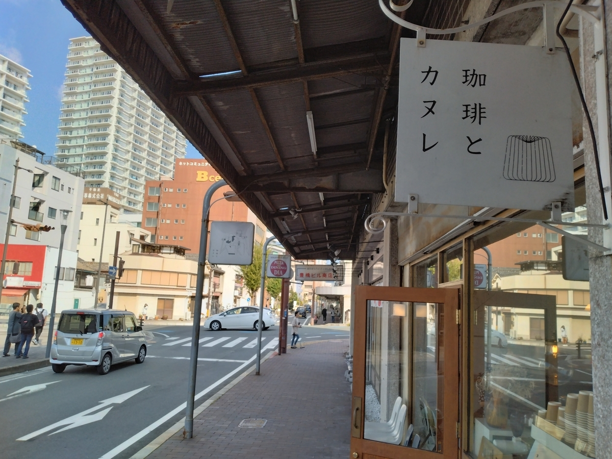

「まちなか図書館」はなかなか興味深くて、利用者の中央値がティーンエイジャーでしたね。勉強してる学生さんがいっぱいいました（マナーの良いタイプのマケインさんなので図書館の内部の写真は控えています）。

また、図書の各分類を図書館がさらに細かく独自に分類、タグ付けしており、タグも大きく展示してあったので、全体的に利用者の興味関心を呼び起こそうという意識が感じられました。私はふつうにビル・エヴァンスのインタビューを読んでました。

## ６．のんほいパーク

なにかと登場したのんほいパーク。豊橋駅から一駅でアクセスも良く、家族連れが多いので、仲良し男女グループで訪れてもシリアス感が薄く、そういうグループで遊ぶのにはちょうどいいと感じました。グループで訪れ、その中の意中の二人の呼吸の相性を確かめても不自然感がないというか。

ここのサービス券を仲良し男女グループにばらまいて何が起こるかを観察する教師って、やりたいこととその手段が一致しすぎていて怖いなと思いました（その意図を把握して危機回避できる朝雲さんは、作中で一段抜けた存在ですよね）。

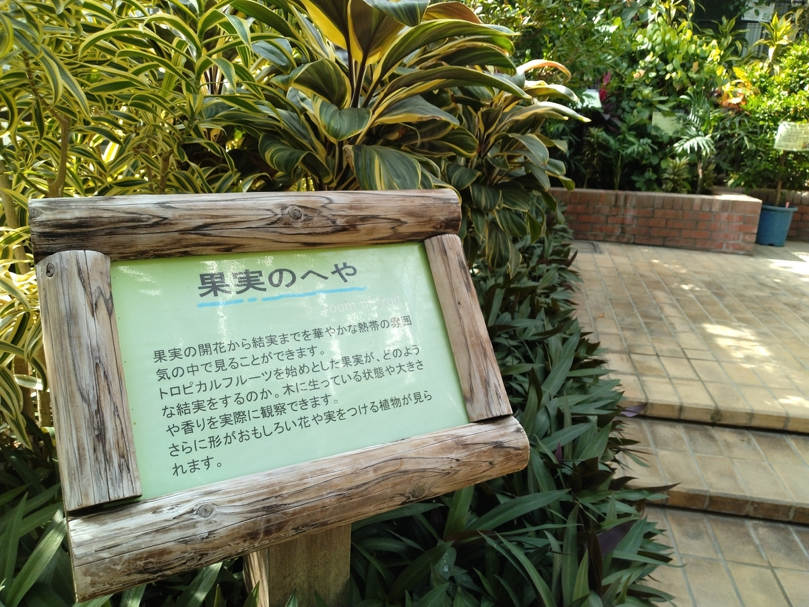

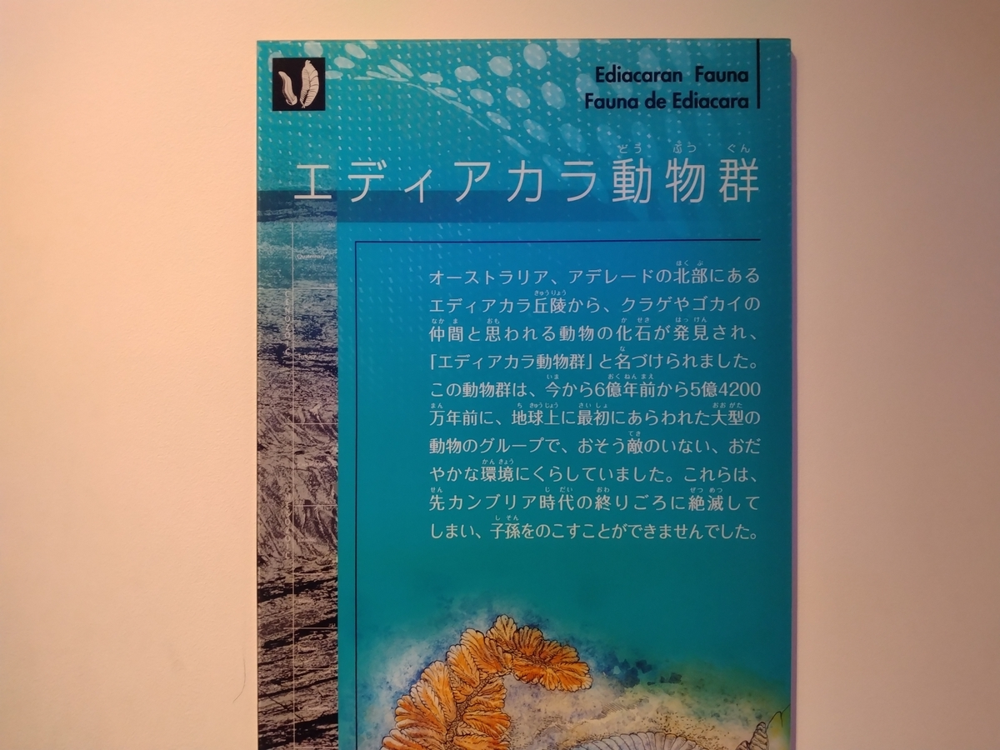

## ６．豊橋市役所

今回の巡礼では、ここで最も価値ある体験しました。マケインさんとなるならここには絶対に来るべきです。ここには、４巻エピローグの舞台となった市役所の展望フロアがあるんですね。

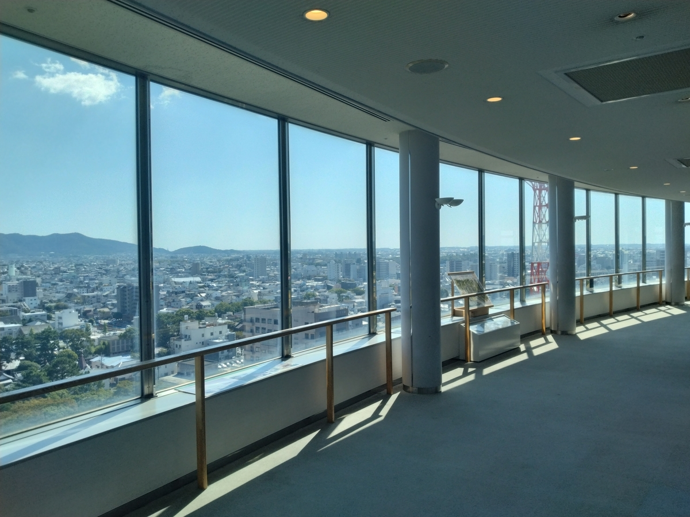

あのですね、端的に、狭いんですよ。書きぶりからしたら全面が展望になっているのかと思いきや、一面だけで、人流のあるところで。ここで壁ドンすると目立って衆目を集めます。ここで壁ドンすることを思うと脳が壊れるかと思いました。かなり気合い入ってますよ。で、そこからレストランの入口でマフラーをギュッとやるのも、レストランの入口はフツーの両開きの自動ドアなので、やっぱりメチャ目立つと思います。

現地来てわかりましたけど、４巻エピローグは全体的に「いちゃついてるカップル」にしか見えない。

なお、八奈見さんはここでの壁ドンのきっかけについて「（温水くんに振られたという）噂が屈辱だったから」と述べているわけですが、それについても気付きがあったので後述します。

１３階にはビュッフェ形式のレストラン「コスタリカ」がございます。

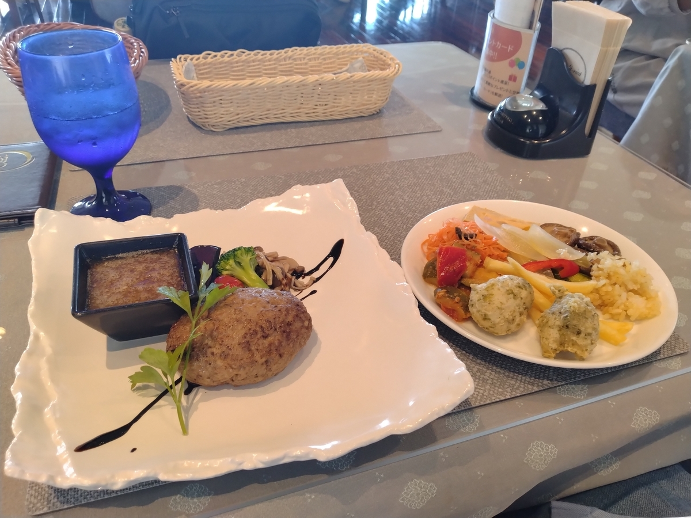

月之木先輩からタダ券をもらってやってきた……ってレストランですね。ビュッフェ形式なので無限に前菜を食べられました。前菜なのに茶色いメニューやカレー、ピザも完備だったので八奈見さんも大喜びでしょう。座ってると焼きたてのパンも無限にサーブされるっぽいです。なお、私は八奈見さんではないので、前菜を盛りまくったこの写真を撮るために朝食をちくわ１本で済ませました。

ただ、メニューは１食２０００円～３０００円なので、タダ券がないと高校生には敷居が高そうですね。

## ７．向山大池

４巻の終盤で温水くんが馬剃天愛星さんに呼び出された例の橋のある公園です。向山大池は灌漑のための溜め池だったそうです。そのせいか、周りになんもないんですよね。それを踏まえて、例の橋の写真を見て下さい。

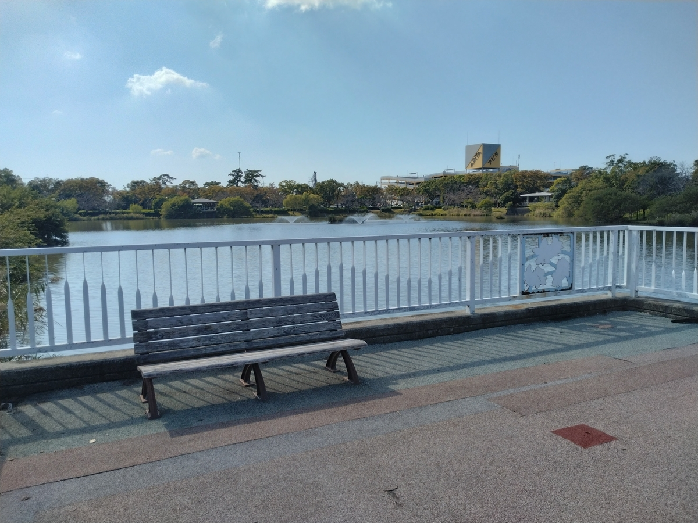

大通りから例の橋のベンチに至るまでには、１０分弱歩かないといけないんですよね。周囲から視界を遮るものが何もない中を。大通りから公園、公園の中の遊歩道、そして橋。そのルートには、クリスマスってこともあってほとんど人はいないと思う。

この橋のこのベンチに至るまで歩くことそれ自体に勇気が要ると思いました。馬剃天愛星さんは本当に頑張った。よく頑張った。誰もがあなたを賞賛するでしょう。勇気を振り絞って贈ったクリスマスプレゼントは彼のお友だちのハイカースト女子にＮＧを食らっちゃったけど……、という感じです。

## ８．豊川稲荷

５巻冒頭で温水くんと八奈見さんが佳樹ちゃんのデート（？）をストーキングするデート（？）したお寺とその門前通りを歩きました。

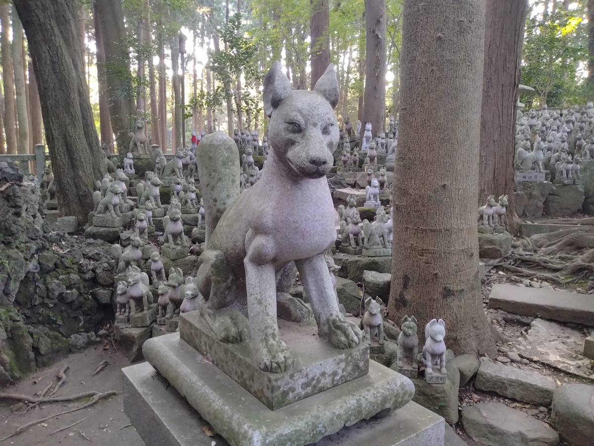

豊川稲荷のこの領域って、門前通りからはもちろん本堂からもやや離れて、静寂が満ちていました。その静かなエリアで「似てる～～～」ってやり合う高校生男女がその行為をデートではないと言い張るのは不可能です。豊橋の街中を二人でウロウロじゃれ合うのとはワケが違って、デート以外の解釈をすることが不可能。

のんほいパークとの比較で話すと、のんほいパークが男女で訪れてもデート感が薄い（まあ「大人のデート」ではないでしょうね）のに対して、豊川稲荷で二人っきりってガチ感がありました。勝負を仕掛けてきている。

ストーキングデートのそもそも論なのですが、実は佳樹ちゃんのデート（？）を確かめるためだけならわざわざ彼女を捜索する必要はないんですよね。最寄りの豊川駅で待っていれば必ず彼女は通るので。でも、八奈見さんは温水くんと二人で歩いて捜索することを提案した。その一手間を掛けさせた理由って、そういうことだと思います。

最終的に二人のデート（？）は、温水くんの不安で幕引きとなるわけですが、その帰り道では八奈見さんが温水くんを餌付けして励ましていたわけですよね。豊川駅～豊橋駅間って、電車の本数が１時間に３～４本とそれなりの待ち時間を要求してくるわけです。その間、八奈見さんが励ましていたの、これは尊いことだなと思います。

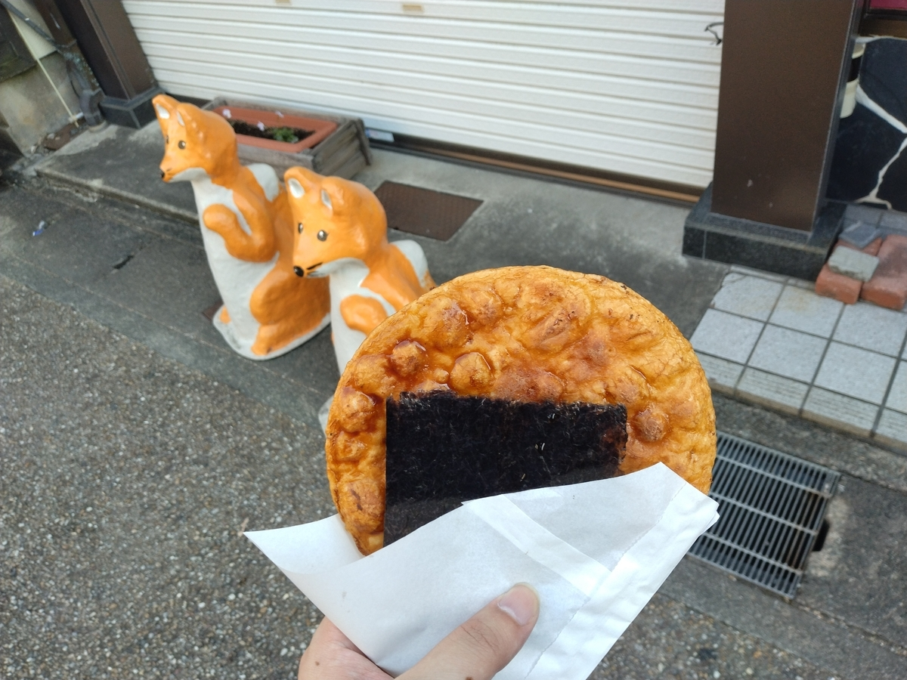

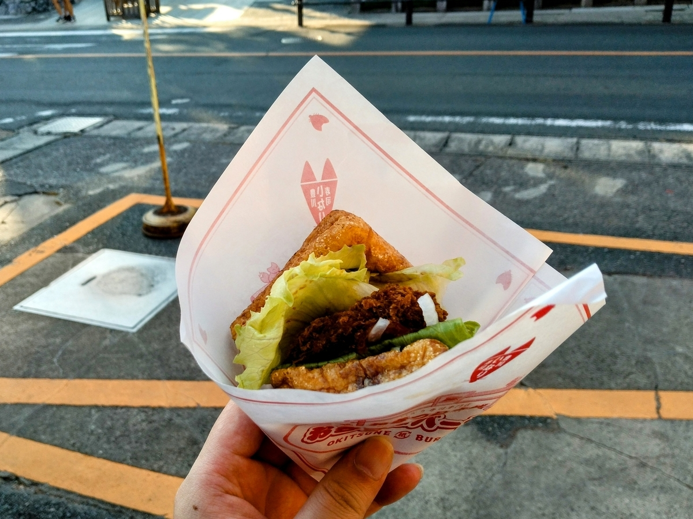

## ９．まとめ～「噂」について

一日掛けて主要舞台を歩きました。で、わかったことがあって、彼ら彼女らがラブコメしてたロケーションって全体的に見通しが良いんですよね（というより、市街地がコンパクトなので死角が少ない）。この大きさの街だとどこに行っても学校関係者がいると思う。

そういうロケーションでそういう行為に励むと、「あいつら付き合ってる？」って噂、フツーに立つでしょうね。高校生でもわかると思う。それ踏まえて書くと、八奈見さん始めヒロインのみなさんは、温水くんと噂が立つことを覚悟して彼と遊んでいるのではないかと実感されました。

この「噂」（言い換えると、無責任な評価）って、『負けヒロインが多すぎる！』シリーズの中で、それなりにクリティカルなポイントだと私は考えています。作中で八奈見さんが温水くんに一番怒った（二人の間に漂っていたコメディムードを終わらせようとした）のって、温水くんが周囲の「あいつら付き合ってる？」って無責任な評価に振り回されて（八奈見さんの意思を確かめることもなく）八奈見さんとのお昼ご飯の約束を雑に終わらせたことじゃないですか。１巻～７巻、ＳＳＳまで含めて、八奈見さん一番怒ったのってあのシーンなので、そういう読みも可能かと思います。

それで、４巻エピローグにおいて八奈見さんが「（温水くんに振られたという）噂が屈辱」と評しているのは、自分が自らそう望んで構築している男子との人間関係について、周囲からそう無責任に評価されることに対する屈辱感だったんでしょうね。それって、彼女の意思が軽んじられているというのは言うに及ばず、彼の存在もまた同様に軽んじられていることを意味していますし。

そして、今回の巡礼でわかったのは、さらに、八奈見さんの覚悟――「あいつら付き合ってる？」って噂が生まれる可能性を許容する覚悟をスルーした温水くんに対する屈辱感もあったのではないでしょうか、というところ。

そういうとこだよ、温水君。

あるいは、無責任な評価って、要するに、「負けヒロイン」ってワードそのものだったりするわけで。

（おわり）
