このエントリは「まだ書いていない小説の聖地巡礼エントリをあらかじめ書いてみたら、どのようなエモーションが作者のなかに生じるのだろうか」という実験のためのものです。したがって、このエントリでは延々と「まだ書いていない小説の、まだ書いていないし書かれるかもわからない与太話」を書きます。

ということで、そういう実験のため、小説（ラノベ）の舞台とする京都大学桂キャンパス（主人公らが通う中高一貫校のモデル）、桂坂ニュータウン（主人公・ヒロインの住む地域）にロケハンしてきました。

1. 阪急桂駅周辺
2. 京都大学桂キャンパス
3. 桂坂ニュータウン
4. 実際にロケハンしてみて
5. 実際にエントリを書いてみて

## 1. 阪急桂駅周辺

主人公・ヒロインの（一応は）最寄りになる駅。二人が住んでいるニュータウンまではバスで20分前後。ターミナルの大阪梅田駅までは35分。

とは言え、桂坂の上のニュータウン（標高150メートル前後）は下界の鉄道網からは隔絶されているため、基本的に彼らはバス移動です。ニュータウンから京都駅・四条烏丸へはバスで一本。どちらも片道1時間前後掛かることを思うと、なかなかな隔絶具合であることがお分かりになるのではないでしょうか。

二人が桂駅を使う機会は、どの家庭も自家用車をお持ちである（ないとニュータウンで生活できない）ため、それこそ親とではなく友人同士で梅田へ出るタイミングだけだと思います。

逆に、そういうタイミングであるが故に、友人同士の印象的なシーンで登場することになりますね。

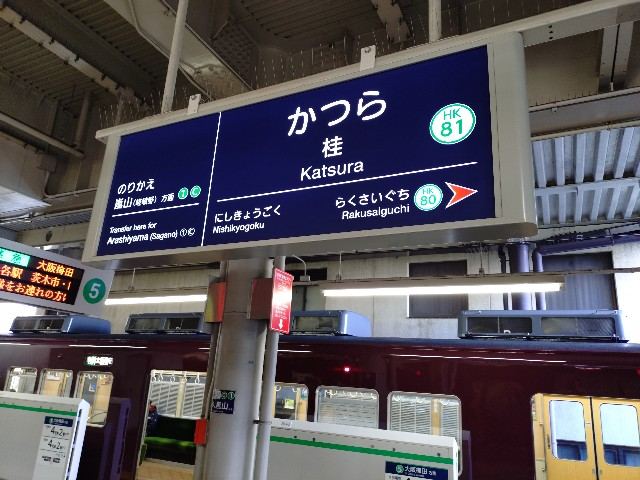

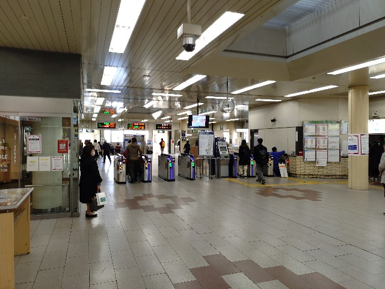

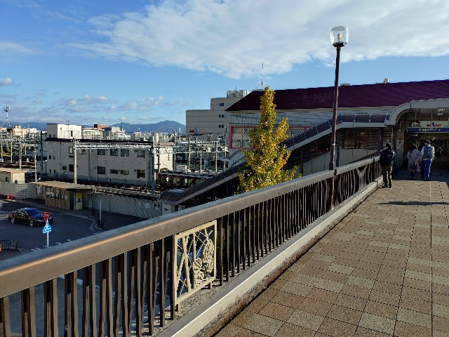

## 2. 京都大学桂キャンパス

主人公らが通う中高一貫校のモデル。桂駅からはバスで15分前後、徒歩で50分前後の距離感。坂の斜度がエッグいので自転車通学の場合でも駅から40分は掛かることになると思います。下界から通う生徒にはなかなかツラい距離でしょうかね。スクールバスとかあるのかな。

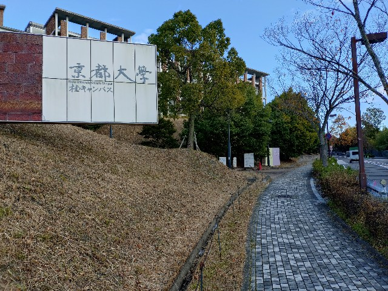

桂キャンパスは下界からニュータウンへと繋がる坂の一つ（御陵坂（ごりょうざか））の中腹に位置しています。ニュータウンへと繋がる坂はいくつかありますが、そのうちニュータウンと桂駅とを最短で結ぶのが御陵坂です。

桂キャンパスは、坂の下から順にAクラスタ、Bクラスタ、Cクラスタの三つのクラスタからなる巨大なキャンパス。企業からの寄付金で作られた記念館や大ホールなども付随しており、御陵坂の途中に突如として現れる学園都市感はあります。

中高一貫校の直接のモデルは、A～Cクラスタのうち、最も上に位置するCクラスタです。A・Bクラスタは作中でもそのまま桂キャンパスとなります。

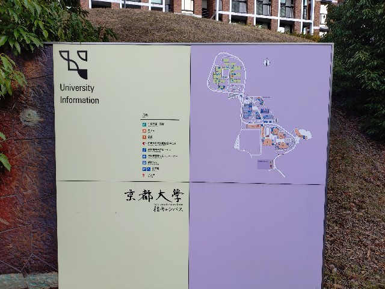

そのCクラスタからの開けた眺望。正面には青空、青空の下に山々、山々に囲まれた洛中、青空から洛中までを貫いてそびえ立つ時計台。うーん、アニメ。

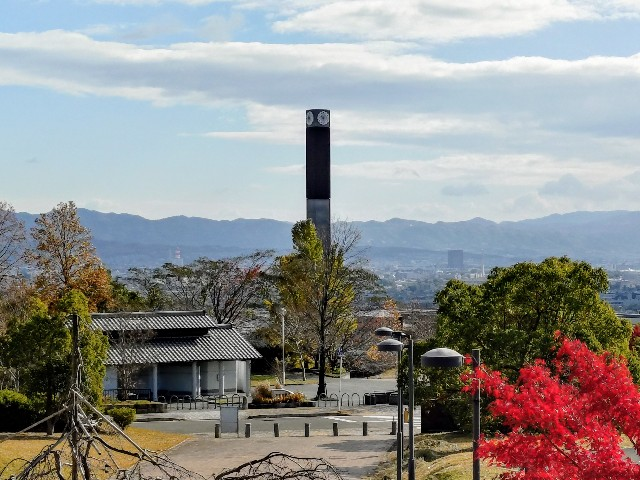

CクラスタとBクラスタとの間には細い車道と御陵公園（みささぎこうえん）があり、そこが中高一貫校と桂キャンパスとの境界となります。市民に開かれている公園。

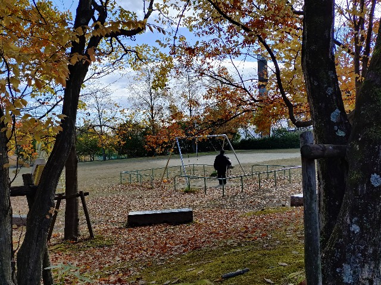

CクラスタへとBクラスタ・Aクラスタから繋がる巨大な歩道がありますが、これは美しいので残しておきたい。

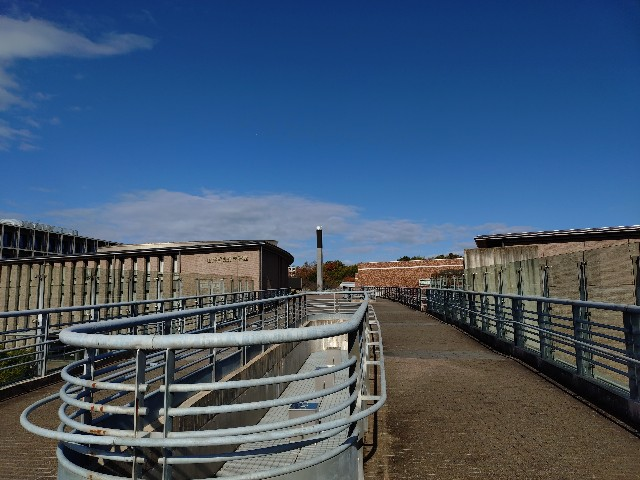

その歩道から見えたバスケットゴールと、背景の青い空と山々と洛中。うーん、アニメ。

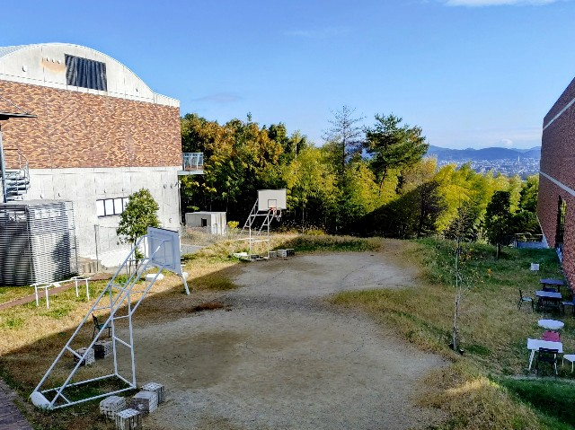

Cクラスタから下って、Bクラスタにはパン屋が併設されています。主に大学生・教職員・近隣の住民の方々が利用していますね。ただ、主人公らの学校は授業時間・昼休みとも外出禁止なので、昼休みにパン屋からデリバリーされることになると思います。大きな工房ではないので出荷できる絶対数も少なく、昼休みには争奪戦の様相を呈します。

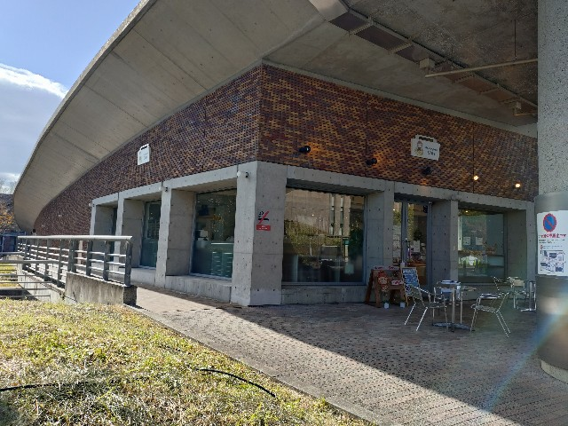

ここまでは御陵坂の下側からのアプローチでしたが、主人公・ヒロインが住んでいるのはさらに上側のニュータウン。上側には、ニュータウン側の生徒のほぼ専用となっている裏門的なやつがあるんでしょうね。

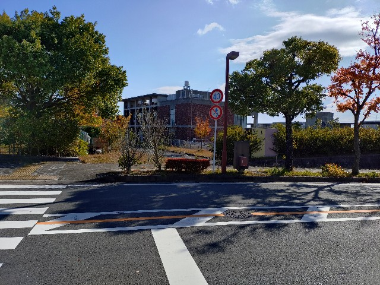

実は、桂キャンパスには計画されていたものの実現されなかった「Dクラスタ」というものがあります。本作ではCクラスタも実現されず、代わりに新興の私立の中高一貫校が出来たイメージですね。このため、桂キャンパスと同様に、中高一貫校じたいもかなり歴史が浅い学校になりますね。

大学に隣接する立地とその立地で学生を集めることを鑑みると、少数精鋭を掲げ、SSH（スーパーサイエンスハイスクール）指定もされてるんじゃないでしょうか。規模が小さく新しい学校です。

## 3. 桂坂ニュータウン

主人公・ヒロインが住むニュータウン。1986年に入居開始であることを考えると、2024年現在で、入居開始世が50～60代、その子世代が20～30代くらいなのではないでしょうか。中高一貫校は、子世代が中学に上がるボリュームゾーンになる2000年前半に開校していると思います（ちなみに桂キャンパスが2003年～）。

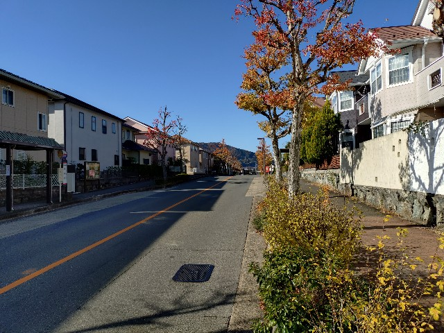

10代半ばの主人公・ヒロインの世代は、絶妙に少ない（少なくなりつつある）世代だと思います。そういう意味で、同学年の幼なじみである二人が仲良しなのも納得ですね。

なお、ニュータウンには1989年に公立の小学校・中学校が開校しているので、私立の中高一貫校の計画の際にはクソ揉めがあったと想像されます。本作はあくまでラノベ。整合性は深くは追い求めないでおこうと思います。

自家用車の所有が前提となる地域であるため、各戸とも駐車場またはガレージを備えています。ヒロイン宅のガレージは、彼らのたまり場になっていますね。

その自家用車を各地区へと分岐させるためのラウンドアバウト。下界へと下りる桂坂とニュータウンの各地区へと繋がる三つの道との、計四本に分岐しています。太く開けた道路。見応えありました。

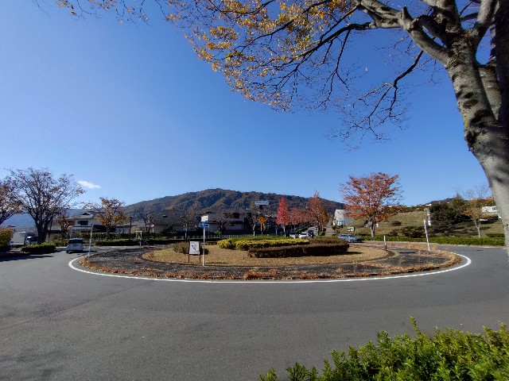

ラウンドアバウトの間近に位置するのが桂坂公園。

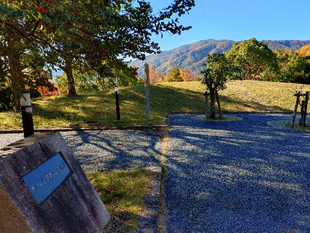

下生えも美しく生えており、景色も良く、それらしいモニュメントもあり、住民の方の憩いの場となっているのでしょうね。

主人公らが屋外で練習するには最適なロケーションです。他にもいくつか公園はあるものの、物語の中心は他にはありえないですね。平日の放課後は学校で、夜や休日にはこの公園で、という使い分けになると思います。

撮影こそしませんでしたが、この日はウエディングドレスの女性とタキシードの男性のお二人が写真撮影をしており、公園が愛されていることが感じられました。また、やはり写真なしですが、住民の方々（地区会かな？）が街路樹の剪定や落ち葉・ゴミの清掃をされており、地域の絆でもあるのでしょうね。

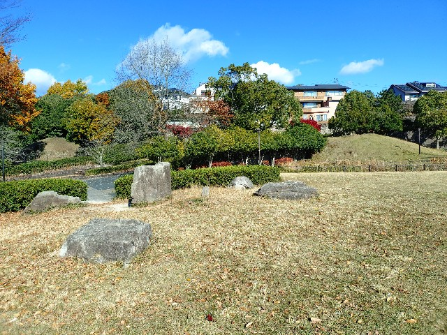

公園の端からは長岡京側も望めました。

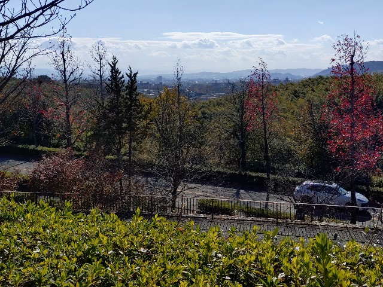

公園の木は、当然、桂。

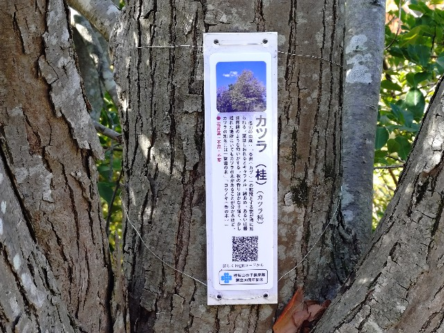

## 4. 実際に歩いてみて

御陵坂の真下に住んでいた大学生のときには桂駅と桂キャンパスに通っていたので感覚は知ってましたが、桂坂ニュータウンはほとんど初めてでした（イズミヤに一度行っただけ）。いや、閑静な住宅街ですね。どのお宅もとてもよく整えられており、遊歩道も何本も備えられており、日本の経済と精神に余裕が溢れていた頃に生まれた、志ある地域だと感じられました。その住民の方々は今もきっと志を持ち続けているのでしょう。

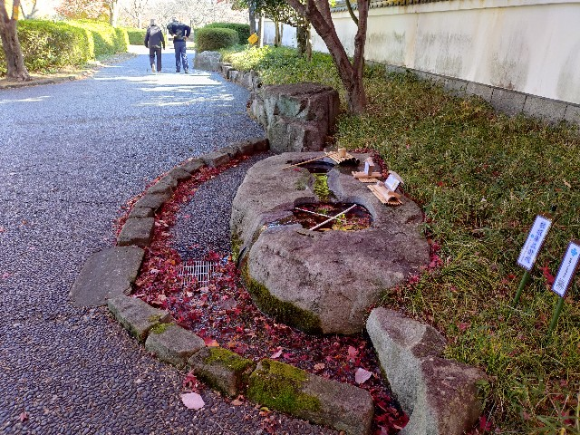

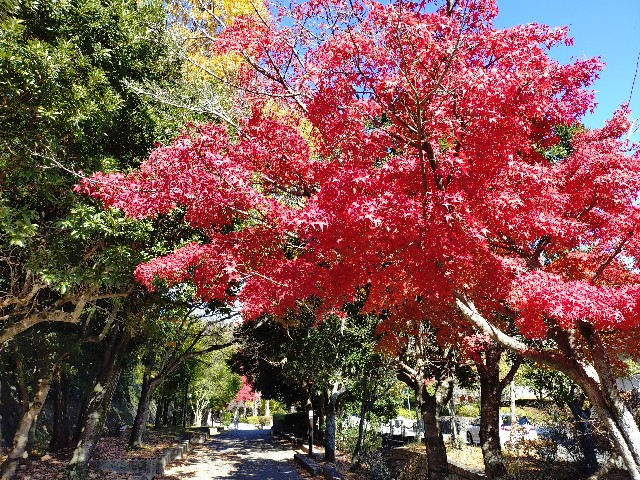

主人公・ヒロインともある側面では大らかな人物らであり、こういうある種の余裕を備えた地域で育ったからこうなったのであろう、と想像されました。また、先輩を含めた学友の多くはニュータウンではなく下界の住民であり、単純に住んでいるエリアの違いとして、主人公・ヒロイン間の心の距離よりも遠くなりがちなのであろうなあと感じられました。

## 5. 実際にエントリを書いてみて

パソコンで調べて自分の頭の中にだけある与太話と、実際に歩いて他人様に聞かせるための与太話とでは、作り込みの強度が違うなと思いましたね。書いてみて、強度を上げられた気がします。昼休みのパンの話は指が勝手に動いて出てきたエピソードですし。彼らの手触りがグッと具体的になったのを感じます。

ロケハンしてさらにそれを語ってみせる、なかなか面白い体験でしたのでみなさんもやってみてはいかがでしょうか。

（おしまい）
