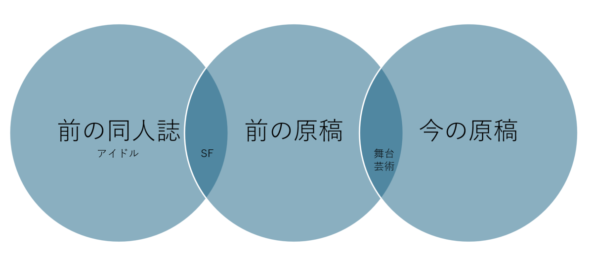

> 「一心不乱に、オレのイノチを打ちこんだ仕事をやりとげればそれでいいのだ。目玉がフシアナ同然の奴らのメガネにかなわなくとも、それがなんだ。オレが刻んだ仏像を道のホコラに安置して、その下に穴を掘って、土に埋もれて死ぬだけのことだ」
>
> 「夜長姫と耳男」（坂口安吾）

前の原稿、まだイノチが打ちこまれてなかったですね。今の原稿は、一心不乱に、オレのイノチを打ちこんだ仕事をやりとげていきます。

【今後のタイムライン】

2024年12月：今の原稿のプロットを固め、本文をちょっとだけでも書く。
2025年1月～6月：本文をひたすら書く。
2025年7月：体験版を知り合いの皆さまに共有し、フィードバックを頂く。
2025年7月～9月：体験版のフィードバックを反映する。
2025年9月：第20回小学館ライトノベル大賞に応募。
2026年4月：第33回電撃大賞の締切。

【今後なにを書くか】

もともと、前の原稿は前の同人誌（アイドル×SF）のアイデア（SF）を流用しつつ、道具立てとキャラクターを一新して描かれたもの（舞台芸術×SF）でした。

前の原稿がダメだった原因は、思うに、舞台芸術×SFとしたせいで、読者への負荷がオーバーしたのではないかな、と。今の原稿は、SFを抜き、舞台芸術一本で、青春小説をやります。

やるぞ！！！！！
