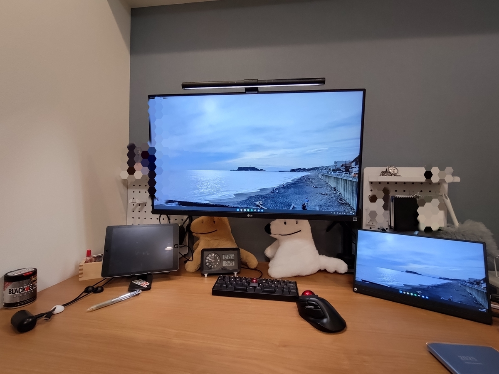

２０２４年のさまざまな・オブ・ザ・イヤーを発表します！

1. 本
   1. 長編小説
   2. 短編小説
   3. 実用書
2. 音楽
3. ベストバイ

## １．本

### １．１　小説（長編部門）

２０２４年の長編小説・オブ・ザ・イヤーは、書かんでもわかるでしょう。**『負けヒロインが多すぎる！』（雨森たきび）**でした。
ベースラインで八奈見杏菜さんにドキドキしているのは大前提として、６巻・２巻の焼塩檸檬さん、４巻の馬剃天愛星（クリスマスエディション）のエピソードが抜きん出て好きです。焼塩檸檬さんがキメのシーンで見せる「決闘」は、スポーツ少女としての彼女のあり方をキレ良く表現しており、好きですね。拳を握って応援したくなる。６巻で彼女は「成った」のでしばらくはコメディリリーフ的でしょうが、彼女がメインの巻は繰り返し読むでしょう。馬剃天愛星（クリスマスエディション）さんは、彼女の前にいるヒロインらが醸す「格上のオーラ」のようなものに立ち向かう姿が愛おしかった。本当に頑張りました。
ブログ記事も９月からで４本も書きました。聖地巡礼もしましたし……。

①アニメの感想１



②聖地巡礼



③原作の考察



④アニメの感想２





### １．２　小説（短編部門）

短編小説・オブ・ザ・イヤーは、『小説の惑星　オーシャンラズベリー篇』（伊坂幸太郎・編）から**「KISS」（島村洋子）**！　今年読んだ短編だと圧倒的に一位です。

グラビアクイーンになった元・同級生でいじめられっ子だった女性のサイン会に無理矢理連れて行かれる男子大学生の短編。彼女がテレビ番組のエピソードトークで披露した「甘酸っぱい思い出」は、しかし、幼かった主人公の彼が張った見栄。
いわゆる「感傷マゾ」ものとして読むことも可能だろうが、そういうハシャギのようなものがない。現在の彼にとっての彼女の「甘酸っぱい思い出」とは、感傷の向かう先ではなく赦されることのない罰である。後味の複雑さに驚嘆する。



### １．３　実用書

４月に**『センスの哲学』（千葉雅也）**を読んでから、（自己啓発的な側面を有する）実用書を読む目は「この本は『センスの哲学』よりもイカしているだろうか？」でした。結論から言えば、これよりイカした一冊はありませんでした。
さまざまな読みが可能なように開かれた、エッセイ風の一冊。読むときに切実な問題に引きつけて読むのがいいのではないだろうか。エッセイかつ入門書の体裁（言葉の定義→具体化⇔抽象化→例外の提示→再定義）を取っているのですごい読みやすい。読書に慣れてる人なら2時間もあれば読めるだろう。それでいて、思考を地に足の付いた日常から遠くへ離陸させてくれる。
本書は、生き方論、鑑賞論、創作論、その他「センス」がまつわるものであればどんな読み方でも許される本だと感じた。その上で、私にとっていま一番切実な創作論に引き寄せて感想を書く。
センスとは、対象物から意味を取っ払ってその物をあるがままに捉えるところから始まる。その対象物のあるがままが、存在したり、欠如したりする。その存在／欠如の「リズム」をどう捉えるかがセンスに繋がる。リズムについてより立体的に書けば、意味がある／意味がないという「ビート」、あるがままがどのようにあるかという（＝構造）「うねり」に分解できる。
対象からリズムを感じるとき「次にどんなビートが叩かれるだろう？」「どんな風にうねるだろう？」と予測をしている。対象が予測通りなら気持ちいいし、逆に、予測から外れていてもサプライズが気持ちいい。その外れ具合（リズムの遊び）を感じるのが気持ちいい。
創作論として捉えた場合には、鑑賞者が「センス」をどれくらい有しているかを見積もれるかがポイントになる気がしてて、要するに鑑賞者のニーズに応える力ということなんですが、私は意味の有無のビートよりも構造の大小のうねりで物語を作りがちで、そこはもう少し前者を意識した方がいいのかと感じた。
私は本来的に意味を中心に感じる感性の持ち主なので、人より少ない意味で気持ち良くなってしまう（=小説を書くときに込める意味の「ビート」が小さくても十分に大きく感じてしまう）のはあるのかもしれない。そういう意味で、意味への感性が高いがために、書くときには意味を薄味で書いてしまう、盲点だった。



## ２．音楽

今年は（も）モダンジャズを中心にジャズを多く聴きました。栄えあるミュージック・オブ・ザ・イヤーは**『Interplay』（Bill Evans）！**　例えば友人から「ジャズを聴いてみたいんだけど」って相談されたらこの一枚を間違いなく挙げると思う。
まず、ツカミの１曲目「You And The Night And The Music」が飛び抜けて良い。ビル・エヴァンスのピアノソロから入り、フィリー・ジョー・ジョーンズのドラム、フレディ・ハバードのトランペットが加わる。ビル・エヴァンスの端正なピアノと、彼を中心としたクインテットの奥深さを愉しめる一枚。フレンドリーなメロディが少しずつアレンジを変えられながら繰り返されて印象的。特にトランペットが加わるのが素直に格好いい。メロディの繰り返しからのソロがイケてる。各楽器とも聞き応えがある。
ビル・エヴァンスではあまり評価の高い方ではないようだけれど、私はこの一枚にとても「モダンジャズへの親しみやすさ」のようなものを感じた。



### ３．ベストバイ

今年のベストバイは「[デッッッケエ机](https://www.amazon.co.jp/dp/B09S6KHYH5)」でした。写真をご覧になって頂ければ、この快適さに説明は不要だと思います。

２０２５年も良い本を読み、良い音楽を聴き、良いものを買っていきましょう。

（おわり）
