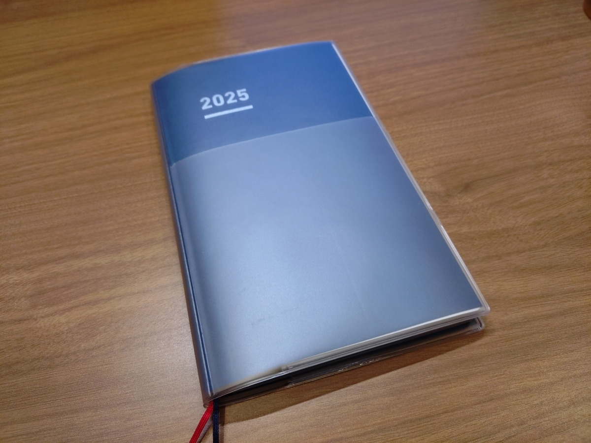
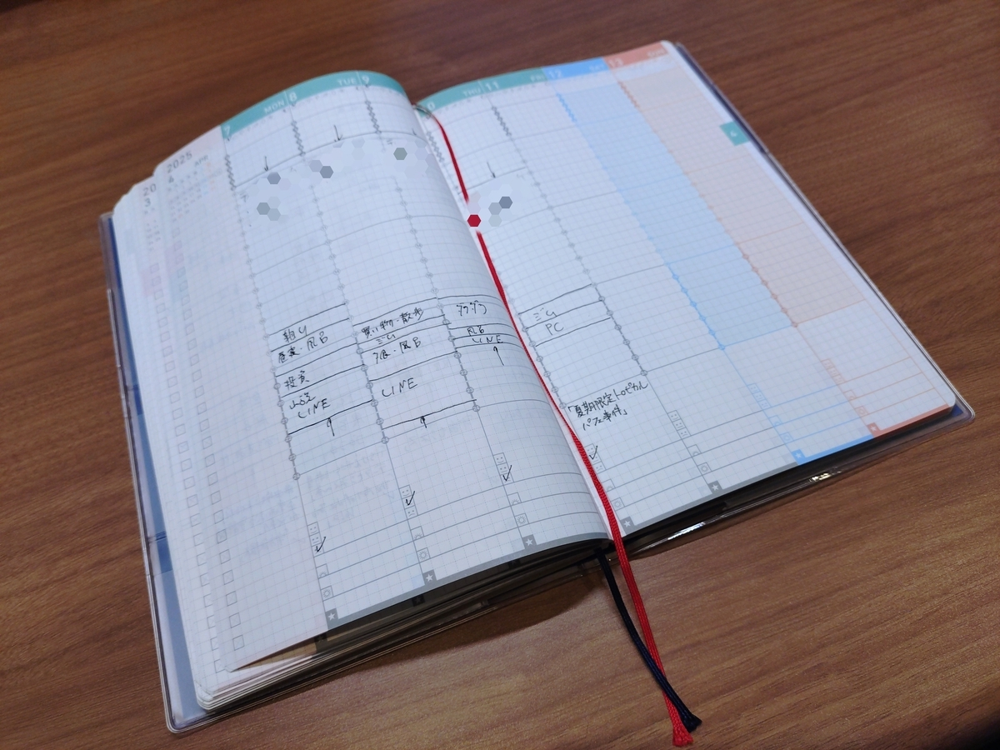
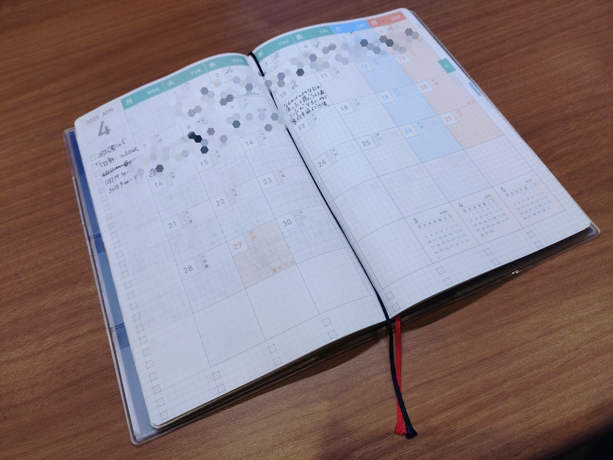
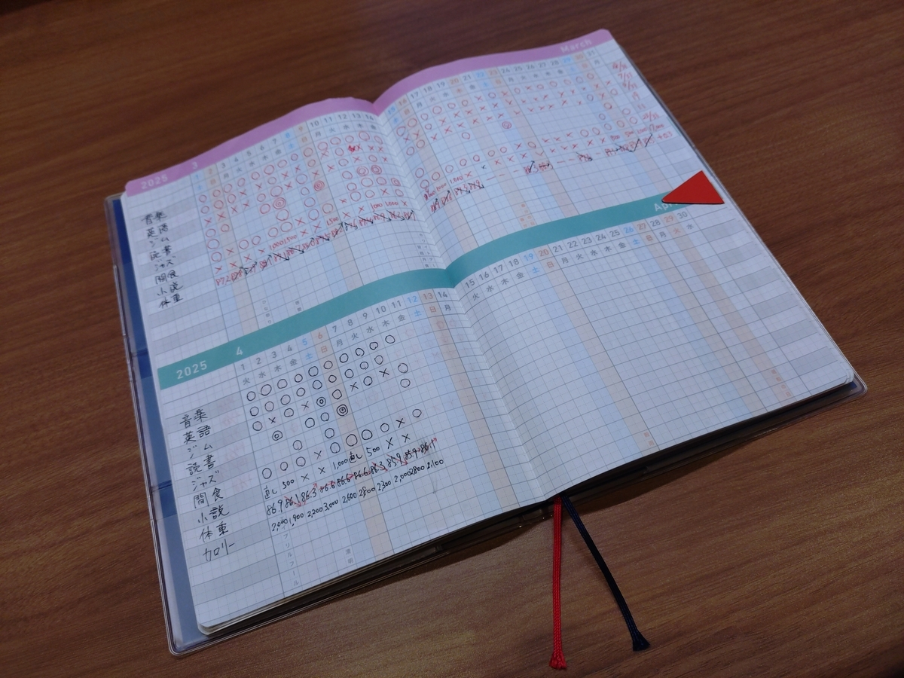
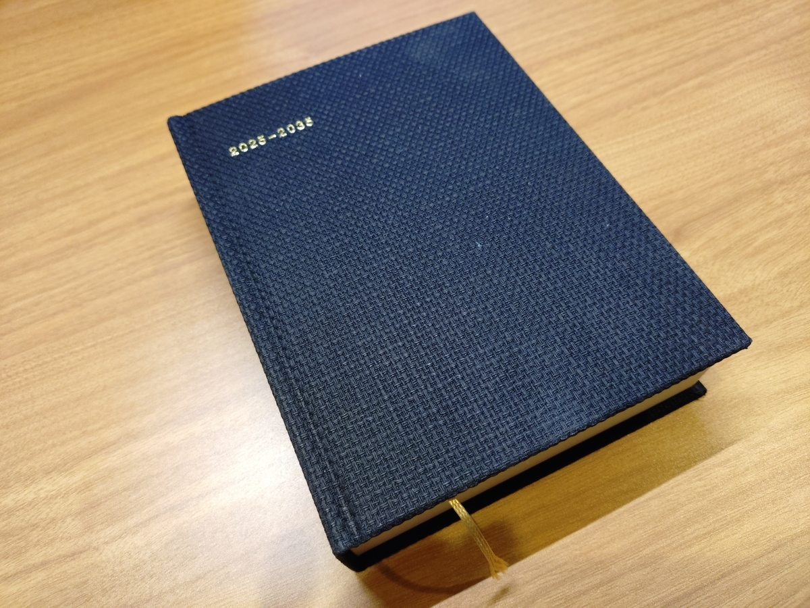
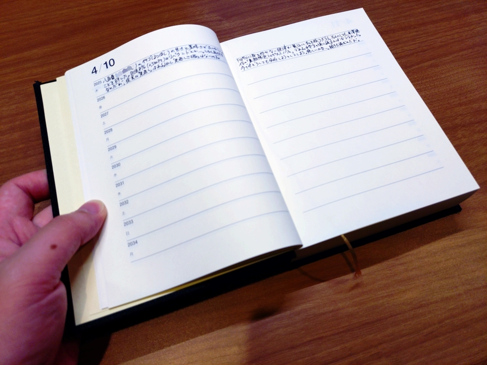
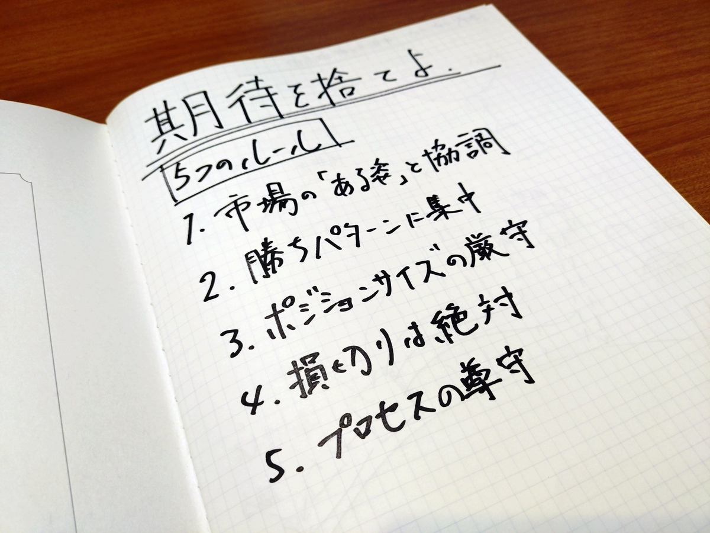
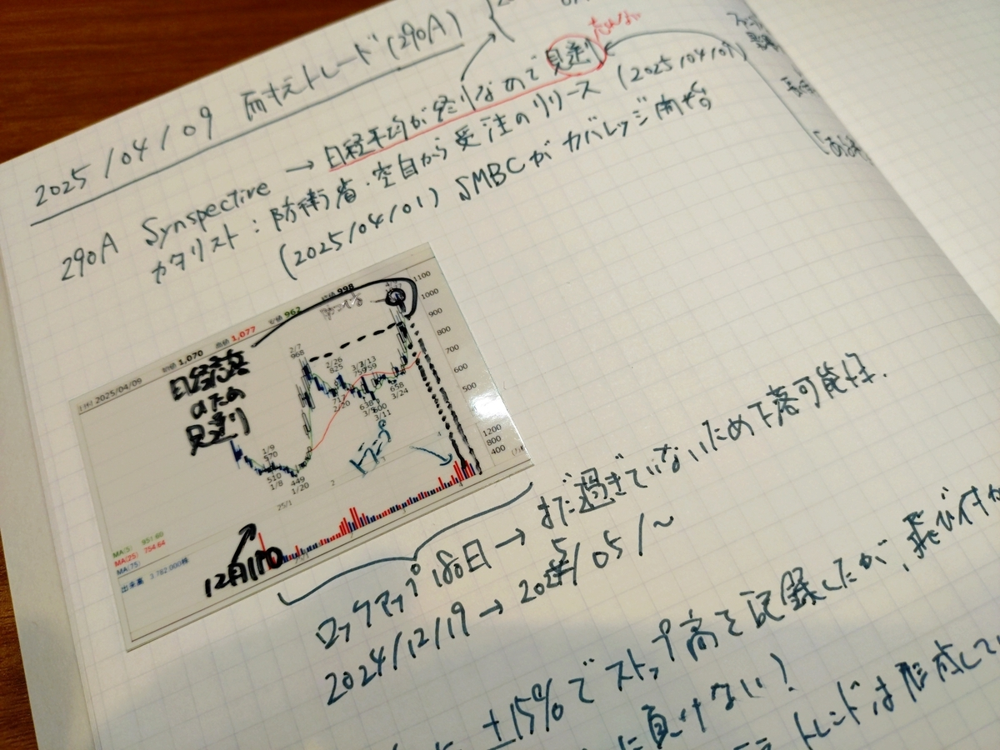
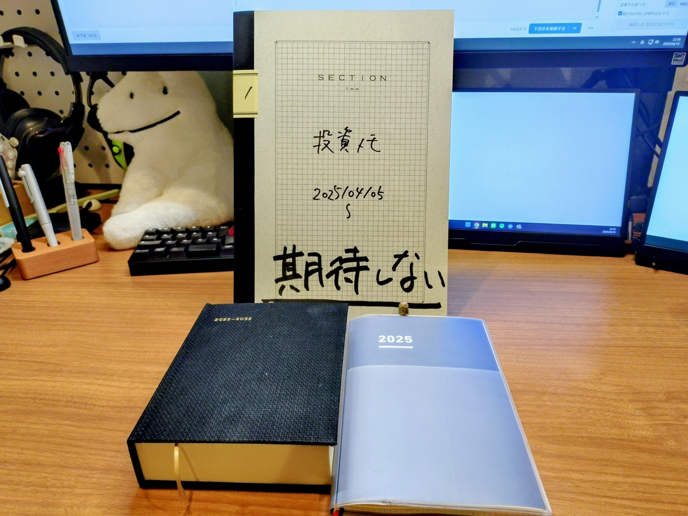

Ｘのアカウントを削除してから二ヶ月強が経過した。死んだ子の年を数えるようなものだが、数えてしまう。一ヶ月弱が経過した時の「Ｘをやめて良かったこと」は[2025年2月度月報に書いた](/posts/2025-02-28/)が、あれから読める本の量が増えて、心も穏やかになって、誰かと戦いたい気持ちも失せて、自分と家族と友人と向き合っている。みんなもＸをやめよう。

さて、困ったのは記録である。

Ｘでは日々の、というよりもはや刻々のだったが、記録を残していた。今でも他のＳＮＳで残している。が、いかんせん、インターネットの持続性への疑念はもう留まることを知らない。もとよりブログの他に五年、十年を残すことは考えていなかったが、数ヶ月、一年で散ることも念頭に置かなければなくなった。

後出し情報から入って恐縮だが、Ｘをやめる前の去年の十一月から紙の手帳を使っている。主に、①一時間単位の行動記録、②一日単位の一言日記、③一ヶ月単位の目標進捗、を記録している。









これはＸ云々抜きにして、単純に、やったことややりたいことの記録を電子では捌ききれなくなったからだ。この紙の手帳のウェイトは、Ｘをやめてからというもの日に日に増している。一方で、一年間の手帳であるため、日単位、週単位、月単位を決まった形式でしか残せないことに不満を覚えるようにもなっていた。

記録をもっと自由に、もっと長く残したい。

そこで導入したのが十年日記と投資ノートである。

十年日記は、その名の通り、十年にわたって日記を付けることができる日記帳である。二〇二五年四月一日から始まり、終わりは二〇三五年三月三十一日である。この日記帳を書き終える頃には全てのＳＮＳは言うに及ばず、このブログもなくなっているだろう。インターネットに書いた自分の想いも、そこでの友人との交流も、いいねと思った瞬間も、全て消えている。

だが、紙とインクは残る。自分の想いも、交流も、瞬間も、全て残せる。したがって、紙の日記帳にインクで日記を書くことにした。十年間を残すにあたり、さしあたって二つのルールを設けた。

ルールその一：嬉しかったことを必ず一つ書く。この日記帳の根幹を成すルールである。私は百パーセントの確率で全てを忘れる。インターネットは儚いが、私のエピソード記憶もまた、儚い。今年で三十三歳になる私の喜びを、十年後の四十三歳の私はどんな想いで振り返るのだろうか？　朧気に思い出すときことは、せめて嬉しかったことであってほしい。

ルールその二：仕事のことを書かない。これは前述の紙の手帳に任せたいからだ。また、仕事について書き始めるとキリが無い。刹那的な（紙に残す価値もないような）愚痴が多くなってしまうだろう。一切書かない。仕事は渡世。刹那である。

書き始めてからまだ十日しか経っていないが、確かな手応えを感じている。記録を残すという目的に加え、その日の嬉しかったことを毎夜日記を書くために思い出すというのは、それだけで気持ちの良いものだ。





投資ノートは、トレードの成績を上げるための業界研究や売買記録、チャート分析のため……、ではない。最大の理由は、トレーディングに臨む際の精神状態を刻み込むためだ。私見だが、個人投資を、私は陸上競技等の個人競技のようなものだと考えている。投資のためには様々な手法、分析、システムが存在する。だが最も重要なのは、どんなものに頼ろうとも、最後に結果を決めるのは、それを信じ抜くブレない精神だ。

人の心は弱い。市場が揺れればその瞬間の精神も揺れる。

トランプが関税を上げると言う。株価は下がる。あれだけ強い心で「いくら下がったら損切りをする」と決めたのに、弱い心は、いつか上がるかもしれないから持ち続けたいと期待する。下がった株価は二度とは戻らない。

トランプが関税をやめると言う。株価は上がる。あれだけ強い心で「一日だけ上がってもトレンドを作るまで買わない」と決めたのに、弱い心は、早く買えばそれだけトクをすると期待する。上がった株価はあっという間に下がる。

目まぐるしい朝令暮改に決心は揺らぐ。だが、紙に残した決心が消えることはない。このノートを通して、長期的な視点を持つ一貫したメンタルモデルが養われることだろう。

そして、十年後に振り返ったとき、現在の私のメンタルモデルは、まさに記録に残すべき現在の私の感情そのものである。





十年後が楽しみであり、十年後へと続く明日が楽しみである。



（おわり）
