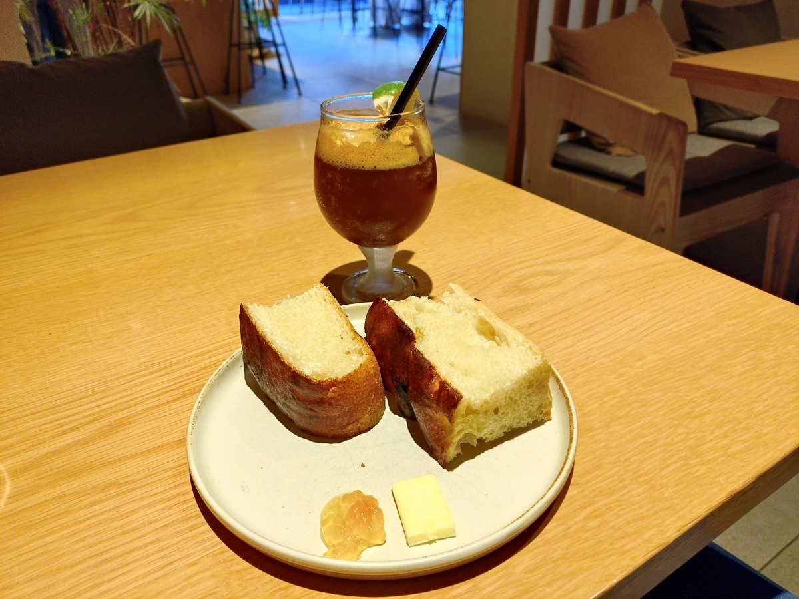
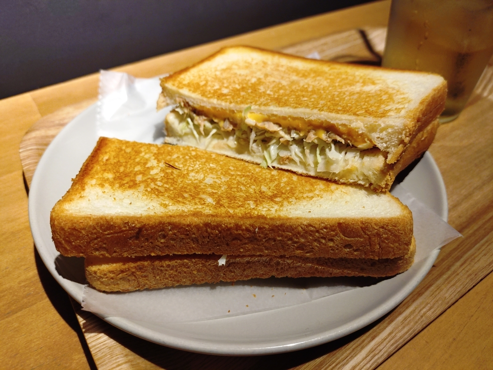
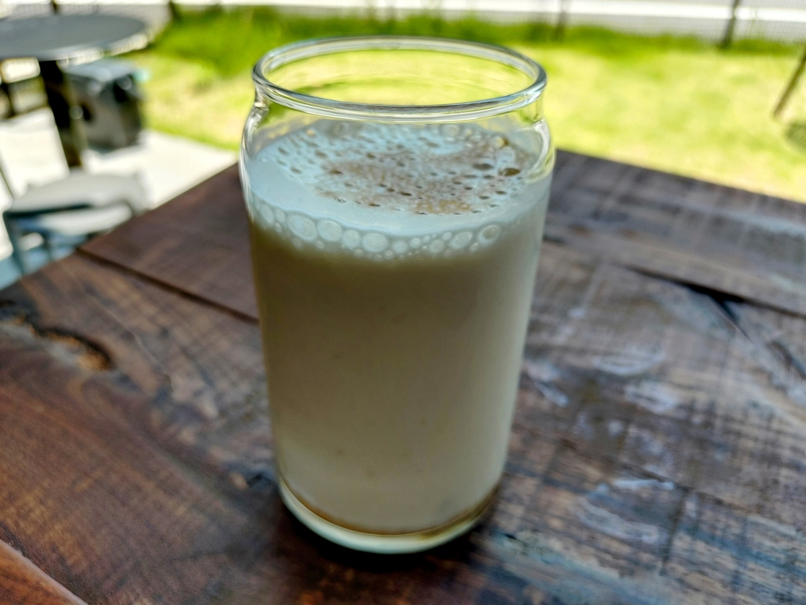
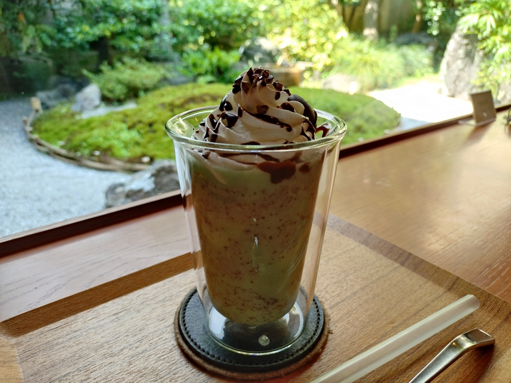

## 目次

1. ２０２５年目標に対する進捗
2. 雑記
3. ２０２５年６月度の本の感想（２冊）（年間累計６５冊）
4. ２０２５年６月度のジャズの感想（６枚）（年間累計４７枚）

## 1. 2025年目標に対する進捗

1. **趣味：新人賞に応募する。**
   1. 小学館ライトノベル大賞に応募する１２万字前後（±１０%）の原稿の初稿を２０２５年７月中に完成させ、９月末に応募する。
**→○２．９万字（累計９．０万字）。初稿が６月３０日に完成！**

2. **健康：体重を８８キロから７５キロまで減らす（身長は１８１センチ）。**
   1. ジムに年間１５０回行き、各回で必ず、アップ（プランク、プランク腕立ておよびＹＩＴバランス）および有酸素運動（クロストレーナー２０分以上）または無酸素運動（上半身セット）を行う。
**→×８７キロ→８７キロ。６回（累計６３回。年間１２６回ペース）**
   2. 一人でスナック菓子・ナッツ類を食べず、食べたくなったらガムを噛むか歯を磨く。
**→△８回食べた。**
3. **生活：紙の本を減らす。**
   1. 紙の本を減らすことで部屋のスペースを確保するために、紙の本を買うのは月に３冊までとする。例外を設けない。
**→×４冊。（『美人　Ｂｉｊｉｎ』、『読者ハ読ムナ（笑）』、『ジャズ・マンとその時代』、『セロニアス・モンクのいた風景』）**
4. **仕事：ドメイン知識を海外に展開できるようにする。**
   1. 社内の技術をより深く理解するために、電子回路について学ぶ。教科書を１冊やり切る。
**→○暇なときに教科書を眺めている。**
   2. 英語の議論でナメられないようにするために、スピーキング・リスニングを鍛える。１ヶ月に８回、２０分間の英会話レッスンを行う。
**→×ぜんぜんだめ。**

## 2. 雑記

６月度の一冊は<strong>『選定なし』</strong>、一枚は<strong>『Ride into the Sun』（Brad Mehldau）</strong>でした。

『Ride into the Sun』はとにかく静けさがたまりませんね。



**６月は本を一切読めませんでした**。そういうバイオリズムなんだと思うことにしました。**ジャズは６枚とそこそこ聴けた**んですけどね。

<strong>小説は２．９万字（累計９．０万字）で初稿が完成！</strong>６月３０日にちょうど最初のピリオドを打てました。しかし、このエントリを書いている７月１日に最初から最後まで読み直したところ、良いところと悪いところがハッキリしすぎていて、トータルで「なんだかな」という完成度。とにかく台詞、台詞に対するリアクションが少なすぎる。台詞！　台詞！　台詞！　台詞の量はこれから２倍に増やしたいですね。直しどころが多すぎる！　５月度の月報では「微修正」と書いていましたが、もう、徹底的に叩き直す。漫画で言えばこれがネーム、これからが本番というつもりでやります。

６月２８日（土）～７月１日（火）を四連休にして、２９日（日）～１日（火）の**３日間を京都**で過ごしていました。来週から祇園祭なので、それに合わせて今週は観光客の少ない週末だったようです。とは言え、私の目的は**原稿＠喫茶店**。人が少ない京都って快適ですね。３０日には１日で喫茶店を４店舗ハシゴし、１日で８０００字の進捗を叩き出しました。よく頑張りました。ハシゴした喫茶店も、これまでの自分の手札になかった４店舗。開拓にも成功しました。そんなワケで、**６月３０日は２０２５年の最良の日**。それくらい良い日。









## 3. ２０２５年６月度の本の感想（２冊）（年間６５冊）

**①『若きアスリートへの手紙』（町田樹）**
読書メモは別途取ったのでそちら参照

**②『会社四季報プロ500　2025年　夏号』（東洋経済新聞社）**
ある種の教養のためにと思って読んできたが、自分のトレードのためには読まなくてもいいなと思った（基本的に、ここに載るくらい知られた時にはもう持っていて、なんなら売り終えていたい）

## 4. ２０２５年６月度のジャズの感想（６枚）（年間４７枚）

**①『Three Times Three』（Antonio Sanchez）**
1曲目「Nar-This」がモダンジャズの名曲「Nardis」を現代風に超格好良くアレンジしているので聴いてほしいです。



<strong>②『Let Go』（Robert Grasper）</strong>かなりスピリチュアルジャズ寄り。難解。
**③『Solid Jackson』（M. T. B.）**
上手いわ……。ブラッド・メルドーらベテランプレイヤーのカルテットの一枚。どのパートも言わずもがなだが、ベースのソロの聴かせ方が抜群に上手い気がする。
**④『Words Fall Short』（Joshua Redman）**
ジョシュア・レッドマンは若い頃のパリでの演奏（1990年代中盤の「Night in Tunisia」のライブ）を指して「どうやって吹いていたのかわからない（大意）」とインタビューで語っていたが、確かに、全くの別人である。演奏そのものも落ち着いているし、良い意味でケレン味がない。
**⑤『Ride into the Sun』（Brad Mehldau）**
どれも落ち着いて心地よいのだが、3曲目「Better Be Quiet Now」が目の覚める素晴らしさ。今月のベストかな。
**⑥『It Doesn't Mean A Thing If It Ain't Got That Swing』（Manhattan Jazz Quintet）**
スタンダードなナンバーをスタンダードなカルテット編成でやり切ってくれる気持ちよさですよね。クインテットと名乗っているだけあり、どの楽器にも等しく聴き所を設けている。ところでManhattan Jazz QuintetってModern Jazz Quartetとは別グループなんですね。

（おわり）
