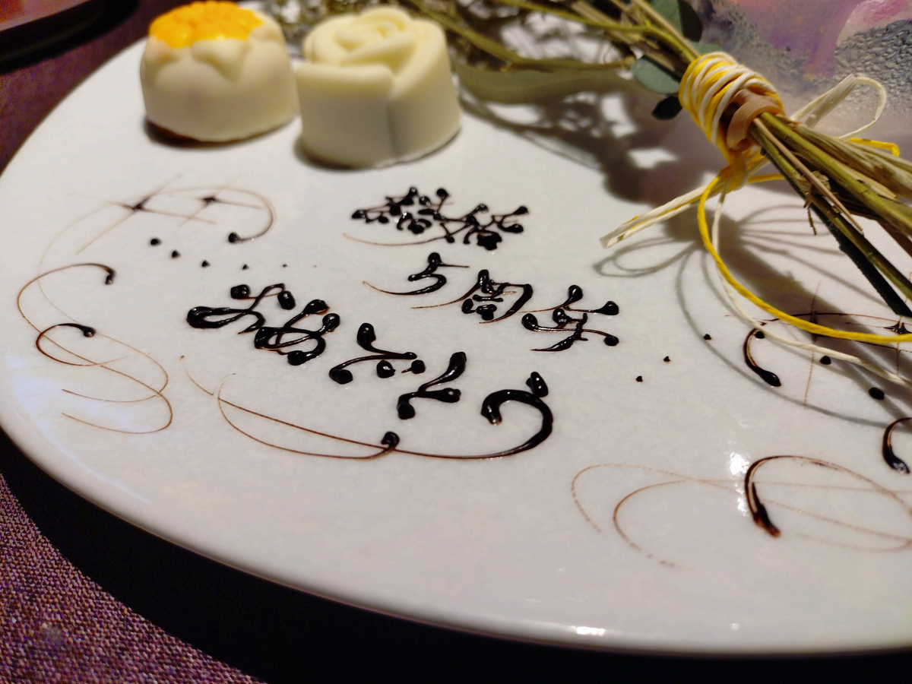

## 目次

1. ２０２５年目標に対する進捗
2. 雑記
3. ２０２５年７月度・８月度の本の感想（１２冊）（年間累計７７冊）
4. ２０２５年７月度・８月度のジャズの感想（１１枚）（年間累計５８枚）

## 1. 2025年目標に対する進捗

1. **趣味：新人賞に応募する。**
   1. 小学館ライトノベル大賞に応募する１２万字前後（±１０%）の原稿の初稿を２０２５年７月中に完成させ、９月末に応募する。
**→８月中旬に知人各位からレビューをもらえるまでブラッシュアップできました！　今はひたすら直し。**

2. **健康：体重を８８キロから７５キロまで減らす（身長は１８１センチ）。**
   1. ジムに年間１５０回行き、各回で必ず、アップ（プランク、プランク腕立ておよびＹＩＴバランス）および有酸素運動（クロストレーナー２０分以上）または無酸素運動（上半身セット）を行う。
**→×完全に気持ちが切れてジムを休会。**
   2. 一人でスナック菓子・ナッツ類を食べず、食べたくなったらガムを噛むか歯を磨く。
**→×**
3. **生活：紙の本を減らす。**
   1. 紙の本を減らすことで部屋のスペースを確保するために、紙の本を買うのは月に３冊までとする。例外を設けない。
**→○２ヶ月で６冊ちょうど。**
4. **仕事：ドメイン知識を海外に展開できるようにする。**
   1. 社内の技術をより深く理解するために、電子回路について学ぶ。教科書を１冊やり切る。
**→○暇なときに教科書を眺めている。実機での研修にも参加した。**
   2. 英語の議論でナメられないようにするために、スピーキング・リスニングを鍛える。１ヶ月に８回、２０分間の英会話レッスンを行う。
**→×ぜんぜんだめ。**

## 2. 雑記

７月度・８月度の一冊は<strong>『夜間飛行／人間の大地』（サン=テグジュペリ, 野崎歓）</strong>、一枚は<strong>『STEAM ENGINE』（STEAM ENGINE）</strong>でした。

６月から７月下旬まで本を読めない時期が続いていましたが、ずっと楽しみにしていた<strong>『夜間飛行／人間の大地』のおかげで読書に復帰できました。</strong>野崎歓の新訳です。『人間の大地』（または『人間の土地』）って私の人生の指針の一つとなっている小説でして、それがまたこうして新しい側面を見せてくれることが嬉しい。ありがとう。



**『STEAM ENGINE』は「ジャズ聴いてみたいんだけど？」ってリスナーにちょうどいい**んじゃないかな。まあ、いいから聴いてみてよ。



ミュージシャンも新進気鋭の若手ジャズメン（いままさに日本で最もアツいミュージシャン）。こうして（まだ）日本で演奏してくれる機会を喜んだ方がいいと思います。私は１０月のCotton Clubでのステージに行きます（予約済）。



<strong>小説は体験版が完成！</strong>いまは体験版へのご講評を参考にしつつ、ひたすら直しの時期。苦しいけれどここを乗り越えないと先がない。

自分は（元々は、読者と作者との間でキャラクターが共有されている二次創作出身であることもあり）小説の立ち上げが明確に苦手（自覚有り）。キャラクターと空間の立ち上げ（セットアップ）・セットアップで読者を掴むフックに対するコメントを多く頂きました。

また、伊坂幸太郎・津村記久子など私が好んで読んでいる小説の影響が強く、キャラクターの外見を読者に刷り込むのも得意じゃないみたいです。「それは各々で勝手に想像して頂いて」と思っちゃう。いや、ラノベなんでしっかり描き込まないと、そして外見を明瞭に想像して頂かないと。

あとはそうですねえ、男女もののラノベのクセに甘さ（潤滑油）が少ない。書いた直後は（それぞれのシーンへの思い入れがあることもあり）「よく書けてるな」って感じてたんですが、冷静に読み直してみると、どのキャラクターも冷静すぎるというか、どこか互いに突き放した感がある。

まあ、あと色んなコメントありましたが、直したいのはこの３つですね。

健康について、<strong>ジムの気持ちが完全に切れちゃった。</strong>今は諦めて肥満外来に通っています。

また、トレーディング。自分なりの<strong>トレーディングのやり方が体系化・明文化・ルール化されてきました。</strong>８月にはそのやり方に基づいて過去１０年分のデータでバックテストもやってみて、なかなか悪くないリターンが見込まれることもわかりました。バックテストはともかく、自分なりのやり方は、いつかブログ記事にしてみたいな。noteの雑記事（投資に関してはnoteって生成AI産のゴミばかり）よりも意味ある記事になると思います。

さて、**７月度の月報をサボった理由は、完全に夏バテ**で（部屋が暑すぎて・ジメジメし過ぎて）メンタル・フィジカルともにヘタっていたからですね。築４０年・１階・１K・裏通りの部屋から**引っ越します**。夏の間ずっとこのコンディションなので、もう完全に部屋の環境が原因ですね。来年もこれやるワケにはいかないし、というより、終わらない夏の間ずっとこれだと流石に人生単位で悪影響が出るので、もう**引っ越します**。次は今よりは上の階で新しくて広い部屋。９月末に**引っ越します**。みんな遊びに来てもいいよ。

ところで、８月１９日は結婚５周年。８月２３日におフレンチも頂きまして、最高。ここ数年で**家族とともに食べた料理の中で最良の時間**でした。でも、テーブルマナーって難しいね（フォークの背に乗せない！！！）。あと、同日はSwitch 2を買いに羽田空港まで小旅行してみたり、記憶に残る一日でしたね。こういう日が四半期に一回くらいあると「いい人生」って気がする。

## 3. ２０２５年７月度・８月度の本の感想（１２冊）（年間７７冊）

**①『夜間飛行／人間の大地』（サン=テグジュペリ, 野崎歓）**
さし当たって「人間の大地」だけ読んだが、私の人生の指針の一つになっている書である。かなり硬質で透明な印象を受けた。他の訳と読み比べたいなあ。

**②『100分 de 名著　サン=テグジュペリ　人間の大地』（野崎歓）**
『人間の土地』あるいは『人間の大地』は私のブックオブライフなのだが、頭から最後までその良さを感得できているかと言えばそうでもなくて、特に終章はマニフェスト的で、かなり説教くさく感じている。それまでの、空と大地による暗喩とは打って変わって、かなり直接的なのである。
しかし、本書のような解説書を読むと「なら、あった方がよかったんやろなあ」とも感じますね（そして、『人間の～』を読み直すたびに「うーん」感じるんでしょうね）。

**③『ラリー・ウィリアムズと短期売買法【第2版】投資で生き残るための普遍の真理』（ラリー・ウィリアムズ）**
私はこの数週間ほど、自分の感情にフィットしたトレーディングのモデルの構築とそのバックテストに励んでおり、本書ではこの試みが完全に正しいことが証明されたように思う。
本書にはトレーディングに関する様々な論点が含まれているのだが、結局は、①感情のコントロール、②モデルの構築、に集約される。この二つは密接に関係する。感情をコントロールできなければ、完璧なモデルがあったとしても従えない（=勝てない）。
本書のモデルはアメリカのコモディティと指数がベースなので、日本の個別株に適用するには数え切れないほどの修正を加えなければならないだろうが、上述の二点は普遍の真理だろう。本書のベースとなる第1版は1990年代（今よりも市場データへのアクセスが悪く、モデルのテストも難しかった時代）に書かれ、当時は本書を読んだとしても検証が難しかっただろうが、2025年の現在は天国だ。どんどんテストしよう。
もともと私は「新高値ブレイク」と呼ばれる、トレンドフォロー型の極めて単純な手法からトレードを学んだが、今はもっと洗練させている確信がある。しかも、自分の感情にフィットするようなやり方で。自分の「投資スタイル」（便宜的にそう呼ぶけれど）をもはや「投資」とは一切感じていなくて、投機、トレーディングです。そういうスキルツリーになってきた。

**④『ヘッジファンドのアクティブ投資戦略』（ラッセ・ヘジェ・ペデルセン）**
アクティブファンドが「エッジ」（市場に対する優位性）を得るメカニズムを詳述する……のだが、難しくてぜんっぜんわからなかった。打ちのめされました。彼らが様々な学問を横断的に用いていることだけはわかった（なんもわかってないのでは？）。
元は、本書からスマートマネー（巨大な資本を有する投資家）の一つであるアクティブファンドが、どのようにしてトレンドを作っているのかを知り、トレンドフォローである現在の私の手法を洗練させるのに使おうと考えていた……が、難しかった。
ただ、面白みを感じたのは、アクティブファンドは個人投資家を遙かに凌駕するスケールの資金と知能を有しており、にも関わらず、なんか普通に市場に踊らされることもあることだろうか（本書で登場したアクティブファンドは、どれも地位を確立できたほど勝ったファンドなのだが、それでも失敗談が無限に出てきた。ということは、負けたファンドはその無限を上回るくらい負けたということである）。

**⑤『身体が生み出すクリエイティブ』（諏訪正樹）**
クリエイティビティの源を探る一冊。
クリエイティビティのためには頭（論理）だけで考えたとしてもリープ（跳躍）が足らず、身体（感覚）がその対象に接するように想像することがポイントとなる。つまり、分析だけではなく、想像すること、自分自身から離れて相手にダイブすること。
とは言え、身体と対象が接した体感は、言葉にしないと失われてしまう。まず言葉にしつつ、その言葉からズラして別の言葉を探すプロセスが感覚・言葉を広げることに繋がり、ひいてはクリエイティビティの源泉となる。
私はジャズを聴いてはその良さの言語化を試みている（た）のだが、もっと精緻にやりたくなった。
小説の種本のために読んだのだが、思わず唸る箇所も多く、読み物として楽しかった。

**⑥『伝説のトレーダー集団　タートル流投資の魔術』（カーティス・フェイス）**
まず、本書が掲げた「隙のないシステム」という概念が気に入った。トレーディングのためのシステムは様々な手法、変数、評価方法でバックテストされねばならない。システムの強固さに関して、類書と比較して相当の紙幅が費やされている。私自身も自分のシステムに対してバックテストは幾らか行っているのだが、作り込みが不足していた。このコンセプトをシステムに取り入れ、市場に負けないように改良したいと感じた。
そして痛感したのは、本書も類書も、規律に従うことの重要性とその困難性についてひたすらに語る点だ。彼ら成功したトレーダーは、その性質を身につけて成功したトレーダーを多く見、そして、それを遙かに上回る数の失敗したトレーダーを目にしてきたのだろう。
私は日本人トレーダーの投資本もかなりの数を読んできたと自負があり、しかし、その本のほとんどは「規律」を語らない。儲けのためのシステムについては辛うじて語るが（じゃあ何を語るの？　何もなしなんだよ）。
日本語で読めるアメリカの投資本は、日本語に翻訳するに値すると出版社が選別したものであるとは言え、この「規律」の語り口、重みが異なる。トレーディングの成功ためのシステムは二の次で、本質は「規律」。
とは言え、システムを作ることと規律を守ることは切り離せない。もしも守るべきシステムがなかったら、なにを守れと言うんだ？

**⑦『投資の公理　非合理な人間が非効率な市場に挑むときの11の教訓』（ポール・マーシャル）**
効率的市場仮説をボコボコにしたい本。

**⑧『「こつ」と「スランプ」の研究　身体知の認知科学』（諏訪正樹）**
『身体が生み出すクリエイティブ』に続いて2冊目の諏訪本。『身体が～』の方が切り口が斬新（身体知を「お笑い」から語るのは初めて見た）ので、 そちらを読めばいいか。
身体知を感覚と言語からなるアートであると説く類書はいくつかあるが、その中だとスケーターの町田樹『若きアスリートへの手紙　〈競技する身体〉の哲学』が圧倒的だった。

**⑨『記憶の深層　〈ひらめき〉はどこから来るのか』（高橋雅延）**
読みさしだったのを最後まで。記憶にストーリーを持たせるということ。

**⑩『マルチタイムフレームを使ったテクニカルトレード』（ブライアン・シャノン）**
これまで読んだテクニカルトレードの本の中で、最も教科書的な網羅性の高い一冊かもしれない。特に「4つのステージ」に割く紙幅がちょうどよく、その紹介に留まらずにインサイトもある。さらに、本書独自の視点もある。
本書でなるほど感があったのはタイトルの通り「マルチタイムフレーム」（複数の時間軸）でのトレードに関するコンセプト。週足、日足、30分足……と、大きな時間軸から小さな時間軸へと向かってトレンドを確認していく。たしかに、それぞれの時間軸に関するトレーダーがいるのだから、それぞれに関して確かめるのが筋なのだが、自分が中心になると自分の時間軸しか見なくなる。
ところで、損切りについては、私は長らく固定割合を使っているのだが、ATRを使った方がいいのかもしれないと感じられるようになってきた（タートルズはATRの2倍を使っていたはず）。
テクニカルトレードだと、ラリー・ウィリアムズが教科書的に扱われることが多いが、最初の一冊には本書だろうな。

**⑪『リサーチ・クエスチョンとは何か？』（佐藤郁哉）**
これ、物語を考える人は読んで損しないと思います。リサーチ・クエスチョンを「仕掛品としての問い」（リサーチを深めるプロセスにおいて絶えず見直され、やがて最後には形を変える問い）と定義しているんですが、それってまさに物語を考えるプロセスにおける「テーマ」のあり方と同じだと感じたんですよね。最初の問いは最終の問いと異なるかもしれない。しかし、それなしではプロセスを進めることができない。そういう存在である「仕掛品としての問い」。そういう目線から小説を見直したくなりました。

**⑫『作家と楽しむ古典　平家物語ほか』（古川日出男、ほか**）
古川訳の『平家物語』は原稿が終わったら読みたい本の一つで、それに先立ち訳者の想いを。

## 4. ２０２５年７月度・８月度のジャズの感想（１１枚）（年間５８枚）

**①『It Doesn't Mean A Thing If It Ain't Got That Swing』（Manhattan Jazz Quintet）**
スタンダードなナンバーをスタンダードなカルテット編成でやり切ってくれる気持ちよさですよね。クインテットと名乗っているだけあり、どの楽器にも等しく聴き所を設けている。ところでManhattan Jazz QuintetってModern Jazz Quartetとは別グループなんですね。

**②『Lover Come Back To Me』（Manhattan Jazz Quintet）**
親しみのあるスタンダードナンバーをいかにもスタンダードな演奏でやってくれる。失礼な書き方だが、集中しないで聴ける、聴くのにちょうどよく感じる。

**③『Lofty Fake Anagram』（Gary Burton）**
ゲイリー・バートンのヴィブラフォンの金属的なサウンドにエレキギターが乗って独特の味わい。

**④『Live at Music Inn with Sonny Rollins』（The Modern Jazz Quartet）**
MJQとソニー・ロリンズの夢の共演やん。「A Night In Tunisia」が例によって好き。MJQとソニー・ロリンズが現役で「チュニジアの夜」をやってた時代が存在したの凄すぎる。

**⑤『After Hours』（山中千尋）**
聴きました。ながら聞きだったので反省。

**⑥『Portrait of Bill Evans』（Eliane Elias, Dave Grusin, Herbie Hancock, Bob James, Brad Mehldau）**
すげ～一枚っす。豪華ミュージシャンによるビル・エヴァンスへのトリビュート。

**⑦『STEAM ENGINE』（STEAM ENGINE）**
日本の若手ジャズバンドSTEAM ENGINEのアルバム。すっごい聴きやすいです。聴かせどころがわかるというか。
もしもジャズを聴いたことない人に「ジャズっぽい一枚」を渡すならビル・エヴァンスの『Interplay』だったのだが、「かっこいい一枚」なら本作かもしれない。



**⑧『Positive Intensity』（Tommy Flanagan）**
トミー・フラナガン（p）がリーダーのトリオ。トミー・フラナガンがグイグイ来る以上にロイ・ヘインズ（dr）が叩きまくる。ハイハットなどで音が広がっていたところを、ピアノのサウンドがギュッと収束させるのがなかなか聴いていて面白い。

**⑨『Paris Jam Session』（Art Blakey）**
良すぎてウットリしてた。ジャズメッセンジャーズにバド・パウエルとバルネ・ウィランがゲスト。ふと、バド・パウエルのサウンドが感得された気がする。

**⑩『Code Derivation』（Robert Glasper）**
ロバート・グラスパーって凄いわ。昔のモダンジャズ的サウンドを散りばめながら、ヒップホップの性格も併せ持っている。同様の試みの『BLACK RADIO』は実験的な感じを受けたが、本作は一枚のジャズアルバムとして完成されている。

**⑪『Ride into the Sun』（Full）（Brad Mehldau）**
素晴らしい。室内楽的なサウンドなんだけれど、ジャズを聴きたい気持ちを完全に満たしてくれる。必聴。また、このアルバムを楽しめるほど成長した自分が嬉しい。



（おわり）
