## ０．序文：すべては損切りから始まる。

みなさんは、株を買うときに何を考えて買いますか？

カタリストですか？　優れたファンダメンタルズですか？　美しいチャートですか？

私はどれでもありません。

私のトレードは「このトレードで１０万円[^1]を失ってもいいか？」と自分に問いかけることから始まります。

私のトレードは損切りから始まります。

## １．私は誰か？

### 私自身について。

私はコロナ禍の２０２１年から投資を始めた兼業トレーダーです。歴、メチャ浅い。ただ、兼業なりに試行錯誤したのでこの記事で紹介していきます。なぜなら、このブログは私のブログなので。

さて、２０２５年に入ってからの自認は「投資家」よりもむしろ「トレーダー」。トレーディングスタイルは、徹底したトレンドフォローのテクニカル派。テクニカル：ファンダは８：２の気持ち。この記事でも、株を買ったり売ったりを「投資」ではなく「トレード」と呼びます。

私は２０２３年にトレンドフォローの手法「新高値投資[^2]」を知り、それ以来、トレンドフォローの手法を洗練させることだけを考えてきました。その過程で、いわゆる「新高値投資」や「新高値ブレイク」とは決別しました。

２０２４年にトレンドフォローの雄であるアメリカ人トレーダー、マーク・ミネルヴィニの著書に感銘を受けたことをきっかけに、ウィリアム・オニール、ラリー・ウィリアムズ、タートルズのカーティス・フェイスのトレンドフォローに関する本を読み漁り、トレンドフォローについて思索を深め、日本市場で実践しています。

２０２５年９月現在の私のトレーディングスタイルをこうしてブログ記事として言語化し、自分のスタイルの整理をするとともに、読者の皆さんからの刺激を得られたらと考えています。それがこの記事を書いた理由です。

### 私の失敗について。

トレードを始めた２０２１年、私は「なんとなく」で買った株がいい感じに上がるのを見て喜び、手を叩き……、２０２２年の年明けに「その日」がやってきました。

> ずっとアツかった半導体が、いま「割安」だ！（ＳＮＳの声）

ＳＮＳでのウワサに飛びつき、資金のうち「かなりの額」を半導体関連企業の株価に連動して動く指数：ＳＯＸＬ[^3]に注ぎ込みました（チャートの左側の⬅）。

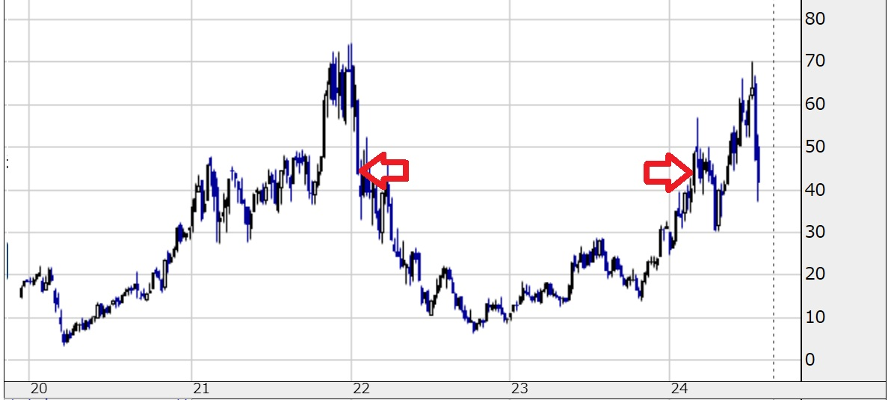

まだ下がる！　また割安！！　ナンピン！！！　まだ下がる！　また割安！！　ナンピン！！！　ウオー！！！！！！！！

結果はご覧の通り。

２０２４年の春前（チャートの右側の➡）になんとか手放すまで２年もの間、私の資金のうち「かなりの額」は塩漬け。相当な機会損失を被りました。

資金が目減りしている間、私は一つの問いについて考えることになりました。

> 「安く買ったら、いつ売ればいいんだ？」（私）

バリュー投資の王であるウォーレン・バフェットに訊いたとしても、その答えは返ってこないでしょう。

> 「最も好きな保有期間は永遠である。」（ウォーレン・バフェット）

日本人投資家はバフェットのことが大好きですが、私は大嫌いです[^4]。なぜなら、私が一番困っている時に答えをくれなかったから。

２０２２年の私は散々でした。「かなりの額」が塩漬けになっていたせいでトレードはできず、買ってから１／４まで落ちたＳＯＸＬを手放すこともできず……。まったくトレードできない一年でした。

２０２３年に入って資金が増え、再起を賭けて様々な本を読む中で出会ったのがトレンドフォローでした。

> 「高値で買って、さらに高値で売る。」（トレンドフォロワー）

２０２２年の私への答えはそこにありました。

## ２．この記事の想定読者について

この記事の想定読者は、

- バリュートラップに引っかかった兼業投資家
- 日本市場でトレードするトレンドフォロワー

兼業投資家のうち「割安」「バリュートラップ」に引っかかってる方に「こういう方法もあるんだよ！！！」って紹介したい。

トレンドフォロワーのための本って、多くはアメリカで出版されたアメリカ市場向けの本[^5]じゃないですか？　でも、私たちの多くって日本市場でトレードをするわけで、そこにはアメリカ市場のための手法とのギャップがある。そのギャップをこの記事で埋めたい。せめて、ヒントを提供したい。

願わくば、この記事があなたの一助になることを。

## ３．すべては損切りから始まる。

### 人は誰しも「損」をしたくない。

では「損」とは？

1. 含み損は「損」か？
２０２２年の私：損ではない。
２０２５年の私：損である。
2. 機会損失は「損」か？
２０２２年の私：損ではない。
２０２５年の私：損である。
3. 確定損は「損」か？
２０２２年の私：損である。
２０２５年の私：受け入れるべき「必要経費」である。

日本の兼業投資家の多くは、含み損を損だと捉えません。その含み損が確定して初めて損が確定する、と考えがちです。

私は「含み損≠損」という考え方を決して受け入れません。含み損が戻らないリスク、含み損が膨らむことへの不安・精神的コスト、なにより、その資金で本来得られたハズの機会を失うことのコスト……。

行動経済学には「損失回避性」という概念があります。これは、損失を回避することを利益を獲得することよりも評価してしまうという人間の心理です。これって、含み損を確定損へと確定させない心理なんですよね。

私のトレード戦略は、損切りを受け入れるところから始まります。

下表はトレードの本ではあるあるの表ですが、「トントン」に戻すために必要なリターンは、確定損が大きくなればなるほど大きな額が必要です。

| 確定損へと確定させた損失割合 | 「トントン」に戻すために必要なリターン |
| --- | --- |
| 4% | 4% |
| 5% | 5% |
| 6% | 6% |
| 10% | 11% |
| 15% | 18% |
| 20% | 25% |
| 25% | 33% |
| 50% | 100% |

失った５０％を取り戻すためには、残りの５０%から１００％のリターンを得なければいけない。要するに、ダブルバガーを狙う必要がある。

ダブルバガー、狙えますか？

私は、ダブルバガーを狙えない。

ダブルバガーを狙えないならどうするか？

そう、ダブルバガーを狙うまで追い込まれる前に、損失を確定させる。撤退する。

損切り＝撤退ラインを決めるところから私のトレードは始まる。

### では、いくらなら失えるか？

一般的に「トレード資金全体の１～２％が１回のトレードで許容できる損失」とされています。私は保守的なトレードを好むので、トレード資金全体の１％を許容できる損失としています。これを踏まえてちょっと計算してみましょう。

１回のトレードでの損切り許容ラインを５％とするならば、１回のトレードで使える資金は全体の２０%となります。４％ならば、２５％。そうすると、原理的に、そもそも３～５銘柄しか保有できないことになります[^6]。

損切りで失える額が決まると１回のトレードの資金が決まり、１回のトレードの資金が決まると保有できる銘柄の数が決まる。

すべては損切りから始まる、とはまさにこの意味です。

## ３．損切りの次に利益がある。

### わかった。じゃあ、利益はどうするんだ？

> Trend is Friend.（トレンドフォロワー）

利益は伸ばせるだけ伸ばせ、がトレンドフォローの教科書的な答えですが、ちょっと計算してみましょう。

勝率５０％、１トレード当たりの利益率９％、損切り許容ライン４．５％のトレードを月に４回行った場合を例に取ってみましょう。この場合は、年間でのリターン１３％になります。机上の空論と言えど、結構なリターンだと思いませんか？

| 月 | 資金 | リターン | １銘柄当たりの資金の割合 | 総トレード数 | 勝ちトレード数 | 勝率 | １トレードに期待する利益率 | 負けトレード数 | 損切り許容ライン | 月当たりの損益 |
| --- | --- | --- | --- | --- | --- | --- | --- | --- | --- | --- |
| １月 | 100 | 1.8% | 20% | 4 | 2 | 50% | 9% | 2 | 4.5% | 1.8 |
| ２月 | 101 | 2.8% | 20% | 4 | 2 | 50% | 9% | 2 | 4.5% | 1.818 |
| ３月 | 102 | 3.8% | 20% | 4 | 2 | 50% | 9% | 2 | 4.5% | 1.836 |
| ４月 | 103 | 4.9% | 20% | 4 | 2 | 50% | 9% | 2 | 4.5% | 1.854 |
| ５月 | 104 | 5.9% | 20% | 4 | 2 | 50% | 9% | 2 | 4.5% | 1.872 |
| ６月 | 105 | 6.9% | 20% | 4 | 2 | 50% | 9% | 2 | 4.5% | 1.89 |
| ７月 | 106 | 7.9% | 20% | 4 | 2 | 50% | 9% | 2 | 4.5% | 1.908 |
| ８月 | 107 | 8.9% | 20% | 4 | 2 | 50% | 9% | 2 | 4.5% | 1.926 |
| ９月 | 108 | 9.9% | 20% | 4 | 2 | 50% | 9% | 2 | 4.5% | 1.944 |
| １０月 | 109 | 11.0% | 20% | 4 | 2 | 50% | 9% | 2 | 4.5% | 1.962 |
| １１月 | 110 | 12.0% | 20% | 4 | 2 | 50% | 9% | 2 | 4.5% | 1.98 |
| １２月 | 111 | 13.0% | 20% | 4 | 2 | 50% | 9% | 2 | 4.5% | 1.998 |

ご自身のこれまでの勝率・利益率をご自身で計算し、仮に厳格に損切りをしていたらどれくらいのリターンが得られたかまで計算してみると、損切りが悪くないものだと分かると思います。

## ４．損失・利益の計算の次に方法論がある。

### 合い言葉は「ＶＣＰ」

ここまで長らく計算にお付き合いありがとうございました。ここからがこの記事の「私らしさ」です。

私の方法論は、ＶＣＰに基づく銘柄選択の徹底です。これを日本市場に特化させたことに私の方法論のエッジ（優位性）があると信じています。

ＶＣＰとは、大口投資家（以下、スマートマネー[^7]）による買い集めによって生じる典型的なチャートパターンです。ＶＣＰ：Volatility Contraction Patternは、日本語だと「ボラティリティ収縮パターン」。その名の通り、ある銘柄のボラティリティ（値動き・出来高）の収縮・拡大のプロセスを示すパターン。アメリカ人トレーダーのマーク・ミネルヴィニが体系化したテクニカルトレードのための手法です。

私のバイブルである『[ミネルヴィニの成長株投資法](https://www.amazon.co.jp/dp/B00HFSEJ2K?tag=yoshizaki1029-22&linkCode=osi&th=1&psc=1)』（マーク・ミネルヴィニ）から２枚の図を引用するとともに、２０２５年の春～夏にＶＣＰを示した典型的な銘柄をいくつか紹介します。

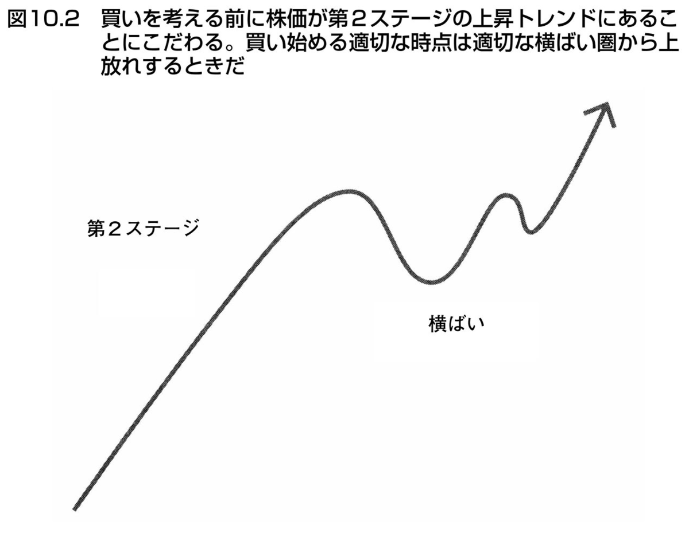

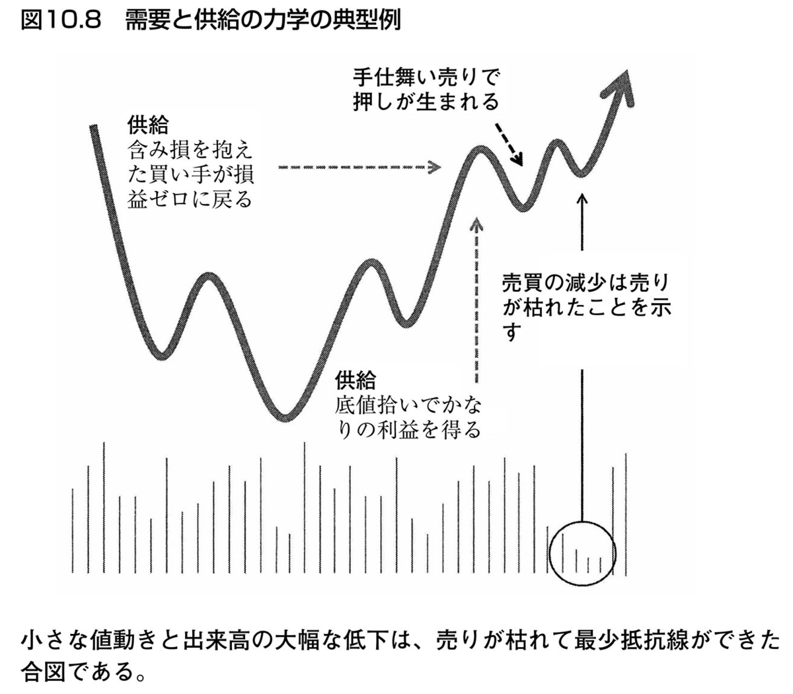

概念図だけ見せられても正直「なんのこっちゃ」って感じですよね？

以下に２枚のチャートを用いて実例を示します。

１枚目は、ダイフク（６３８３）の２０２５年２月～８月のチャート。２枚目は、同じくダイフクの３月～９月のチャートです。

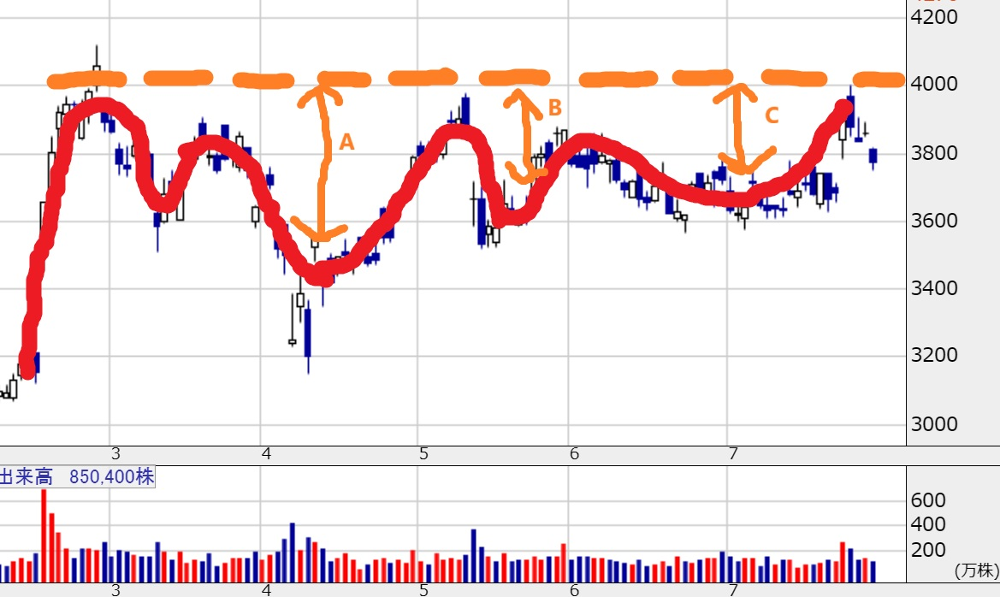

オレンジ色の破線がダイフクが２０２５年３～８月に示した高値です。ここで注目して欲しいのは、高値から安値までの差分を示すＡ、Ｂ、Ｃが時間経過とともに小さくなっていること。このＡ＞Ｂ＞Ｃの動きが「ボラティリティの収縮」を意味します。

では、これがどうなったか。

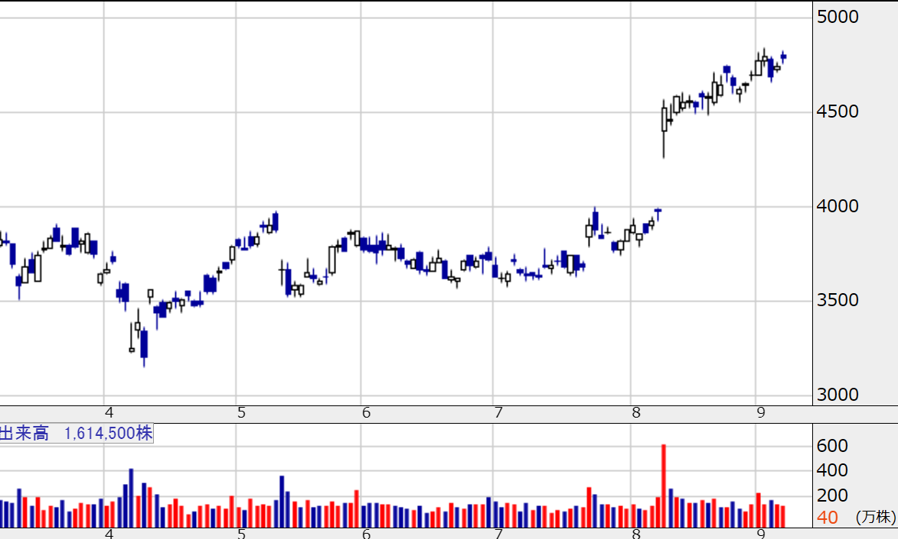

２０２５年８月の決算で窓を開けて上昇し、その後も上昇し続けています（以降、ＶＣＰを示した後に窓を開けることを「ブレイク」と呼びます）。

１銘柄だけだと信じられない？

私はＶＣＰを形成している銘柄をひたすらウォッチしていますので、この夏にブレイクした銘柄はまだまだあります。

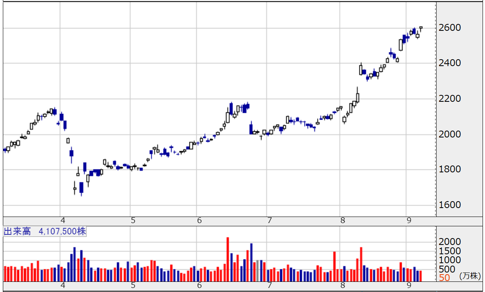

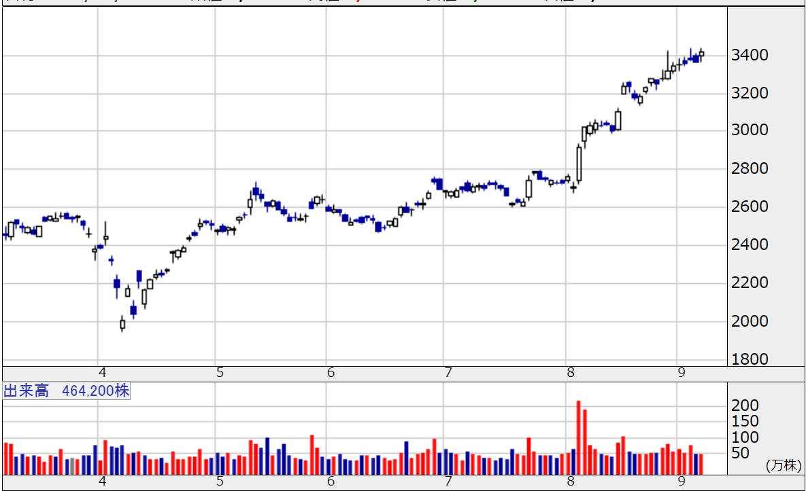

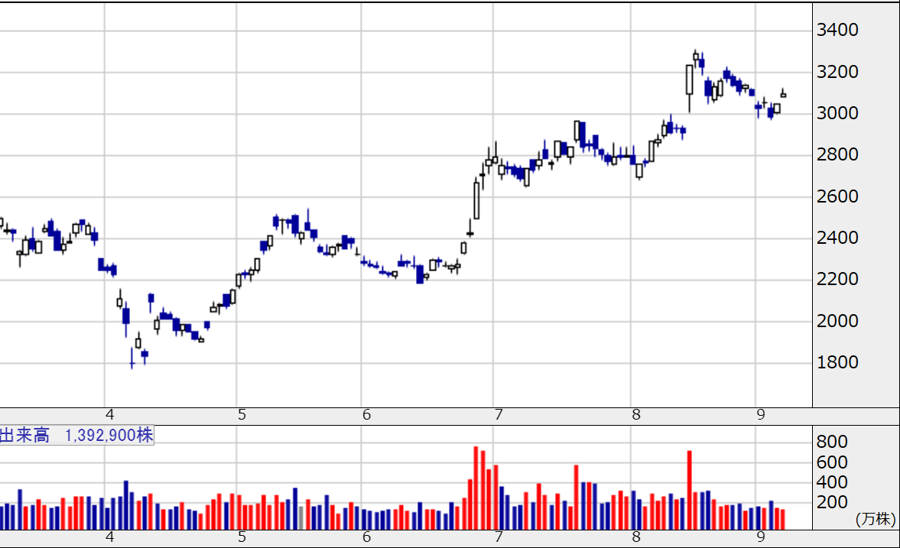

これくらいでいいでしょう。もちろん、ブレイクに失敗した銘柄もあります。

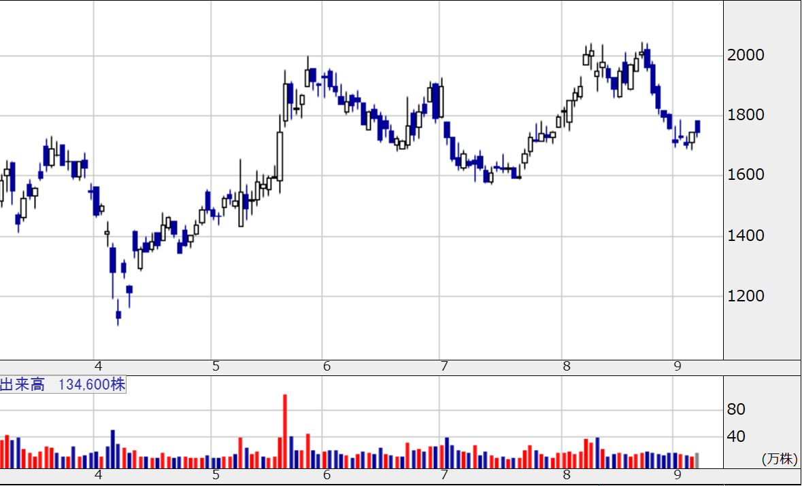

実例はこれくらいでいいでしょう。

ＶＣＰには、２つのエッジがあると信じています。

## ５．鬼と奴隷になれ。

### 再現性の鬼になれ。

ＶＣＰは、スマートマネーの買い集めによって形成されます。したがって、原理的には市場にスマートマネーが存在する限りは常に形成され続けます。そして、市場からスマートマネーが消えることは決してありません。

つまり、ＶＣＰは再現性のあるパターンです。

このパターン＝スマートマネーの買い集めを愚直に追い続ける手法には再現性があり、再現性のある手法にはエッジがあります。

### 規律の奴隷になれ。

再現性のある手法を愚直に追い続ける手法を方法論として確立できると、規律を持ったトレードが可能となります。一言で言えば、ニュース・噂に惑わされなくなります。大事なのは、そのニュース・噂を「私が」どう感じたか、ではなく、「スマートマネーが」どう感じたか。東証の取引代金のうち約６０～７０％がスマートマネーによるものだと言われています。スマートマネー＝市場、と言っても過言ではない。

我を捨て、市場に規律を持って素直に従う。この規律にはエッジがあります。

## ６．アメリカ市場の手法を日本市場に適用する挑戦。

### アメリカ生まれのＶＣＰは日本ではちょっと様子が違うらしい？

ＶＣＰはあくまでアメリカ人トレーダーがアメリカ市場向けに体系化した手法です。したがって、日本市場では異なる様相を呈するようです。

日本市場とアメリカ市場の大きな違いには、信用取引制度の違いが挙げられます。貸借期間がアメリカ市場では無制限であるのに対し、日本では６ヶ月。対象銘柄はアメリカ市場では全上場銘柄、日本では一部のみ。貸株料は日本では変動制、アメリカでは証券会社ごと……。信用取引制度だけでも数え上げればキリがありません。

私が考える最もクリティカルな違いは、信用取引制度の貸借期間の違いです。

アメリカでは貸借期間が無制限であるためにその時の需給のみに応じて取引が行われる一方で、日本では６ヶ月の制限があるために「建玉を継続するか否か」の判断が６ヶ月ごとに行われます。このため、ある銘柄で大量の信用買いポジションが６ヶ月前のほぼ同時期に構築された場合には、その返済期限が近付くと市場とは無関係の大量の売り圧力が生じます。これにより、ＶＣＰが不明瞭になります。

貸借期間の制限によってＶＣＰが不明瞭になることの代わりに、メリットもあると感じています。ＶＣＰの形成期間を６ヶ月と想定しやすいことです。直近６ヶ月以内の市場は６ヶ月以内の市場しか示せないため、ＶＣＰの形成期間を無制限に広く取ることができない＝想定しなくてもよい。有限の分析時間しか持たない兼業トレーダーにとって、これほど都合のいいことはないように感じています。私は１日当たり２０分ほどで１００銘柄近くのチャートをチェックしています。

また、単元株の大きさの違いもクリティカルな違いの一つだと感じています。端的に、日本では売買最低代金が大きいがために、銘柄当たりの取引回数は少なくなり、ＶＣＰを形成できる銘柄が限られるということです。ＶＣＰが形成される原理には、スマートマネーによる買い集めがありましたよね？　取引回数が少ないと買い集めの痕跡（ボラティリティの収縮）が見えづらくなり、結果としてＶＣＰを確認できなくなります。私の感覚だと、売買代金が３億円以上でようやくＶＣＰが見える印象です。

## ７．記録は語る。

### まずはノートに記録する。

ここまで、自身のトレードの記録（勝率、リターン、回数……）を把握していることを前提に記事を書いてきました。記録をノートに書き出して下さい。そして、これからもノートに書き出し続けて下さい。自ずと「自分が不安を感じないで損切り・利食いをできるライン」が感じられるようになります。そのラインを守ってトレードを行う。

まず数字を見る。続いて再現性・規律を得る。最後に方法論。

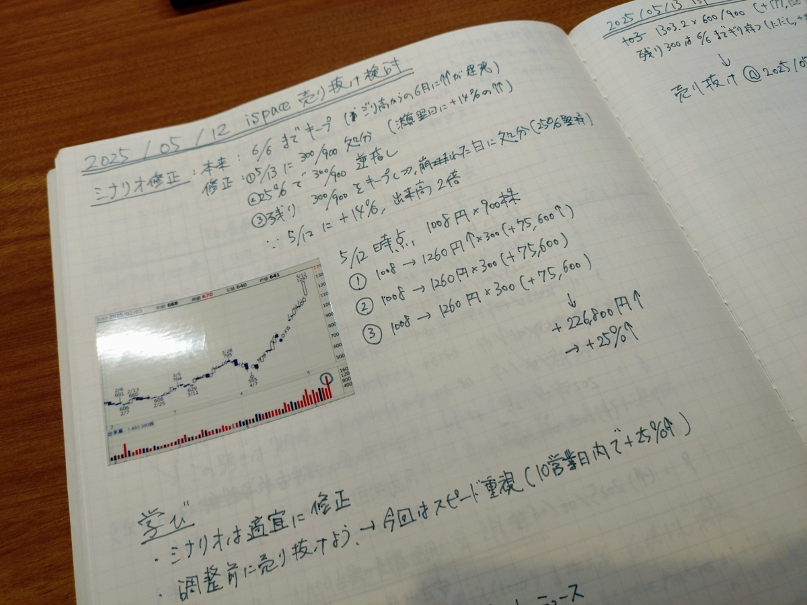

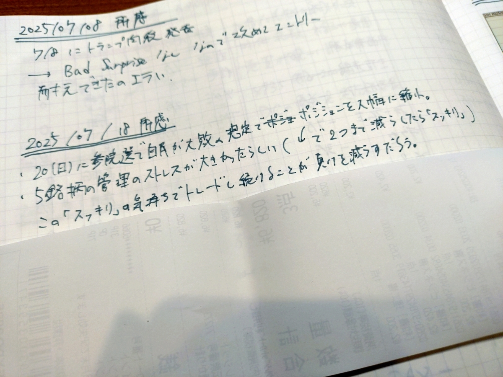

### それから、得意なパターンを監視する。

上述の通り、私はＶＣＰを形成しつつある銘柄・ブレイクした銘柄を毎日ウォッチしています。これらの銘柄を抽出するためのシステムを組んでいます。毎日の全銘柄のＯＨＬＣＶをデータベース化し、データベースから数式化したＶＣＰに適合する銘柄を抽出し、抽出した銘柄を目視でウォッチしています。１日当たり２０分ほどで１００銘柄近くのチャート。

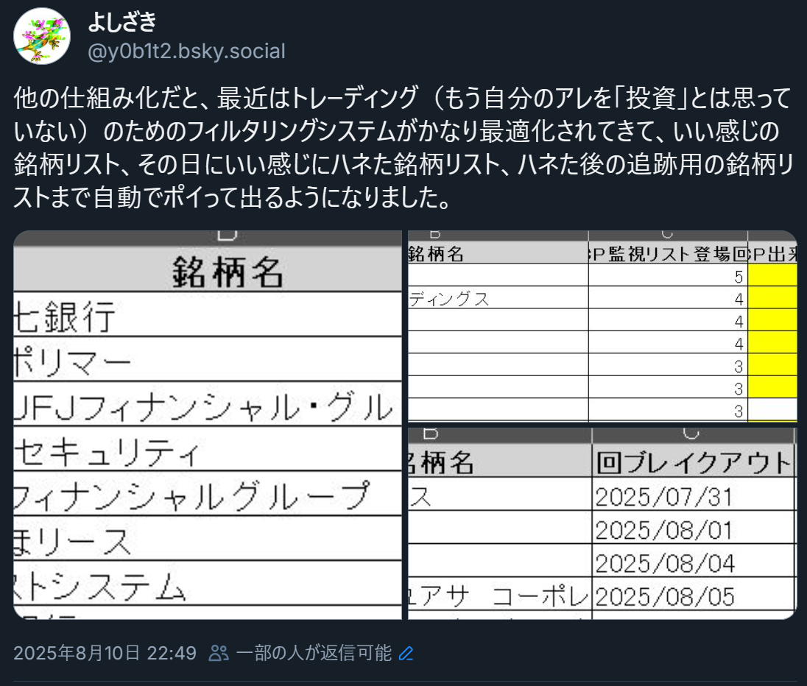

## ８．まとめ

ここまで、トレンドフォローとＶＣＰの魅力を語ってきましたが、あなたがトレンドフォローにこだわる必要はありません。というか、方法論は何でも良い。その何でも良い手法が数字と再現性と規律に基づいていればそれでよい。

私の場合、すべては損切りから始まった。

## ９．私が信じていないことリスト

### 安値買い・ナンピン

私は機会損失を恐れる。

### 分散投資

私は管理できる数の銘柄しか持たない。

### 「成長株投資」という言葉

私は企業がどう成長するかよりも市場がどう評価するかを信じる。

### ＲＳＩを含むすべてのオシレーター

私はむしろ過熱を追う。

### ５２週新高値

私はもっと速くなりたい。

（おわり）

[^1]: リアルな痛みを伴う額としての「10万円」なので、各人で置き換えて考えて下さい。
[^2]: [『伝説のファンドマネージャーが教える株の公式』（林則行）](https://www.amazon.co.jp/%E4%BC%9D%E8%AA%AC%E3%81%AE%E3%83%95%E3%82%A1%E3%83%B3%E3%83%89%E3%83%9E%E3%83%8D%E3%83%BC%E3%82%B8%E3%83%A3%E3%83%BC%E3%81%8C%E6%95%99%E3%81%88%E3%82%8B%E6%A0%AA%E3%81%AE%E5%85%AC%E5%BC%8F-%E6%9E%97-%E5%89%87%E8%A1%8C-ebook/dp/B0081WLY18/)
[^3]: Direxionデイリー半導体株ブル3倍ETF。要するに、半導体関連企業の指数
[^4]: バフェットが株を永遠に保有できるのはバークシャー・ハサウェイの保険事業が尽きることのないキャッシュを生み出すからであって、さらに言えば、それでレバレッジを掛けられるからであって、もっと言えば、既にバフェット自身がバリューを生む存在になっているせいで株価に対して正のフィードバックを掛けられるからであって……。
[^5]: 日本だと「新高値ブレイク投資塾」のDUKE。が日本向けに噛み砕いていますが、私は正直、氏の著書には不満を覚えています。「成長株投資」を私は信じていないので。
[^6]: 損切り許容ライン・銘柄数の検証のために、２０１５～２０２５年の１０年間の日本市場のデータを用いてバックテストしてみました。結果、４銘柄と５銘柄との間に顕著な差は出ませんでした。
[^7]: スマートマネーコンセプト（通称、ＳＭＣ）という手法がある。チャートに表れたスマートマネーの動きを精緻に追うための手法である。目下、勉強中。
