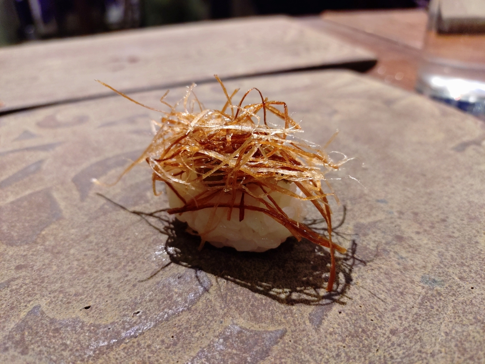
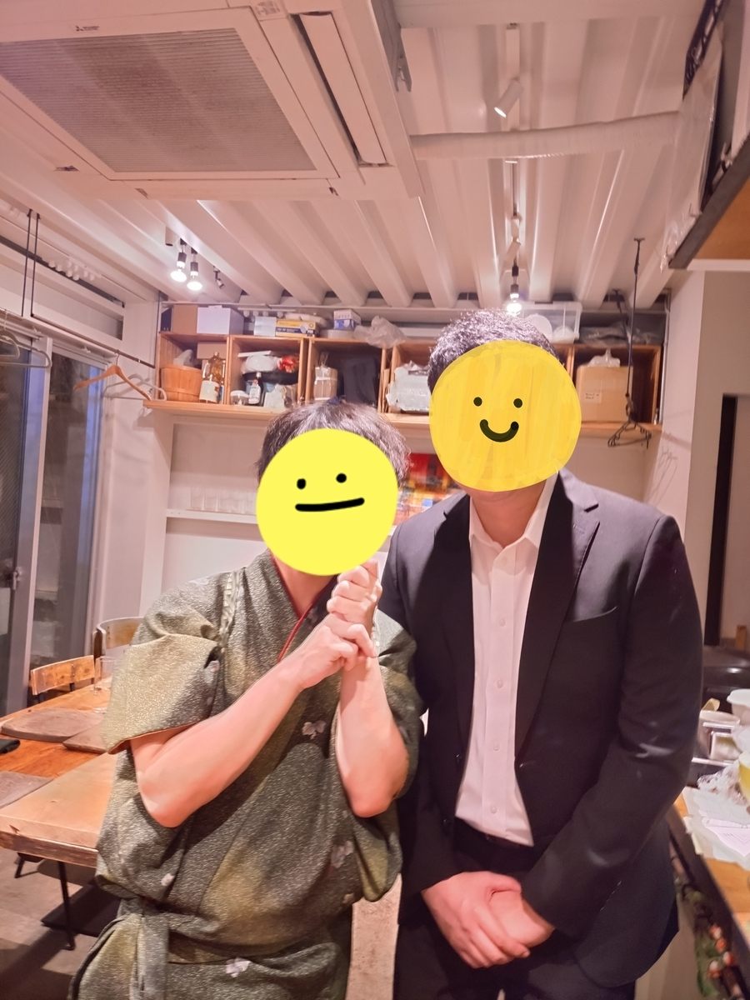
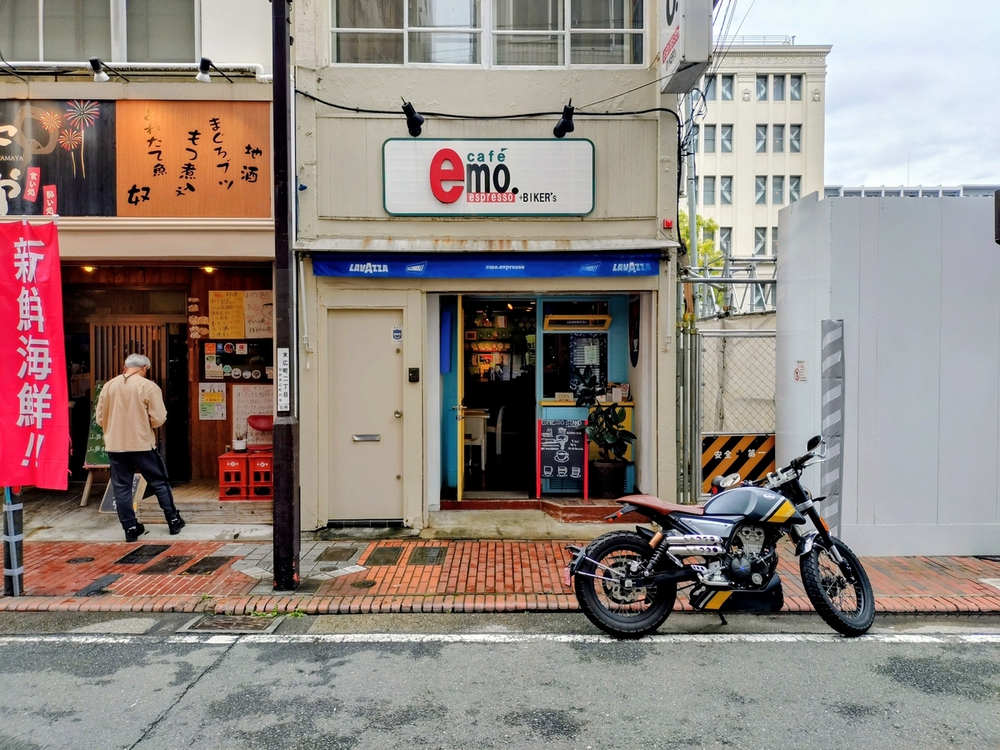
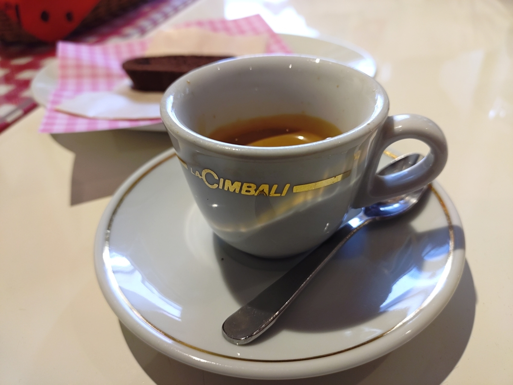
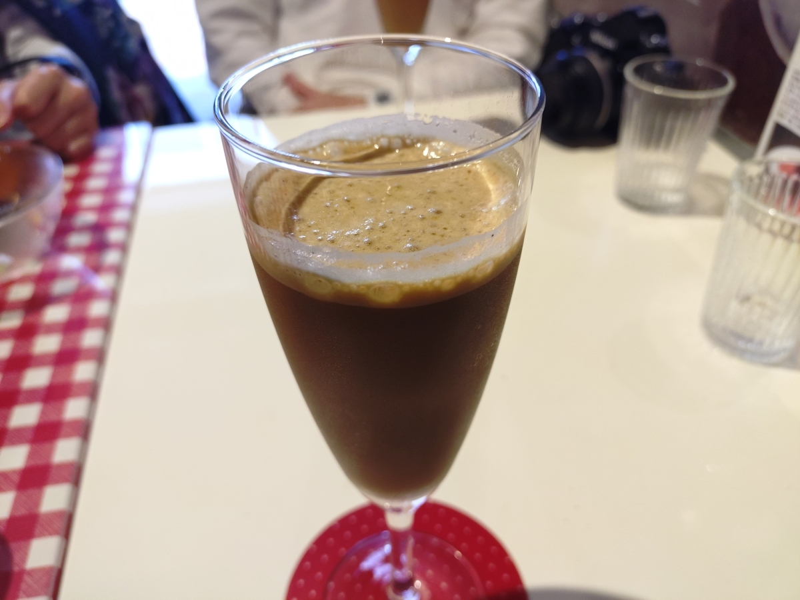

## 目次

1. ２０２５年目標に対する進捗
2. 雑記
3. ２０２５年１０月度の本の感想（３冊）（年間累計８１冊）
4. ２０２５年１０月度のジャズの感想（１３枚）（年間累計８２枚）

## 1. ２０２５年目標に対する進捗

1. **趣味：新人賞に応募する。➡達成！**

2. **健康：体重を８８キロから７５キロまで減らす（身長は１８１センチ）。**
   1. ジムに年間１５０回行き、各回で必ず、アップ（プランク、プランク腕立ておよびＹＩＴバランス）および有酸素運動（クロストレーナー２０分以上）または無酸素運動（上半身セット）を行う。
**→○週２回くらいでエアロバイクを漕いでいます。また、マンジャロを導入しました。１ヶ月で３ｋｇ落ちました。**
   2. 一人でスナック菓子・ナッツ類を食べず、食べたくなったらガムを噛むか歯を磨く。
**→○マンジャロパワーを借り、間食が全くなくなりました。**
3. **生活：紙の本を減らす。**
   1. 紙の本を減らすことで部屋のスペースを確保するために、紙の本を買うのは月に３冊までとする。例外を設けない。
**→×５冊。**
4. **仕事：ドメイン知識を海外に展開できるようにする。**
   1. 社内の技術をより深く理解するために、電子回路について学ぶ。教科書を１冊やり切る。
**→○暇なときに教科書を眺めている。**
   2. 英語の議論でナメられないようにするために、スピーキング・リスニングを鍛える。１ヶ月に８回、２０分間の英会話レッスンを行う。
**→△ちょっとやりました。**

## 2. 雑記

１０月度の一冊は<strong>『口訳　太平記　ラブ＆ピース』（町田康）</strong>。力強い語りが齎すグルーヴ感をとくと味わいました。おとぼけしているように見えてメチャクチャテクい。凄かったです。

一枚は迷ったけど<strong>『Montreux '77』（Ella Fitzgerald, Tommy Flanagan）</strong>でした。今月は「おれってトミー・フラナガンのピアノが好きだな」って気付いた月でした。また、エラ・フィッツジェラルドのスキャットのスピード感にジャズを感じたり。



小説は９月末に応募した（１２月に一次選考の結果発表）ので、まあ、やることないんですが、１０月末にふつふつと<strong>「次のやつ、考えたい！（≠考えなきゃ）」</strong>の気持ちが湧いて参りました。のんびりと考えていきたいです。

健康については、巷で話題の<strong>「マンジャロ」（要するに、やせ薬）を導入</strong>してみました。最小の導入量２．５ｍｇなのに、食欲がスッと消えました。常に腹三分目くらいの満腹感があるというか、空腹、飢餓にならない。そうすると、１回の食事量が減るし、そもそも食事回数が減るし、間食をまったくやらなくなる。そりゃやせるわね。**１ヶ月で３ｋｇやせました。**

１０月の過ごし方ですが、９月末には「享楽的に～」とか書いてましたが、なんか、仕事のせいで不思議と**忙しない１ヶ月**でしたね。出張の数と仕事の種類が多く、時間の限られた中でマルチタスクを倒さなければならないというか（その割に、成果らしい成果にもならない調整業務も多く）。

また、１０月が始まった頃には「月末のデカい会議を倒したらひと息つけるかな？」みたいな見通しを立てていたものの、１０月半ばにキャリアプランを見つめ直したところ**転職を決意**。一気に<strong>「戦いの輪廻」</strong>に引き戻されました。同業界の同職種で１社、チャレンジングな事業に取り組んでいる企業がありまして、そこで**挑戦してみたい**な、と。今回の転職に関しては、そこしか受けていない（ので、無間地獄に落ちることがない）し、落ちても失うものなし（現職を続ければいい）で、端的に、余裕がありますね。１０月半ばに書類を応募、翌週に**書類通過！**、これを書いている１１月頭の連休には面接の準備をして、一次面接、最終面接（一次の次が最終です）、そして内定と勝ち取っていきたいですね。１１月の月報ではその結果をお伝えできると思います。

仕事はこれくらいにして、プライベートの話もしましょう。

私はわりと食道楽的な側面、コダワリ行動的な側面があり、気に入った飲食店を見つけると足繁く通い、友人に広めがちです。しかし、ショッキングなニュースが２件飛び込んで参りました。そう、**閉店**ですね。

１店目は<strong>「[veggie tempo &Sushi](https://www.veggietempo.com/veggie-tempo-sushi)」</strong>。私の中で「切り札」的な位置付けの、「野菜寿司」のお店。

１０月末に友人とフラッと遊びに行ったところ、寿司職人さんから「１１月末で閉めるんですよ」と知らされ、エッ！？？？？って。それから、**泣きながら食べてました**。ここの寿司って、ここだけのエンターテイメントで、ここなくなったら二度と食べられないんですよね。

記録がてら、最後の感想をここに残しておきます。

野菜のお寿司を出してくれるお店で、一貫目はシャリだけなんですが、この初手のシャリが口に広がる感覚をまず味わう。そのおかげで二貫目以降は広がるシャリとネタがどんな相互作用を起こしているのか、明瞭に感じられるんですよね。シャリが広がる、メインの野菜の旨味が広がる、最後にちょっとした触感の違いや香味が広がる。このインタラクションって、ここでしか食べられなかったんですよね。

野菜を食べさせることにこだわり、動物性の油とタンパク質を使わないことを徹底。お野菜の旨味一本勝負。それでいて、じゃあ精進料理やヴィーガン料理的に抑圧されているかと言うと、全くその逆で、**野菜の旨味を享楽的に味わえた**。本当に悲しい。

「もうこの寿司食べられないってことですか？！」って思わず尋ねてしまいました。そして、「そうです」と……。

経営形態がよくわかっていないんですが、「&Sushi」はその寿司職人さんの夜の間借り的な感じだったのかな？　昼の部は（おそらくお店のオーナーで）これからも続くようです。これからはランチも行かせて頂きます。

２店目は<strong>「[cafe emo. espresso](http://www.cafe-emo.com/)」</strong>。マジか～～～～って感じです。

１１月２３日（祝）に閉店。**まだ間に合います**。このエントリを読んだらすぐさま行って下さい。１０月３１日にインスタで告知があって、すぐさま１１月１日（今日）駆け付けたところ、超満員。これから休日はずっとこんな感じだと予想されます。平日に有休取って行って下さい。**私はこれから平日に有休取って行きます**。

このお店は、私が就職とともに２０１７年に関東に来たその年、友人から教えてもらったエスプレッソのお店。その後、関西に引っ越したり、関東に戻ったり、そういうあっち行ったりこっち行ったりの中でも、暇を見つけては行っていました。**会社員生活における余暇の象徴、喫茶店の象徴**だったんですよね。

エスプレッソはガツンと味わい深い。

私が好きだったのはラテ・シェケラート。泡（エスプーマ）が柑橘の果汁で少しだけ香り付け、味付けされていて、**丁寧な仕事の逸品**でした。私の中で一番美味いラテ・シェケラート。

他のエスプレッソ、ラテ・シェケラートを扱う喫茶店に入るとお手並み拝見的にラテ・シェケラートを頼んでいたのですが、これを上回る丁寧な一杯には出会ったことないです。オールタイムマイベスト。

閉店までにあと２回行くことをマスターと約束したので、あと２回行きます。

皆さんも、大切なお店には行けるときに行って下さい。永遠って、ないらしいです。

## ３. ２０２５年１０月度の本の感想（３冊）（年間８１冊）

### ①『巴里マカロンの謎』（米澤穂信）

面白かった～。小佐内さんがかわいくてよかったです（各位の悪意が「小市民」なりの悪意という感あり、悪意と正義感の暴走した『秋期限定』からの箸休めになってくれました）。

### ②『口訳　太平記　ラブ＆ピース』（町田康）

語ることそれ自体に備わるパワーですよね。
王朝が二つに割れた経緯、混沌に対して、町田は語りによって道理を与える（読者に道理を見出させる）。そこに圧倒的な語りの力を感じました。
本作はひとりの人物が小集団を率いて戦場から去るラストシーンで幕を閉じるのだが、読者たる我々は、彼ら、そして後醍醐らがどうなったかを知っている。様々な読みどころあったんですが、このラストシーンの脱出にすべて繋がっていたのかと唸った。
彼は敵に射られるのだが、神仏のご加護のおかげで傷一つ受けない。神仏とチャネリングされた彼に齎されたご加護は、作中で延々と語られた、神=皇族、仏=僧の図式に基づくと、いわば代執行者としての証しなんですよね。
この象徴、また、to be continued...感の読後感が素晴らしい。いや、本当に良かったです。

### ③『週刊ダイヤモンド　5年後の業界地図』（ダイヤモンド社）

読みました。

## 4. ２０２５年１０月度のジャズの感想（１３枚）（年間８２枚）

### ①『Clifford Brown and Max Roach』（Clifford Brown, Max Roach）

Claude先生に私の好みだろうと勧められて。ホーン隊が高音域を自在に吹きつつ、ドラムがグッと前に出る瞬間がある。この役割交代を追いかけるのが楽しいですね。Claude先生曰く、私は高音域と低音域との分離感のあるジャズが好き、とのことだが、確かにそういう意味でピタリとハマった。

### ②『Spirts of Rejoice』（Albert Ayler）

この不安定な揺れるようなトランペットを味わえるようになりました。よく聴けば明瞭だ。

### ③『Pocket Change』（Nate Smith）

全編ネイト・スミスによるドラムソロの一枚。圧巻の一言です。リズムがすごい。

### ④『J.S. Bach Preludes and Fugues Vol.1』（John Lewis）

ジャズミュージシャンのジョン・ルイスがバッハを弾いてみたシリーズ。たぶん上手いんだと思う。ただ、おれはジャズを聴くための耳／語るための言葉を得つつあっても、クラシックのためのは無いんだな、と思った。

### ⑤『Jackie-ing, Live in Amsterdam May 1964』（Thelonious Monk）

セロニアス・モンクってあまりきちんと通ってこなかったんですが、ピアノのサウンドに疎密差があって面白いと思った。たとえばビル・エヴァンスのサウンドって流麗に聞こえてくるけれど、セロニアス・モンクって引っかかりがある。

### ⑥『Art Pepper Meets Rhythm Section』（Art Pepper）

名盤らしいですね。良い意味で驚きがない。あるべきところにあるべき音があるように感じる。

### ⑦『My Life Matters』（Johnathan Blake）

気鋭のドラマーがブルーノートレコードから2025年にリリースした最新作。音の密度で聞かせる感じはとても現代的だが、音を出す手つき？は伝統的なジャズを感じる。ビブラフォンもいいね。

### ⑧『Montreux '77』（Ella Fitzgerald, Tommy Flanagan）

エラ・フィッツジェラルドが歌い、トミー・フラナガンが伴奏を務めたライブの音源。フィッツジェラルドの声域の広さは楽器のようだ。ビブラートがほとんどないのが特徴か。フラナガンのピアノも楽しませてもらって、豪華な歌ものってお得過ぎる。「Billie's Bounce」のスキャットが凄まじい。

### ⑨『Ella at Juan-Les-Pins』（Ella Fitzgerald, Tommy Flanagan）

CD2枚組の2.5時間にわたるライブ盤。流石に長すぎてすべて集中して聴くには至らなかったのだけれど、歌モノの楽しみ、というよりも声の原始的な楽しみを感じました。
今日Claudeに私のジャズの嗜好を読ませて「エラ・フィッツジェラルド、サラ・ヴォーン、ヘレン・メリルのどれが好きだろうか？」と尋ねてみたところ、「絶対にフィッツジェラルド」との回答を得た。正鵠を射ている。

### ⑩『Volume 3』（Lee Morgan）

ハードバップを感じたければこの1枚という感じだ。リー・モーガンのアーティキュレーションは彩り豊かで、テーマからソロへの移行が明瞭。アルバムとして聴いた時にもA面1曲目の「Hassan's Dream」からA面最後の「I Remember Clifford」までストーリーがある。名盤です。

### ⑪『A Blowing Session』（Johnny Griffin）

ジョニー・グリフィンのトランペットの速吹きが凄まじいのだが1曲目「The Way You Look Tonight」の4ホーンがソロで競う演奏ですよね。ジョニー・グリフィン、ジョン・コルトレーン、ハンク・モブレー、リー・モーガン。リッチ過ぎる。

### ⑫『Moods VilleよりTommy Flanagan Trio』（Tommy Flanagan）

バーで流れるようなムーディーな一枚。ピアノのサウンドの粒が揃っており上手かった。ただ、アルバムとしては起伏に欠けていたか。

### ⑬『Silver in Seattle - Live at The Penthouse』（Horace Silver）

お手本のようなハードバップとブルージーな曲。各楽器のバランスに優れる。特に1曲目「The Kicker」のテーマとソロのセクションの明瞭さ。いや、いいもの聴かせてもらいました。

（おわり）
