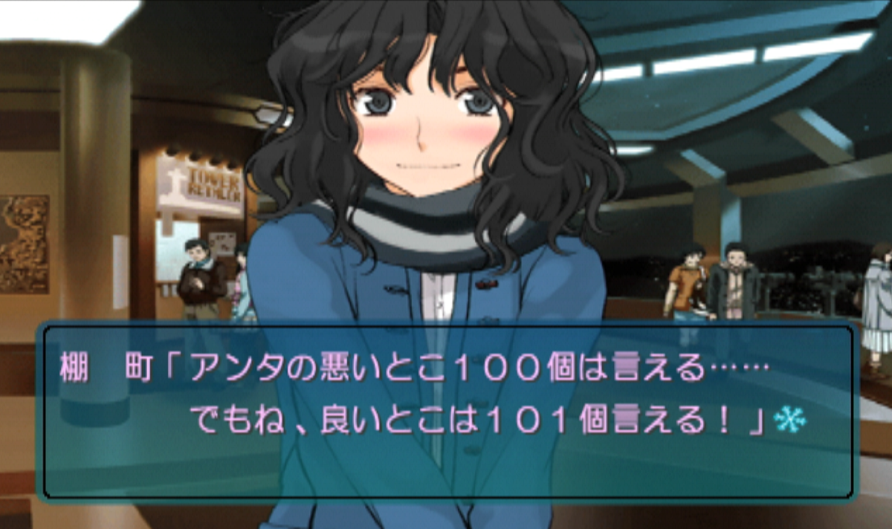
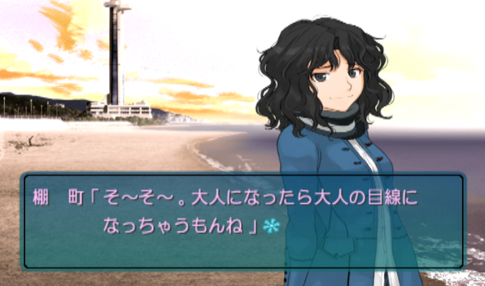

## 前書き

この三連休を使って恋愛シミュレーションゲーム『アマガミ』をプレイした。二〇一〇年、高校三年生の十七歳の夏に最後に遊んで、それ以来初めてだから、十五年ぶりということになる。恐ろしいことに、オギャアと生まれてから十七歳までの距離と、十七歳から三十三歳までの距離はほとんど変わらない。そういう時間スケールでの再プレイということになる。

さて、恋愛ＳＬＧの目標は「特定の誰か一人と交際する」であるからして、その「誰か一人」を決めなければならない。三連休前の一週間、ウィークデーはずっと誰と交際するべきかを考えていた。

## 私の人生とゲーム『アマガミ』

高校二年生の夏前にゲーム『アマガミ』を買ったとＡｍａｚｏｎには記録が残っていた。高校三年生の七月の終わりにゲーム『アマガミ』に封をすると共に、当時のＴｗｉｔｔｅｒアカウントの運用を止めた。したがって、一年にわたって遊んだことになる。高校生にとっての一年は長かった。私の高校生活とは、部活と勉強と『アマガミ』の三つから構成されるといっても過言ではない。

私はもともと『アマガミ』を新谷良子氏を経由して知った（新谷氏は、私が当時聴いていたネットラジオ「さよなら絶望放送」のパーソナリティを務めていた）ので、彼女が声を当てる幼馴染み・桜井梨穂子が入口だった。

二番目に仲良くなったのは、記憶は定かではないが、先輩・森島はるかだったはずだ。それから先はもう全く覚えていないが、悪友・棚町薫か仮面優等生・絢辻詞だろう。後輩二人にはあまり関心を持たなかった。

最終的には、絢辻詞に熱を上げていた。

再プレイで交際するのは、同学年の桜井梨穂子か、絢辻詞か、棚町薫か、この三人のうち誰かだろう、と早い段階で直感した。十五年ぶりか、と考えた。

結論から言えば、棚町薫を選んだ。

他の二人とも迷った。迷ったが、私の本名（≠よしざき）としての生き方、つまり、高校から大学から会社勤めから、を振り返った時に、三十三歳の私から見た時に、私の青春に一番いてほしくて、そして、一番縁遠かった人物像として、棚町薫を選んだ。

私の人生には悪友はいなかった。これからもいないだろう。



## 十五年ぶりに起動して

主人公氏、めっちゃ好意向けられてるやんけ、かなり動揺した。

桜井梨穂子から彼への矢印は、彼女の部活で彼女から彼の話を聞かされていた先輩らに初対面の男子が彼であると確信させるほどの情緒を持っていた。棚町薫に至っては、登場シーンが「教室で彼の耳を甘噛み」である。彼女ら彼らの人間関係を俯瞰して見つめ直してみると、彼女らは明確に矢印を向けている、彼は中学三年生のクリスマスのトラウマが原因で明確にそれを拒んでいる。

愛おしかった。健気に矢印を向ける彼女らと、頑なに拒む彼。そういえば、高校生の頃の視野ってこれくらい狭かったかもしれない。私はボンクラだったので、これよりもさらに狭かっただろうが。

## 棚町薫の機微

棚町薫である。私は、彼女の持つ機微のことをなにひとつわかっていなかった。今回の再プレイを通して、いろんな発見があったけれど、一つだけ書き残しておくことにする。

序盤のいわゆるフラグイベントでは、彼女が主人公との関係を悪友からもっと特別なものへと切り替えることを宣言する。この重要な宣言を経て、そのまさに次のイベントで棚町薫は「物理的に主人公ににじり寄る」ってアクションを起こすんだ。今ならその真意がわかる。物理的な距離の近さは、心の距離の近さだ。

「あたしはアンタに近付くけど、アンタはどうすんの？」

棚町薫の宣言に、私は動揺した。こんな真っ直ぐに感情をぶつけられたこと、なかった。そして、それをまたそうとは言わずに、直情的なアクションで示してしまう、言葉にはまだできない、そういうところに高校生なりの愛おしさを感じた。

高校生の私はボンクラでボケナスでアホンダラだったので「ふ～ん、距離って物理的な距離だったんだ！（棚町さんって、面白い子！）」くらいにしか感じていなかった。そういうヤツには真っ直ぐに感情をぶつけても仕方ない。自業自得である。

## 終えてみて

十五年ぶりに本作に触れてみて、自分の柔らかいところ、青春の甘さや苦さを思い出させてもらえたひとときだった。あの時の私って本当にボンクラのアホンダラやったなあ、とか、翻って彼女ら彼らって彼女ら彼らなりに全力で生きているんだなあとか。
そういう彼女ら彼らの全力の青春をどこか遠くから眺め、私ってすっかり「大人の目線」になっちゃったね、という感じてしまった。



そんな「大人の目線」になることが悪いとはぜんぜん思っていないけれど（だって紛うこと無き「大人」だからね）、今その瞬間の人間関係に全力の近視眼的な「子どもの目線」に戻れることって二度となくて。

高校生の時にゲーム『アマガミ』と出会って以来、数こそやっていないものの、大学生の間は恋愛ＳＬＧのオタクで（そういう自認で）、会社に入ってからはそういう自認も薄れてしまったが、たまにやると素朴に感動する、という感もあり、他方で「大人の目線」になっちゃった今はベタに没入しきることもできないし、まあ、そういう時期は私の人生においてもう終わったんだね、と寂しさも覚えた。

とは言え、このゲームに没頭するなか、ふと「子どもの目線」に戻ってしまう瞬間もあり、プレイしなかった十五年の間ずっと待ち望んでいたのってそんな「あわい」の瞬間だったのかもしれない。

> 「じゃ、あたしの知ってたピリはまもなく死ぬのね？」
　リーは年下の女の肩に手をかけた。
「いいえ、ちがうわ。これは、勝者も敗者もない、人格の再統合なのよ。いまにあなたにもわかる」
>
> 「さようなら、ロビンソン・クルーソー」（ジョン・ヴァーリイ）



（おわり）
