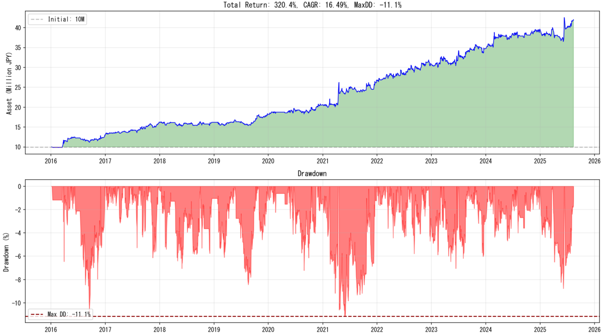
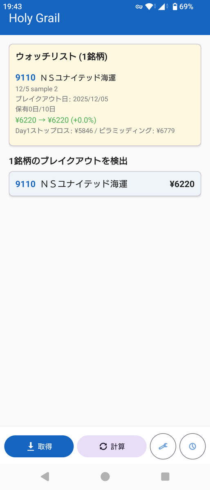
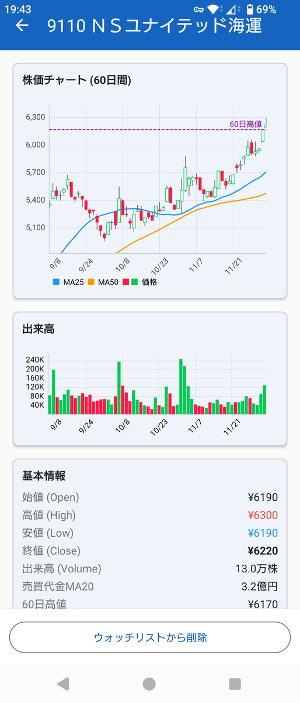

## ０．背景：再現性の鬼になれ。

みなさん、「高市トレード」で儲かってまっか？　私もちょっとだけ儲けさせて頂きました。

で、気付いたんですよね。

「高市のおかげで儲かった」って思いたくねえなって。「高市のせいで損した」って思ったらマジギレしそうになったし。

おれ、**高市嫌いやねん（政治家で一番嫌いやねん）**。そういう感情のノイズのせいでトレーディングの精度が落ちているのを感じたので２０２５年９月半ばから１２月現在までノーポジです。ノーポジになるとどうなるかというと、儲からないんですよね。高市のせいで儲からないって、マジでムカつくなって。

ということで、今回の試みでは、政局と、感情と、トレーディングを切り分けようと知恵を絞りました。

題して<strong>「再現性の鬼になれ　システムトレードプロジェクト」</strong>です。

※２０２５年９月５日のエントリの続きで、当時から考えが変わったので新たなエントリを書きました。



## １．目的：「業界分析」したくないが？

私はもともと「業界分析」は好きでした。本業でも分析系の業務に携わっていることもあり、気になるセクターの様々な企業のＩＲやニュースを読み込み、自分なりの仮説を立て、将来予測を行うなどしていました。

ただ、実感としてこれが実リターンに寄与している感もありませんでした（普通にテクニカルだけでトレードした方がタイパ良くリターン出てた）し、なにより高市の一声でセクターが乱高下するのにウンザリしたので、やめました。

トレーディングのための<strong>「業界分析」を完全にやめ、業界分析・ファンダメンタルズ分析を一切抜きにして安定したリターンを得るためのシステムを構築した</strong>、というのが今回の論旨になります。

つまり、システムトレードのためのシステムを作りました、ということです。システムトレードとは、システムが出すアラートに従って（一切の裁量抜きに）トレードする戦略のことです。

## ２．結論：システムトレードで勝てます。

システムトレードだけで勝てます[^1]。具体的なトレード手法は本エントリの趣旨から外れるため省きますが、前回のエントリにて紹介した私の手法をさらに機械向けに改良した手法です。

このシステムの何が優れているかと言うと、私がトレーディングを初めてからずっと使ってきた手法をベースにしたシステムであるという点なんですよね。言い換えると、**このトレーディングシステムには私の「信念」が組み込まれている。だから、従える。従う自信がある。**

ところで、トレーダー集団「タートルズ」ってご存じでしょうか？

アメリカのトレーダー、リチャード・デニスらが「トレーディングの方法論を教えることは可能か」という仮説の検証のために立ち上げられた、いわばトレーダーの卵の集団なのですが、成功率・生存率は極めて低かったそうです。

今回のトレーディングシステムの構築を経て、私はその成功率の低さをなんとなく理解できました。人は、ただ他人から教わっただけのシステム（信念）に身銭を預けられるほど強くないのではないか。強くない、というとネガティブに聞こえるけれど、他人の信念に全ベットできるのは狂気の沙汰なのではないか。

**自分の信念を確立せねば勝てないのではないか**、という気付きがありました。

## ３．実装方法：退屈なことはClaude Codeに任せよう。しかし……、

今回のトレーディングシステムの根幹の信念は私の内側（経験）にあったものですが、それを具体的なコードに起こす際には私は一つもコードを書きませんでした。<strong>退屈なことはClaude Codeに任せよう。</strong>Claude CodeにPythonでコーディングしてもらいました。

しかし、自分の内側にないものは自分をひっくり返しても出てこない。今回はClaude Codeに手直しさせながらバックテストを回し、Optunaライブラリで最適パラメータを導出し、「聖杯」に辿り着くことができましたが、両方とも自分の内側にはありませんでした。

今回のプロジェクトを友人に相談したところ、Claude CodeとOptunaライブラリを教えてもらいました。友人に感謝です。

それまでのブラウザ版のClaudeからコードを手作業でコピペして各種パラメータを手作業で入力するグリッドサーチで最適解を探そうとする石器時代のアプローチから、一気にモダンな分析環境を得ることができました。

**自分の内側にないものは外側から得るしかできない。**

知らないことは、知らないことすら知らない。当たり前のことながら改めて実感しました。

## ４．信念のために：アプリも作りました。

「信念」が大事だと上述しましたが、私の信念の一つには「怠惰」があります（ネガティブな性質も込みで「信念」であると思います）。怠惰なので毎日パソコンでプログラム回して銘柄チェックとかめんどいし。だからアプリ作りました。毎日、決まった時間に勝手に動いて勝手に銘柄チェックして、勝手にトレード対象をリストアップしてくれる賢いヤツです。

**信念を実行し続けるための絶えざる仕組み作り**がシステムをワークさせるために必須でしょう。これもClaude Codeが作ってくれたよ。

信念を実行するために、感情、面倒くささ、その他あらゆる阻害要因を取り除く。そのための仕組み作り。

## ５．まとめ：再現性の鬼になれ。

２０２５年の日本ってトレーディングシステムを考えるためのいろんなデータが簡単に手に入るんですよね。特に、[J-Quants](https://jpx-jquants.com/)には大変にお世話になりました[^2]。四本足データからファンダの指標まで何から何までAPIで提供してくれます。また、信念をデータを使って検証するのもAIを使えば瞬時にコーディング可能です。

でも、**自分のためだけのトレーディング戦略の源となる信念は自分の中にしかないし、自分で自分の信念に気付いていないことすらある。**

そして、信念を組み込んだトレーディング戦略を立てたとして、それを実環境で再現し、実行し続けるためにはそのための仕組みが要る。

<strong>再現性の鬼になるためには、まずは信念があり、次いで信念を検証するためのデータがあり、実行させるための仕組みが最後にある。</strong>それら全てが揃って初めてワークするのではなかろうか。今回のトレーディングシステム作りでの最大の収穫でした。

## ６．参考書籍

私はトレーディング本のオタクで、短期トレーディング、モメンタム投資、成長株投資に関係しそうな本はかなり読んでいるんですが、そのうち「これだけは！」というのを５冊。

### システムを構築するための考え方について

#### ①『ラリー・ウィリアムズの短期売買法【第2版】投資で生き残るための普遍の真理』（ラリー・ウィリアムズ）

バックテストをやれ、死ぬほどやれ、と書いてあります。



#### ②『伝説のトレーダー集団　タートル流投資の魔術』（カーティス・フェイス）

他者から与えられたシステムに身を委ねる難しさが書いてあります。だから自分で作るんだね。



#### ③『１日わずか３０分の作業ですむ株式自動売買戦略』（ローレンス・ベンスドープ）

このエントリの「信念」という概念はここから借りました。



### システムの基礎となったトレードのアイデアについて

#### ④『株式トレード　基本と原則』（マーク・ミネルヴィニ）

詳細は前回のエントリ参照。私淑しています。とは言え、近年の氏のトレードってたぶん本書の時代からかなり更新されてるよね、という感があり、ほどほどにした方がいいと思います（氏のXアカウントを眺めてる感だとほとんどテクニカルでトレードしてると思う）。



#### ⑤『成長株投資の神』（マーク・ミネルヴィニ）

ミネルヴィニとその共鳴者たちのインタビュー集。頭が凝り固まった時に読みました。



みんなも、本、読もう！

（おわり）

[^1]: ただし、システムに従えるなら！！！
[^2]: J-Quantsを教えてくれた友人にも感謝。
