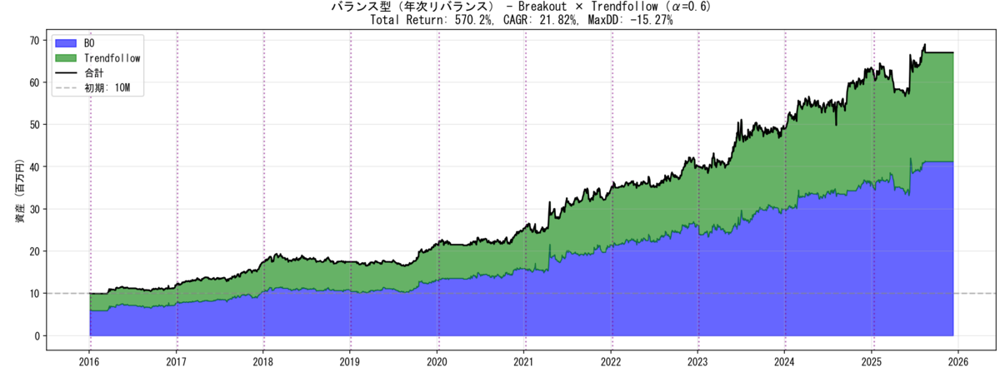

## 目次

1. ２０２５年目標に対する進捗
2. 雑記
3. ２０２５年１１月度の本の感想（１２冊）（年間累計９３冊）
4. ２０２５年１１月度のジャズの感想（８枚）（年間累計９０枚）

## 1. ２０２５年目標に対する進捗

1. **趣味****：新人賞に応募する。➡達成！****
**
2. **健康：体重を８８キロから７５キロまで減らす（身長は１８１センチ）。**
   1. ジムに年間１５０回行き、各回で必ず、アップ（プランク、プランク腕立ておよびＹＩＴバランス）および有酸素運動（クロストレーナー２０分以上）または無酸素運動（上半身セット）を行う。
**→○マンジャロやべっす。**
   2. 一人でスナック菓子・ナッツ類を食べず、食べたくなったらガムを噛むか歯を磨く。
**→○マンジャロパワーを借り、間食が全くなくなりました。**
3. **生活：紙の本を減らす。**
   1. 紙の本を減らすことで部屋のスペースを確保するために、紙の本を買うのは月に３冊までとする。例外を設けない。
**→△４冊。**
4. **仕事：ドメイン知識を海外に展開できるようにする。**
   1. 社内の技術をより深く理解するために、電子回路について学ぶ。教科書を１冊やり切る。
**→○積極的に教科書を眺めている。**
   2. 英語の議論でナメられないようにするために、スピーキング・リスニングを鍛える。１ヶ月に８回、２０分間の英会話レッスンを行う。
**→×まったくやってない。**

## 2. 雑記

まずは９月末に提出した小学館ライトノベル大賞の結果ですね。**一次落ち**でした。ちーん。で、１０月度月報で報告した転職活動の結果ですね。**お祈り**されました。ちーん。仕事が半焼したり、ストレス解消にトレーディングシステム組んでたら露骨に寝不足になったり。

そういうこともある。

ジャズをいっぱい聴けたのが数少ないプラスかな。トレーディングシステムは別立てでエントリを書きました。これは結果を出せました。

１１月は全体的に低調な一ヶ月でした。低調だったので１２月半ばまで月報が遅れました。

そういうこともある。

１１月度の一冊は強いて挙げるなら**『言語化するための小説思考』（小川哲）**。事前の期待とは違ったのだけれど、読書体験としては面白かったです。

一枚は**『Scenery』（福居良）**。アルバムの完成度には欠けるけれど「Early Summer」だけは聴いてほしいです。



### トレーディング

１２月に入ってからですが、目ン玉ギンギンにしてトレーディングシステム「聖杯」を作ってました。来年から使います。



### 新人賞

そろそろフラットな目を取り戻したはずなので、まずは応募原稿をゆっくり読み直したい。



## ３. ２０２５年１１月度の本の感想（１２冊）（年間９３冊）

### ①『会話の0.2秒を言語学する』（水野太貴）

会話、言語活動が相対化されて、頭が柔らかくなりました。自分たちが当たり前だと思っている会話ってやつはそうではなく、奇跡的な能力らしい。途中、吃音の話題が出たのだが、私は幼い頃はメチャクチャに噛んでいたが、長じてからは頻度が減った。これはもしかして（本書で紹介されていた通り）発話に使う語彙が自ずと工夫、喋りやすいように選択されるようになったからかもしれない。面白かったです。

### ②『カードゲームで本当に強くなる考え方』（茂里憲之）

生き方論ですね、これ。私はカードゲームをやらないので、ボードゲームやソロプレイ用のデッキ構築ゲームに当てはめて読みました。
いくつか論点をピックアップすると、
「勝つためには「敗者のゲーム」から「勝者のゲーム」にステージを上げる（相手のミスを待つのではなく、積極的に勝ちを狙いに行く）」
「ゲームは期待値通りに収束しない（ゲームには無数の選択肢による条件付き確率と分散があるので）」
「ゲームの終局から逆算してゲームメイクを逆算する（逆算の際に根拠の朧気な選択肢は弱い）」
「自分の仮説を持ち、磨いてデッキを作る（ゲームに勝つためには根拠が要り、それは仮説を磨くことで得られる）」
あたり。
こうしてピックアップされた論点って、いわゆる働き方論とか平たく言えば自己啓発本なんですよね。カードゲームの体裁を装っているけれど。
私は初見のボードゲームを人よりも強く遊べる自信があるんだけど、それはたぶんゲームメイクの逆算が好きだからだな、とか、それって俺の人生そのものだな、とか。あと、人より「大胆な」選択を取ることが多くて、（生来の性格もあれど）歪だったとしても自分にしか作れないデッキを作るのが好きなんですよね。

### ③『さよならジャバウォック』（伊坂幸太郎）

伊坂幸太郎の小説のテーマには、ずうっと「人類の悪意／善意の葛藤」があると思ってて、そのどちらか一方がもう片方に反転する恐ろしさであるとか喜びであるとかを書こうとしているのだと私は思っているのだけれど、それをメインテーマに据えた時の伊坂はキレが減じられているように感じる。メインテーマに振り回されるというか。『あるキング』とか『モダンタイムス』とかね。力む、というか。メインテーマを台詞で語らせてしまう。いや、それくらい噛み砕いてまで伝えたいことなんだろうし、台詞でもわかる程度に噛み砕ける力があるからこそ、売れっ子なんだ、というのも理解できる。ただ、アジテーション的な小説になるんですよね。
私の中でのベスト伊坂が『砂漠』なので、むしろ、例外的な小説を好きになってしまった感もなきにしもあらず（いや『アヒルと鴨のコインロッカー』とか『チルドレン』とか、そういうテイストのはいくつかあったんだけどね）。

### ④『Pythonで始めるMCP開発入門』（李碩根、からあげ、渡邊拓夢）

Claudeを使い倒すのにMCPに関する知識もいるかと思い読みました（ご恵投頂きました。ありがとうございます）。
これまでのClaudeとのやりとりはやりたいことベースだったゆえ、その場しのぎ的に策を出してもらうことが多かったのですが、本書はMCPをルールベースで教えてくれる。次にMCPサーバーを作る時に参照します。

### ⑤『締切と闘え！』（島本和彦）

良い意味で「ちくまプリマー」らしい一冊だった。島本和彦がなんのてらいもなく「がんばれ！！！」と叫ぶ。てらいのなさ、みたいなの、大事っすよ。

### ⑥『新　失敗学　正解を作る技術』（畑村洋太郎）

ギブ。「エリート組織」の失敗という観点が2020年代には現実に即してないと思われてならない。屏風から出してくれや。

### ⑦『DIAMONDハーバード・ビジネス・レビュー2025年11月号特集「戦略を機能させる」』（ダイヤモンド社）

立ち読みしてから買うべきだった。「戦略」という言葉に惹かれて買ったが、もっと上層部に向けた本だった。

### ⑧『忙しい人に読んでもらえる文章術』（トッド・ロジャース、ジェシカ・ラスキー＝フィンク）

・読み手の手間を減らし、
・結論を先に出し、
・less is more精神。
まとめるとこれ。less is moreをくどいほど謳いながら、（本書の説得力を上げるためだけでしょう）エピソードが多用されていて、ダルい。

### ⑨『アナロジー思考』（細谷功）

読みました。著者の細谷氏、ミスター構造といった感で呼吸はかなり合うのだが、本書の問題意識と私の読みたいことがズレていて、ん、と感じてる間に終わってしまった。別の本を立ち読みしてからあらためて読みます。

### ⑩『言語化するための小説思考』（小川哲）

（途中までの感想）
本書は、小川哲が彼自身の小説思考をフレンドリーに読者に伝えようとするあまりに具体と抽象の行き来がスムーズ過ぎて、やや「手触り」が欠けている、と私は思う。手触りとは、ぎこちなさと読み替えてもいいです。そこに作家性というか、癖が出ると思ってて、それを楽しみに読んでるところはあるので。
（その後の感想）
「小説の見つけ方」の章が飛び抜けて味わい深く、検見川運動場の便所サンダルの話こそ読みたかった（小川哲という一人の人物の手触りなので）。
私はたぶん本書を一種のエッセイとして読んでいて、他方で小川哲は一種の自己啓発書として書いていて、そこにギャップがあったのだが、この章はそのギャップがきれいにクリアされていたように感じる。小説を考え、書くにあたって、小川哲も苦しんでいるはずなので、その苦しみを見せて欲しい。
ところで「文体とは情報の順番である」という主張は（その是非はさておき）、極意になってて、「バッティングの極意とは来た球をタイミング良く打ち返すことである」くらい意味なくなっててウケました。

### ⑪『冬期限定ボンボンショコラ事件』（米澤穂信）

ついに〈小市民〉シリーズ読了です。
足かけ半年以上かかったのかな。私自身はミステリの人じゃないのでキャラ読みしたんですが、なんと言っても、小佐内さんのファム・ファタール性やね。破滅を齎すガール像として、これは不世出なのではないでしょうか。メチャクチャに頭の切れるガール（ただし普段は牙を隠す）と一緒に活動し、あるいは距離を置いたり置かれたり、そうして最後に得難い信頼関係を結び直す、そういうパートナーシップに憧れないボーイはいないのでは。
『冬期限定』について言えば、コンビニの防犯カメラのくだりにピンと来て（しまって）からはミステリの駆動力は弱まったものの、ラストの犯人追い詰めシーンはロケーションや時期などシチュエーションが光り、興奮しながら読めました。
総合すると『秋期限定』のラストが一番好きかな。あれを言わせるために3巻を使い、あれを言わせたケジメで1巻。トータルバランスがありました。
しかし、これ本当はハイティーン時代に読みたかったですね。

### ⑫『荒木飛呂彦の新・漫画術　悪役の作り方』（荒木飛呂彦）

読みました。
漫画家本人による創作術の本ということで、先日の島本和彦からの流れで。漫画術の本なので、漫画家でもなければ漫画の熱心な読者でもない私は想定読者から外れていたかも。

## 4. ２０２５年１１月度のジャズの感想（８枚）（年間９０枚）

### ①『The Freedom Rider』（Art Blakey）

いいと思うんだけど、なんかちょっと私のテンションをアート・ブレイキー＆ザ・ジャズメッセンジャーズのサウンドに合わせるのに失敗した感がありますね。リー・モーガンのトランペットが良かったです。

### ②『Standards Vol.1』（Keith Jarrett）

ここしばらくハードバップの文法でスタンダード曲を聴いていたが、今回はキース・ジャレット率いるスタンダーズトリオ。同じ曲でも複雑さが全く異なる。例えばマイルス・デイヴィス・クインテットで聴き込んでいた「It Never Entered My Mind」はマイルスの歌うようなトランペットによる叙情性溢れるバラードだが、スタンダーズトリオでは音数が控えめで情景を想像させるような演奏。
このスタンダード曲の聞き比べの楽しさってジャズにはある。

### ③『The Kicker』（Joe Henderson）

リッチで華やかなスリーホーン（テナーサックス、トランペット、トロンボーン）で聴かせる。表題曲にしてスタンダード曲「The Kicker」がべらぼうに良い。セクステットながら、それぞれの楽器に聴かせるソロがある。なにげにピアノが相当いい仕事してる気がする。

### ④『Scenery』（福居良）

硬質なサウンドのピアノトリオ。スタンダード曲は物足りないが、それを補ってあまりあるくらい「Early Summer」が傑出している。トリオの三人が同じ理想イメージを共有できた瞬間の曲だと想像する。終盤のドラムソロへの入り、出がまた良く、畳みかけるピアノにちょっと疲れてきたところで、ドラムのストイックなソロ。またあのピアノ聴きたいな……というちょうどのタイミングでトリオに戻る。奇跡みたいな曲だと思います。大絶賛。

### ⑤『Pocket Change 2: Mad Currency』（Nate Smith）

私は先週からフィンガードラムを触り始めて、そのためにドラム（フィンガーじゃないやつ）のどこを叩いたらどんな音が鳴るかとかちょっと勉強したのだけれど、そういう耳で聴くと、ネイト・スミスの上手さって異次元。ドラムなのに音色がある。

### ⑥『Speak Like a Child』（Herbie Hancock）

ハービー・ハンコック（p）が率いるセクステット。特徴的なのは、ピアノ以外のソロがないことか。3人ものホーンセクションを抱えながら、彼らはアンサンブルに徹している。ハービー・ハンコックの感性が全面に押し出された一枚で、確かに『Mayden Voyage』とセットで聴くのが良さそう。（でも、私が一番好きなのは『Empyrean Isles』だな）

### ⑦『Nancy Wilson/Cannonball Adderley』（Nancy Wilson, Cannonball Adderley）

キャノンボール・アダレイ・クインテットの伴奏にボーカルはナンシー・ウィルソン。ジャズ喫茶で耳にして、ボーカルの甘い歌声が印象的だったので。キャノンボール・アダレイって、実はほとんど聴いてないかもしれない。

### ⑧『Know What I Mean?』（Cannonball Adderley, Bill Evans）

「Walz for Debby」でサックスが入る瞬間、この曲の持つ世界が広がりましたね。

（おわり）
