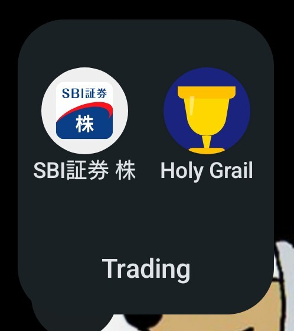

## 目次

1. ２０２５年目標に対する進捗
2. 雑記
3. ２０２５年１２月度の本の感想（１３冊）（年間累計１０６冊）
4. ２０２５年１２月度のジャズの感想（１枚）（年間累計９１枚）

## 1. ２０２５年目標に対する進捗

フィードバック記事参照。

## 



**2．雑記**

１１月月報が１２月半ばの公開だったため、実質２週間。

１１月末から目ん玉ギンギンにして作っていた**トレーディングシステム「聖杯」を無事に稼働させることができました**（させました）。聖杯のためのトレーディング関係の本を大量に読んでいたのが１２月、というまとめ方になるでしょう。



聖杯の稼働により、一日のトレーディング活動は、聖杯が出すアラートを十五分足らずでチェックするだけになります（そして、たまに出すアラートに従って三分で売買の指示を出すだけ）。また、聖杯を実際に動かしてみて二日ですが、売買のルールが完全に自分から外部化されていると日中の値動きにアテンションが引き摺られなくなって本当に気楽。判断をするのは私ではなく聖杯なので（正しく言えば、聖杯を組んだ時点での過去の私だが）。

まとめると、<strong>聖杯が完成を迎えたことにより、可処分時間・可処分アテンションが一気に増えます。</strong>２０２５年にはトレーディングで浪費していた可処分時間・可処分アテンションを、２０２６年にはもっと価値あるアクティビティに割り当てていきたい。

トレーディングより価値あるアクティビティを――それが２０２６年のモットーになります。

１２月度の一冊は<strong>『物価とは何か？』（渡辺努）</strong>。久しぶりにきちんと頭を使う読書をできて良かったです。本書で紹介されておいた、経済学者のハーバート・サイモンが１９７１年に記した言葉に唸りました。

> **情報は何かを消費する。それは情報の受け手の関心（Attention）だ。**
>
> ハーバート・サイモン

アテンションエコノミーについて想いを馳せる昨今（そして、アテンションの渦から逃れたくてＸ、Ｆａｃｅｂｏｏｋ、Ｉｎｓｔａｇｒａｍを止めた２０２５年）。五十年前の言葉ながら、情報の洪水が人々を飲み込み、アテンションの奪い合いが激化する２０２０年代を予言するような一言。非常に含蓄がありました。

一枚は（一枚しか聴いてないけど）**『Here's Lee Morgan』（Lee Morgan）**。ハードバップは最高。

## ３. ２０２５年１２月度の本の感想（１３冊）（年間１０６冊）

### ①『1日わずか30分の作業ですむ株式自動売買戦略』（ローレンス・ベンスドープ）

事前に決めた客観的なルールに従って粛々とトレードを実行するということ。本書はテクニカルだけを用いてルールベースでトレードするためにファンダメンタルズを「主観的」と断じているが、私見だが、ファンダメンタルズも（何らかの形で）ルールに組み込むことは可能だと思う。
さておき。
トレード戦略はトレーダー本人の信念にフィットしたものであるべきという主張、この数週間のバックテストの中で様々な結果を見、納得した。少なからずリターンを得られるトレード戦略でバックテストを行っていると、リターンのより大きいトレード戦略を発見することもある。ただし、リスクもそれだけ大きい。リスクをどれだけ自分が許容できるかを考えながら（自分だけの！）最適解を探っていくことが上達への近道だろう。
本書の技術的な肝であるところの「互いに相関の無い複数（または逆相関の）のトレード戦略を組み合わせることでリターンを大きくできる」というアイデアは、なるほど言われれば確かにだが、自分だけでは気付けなかった。今の私の資産サイズは、複数のトレード戦略を組み合わせるには小さすぎるため、とりあえず頭の片隅に置いておこう。

### ②『コナーズの短期売買入門　トレーディングの非常識なエッジと必勝テクニック』（ローレンス・Ａ・コナーズ）

システムトレーディングの手札を増やすために。私は基本的に①短期的なモメンタムを使った手法と②長期的なトレンドを使った手法を組み合わせてシステムを構築しており、つまり「勝ち馬が最高速度に達した瞬間に乗る」戦略。これに対して、本書は、「勝ち馬がスピードを落とした瞬間に乗る」手法。
本書では、トレーディング業界（投資業界）の「常識」に疑問を投げかけ、反証していくのだが、面白いと感じたのは「常識」の違い。本書は、いわゆる平均回帰に基づいた手法であって、その観点からだと私（モメンタム）側の常識は非常識とされる。私（モメンタム）側からの観点からだと、本書（平均回帰）の常識は非常識である。要するに、お互いが自分にとって都合の良いように自分の手法を紹介しているのである。
しかし、傾聴に値すると感じたのは、平均回帰側の本書であってさえ、長期のトレンドを最重視していた点。長期のトレンドに乗る。これが大前提らしい。

### ③『高勝率システムの考え方と作り方と検証』（ローレンス・Ａ・コナーズ）

同著者の『コナーズの短期売買入門　トレーディングの非常識なエッジと必勝テクニック』よりも深くてよかった。押し目買いの戦略は私もいまから検証してみます。

### ④『全天候型トレーダー　バイ・アンド・ホールドの呪縛を解き放つ戦略』（トム・バッソ）

バイ・アンド・ホールドが（人々がそう信じているよりも）ハイリスクであることを数字を用いて示す。「全天候型」とは、適切に分散されたポートフォリオのことであり、株、ETF、先物、債券、商品、買いポジション、売りポジション……、互いに相関しないポジションを取って、リスクの小さい、快適に過ごせるポートフォリオを指す。
私のトレーディングシステム「聖杯」は、株・買いポジションの二つの戦略のミックスなのだが、株・売りポジションまたは先物を追加することで、よりベターなシステムになるのだろう。そろそろ怖がらずに、「売り」「先物」とやらを勉強した方がいいのかもしれない。

### ⑤『アルゴトレード完全攻略への「近道」　より良いトレードシステムを効率的に開発するテクニック』（ケビン・Ｊ・ダービー）

本書のメッセージは「アイデアは検証せよ」に尽きる。そしてそれは、工学系のバックボーンのある人にとっては当たり前過ぎるので、あんまり本書は役に立たなかった。

### ⑥『株式投資のテクニカル分析補完計画』（マイク・Ｂ・シロスキー）

「株を買うということは、無リスクの現金を、それよりもずっとリスクが高いが利益を生む可能性がある資産と交換することである」
バカ難しかった。
以下、メモ。
BBI（ブルベア指数）：USのみの指標
GPI（勝率指数）：上昇日/下落日
RSI（勝利指数）：ネット参照
アルーンオシレーター：アルーン・アップ/アルーン・ダウン
ボラタリティが低いと上がり、高いと下がる
→25日ストキャスティックスでTRと価格をチャートにする
価格出来高指数（PVI）：(価格/出来高)/(1+価格/出来高)→50周辺で上下する。ピアソンの相関係数に先行して下げを示す
ボラティリティ→株価と逆相関
年率：TR(25)の中央値/25日の株価の中央値*root(256)
【簡単なフィルタリング】
25日のアルーン・アップとアルーン・ダウンの差が20以上
25日のRSIが60以上
25日の価格変動の線形回帰/標準偏差が1以上
↓
・アルーン・アップのランキング
・ブルベア指数の高いランキング
・R(25)の中央値/25日の株価の中央値*root(256)のランキングでボラタリティの低い順

### ⑦『オニールの空売り練習帖』（ウィリアム・J・オニール）

ショート戦略について考えるために。うーん、「アート」って感じだ。私は元々オニールとミネルヴィニの本から本格的にトレードについて考えるようになったのだが、システムについて考える今読み直すと、成功例として示されたチャートの裏にはどれくらいの失敗があるんだろう？と気になってしまった。が、それはそれとしてアイデアはあった。試してみよう。しかし、「アート」を統計で扱おう、がコンセプトなので、それを知っておくのは大事なのだ。

### ⑧『私とは何か　「個人」から「分人」へ』（平野啓一郎）

コミュニケーション論として読みました。
私はデジタルネイティブなのでネット経由で知り合った人とよく会うのだが、というか、頻度で言えば学友よりも多いのだが、そこでは本名ではなくハンドルネームを名乗っている。それは別に本名を隠したいからではなく、そうすることで私のネット用の分人が起動しやすくなるという側面はあろうな、と思った。テキストベースの分人がいて、本名を明かさないけど顔は明かす分人がいて、本名も明かす……とレイヤーがある。
平野自身が前書きに書いていた通り、「分人」という概念自体は従来よりあった考えに名付けを行ったものである。自分の中にもあったもののボンヤリしていた考えが整理されると気持ち良いですね。

### ⑨『高勝率トレード学のススメ』（マーセル・リンク）

基礎は頷けるところありつつ、古いし、別の本で十分かな。

### ⑩『ストーリーが世界を滅ぼす』（ジョナサン・ゴットシャル）

途中で投げました。題材に反してストーリーに頼り過ぎ（一般的なポピュラーサイエンス本よりもストーリー過多）。

### ⑪『脳の外で考える』（アニー・マーフィ・ポール）

エピソード集に留まっていた印象。それぞれはなるほど興味深いが、ブログを延々と読まされている感がして、最後まで読めなかった。

### ⑫『世界の７大投資家』（桑原晃弥）

薄い。

### ⑬『物価とは何か？』（渡辺努）

物価とは「蚊柱」のようなものである――それぞれの商品の価格の集団が総体として「物価」を成す。そんな比喩から入り、その蚊柱の方向（物価のインフレ／デフレ）がどのように予測されてきたか、蚊柱の誘導（インフレ／デフレの誘導）がどのように行われてきたか、それらを経済学者はどのように理論立てて政治へと反映してきたか……。疑問をひとつも余すことなく解説してくれました。
インフレが過剰に進みつつある2025年。本年の読み納めが本書で良かったです。

## 4. ２０２５年１１月度のジャズの感想（１枚）（年間９１枚）

### ①『Here's Lee Morgan』（Lee Morgan）

リー・モーガンのトランペットって特徴的で、そのサウンドを追う楽しさがありますよね。

（おわり）
