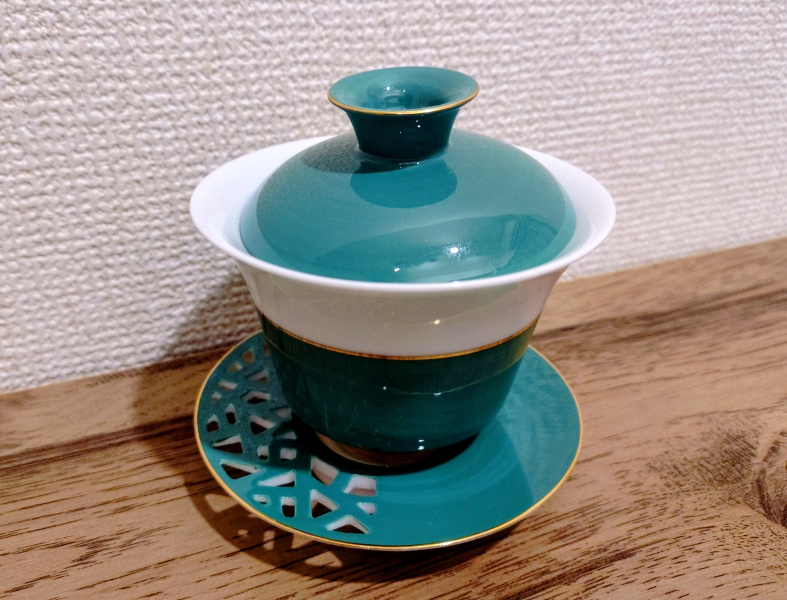
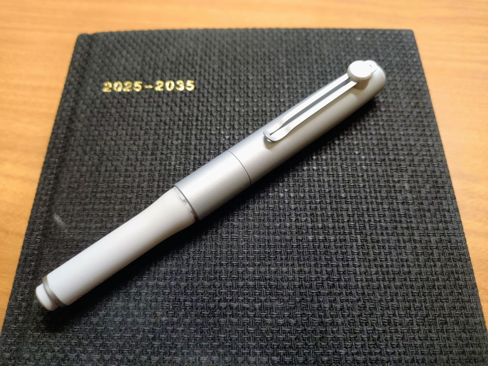
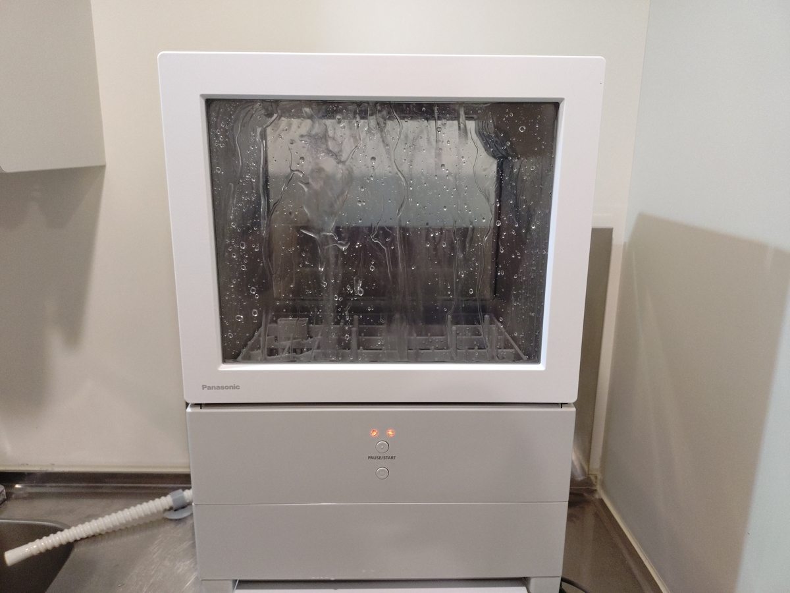
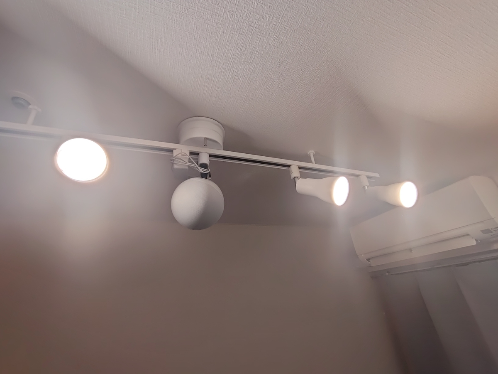
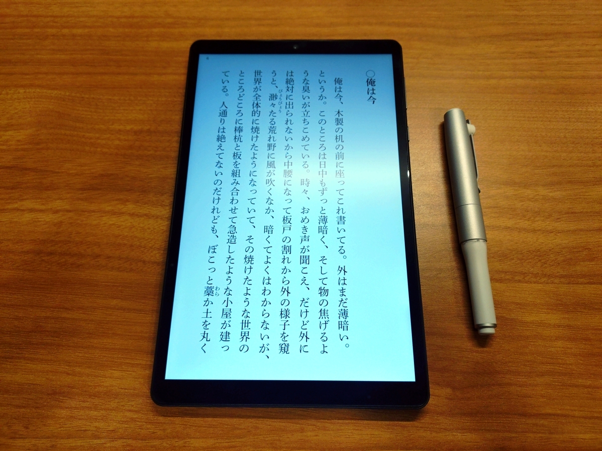

よしざきです。

2025年もぎょうさん買い物しましたので、買って良かったアイテムを紹介します。読んで良かった本と聴いて良かった音楽は別のエントリで紹介します。

1. 気持ちがアガった部門
   1. 茶器
   2. ペン
2. 暮らしが便利になった部門
   1. 食洗機
   2. スマートスピーカー＆ダクトレール
   3. 8.4インチタブレット

## 気持ちがアガった部門

### 茶器

2024年の年末から2025年の年始にかけて台湾を一人旅しておりました。目的は茶器探し。

陶磁器の街「鶯歌（イングー）」をブラブラしていた時に見つけたのがこの**蓋碗**。白地に鮮やかなグリーンと、綺麗なゴールドのライン。一目惚れでした。ティーソーサーにホールが空いているのもなかなか面白い。たしか、個人工房の作品じゃなかったかな。暇な休日は、部屋でこれで茶を淹れ、天井から吊るしたスマートスピーカー（後述）でジャズを流しながら読書をし、想像上の「老後」をやっております。

### ペン

2025年4月から十年日記を付けております。そこで使っているのがこの**[三菱鉛筆 uniball ZENTO Sigunitureモデル](https://www.mpuni.co.jp/products/ballpoint_pens/roller/zento/ubzh.html)**。

良いペンを使うとシンプルに気持ちがアガる。書き心地が滑らかなのは言うに及ばず、個人的に好ましいと思っているのはこのキャップ式のコンセプト。

> マグネット式キャップを軸本体からカチリと引き抜く瞬間は、「かく」に向きあう前のひと呼吸。
キャップを逆に挿すとき、やわらかい書き心地を最大限味わうためのカタチが完成されます。
>
> （三菱鉛筆[公式サイト](https://www.mpuni.co.jp/products/ballpoint_pens/roller/zento/ubzh.html)）

キャップを外した時の「抜刀」感っていうんですかね。「これから書くぞ」ってテンションを作ってくれます。この抜刀の心地よさ、日記を書く楽しさの何割かを占めています。

ただ、このモデルは本当に品薄で、私は一回しか実店舗で見かけたことないです。三鉛筆は、この数年はプレミア感のあるモデルでの商売をやっているように思いますが、明らかに供給が追いついてないですね。文具売り場でこのモデルの「品切れ」のポップを見る度に、三菱鉛筆あかんなあ、と感じています。

## 暮らしが便利になった部門

### 食洗機

暮らしの崩壊はシンクからやってきます。洗われないまま溜まった食器は、次の食器を洗う気力を削ぎ、あとは雪だるま式に全てが崩壊します。黙って食洗機を買え！！！　ということで、**Panasonic「[SOLOTA](https://panasonic.jp/dish/products/NP-TML1.html)」**を導入しました。

つらいときでも食洗機にポイポイすればあとは食洗機さまがなんとかしてくれる……この心強さを得たらもう二度とこれなしの生活には戻れないです。私は一人暮らしなので一人サイズを買いましたが、同居人数に応じて買えばよろしいと思います。

### スマートスピーカー＆ダクトレール

私は部屋のオートメーション化を推し進めておりまして、声で部屋のオブジェクト（ライト、エアコン、カーテン、サーキュレーター……）を操作しています。その要石になるのがこの**[ダクトレール](https://www.amazon.co.jp/dp/B081H3K85M)に吊るされた[Amazon Echo](https://www.amazon.co.jp/dp/B085FVY6KW)[^1]**。

机とかに置くとけっこう邪魔なんですが天井に吊るしておけば場所も取らないし、天井のスピーカーから音楽を鳴らすと部屋がカフェになるのでウケます。

### 8.4インチタブレット

私、入浴しながら読書するのが趣味なんですよね。風呂読書用の端末選びって難しくて、①デカすぎない（デカいと持ちにくいので）、②高価すぎない（風呂で端末が死んだときに泣きたくないので）、③ヘボすぎない（読書のためのhontoアプリって意外とスペックを要求するので）の3つが求められる。それに加えて、ガジェット選びの観点からは個人的には④OSはAndroid、⑤台数が出ている、も加えたくて。

本当は7インチくらいでいいのだが、いまの市場って7インチタブレットが存在しないので、妥協の8インチ。その他諸々のバランスを勘案して、**HEADWOLFの[FPad 7 Pro](https://www.headwolf.net/product/detail?code=F7)**が選ばれました[^2]。読書用の端末として一切の不満がないのですごい。

2026年も気持ちを上げ、生活を便利にしていきましょう。

（おわり）

[^1]: この第4世代はディスコンになりました。新しい世代を吊るせるかは知りません
[^2]: Fpad 7 Proはディスコンになり、7無印しかもうないようです。ストレージサイズが512GBか256GBかの違いしかないので7無印でええと思います
