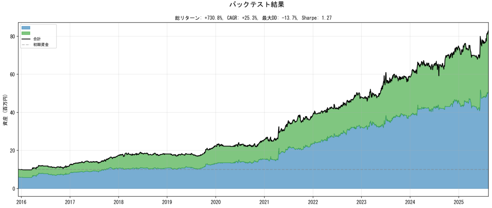
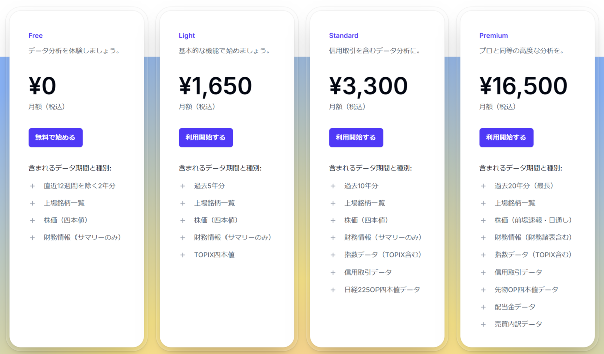
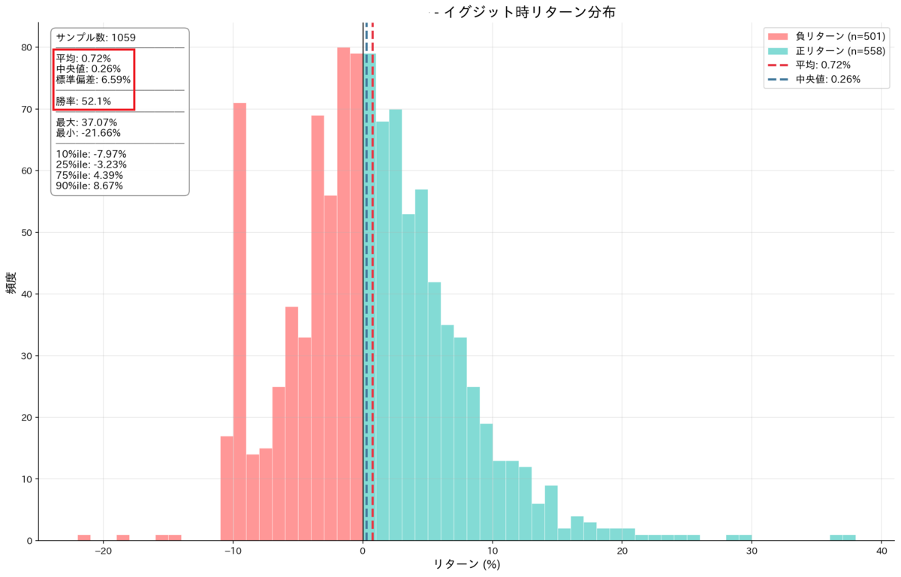
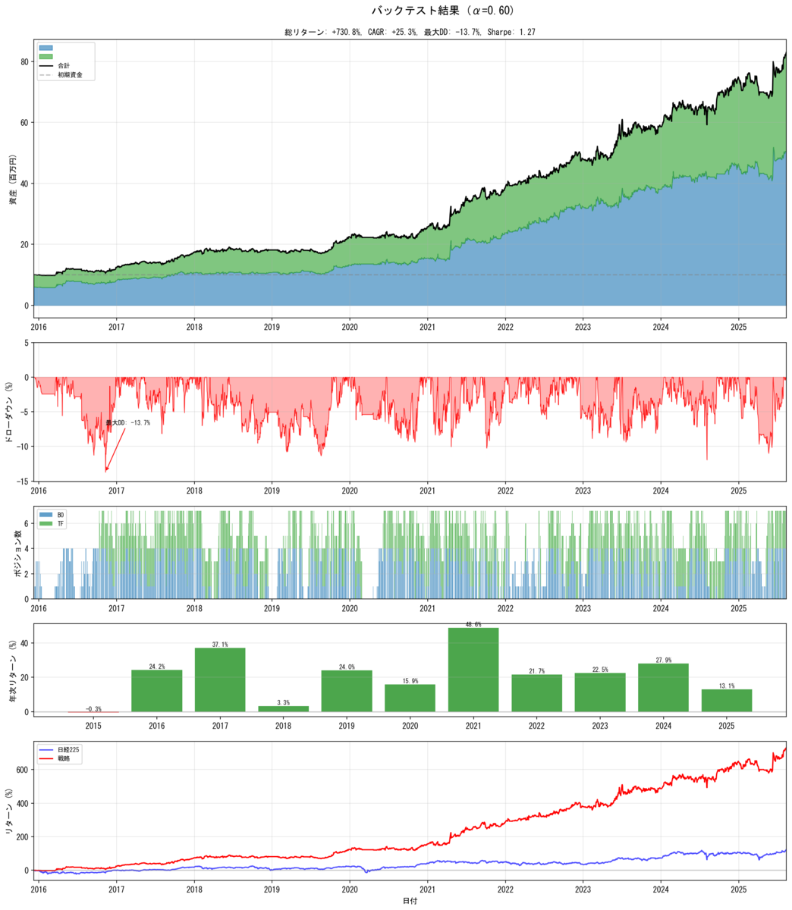

私はトレーディングシステム「聖杯」を作っています（いました）。（少なくともバックテストの上では）自分で納得のいくものが出来たので、作り方のコツみたいなものを残しておこうと思います[^1]。

以下、システムを「取引においてトレーダー自身による裁量のない、完全にルール化されたトレーディング手法」とでも定義させてください。

## 目次

1. 自分のトレーディングスタイルを決める
2. システムのための材料を集める
3. 集められた材料で自分のトレーディンスタイルをシステムとして再現する
4. イベントスタディでシステムの成否を確かめる
5. バックテストでシステムの成否を確かめる
6. システムを成文化する
7. TIPS
8. このブログを初めて読んだ人向けに、過去のエントリから引用

## 1．自分のトレーディングスタイルを決める

まずは、自分がいわゆるテクニカル派なのか、ファンダメンタル派なのか、その両派のいいとこ取り派なのかを決めます。私自身の感触だと、システムに落とし込む容易さで言えば、**テクニカル単独＞両派のいいとこ取り＞（越えられない壁）＞ファンダメンタル単独**、な感触です。

テクニカル・ファンダメンタルの本質的な違いには、テクニカルはチャートの動きを（変数はそれだけで、ある種、機械的に）読み込んで裁量の割合小さく取引するのに対して、ファンダメンタルはチャートの動きよりも複雑な変数を読み込んで裁量の割合大きく取引することが挙げられます。端的に、ファンダメンタルの方がやること（やりたいこと）が複雑なので、それ単独をシステムに落とし込むのは難しいと思います[^2]。

いいとこ取りは、テクニカルのチャートに加え、ファンダメンタルのうち数値化しやすい変数をピックアップする感じですね。

## 2．システムのための材料を集める

日本株でシステムのための材料を集めるのに使ったのは、私は以下の5つ。

- [J-Quants](https://jpx-jquants.com/ja)：神。四本足からキャッシュフローから、数値化されたものは何から何まで集まるデータベース。月額1650円～。**とりあえずJ-Quantsから始めよう。**

  

- [J-Quants DataCube](https://dc.jpx-jquants.com/ja)：日本で唯一、個人が安価に簡単にティックデータ（歩み値）を手に入れられるデータベース。日本で信頼できる分足・時間足データをデータで得ようとするなら、ここでティックデータを集めて、それを加工するしかないはず（他にあったら教えてくれ）。
- [TradingView](https://www.tradingview.com/)：言わずと知れた、神。説明については先駆者が多いのと仕様が変わりがちなので詳しくは調べて。
- [yfinanceライブラリ](https://github.com/ranaroussi/yfinance)：Pythonのライブラリ。説明については先駆者が多いのと仕様が変わりがちなので詳しくは調べて。
- [東証上場会社情報サービス](https://www.jpx.co.jp/listing/co-search/index.html)：IR他のデータベース。

## 3．集められた材料で自分のトレーディングスタイルをシステムとして再現する

まず、トレーディングシステムを組むなら「チャートを読んでたら／IRを読んでたら「第六感」が働いて「買おう！」と決めた」みたいなのは不可能です。

**「第六感」を指標にするために数値化・言語化するところから始まる。**

例えば：チャートでは、「新高値」はシグナルにならないが、「新出来高」ならなる[^3]。

例えば：IRに出現するキーワードでは、「受注増」はシグナルにならないが、「専門性」ならなる[^4]。

第六感を指標として数値化できたら、あとはガチャガチャと手を動かしてシステムを組んで下さい。いまはClaude CodeとかGeminiとかAIがいい感じにしてくれるので。

結局、**指標の選び方が最大のポイント**でしょうね。みんなが見てるＰＥＲとかＰＢＲとかは一生成果が出ないと思います。ロジックを立てて、**ヘンな指標×ヘンな指標のシステム**を作れるかでしょうね。

私が傾聴に値すると思っている、ネットで活動する数少ない日本人投資家に「株おじさん」という方がいて、その方が清原達郎（キヨタツさん）[^5]を引いて端的に述べていたので引用します。

> **キヨタツさんの言うように「まだ多くの人が気付いていない指標」は可能性が無限大。**
>
> 株おじさんのnote「[中長期の高騰株を探すインジケータ](https://note.com/kabu_ojisan/n/n13adbb5ca69a)」

**誰も知らん、ヘンな指標のシステムを作れ。**

## 4．イベントスタディでシステムの成否を確かめる

ここでの「イベントスタディ」って言葉の使い方が正しいのか私にはわからないんですが、Claudeはそう言ってるので、そう言います。

> イベントスタディ（Event Study）とは、**企業に関連したイベント前後の株式の累積異常リターンの動きを検証**することで、そのイベントの企業価値に与える影響や情報の効率性を検証する手法である。
>
> [みずほ証券ファイナンス×一橋大学用語集](https://glossary.mizuho-sc.com/faq/show/171?site_domain=default)

要するに、システムがシグナルを発した後の株価の変動を検証するやつです。

イベントスタディでプラスにならないシステムは、これを破棄します[^6]。**自分が「イケそう！」と信じていても、システムがそう評価しないなら、イケない。それがシステムなので。**

## 5．バックテストでシステムの成否を確かめる

イベントスタディでプラスが出て、それで初めてバックテスト（時系列テスト）に進みます。税金とか手数料の処理とか、システムに組み込むの死ぬほどめんどくさいですが頑張ってください。AIが何とかしてくれる。トータルリターンに加え、ドローダウンとか、対日経225とかもいっしょに出力すると便利です。

ここからがこのエントリの最大のポイントなのでよく読んでほしいんです。

バックテストの結果を示す指標は無限にあります。トータルリターン、CAGR、DD、シャープレシオ、安定性……。私はシステムを組む過程で、このための様々な議論を追いました。賢いトレーダーが永遠に議論して、それでもなお結論が出ていない。

これが何を意味するのか。ここから先を言いたくて、このエントリを書きました。

**システムで何を重要視するか、言い換えると、どんなシステムならルールを守って運用できるかを決めるのは自分自身です。自分自身しかあり得ない。他人からもらったシステムを運用できるはずがない。自分でシステムを評価し、自分でシステムをどう運用するか決断するしかない。**

## 6．システムを成文化する

システムが決めた取引ルールを紙のノートに手書きでボールペンかマジックか万年筆かで書いておきましょう。**後からルールを曲げることができないように。**

私はシグナルを出すアプリを作りましたが、そういう手もある。

## 7．TIPS

- システムを作る前に、自分がどれだけ曖昧に取引していたかよくよく反省する。
- データの前処理の出来が後の全ての工程の出来を決める。
- イベントスタディの結果は良いのにバックテストの結果が悪くても凹まない。
  - シグナルの頻度が低すぎる／高すぎるとあるある。つまり、ポジション数が命ということ。
  - リターンの結果のバラツキが大きすぎるとあるある。つまり、ポジションサイズが命ということ。
- 異なる戦略を組み合わせた方がいい。
  - ロングの戦略／ショートの戦略、ベータ値の高い戦略／低い戦略、保有期間の長い戦略／短い戦略……。
- 基本的に手数料に負けるので、手数料は減らそう。
  - SBI証券、使おう！

## 8．このブログを初めて読んだ人向けに、過去のエントリから引用

### 『バフェットとソロス勝利の投資学――最強の投資家に共通する２３の習慣』（マーク・ティアー）

株やる人は全員が読んだ方がいいです。

私は（ブログで度々書いている通り）ウォーレン・バフェットが嫌いで、ジョージ・ソロス（伝説的なトレーダー）について知りたくて読みました。ソロスについての書籍で絶版ではないものって限られているので。

結論から言えば、私はバフェットともソロスとも違うスタイルでトレードをしています。しかし、そのスタイルの原則（本書では「習慣」と呼ばれるが）は本書を参考にしております。私は今年の九月からトレードを中断して全くノーポジになって、トレードのための確固たるシステムを作っているんですが、中断に至った理由、システムを作った理由は本書から大いに影響を受けています。**トレードのための原則が曖昧な状態でトレードをするべきではないし、逆に、原則が確立されたら貪欲にマーケットに打って出るべき。**

本書を読んだとしても即座に利益が出るわけではない。けれども、利益を出し続けるためには本書が言うところの「習慣」について考え続けなければならない。

ちなみに、株をやる人は本書を五冊目くらいに読んだ方が良くて、一冊目は絶対に<strong>『マーケットの魔術師　エッセンシャル版』</strong>（ジャック・D・シュワッガー）。二冊目には<strong>『なぜ株価は値上がるのか？』</strong>（矢口新）。

<strong>『マーケットの魔術師　エッセンシャル版』</strong>では、<strong>『バフェットとソロス勝利の投資学』</strong>の「習慣」の実例が様々紹介されています。<strong>興味深いのは、どんな投資スタイルの投資家も、共通する習慣――規律を守ること――を第一原則として挙げていること。</strong>具体的な手法ではなく、心構えを知ってからマーケットに出るべきでしょう。

<strong>『なぜ株価は値上がるのか？』</strong>は、マーケットが動くメカニズムを概観します。値動きのメカニズムには長期的な要因／短期的な要因があると説き、それぞれの要因のプレイヤーを投資家／投機家とさらに分類します。それぞれのプレイヤーは相手が不合理であると主張するのだけれど、そもそも不合理に基づく相互作用によって値動きが生まれているのだからその主張には意味がない。マーケットの構造を知ってからマーケットに出るべきでしょう。**大局観を与えてくれる一冊です。**







### 私がシステムを組んだ動機



（おわり）

[^1]: 予め明言しておきますが「聖杯」のタネは割りません
[^2]: ただ、私としては、そこまで「複雑な」判断を「ルール化して」毎回の取引で行ってる個人投資家ってどれいくらいいますか？ってのもあるとも思ってて
[^3]: 五秒で考えた例なので、正しいかは知りません
[^4]: 五秒で考えた例なので、正しいかは知りません
[^5]: 私は清原達郎とは明確に異なるトレーディンスタイルなのだけれど、①流動性リスクの怖さ、②ヘンな変数を使う効果、を著している数少ない日本人投資家という点で好感を持っています
[^6]: プラスにならなかったやつを私は「泥」と呼んでいます。
