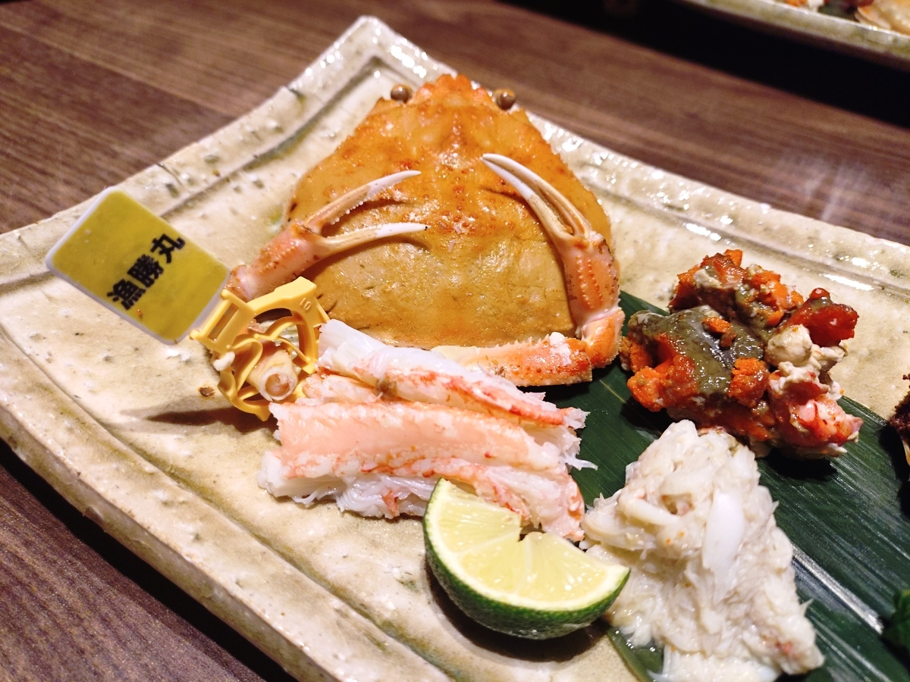

## 目次

１．２０２６年第一四半期の目標

２．２０２６年１月のまとめ

３．２０２６年１月に読んだ本（１７冊／年間１７冊）

４．２０２６年１月に聴いたジャズ（１０枚／年間１０枚）

## １．２０２６年第一四半期の目標

### １．１．趣味：新人賞に応募する。

２０２５年に書いた小説（小学館ライトノベル大賞一次落ち）をリビルドして、他の新人賞に応募します。まずは４月の電撃大賞が目標です。

**→×月初に参考資料を読んだくらい。**

### １．２．健康：毎朝ラジオ体操第一を行い、エアロバイクを漕ぐ。

２０２５年１０月からマンジャロでダイエットを始めたところ、脂肪と共に筋肉もみるみる落ちています。１２月に入ってからは目に見えて体力の減衰が感じられるほどになりました。身体に刺激を加えよう。

**→△７日に５回くらい**

### １．３．仕事：週５回『英語のハノン　初級』のレッスンを行う。

新しい上司はアメリカ人でボディーランゲージも通用しないので、そろそろ年貢の納め時と思い、きちんと英語のスピーキング・リスニングのスキルを磨きます。アメリカ人にナメられないようにしよう。

**→×３日に１回くらい**

## ２．まとめ

### ２．１．身辺雑記

#### ２．１．１．イベント

蟹を食べるために家族と旅館に行ってきました。いいでしょう。



目ん玉飛び出るほど美味かったです。東京の「美味しいレストラン」って（美味しいけれど）料理以上に情報を食わされている気持ちになることもある。ただ、地方の美味い旅館の美味いやつって、**料理そのものを食べましたの満足感**が凄すぎる。また行きたい。

#### ２．１．２．小説

えっと、**小説、書いてないです**（完）

ただ、１月３１日（つまり、昨日）にお友だちと会話して、**闘志が湧いて**きて、これ書いてる今日時点では次のビジョンが視えております。４月１０日の電撃大賞までに直すのは無理目だけど、９月３０日の小学館ライトノベル大賞までには間に合うでしょう。

何を直すべきか、２月に読んだ本の学びだから２月の月報に書くべきなんだろうけど、書いちゃうね。前回の小説は登場人物の間の「情報の格差」が小さすぎたのかな、と。私なりには作り込んでいたつもりだったんだけど、それはあくまで登場人物向けの感情に関するものだけで（そこは今でも強みだと信じている）、初読の読者向けの解説が足りなかった。これを直すには、登場人物の一人を別の競技のプレイヤーにした方がいいんだろうなという気付き。これを実装しましょう。小手先の表現の直しでは足りない、構成の直しになるので、まあ時間は掛かるでしょう。ただ、その時間に見合った直しにはなると確信。

#### ２．１．３．聖杯

<strong>鬼のように稼いでる。</strong>稼いでるので報告してるんですが、この報告がなくなったらお察し下さい。昨年の１１月末から年末まで余暇を全力投下して作り込んで今年の１月から本格稼働させましたが、投下した時間コストは今のところペイしてくれました。そういうレベルで稼いでおります。

### ２．良かった本／良かったジャズ

#### ２．２．１．本

<strong>『踊るのは新しい体』（太田充胤）</strong>が抜群に良かったです。ショート動画型のＳＮＳが発達し、浸透し、誰もが身体を使って発信するようになった２０２０年代において、パフォーミングアーツの実際とは――。あるいは、ここに至るまでにどんな軌跡を辿ったのか。表現者と観客の境界が融ける現在、それでもプロは存在する。**私が書きたい小説に観点をもたらしてくれる一冊**でしたし、同時に、足りないものも見えてきました。頂いた本ですが、ＢＩＧ感謝です。



#### ２．２．２．ジャズ

１月はあんまりテーマを決めずに聴いたけど、あえて選ぶなら<strong>『isles』（池本茂貴, isles）</strong>かな。景気の良さって言うのかな、ラージアンサンブルって**音の厚み**がありますよね。２月はラージアンサンブルを中心にｄｉｇろうかな。



## ３．２０２６年１月に読んだ本

**①『踊るのは新しい体』（太田充胤）**
とても興味深く読みました！
書名の『踊るのは新しい体』に偽りなく、それを「踊る」「新しい」「体」と分解し、それぞれ論じながら互いを行き来する。その具合が良い意味でルーズで、読みながら発想を広げてくれました。
私は身体表現を用いる人々の小説を書いていて、その観点からだと、踊る人々の様々な有り様が記されているのが勉強になりましたね。踊る人々とは、従前そうだったようなダンスの訓練を受けた人々に限られず、それこそTikTokユーザのようなフツーの人々にも開かれている。一方には従来のダンサーのように、踊るための規範の体系（ダンスのジャンルや、ムーヴや、そういうもののデータベース）を拡げる人々がいる。他方には、フツーの人々がいて、彼らが踊る理由は、規範の体系を順守することそのものへの喜びのため、という構図（もちろん両者は対立する構造ではなく、グラデーションがある）は本書が新たに開いた地平な気がする。
本書はまさにその、踊ることにまつわるグラデーションがどのように広がっているのか、を論じた一冊でした。
恵投頂いた本でしたが、大変に良い本でした。ありがとうございました。

**②『新装版　「遊ぶ」が勝ち』（為末大）**
為末大がヨハン・ホイジンガの『ホモ・ルーデンス』を引用しながら自身のキャリアを振り返る。「遊ぶ」をキーワードにし、要するに、余白であるとか自由さであるとかを人生に組み込むことを説く。
為末大の本は、元々は自分の小説を書く参考のために読んでいたんですが、今はフツーに自己啓発の一種としても読んでいますね。何らかに一意専心に取り組んで世界まで上り詰めた人物（そして、私の人生では関わりようのない分野の人物）がその経験をつぶさに言葉にするさまを追体験できるのは、なんというか、読書の効用を感じますね。
スポーツ選手だと、陸上の為末大もそうだし、フィギュアスケートの町田樹もメチャクチャ面白い本を書いてる。

**③『自分を超える心とからだの使い方　ゾーンとモチベーションの脳科学』（下條信輔／為末大）**
トップ競技者の為末大が語るゾーンの体験って究極まで主観的ながら、例えば宗教体験における（普遍的な）それと整合していたりする。じゃあ、それって科学的にはどんな体験なんですか、というのをトップ認知心理学者の下條信輔と対談する。
掛け値なしに面白かった。
ゾーンについて、具体（為末の競技）と抽象（下條の理論）とを行き来する。その行き来の中で、読者としても「そういえば、自分でもそういう経験あったかもしれない」と自ずと気付けるようになる構成になっている。
エピソードとして最も印象的だったのは、下條が会った歌舞伎役者の代役に関するエピソード。代役とは元々他の人に与えられていた役なのだから、演じるには自分自身を消さないといけない。そうやって、自分を消した結果、生涯最高の舞台に出来た、と。自分を消し、最後に残った「型」が最高の舞台を作ってくれた、というもの。この「自分を消す」というキーワードが本書を貫いており、為末が言うには、消えた自分をさらにメタ認知する自分がいる。
私は（もう昔のことだが）舞台関係をやっていて、パフォーマンスの良い舞台では忘我だった。あれを小説にし、届けたい。

**④『ワンパターン献立』（長谷川あかり）**
食事、コンビニ＋まいばすを続けて気が狂いそうになってきたので、調理しようと思って。

**⑤『美人　Bijin』（柘植伊佐夫）**
小説の種本として読みました。難しい。

**⑥『ファイナンス理論全史』（田淵直也）**
「聖杯」を作っている間にファイナンスや金融工学に興味が生まれたため、本書を読んだ。
いわゆる効率的市場仮説・それから発展したウォール街のランダムウォーカーの概念から始まるが、そもそもその二つがそれぞれ単独では機能するものではなく、いくつもの仮定を置いている。そして、その仮定と現実のギャップを埋めることこそが現代の金融工学の最先端であるらしい。端的に言えば、ランダムウォーカーの概念では市場の動きが正規分布に従うことを仮定しているが、現実には正規分布ではないというところから、現代の金融工学の議論は始まる。その分布の歪みは、例えば情報が伝わる速度の差異（効率的市場仮説の限界）であったり、アノマリーであったり……。
書名の通り、ファイナンスの見取り図として非常に役立った。

**⑦『図解　いちばん面白いデリバティブ入門（第3版）』（永野学）**
デリバティブとオプションを完全に理解した。

**⑧『日本人が知らない！！世界シェアNo.1のすごい日本企業』（田宮寛之）**
読みました。四季報編集者が上場非上場を問わずに、日本のグローバルニッチトップ企業を紹介する。読み物として面白くフンフンと鼻息荒く読んでいたが、私が詳しい企業に関しては肌感と異なることをけっこう書いており、本当の信頼感という意味では微妙かも。とは言え、非上場企業への取材力は流石に編集者の地力を感じた

**⑨『イングランド銀行公式　経済がよく分かる10章』（イングランド銀行）**
イングランド銀行（イギリスの中央銀行）が公式で広く国民向けに経済学、ひいては経済政策を知らしめ、啓蒙するための活動をまとめた一冊。
マクロ経済学・ミクロ経済学の基礎、理論的な側面から実学的な側面まで、具体例をふんだんに用いて解説する。具体と抽象を行き来し、たぶん、高校生でも議論に追いつくことが出来る。それくらい平たく、易しく書いてくれている。私もこれから困ったらこれを参照しようと思う。
国民のためにここまで社会奉仕活動に励む中央銀行って、他国には（少なくとも日本には全く）ないですよ。金融大国であるところのイギリスが、金融大国であろうとする誇りを感じました。正直、感動しました。

**⑩『Invent & Wanderージェフ・ベゾス Collected Writings』（ジェフ・ベゾス、ウォルター・アイザックソン）**
ビジョナリーな人物の物語を読みたくて手に取った。
いちサラリーマンとして印象的だったのは、決断というものを二種類に分けていること。「後戻りできる決断」と「後戻りできない決断」。リーダーの仕事とは後者の決断をすること。
いち読者として印象的だったのは「後悔最小化のフレームワーク」とジェフ・ベゾスが呼ぶ思考実験。80歳になってその判断を振り返った時に、自分がどう思うか想像してみるという思考実験だ。チャレンジしていこう。
私たちはAmazonが（ジェフ・ベゾスがそう主張するほどには）善なる企業ではないと知っているが、例えば、ジェフ・ベゾスが宇宙企業ブルーオリジンを立ち上げたビジョンなんかは、イーロン・マスクのそれよりも高邁な精神に基づくものだろう。

**⑪『世界秩序が変わるとき』（齋藤ジン）**
目次だけ読んどけば十分かもしれない。

**⑫『バフェットの法則』（ロバート・Ｇ・ハグストローム）**
バフェットの信者の本。無理すぎて読めんかった。
私がバフェットのフォロワーを嫌いな理由はいくつかあるのだが、
・バフェット自身の銘柄選びがバリューを生み出すことに無頓着（つまり「バフェット銘柄」がバフェットのポートフォリオの価値を上げてしまう）
・バフェットの資金はバークシャー・ハサウェイの保険業によって、事実上、無尽蔵であることに無頓（普通の個人投資家のキャッシュは有限である）
・バイアンドホールドに出口戦略がないことに無頓着（普通の個人投資家は将来の支出に備えるために投資をするため、いつか売らなければならない）
Amazonが今やAWSで稼げるにもかかわらず尚もEコマースを続ける理由と構造的には同じですよね（無限のキャッシュを得られるため）

**⑬『トレーダーは知っている』（小森晶）**
オプション取引の勉強のために。基礎的な知識は分かったが、実運用するための個別株のオプションは日本に市場がないことがわかり、横転……。

**⑭『米国の投資家が評価する「良い会社」の条件』（森憲治）**
「良い会社」とは
ROE＝利益/資本＝利益率×資本回転率
の高い企業であると定義する。
そして、ROEを高く出来る企業の特徴（マイケル・ポーターの5フォースやウォーレン・バフェットのmoat等）を解説する。私は投資本のつもりで読んだが、むしろ、製造業30代半ばのサラリーマン（そろそろ管理職への意識を高めたい）の気持ちで読んだ方が良かったろうな。ROEの解説本としては良書、投資本としては別に……という評価です。
現在の聖杯はテクニカル分析だけだが、定量化できるファンダメンタル的要素、要するに、ROE概念とフリーキャッシュフロー概念を組み込むともっと確度が高まるはずなんだよな（最終的には「泥」となったが聖杯にかなり近付いたアイデアがあり、それはフリーキャッシュフローを組み込んだアイデアだった）

**⑮『負けヒロインが多すぎる！いみぎむるARTWORKS』（いみぎむる）**
イラストを時系列で眺めてみると、焼塩檸檬さんってお色気の担当やったんやな……って思った（お色気担当のギャグ担当から、8巻時点では一番成長した人物だと思う）

**⑯『アルファフォーミュラ　相関のない戦略で構成する最強ポートフォリオ』（クリス・ケイン, ローレンス・Ａ・コナーズ）**
これガチヤバっす。ローレンス・Ａ・コナーズの本は何冊か読んでるけど、かなりワークするシステムのアイデアがあるし、そのアイデアにはきちんと市場に対する洞察がある。

**⑰『負けヒロインが多すぎる！（8.5）』（雨森たきび）**
萌え萌え。
読む度に思うんですが、八奈見さんに餌付けする温水くん、彼女のこと好きなんじゃないかな。自分では気付いてない（認めたくない）だけで。八奈見さんは八奈見さんで、温水くんのこと好きなんだろうけど、それを言葉にしたらこのぬるま湯が終わるってわかってるんだよな（だから「負けヒロイン」なんだよな）。
焼塩ちゃんはぬるま湯を終わらせてもいいって思ってるんだよな（それが6巻だったし、名古屋の夜景の回なんだよな）（そういうところを私は彼女の尊さと思ってるんだよな）（やっぱ、陸上競技のおかげで「勝ち」に行く姿勢を持ってるんだよな）（オタク特有の「だよな」連発）。
小鞠ちゃんは小鞠ちゃんでがんばってるのに明らかにスピード足りてないが、物語的には末脚の人物になるんだろうな。
とは言え、話に絡ませてもらえない馬剃さんが不憫すぎる。

## ４．２０２６年１月に聴いたジャズ

**①『Motion II』（Out of/Into）**
新年一発目はブルーノート期待の若手のクインテット。1曲目のイントロはいかにもブルーノート的なサウンドだが、メロディの展開、手数の多さは現代的。というか、どの楽器も上手い。2026年は「楽器が上手いとは何か？」をもっと言語化することを目指していこう。

**②『Ménage à trois』（Enrico Pieranunzi）**
ピアノの高音域の使い方でヨーロッパジャズやクラシックの雰囲気を感じさせつつ、同じヨーロッパジャズでもECM（ドイツ）とも異なる音作りで、ピエラヌンツィ（イタリア）やレーベルのBonsai（フランス）の特色がありました。ECMで想像する典型的なジャズよりもメロディアスな印象。

**③『HUM!(Live)』（Daniel Humair）**
ドラムがリーダーの本作だが、リズムを刻むリズムセクションとしてのピアノの役割を強く感じた。ピアノを聴いているはずなのに、ドラムのように聞こえた。

**④『Kelly at Midnight』（Wynton Kelly）**
マイク・モラスキーの『ピアノトリオ』で紹介されていた一枚。シンプルな味付けだが、ピアノよりむしろドラムの静けさを聴く一枚かもしれない。

**⑤『Ray Bryant Trio』（Ray Bryant）**
いまの私、1950年代のシンプルな音作りのモダンジャズへの感性がちょっと鈍ってるかも（そういう発見があること自体かなり面白いというか成長を感じるが、感想がそれではいかんでしょう）。

**⑥『Our Delights』（Tommy Flanagan, Hank Jones）**
トミー・フラナガンとハンクジョーンズのピアノデュオ。トミー・フラナガンのピアノのタッチがわかってきたので、二人の演奏を聴き分けることができて面白い体験でした。

**⑦『Toshiko Mariano Quartet』（Toshiko Mariano）**
初めての秋吉敏子。ジャズ喫茶で「Oleo」が流れていたのがきっかけ。チャーリー・マリアーノのアルトサックスの音色が独特な印象を受けた（低音が強調されたような？）。秋吉敏子のピアノは「踊るような」という形容詞が似合う。

**⑧『Something for Real』（Kiefer）**
素直に格好いいです。ピアノはエレクトロニカな音作りながら、ベースとドラムは生っぽい質感がある。特に「Fast One」が白眉。エレピのメロディラインは追いやすく、耳を澄ませていると背後のベースとドラムがどんどん厚みを増していく。2024年リリースのライブ盤。こういう音源も幅広く聴いていきたい。

**⑨『Good Girl』（Kim Parker, Tommy Flanagan）**
1曲目「Bijou」、トリオの醍醐味、ショーケースでした。先日の土曜、美味しいお茶を頂いてこれを聴きながら冬の昼の上野公園を歩きました。幸せのイデアでした。

**⑩『isles』（池本茂貴, isles）**
ラージアンサンブルの音の厚みを楽しませてもらいました。私はピアノトリオを好んで聴いているんですけど、今年は幅を広げていきたい。そう思いました。
気持ち良いので聴いてね↓
「COMET」



（おわり）
