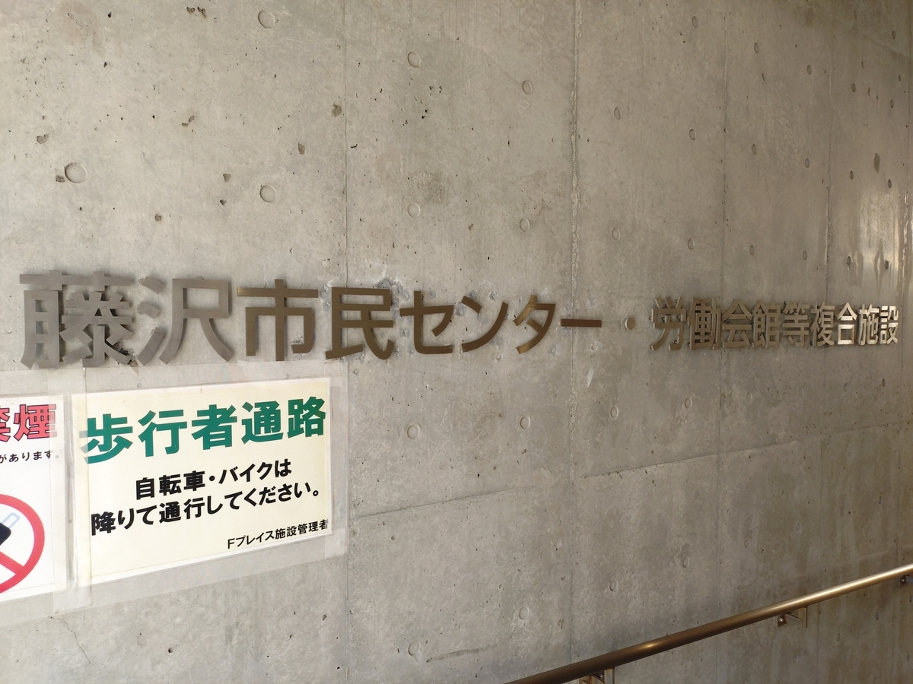
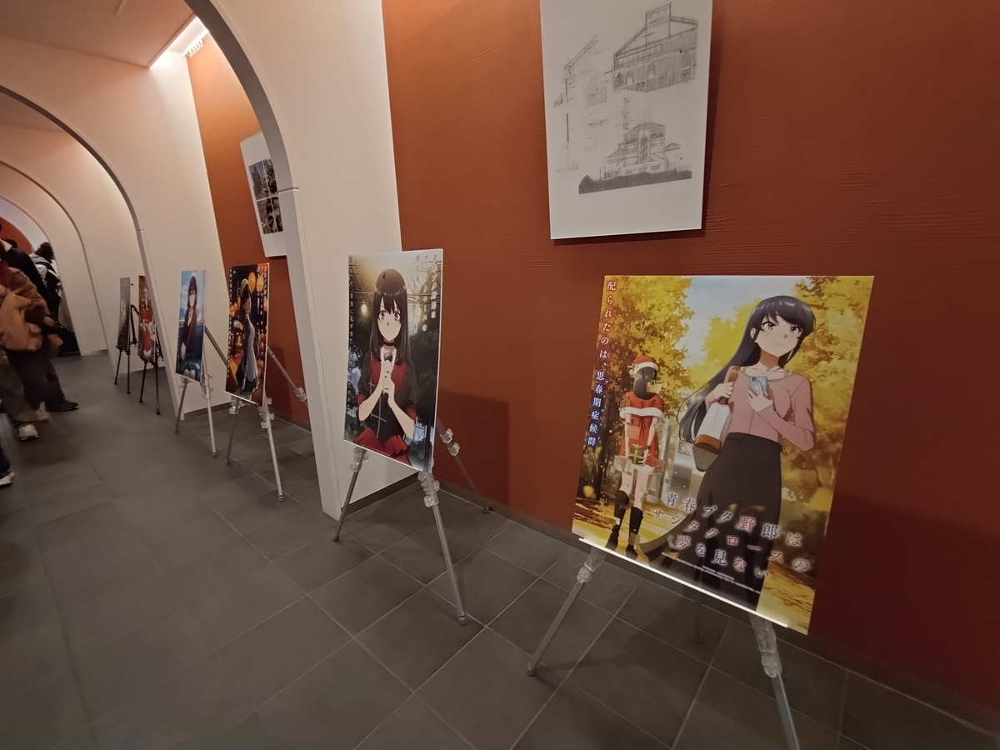
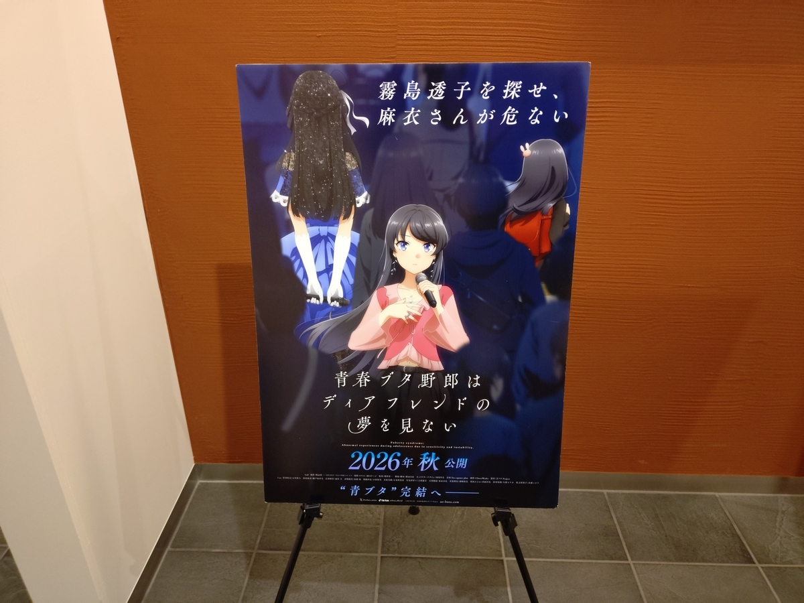

タイトル：第２２回湘南藤沢フィルム・コミッションフォーラム「アニメ『青春ブタ野郎シリーズ』と藤沢の魅力」レポート

日時：２０２６年２月２１日（土）１４：００～１５：００

場所：Ｆプレイスホール（藤沢市藤沢公民館・労働会館等複合施設）

登壇者（敬称略）：鴨志田一（原作）、奈良駿介（アニプレックスプロデューサー）、宮川浩子（フリーアナウンサー、聞き手）。なお、参加予定の石川界人は急病につき欠席。

## 所感

石川氏の急な欠席にもかかわらず、全体を通して和気藹々とした雰囲気で進行した。

個人的に印象に残ったのは、藤沢の良さについて**プロデューサーの奈良氏が「爽やか」と繰り返していた**点。青ブタのアニメをきっかけに、私自身も藤沢にはかなりの頻度（四半期～半年に１回のペース）で来ているため、非常に共感できた。ビル群の東京にはない、開けた雰囲気が藤沢にはある。奈良氏はその爽やかさを指して「抜け感（＝ロケーションの向こうが見えている感）」と呼んでいた。**藤沢には、太平洋のまっすぐな水平線や、上下のある江ノ島、藤沢駅など、確かに視覚に訴える美しさがある。**

大学生編の原作については思うところがあったのだが、アニメは奈良氏を始めとした制作陣の尽力もあり、「いや、大学生編も、こうやって表現されるなら悪くなかったんじゃないか？」と思い直すところまで来ている。

アニメ製作スタッフ、藤沢市の関係者の方々に感謝したい。

## ０．二見将幸（藤沢湘南フィルム・コミッション委員会　副会長）からの挨拶

**２００人の枠に対して１２００人近い応募**があった。当選してここにいる皆さんはラッキーだ。藤沢市に生まれ育ち七里ヶ浜高校を卒業した自分としては、青ブタで母校が舞台となったことは嬉しい。

## １．アニメ『青ブタ』の放送を終えて

### Ｑ１．放送を終えて？

鴨志田：
**大人になった咲太、麻衣が嬉しい。**
キャラクターの描き方、複雑性が上がったことが伝わるかどうかが気になっていたが、伝わったようだ。特に、声優の演技、作画等が、高校生編の「青い」感じから「淡い」感じになった。

奈良：
「ミステリ色」が増した。高校生編の爽やかさから変わり、大学生編ではおどろおどろしさの演出、怖い画面の作り方をすることで、**爽やかさと緩急を付けた。**

### Ｑ２．「ここを気にして見て！」というポイントは？

奈良：
**台詞、言い回しの大人っぽさ**に注目して欲しい。例えば、郁美と咲太の会話に注目するとキャラクターの深みがわかる。

### Ｑ３．大学生編では物語のロケーションが藤沢から横浜まで広がった。意識して巡った場所は？

鴨志田：
<strong>藤沢に住んでいる方は藤沢が好き。</strong>観光客が多い街でも「和」を持っている。その気持ちはキャラクターの中にもあると思って描いた。

奈良：
**「キャラクターが現実にいる」という描き方**に注力した。また、さっぱりとした空気がいい。

### Ｑ４．ロケハンについて

奈良：
いっぱい歩いたし、「フィルムコミッション」に協力頂いた。また、原作でもロケーションが鮮明に描かれていた。

鴨志田：
ロケーションは決め打ちして描いていた。

奈良：
２０１８年に放映のアニメなので、ロケハンは２０１６年、２０１７年に行った。このため、２０１７年時点で行われていた藤沢駅のデッキの改修工事よりも前の写真を行政からもらった。

鴨志田：
藤沢の歴史を残すアニメになっただろう。

宮川：
当時はデッキには噴水があった。

### Ｑ５．藤沢ならではの魅力とは？

奈良：
空気感。爽やかさ。ロケーションの「抜け感」。抜け感とは、ロケーションの向こう側が見えている感。**映像はロケーションの良いところに引っ張ってもらえる。藤沢ならではのロケーションだった。**

鴨志田：
アニメを観て、足を運んで、二度楽しんで。

宮川：
行政との協力は？

奈良：
大学生編のアニメが始まった２０２５年の夏のタイミングでデジタルスタンプラリーを行った。これが大きかった。その時の空気が伝えられるし、身近に感じてもらえる。

## ２．お題トーク

### Ｑ１．「このキャラとはここに行きたい」という藤沢のスポットは？（大学生編の３人について）

奈良：
**（赤城郁美と）新江ノ島水族館。**
郁美のことは好きだけれど、ノリとか勢いとかで生きてきた自分とは違って、郁美は知性があるから会話が続かなさそう。会話より見て回る方がいい。また、江ノ島も考えたが、無言になってしまいそうだ。

鴨志田：
**（岩見沢寧々と）クラフトビールのブルワリー巡り**
２０歳以上のヒロインなのでそういうデートができる。拓海と行ってね。「一口ちょうだい」的なイベントがあったり、ハシゴしたり。

奈良：寧々はアルコールに強そうだ。

鴨志田：強いか弱いかどちらかだろう。いずれにせよ、拓海は振り回される。

石川（代読）：
**（姫路紗良と）藤沢市総合市民図書館**
奈良：紗良は外に遊びに行きたそうだが、石川さんが本好きなので本の話をしたいのかも。

鴨志田：自分だったら図書館では息が詰まるので図書館には行けないが、むしろ図書館だと距離を保てるのかも。

### Ｑ２．サンタクロース編で印象に残っている台詞は？

奈良：
**（赤城郁美）「どうすれば何もできなかった嫌いな自分を忘れられるの？」（７話より）**
共感できる。自分は高校・大学では適当にやれなかったけれど、大人になってようやくできた。郁美はまだ適当をできないから、昔の自分を見ているようだ。郁美役の山根さんにも共感してもらえた。

鴨志田：
サンタクロースのハイライトとなる台詞。自分も印象に残っている台詞の選択肢に入れていたが、被るのでズラした。

鴨志田：
**（梓川咲太）「福山になかったら、たぶん誰にもない。だから、しゃんとしろ」（１３話）**
石川さんと話すために選んだが欠席されてしまった。この一連の男同士のシーンは、青ブタでは珍しい。国見はできすぎていて、こういう横並びの話はできなかった。拓海が思春期症候群になったことで、咲太と横に並んで話すシーンになった。

石川（代読）：
**（桜島麻衣）「私と咲太が付き合っているのは、ふたりで幸せになるためよ」（１０話）**

奈良：
石川さんは麻衣が好き。本音でぶつかっている感じが人として優れている。この台詞は性格が出ていて、言われた咲太役の石川さんなら喜ぶだろう。

鴨志田：
フリとしてランドセルガールでも出ていた台詞だったが、咲太が郁美に言い、麻衣もこうだろうな、と。石川さんに刺さって良かった。

## ３．参加者からの質問（ランダムトーク）

### Ｑ１．アニメ製作で良かった点、大変だった点は？

奈良：
映像をやる監督、演出の方が大変だっただろうが、**自分は新エンディングテーマ「水平線は僕の古傷」が大変だった。**「不可思議のカルテ」が愛されていた中で、それとは別の大学生編のヒロインを示したかった。fox capture planと作詞家の方と相談した。何度もリトライ、議論で苦労した。**フルバージョンで聴いてほしい。**

鴨志田：
**良かったのは、霧島透子の曲を聴いてもらえた**こと。大変だった点では、アニメを作るのはアニメの製作の方なので自分は大変ではなかった。ただ、**大学生編の原作ができていない状況で「大学生編のアニメを作る」と言われた時はヤバいと思った。**

### Ｑ２．牧之原翔子の「「ありがとう」「がんばったね」「大好き」を大切にして生きていく」という台詞はどうやって考えた？

鴨志田：
その台詞が読者の胸に落ちるものがあるのだとしたら、<strong>元から読者にあったのが言語化されただけ。</strong>翔子について「もしも１５歳から先を生きられないとシミュレーションした時、<strong>将来なりたいもので答えるのは職業ではなく、なりたい人だろう」</strong>と想像した。

### Ｑ３．青ブタの舞台の多くは海側にあるのにバニーガールと出会ったスポットとして湘南台側（北側）にある藤沢市総合市民図書館を選んだのはなぜ？

鴨志田：
元は北側も使うつもりで、その入口として藤沢市総合市民図書館を選んだ。しかし『Just Because』が山側だったので被りを避けるために海側になった。

### Ｑ４．聖地でおすすめのスポットは？

奈良：
また行きたいのは**江ノ島小屋**。時間があったら毎回行ってる。かきあげが美味しい。

鴨志田：
**鵠沼海岸の花火**。

## ４．プレゼントタイム

３名にポスターがプレゼントされた。

## ５．映画について

鴨志田：
ポスターの「２０２６年秋公開」の「秋」の文字が大きくなった。
また、完結が近付いたことについて、２０１４年からの作品なので「そろそろ良かろう」と。作品の最後を一緒に迎えてね。

## ６．降壇の挨拶

奈良：
アニメが完結するが、１０年近くかかわっている中で、監督始めメインスタッフも同じく感慨深いだろう。良いものにできると確信している。藤沢でも取り組みをしていく。

鴨志田：
めでたく完結できたのは、読者と藤沢のおかげ。『ディアフレンド』でも藤沢の景色を感じてね。

## おまけ

（以上）
