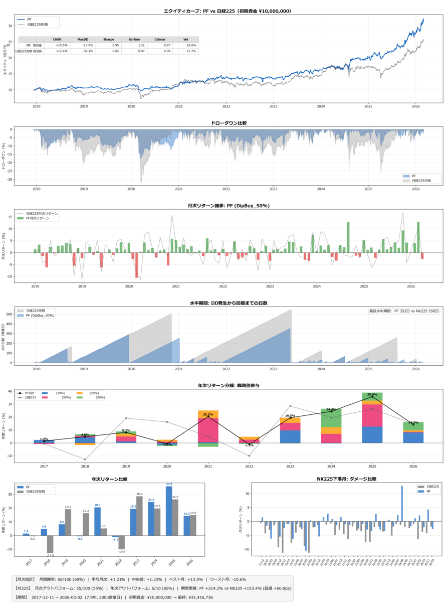

ゼエハア、今度こそトレーディングシステム「聖杯」がさらに正しくなったはず……と確信を持てたので洞察をまとめます。

## 目次

1. メタ戦略：信じ続け、疑い続け、学び続ける。
2. 市場原理：サイクルは消えないし、アノマリーは残る。
3. 市場原理に適応したシステム：「なぜ効くか」を説明できるか。
4. システムのためのトレーディング心理：他者を利用し、自分を制御する。
5. トレーディング心理の土台：私の拠り所、リスク／リワード分析。
6. アセットアロケーション：ひとつでは足りない。
7. トレード戦略：どのアノマリーを使うか。
8. 売買ルール：これが最後。
9. まとめ：逆だぜ。

## １．メタ戦略：信じ続け、疑い続け、学び続ける。

みなさんはトレーディングシステムを作るとき、何から始めますか？　というか、作ろうと思ったこと、ありますか？

どんなパラメータ？　どんなオシレーター？　どんなエントリー条件？　どんなイグジット？　**どんな売買ルール？**　私もそいつらを追究していました。で、６０回くらい失敗して「聖杯」のなり損ないである「泥」を作り続けました。ようやく７０回目くらいから、**トレーディングシステムとは売買ルールの束ではない**と気付きました。いまも泥だらけですが。ここに至るまでに捨てた売買ルールは９０を超えます。

さて、これまでのエントリではＶＣＰやバックテストの話をしました。今回は具体的な手法の話は一切しません。もう少し上のレイヤーの話をします。

このエントリを書くこと自体が、私のメタ戦略です。自分のシステムがどんな信念に基づいているかを言語化し、確認し、必要なら修正する。システムは完成しない。信じ続け、疑い続け、学び続ける。このエントリは、その確認作業の一部です。



これは私の「聖杯」のバックテストと分析結果です。運用成績の代わりとしてここに載せます。

## ２．市場原理：サイクルは消えないし、アノマリーは残る。

市場にはサイクルがあり、アノマリーがあります。

サイクル。蓄積→上昇→分配→下落。ワイコフが定義した四ステージは、２０２６年の今日も変わらず繰り返されています。

なぜサイクルは消えないし、アノマリーは残るのか。

効率的市場仮説（ＥＭＨ）は、ほとんど正しいのでしょう。公開された情報は瞬時に価格に織り込まれ、簡単に搾取できるアノマリーは長続きしない。しかし「ほとんど」であって「完全に」ではない。**構造的な非効率が残る。**

私は、非効率が残る理由は二つあると考えています。

一つ目は、**どのプレイヤーも自分の資金規模に応じた最適戦略しか取れない**こと。

大口機関投資家（スマートマネー）は流動性リスクの高い小型株に大量の資金を投じられないし、個人投資家はＨＦＴ等のインフラを持てないしマーケットメイクもできない。みんな好き勝手に動いているわけではなく、自分たちの構造的な制約の中で合理的に動いている。その合理性の隙間に、俺らがつけ込める歪みが残る。

二つ目は、**人間は群集心理から逃れられない**こと。

上昇局面では過熱し、下落局面ではパニックに陥る。これも消えない。奴らは人間だから。システムがあったとしても、それを動かしているのは最後は人間だから。

この二つがサイクルを駆動させる理由であり、そしてサイクル、アノマリーが消えない理由でもあります。サイクルは偶然ではなく原理です。だからこそ、トレーディングシステムはこの原理から出発すべきだと私は考えています。

## ３．市場原理に適応したシステム：「なぜ効くか」を説明できるか。

これまでのエントリで「信念」という言葉を使ってきました。今回はもう少し踏み込みます。

私がシステム作りで最も重要だと信じているのは「そのシステムのロジックは市場原理から導かれるものであるか」という点です。言い換えると<strong>「なぜ効くか」を市場原理に基づいて説明できるか</strong>。

ここで言う<strong>「システム」とは売買ルールの束のことではありません</strong>。戦略の選定からリスク管理まで含む、運用の枠組み全体のことです。

機械学習で作られた売買ルールを否定はしません。それで成果を出している人はいる。リスペクトしています。ただ、私には使えない。なぜなら、市場原理から導かれないエッジはアルファの減衰が早いと信じているからです。市場の構造が変わった時に「なぜ効くか」を説明できないシステムは、「なぜ効かないのか」も説明できないから。

最初の失敗について。

私が最初の「聖杯」を作り始めたころ、パラメータをちょちょっと作ればそれで済むと思っていました。出来高の閾値の変えてみたり、その他の様々なパラメータを調整してみたり。３０回くらいそれを繰り返して、ようやく気づきました。パラメータの問題じゃない。そもそも「なぜこのルールなのか」に答えられていなかった。というか、システムではなく、個別の売買ルールでしかなかった。

ところで、そんな阿呆だったのにブログでご高説を垂れていたことを、私は別に恥じません。これも学習の一環だから。このエントリもきっといつか過去になるだろう。だが、今じゃない。

## ４．システムのためのトレーディング心理：他者を利用し、自分を制御する。

さて、トレーディング心理には二つの面があると思っています。

一つ目は、**他者の心理を利用する**こと。

普通の個人トレーダーがやりたがらないことをやる。高値で買う。ナンピンしない。複数の戦略を使い分ける。気ままな裁量に任せない。すべてをシステムに委ねる。

二つ目は、**自分の心理を制御する**こと。

過去のエントリで「高市トレード」の話を書きました。ニュースを「株価が上がるか下がるか」で眺める自分が嫌になった。あれが、システムを作ろうと決めたきっかけでした。ニュースも、決算も、為替も、世界情勢も、すべてが株価になる。だって人間だもの。そうしてトレードのリターンが落ちているのを感じ、いったんクローズしてトレーディングシステム「聖杯」を作ることを決めました。自分の感情をトレードから切り離すしかない。

私にとってトレードとは、**自分に有利なサイコロでスゴロクをする**ようなものです。

サイコロ、つまり銘柄そのものに一切の思い入れを持たない。そのサイコロが自分に有利であるかどうかだけに関心がある。個々の出目（勝敗）に意味はない。十分な回数を振れば、有利なサイコロは有利な結果を返してくれる。

もう一つの失敗について。

最初に作った売買ルールに愛着が湧きすぎました。いわゆる「イケア効果」。自分で苦労して組み立てたから、客観的に見れば捨てるべきシステムを捨てられなかった。結局、オーバーフィッティングだった。

それから愛着を捨てるために、たくさん作りました。今の「聖杯」に組み込まれた４つの売買ルールのために、９０近く捨てました。たくさん作ることで一つ一つへの執着が薄れる。今では「泥」を捨てるのが気持ち良くすらある。

愛着を捨てるために多く作ってきたのかもしれない。

## ５．トレーディング心理の土台：私の拠り所、リスク／リワード分析。

じゃあ「有利なサイコロ」であることをどう確認するか。

過去のエントリで損切りから始まるリスク管理の話を書きました。今回はもう少し上のレイヤーです。

システムが「有利」であることの基準として私はプロフィットファクター（ＰＦ）、カルマーレシオを重視しています。そして、インサンプル（ＩＳ）とアウトオブサンプル（ＯＯＳ）で分割した検証、ブートストラップ法による頑健性の確認。

なぜこれが心理の話と繋がるのか。

**リスク分析を抜きにしてシステムに「身を委ねる」ことは不可能**だからです。

以前、タートルズの話を書きました。「人は、ただ他人から教わっただけのシステムに身銭を預けられるほど強くない」と。同じことが自分のシステムにも言える。十分な検証なしに自分のシステムに身銭を預けられるほど私は強くない。それを認めました。

システムへの信頼は検証によってしか得られない。

ぬか喜びの話をしましょう。

過去の聖杯、現在の泥の話です。売買ルールの検証をＩＳ期間とＯＳＳ期間に分けることすら知らなかったころの話です。ＣＡＧＲが２０%を超えて「これで勝つる！」と有頂天になっていました。しかし、実運用に入ると勝てない勝てない。検討し直してみるとパラメータ数が多すぎるし、パラメータをちょっと変えてバックテストすると利益はあっという間に吹っ飛ぶし。泥だった。

「聖杯か！？」→「泥でした……」の繰り返しです。最初はガッカリしていました。でも、何度も繰り返すうちに、ぬか喜びに気づいた瞬間に喜びを見つけられるようになった。「今日はオーバーフィッティングに気づけた」と。

この肌感覚――「オーバーフィッティングしてる」「ベストなイベントに引っ張られてるだけ」「パラメータが頑強じゃない」は、失敗からしか育たない。

**他者から与えられたチェックリストでは理解できない。たくさん作って、たくさん捨てて、初めて自分事として理解できる**。

## ６．アセットアロケーション：ひとつでは足りない。

上述のイケア効果の話。

オーバーフィッティングしていた最初の売買ルール、アイツに固執して、アイツは負け続けたんですよね。二つある売買ルールのうちの片方は勝てるのに、アイツはひたすら負け続けた。というか、上手くいったとて、どっちも日本株のトレンドフォローだから相場が良い時しか勝てねえじゃねえか。**アセット、ひとつしかねえじゃねえか**。

そこで気付いた。ひとつじゃ足りない。

みなさんも「最高のひとつがあれば勝てる」と思っているのではないでしょうか。私もそう思っていた。というか、**思ってすらいなかった**。

それは間違っている。

**アセットはいくつかあった方がいい**。

そして、それぞれの売買ルールを最適化するよりも、まずはポートフォリオの全体像を捉えた方がいい。互いに相関しないアセットを組み合わせることの方がスグにリスク／リワードに効きます。

**システムとは複数のアセットによるポートフォリオの運用であり、そこから個別のトレード戦略が書き下され、最後に売買ルールとして表現される**。順番が逆なんです。

相関させないことによって、期待値をポートフォリオレベルで実現しやすくできる。そして何より、ドローダウンの抑制。ドローダウンを小さくできるということは、上述の心理――サイコロを振り続ける心理――が安定するということでもあります。

## ７．トレード戦略：どのアノマリーを使うか。

アセットアロケーションが決まったら、各アセットクラスに対してどのアノマリーを使うかを決めます。これが「トレード戦略」です。

例えば、トレンドフォロー。群集心理のバンドワゴン効果から生じるアノマリーです。上昇局面で群集が追随し、その追随がさらなる上昇を呼ぶ。市場原理から因果で説明できる。

例えば、小型株効果。スマートマネーの流動性制約から生じるアノマリーです。スマートマネーが参入できない領域に、構造的な歪みが残る。これも因果で説明できる。

**アノマリーの選定基準は、市場原理から因果で説明できるか**。

## ８．売買ルール：これが最後。

ようやく、売買ルールの話です。

エントリー条件。エグジット条件。ポジションサイジング。

私の設計の原則は二つ。

一つ目は、変数は少ない方がいい。変数が多い＝オーバーフィッティングのリスクが高い。各変数には市場原理上の意味がなければならない。「なんとなく入れた条件」は、バックテストでは効いても実運用では効かない。

二つ目は、「幅」と「点」の二段階フィルター。長期的な状態フィルター（幅）で銘柄を絞り、短期的なタイミングシグナル（点）で仕掛ける。

まあ、この辺りは**各自で深めて**くれや。

## ９．まとめ：逆だぜ。

最後に。

多くの人は売買ルールから考え始めます。私もそうでした。売買ルールに過ぎないＶＣＰを表現できる方法を探し、パラメータを弄って、バックテストを回して……。

逆や。

**市場原理があり、システムがあり、心理があり、リスク分析があり、アセットアロケーションがあり、トレード戦略がある。そして最後に、売買ルールがある。**

最初は売買ルールからしか始められないかもしれない。私もそうでした。でも、いつかここに気づく。

逆だぜ。

それは最後なんだぜ。

（おわり）
