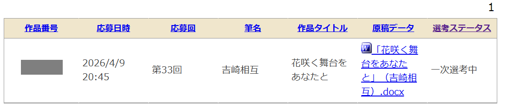

## 目次

１．２０２６年第二四半期の目標

２．２０２６年４月のまとめ

３．２０２６年４月に読んだ本（１３冊／年間５６冊）

４．２０２６年４月に聴いたジャズ（３枚／年間２４枚）

## １．２０２６年第二四半期の目標

### １．１．趣味：新人賞に応募する。

２０２５年に書いた小説（小学館ライトノベル大賞一次落ち）をリビルドして、他の新人賞に応募します。９月の小学館ライトノベル大賞が目標です。

**→△４月に電撃大賞に出しました。それ以外はなんもやっとらん。**

### １．２．健康：毎朝ラジオ体操を行い、毎夜エアロバイクを漕ぐ。

マンジャロはウソ。筋トレだけが真実。

**→△２日に１回くらい。**

### １．３．仕事：週５回『AI英会話スピーク』のレッスンを行う。

海外出張を経て、「もうちょっと英語話せた方が便利やなあ」痛感しました。とは言え、仕事のやる気が無くなっとる。どうしよう。あと、『英語のハノン』に微妙に飽きたという話もあり。

**→△４月１週目はがんばった。**

## ２．まとめ

### ２．１．身辺雑記

#### ２．１．１．体調

３月序盤からメンタルが完全にオワっていたのですが、４月２３日に目覚めると完全に復活していました。１ヶ月、暗く長いトンネルでした。この４年ほどで最も重たい１ヶ月でした。マジでこのまま沈むかと思った。

いまは<strong>「いやあ、世界ってこんなにも明るかったんですねえ」</strong>などとケロッとした顔で言っています。

#### ２．１．２．旅行

ゴールデンウィークには**静岡**に足を運んで参りました。**ライトノベル『レプリカだって、恋をする。』（以下、レプリコ）の聖地巡礼**をするという名目で、とにかくどこかに行きたかった。ついでに日本茶の新茶も仕入れました。

このエントリを書いてる時点ではレプリコの本編１～５巻まで読み終えた（短編集の６巻は未読）状況です。アニメは一切未見。

レプリコの物語の畳み方は、ある種のファンタジー・ＳＦにおけるナゾってこうあってほしいよな、という理想形でした。物語の中心的なナゾが引き起こす現象やトラブルが十分に描かれ、そして最後には全てのトラブルは解決される。しかしナゾの原因は別に解明されない。なぜなら、その解明それ自体は読者のエモーションを惹起するのには貢献しないから。という割り切りがとても良かった。登場人物に起きたトラブルは解決されるけれど世界にナゾは残り続けるし、世界は広がっている……。

繰り返しになるんですが、<strong>レプリコ、理想形です。</strong>よしざき、激賞。

その上で、今回の聖地巡礼で感じたことをちょろっと書き残しておくと、静岡駅周辺はさておき、主人公の暮らす用宗ってマジで普通の地方の漁港でしたね。こういう普通の土地で起きた奇跡みたいな出来事、物語をストレートに感動的に描くと、普通の土地に暮らす多くの読者に親しみやすさを与えるんでしょうね。

#### ２．１．３．仕事

**転職活動、はじめました。**

爆モテしてます。この調子だと５月の月報では良い報告をできそうです。

#### ２．１．４．小説

とりあえず出した、って感じですね。本当はもっと直したかった。

#### ２．１．４．聖杯・水晶玉

聖杯（個別株）：なんかすごく勝ちました。

水晶玉（指数先物・オプション取引）：なんかすごく勝ちました。

<strong>勝ちまくりモテまくり。</strong>信頼できる友人らと『ファイナンス機械学習』（マルコス・ロペス・デ・プラド）の勉強会を始めることとしました。



### ２．良かった本／良かったジャズ

#### ２．２．１．本

まあ当然<strong>『レプリカだって、恋をする。』（榛名丼）</strong>か。３巻を読み終えた後、一瞬ハラハラした（現象の「ナゾトキ」をやり始めそうだったから）んですが、クライマックスの４巻は杞憂。レプリコが売れてアニメになる世の中、良い世界なのでは？と感じられました。



あと、マンガ<strong>『絶対可憐チルドレン』（椎名高志）</strong>を全６３巻一気読みする等もしました。良かった。

『絶チル』はリア中の時に読んでたのに高校進学してからは止まってたんですが、リア高の時に読むの止めた理由も３０代になってから一気に読めた理由もなんとなく察せられて、『ＧＳ美神』よりも奥深いですね。だって、愛の話じゃん。
高校生男子って愛よりエロの方が刺さるので（悲しいかな、ヘテロ高校生男子ってそういう存在なので）、『ＧＳ美神』（しりちちふともも）の方が『絶対可憐チルドレン』（１０歳女児）よりも刺さったのってそういうものだし、とは言え、３０代になった私は流石にリビドーだけで生きてないので、スタートを分かりやすいエロ一本槍ではなく「１０歳女児を育てる」にすることでしか築き上げられない物語があるということを知っています。

もう一歩踏み込んで書けば、『絶チル』のテーマって、まさに「１０歳から手塩に掛けて育てた女児を「そういう」目で見ることができるのか」っていう話でもあったわけで、それは高校生男子には消化しづらいテーマではあるわね。そして、そのテーマを感得するには読者もリアルに年齢を重ねて男子高校生から人の親に近くなる必要があった。それこそが１７年にわたって全６３巻を続け、描き切った力です。



あと、**國宗利広の『日経平均』三部作**。この手の日本の指数に特化した尖った本で、しかも三部作（日経平均、日経平均オプション、日経平均ＶＩ）で出してくれるって、相当の好き者ですよ。ありがとう。



いまAmazonを検索して知ったけど、第一部『実践日経平均トレーディング』は全面改訂版があるらしい。読みます。



#### ２．２．２．ジャズ

４月は３枚か……。<strong>『"Four" and More』（Miles Davis）</strong>かな。

ジャズを聴けないときでも<strong>「教養としてのジャズch」</strong>見てます。いつもありがとうございます。



## ３．２０２６年４月に読んだ本

**①『米国商品情報を活用して待ち伏せする"先取り"株式投資術』（松本英毅、東条麻衣子）**
裁量トレーダーならマストリードまであると思う。何なら、もしも私が聖杯・水晶玉をやってなかったら、これ読んで大いに刺激を受けて裁量トレードしてたと思う。それくらい読み応えある一冊。
本書では、石油、大豆、コーン、ゴールドの商品情報を例に用いて、それらの価格が上下したら／上下しそうになったらどんな銘柄がどんな値動きをするかを実例とともに紹介する。米国の商品から日本の株式への影響を先取りしてトレーディングを進める本書の手法は、日本人著者によって日本語で出版された価値を感じる。
聖杯・水晶玉が既にあるにもかかわらず裁量トレーダー向けの本をこうして読んでいるのは、とにかくアイデアの手札を増やしたいからですね。これ読むまで、正直、大豆とコーンを使おうって発想なかったし（流石に石油と金属はあったが）、アイデアに刺激を加えていこう。

**②『実践　日経平均トレーディング』（國宗利広）**
タイトルに偽りなし。
「日経平均」をトレードすること一点賭けの本。我々の見聞きする「日経平均」がどのように算出され、それが現物と先物との間でどのようにトレーディングされ、他の派生商品にどのように広がっていくかを概説する。具体例も豊富で、日経平均をさわるならマストリードか。
個人的には、オプション取引に紙幅が割かれていてかなり勉強になりました。同著者による続刊『日経平均VI入門』も楽しみだ。

**③『日経平均VI入門　指数としての活用可能性と先物トレーディング戦略』（國宗利広）**
2019年刊。日経平均VI先物（くそマイナーながらそういう先物があります）がトレーダブルだったとして（板がバカ薄いのでトレーダブルではないです）、どういう出自の指数でどういう性質の商品なのかを詳説する。オプショントレーダーだったこの著者にしか書けない本ですね。
私のここ数ヶ月の「水晶玉」は、オプション取引で勝つことを目的の一つとしているのですが、本書は、その観点からだとメチャクチャにアイデアが詰まってました。特に、日経平均VI、HV、IVの計算方法をしっかり追った上で、それらの死角まで語ってくれる、というのは目から鱗。独自のボラティリティー計算方法のアイデアなどもあり、後ほどいろいろ試してみます。
いやあ、良い本ですよ。

**④『東大卒医師が実践する　株式より有利な科学的トレード法』（KAPPA）**
オプション取引の初心者向け本……なのだが、正直、ぜんぜんアカン。オプションのショート（平時は安定的に利益を出す）から解説するのだが、その最大のリスク（落ちる時は底なし）が併記されていない。バタフライ等の項でようやくわかるのだが、うーん。「科学的」と銘打っているものの、どっかの学術論文をチョチョッと参照するだけで、自身のインサイトは少ない。

**⑤『Pythonで学ぶファイナンス論×データサイエンス』（永野護）**
これから仲間内で開催する『ファイナンス機械学習』（マルコス・ロペス・デ・プラド）の勉強会に向けて、ファイナンスにおけるデータサイエンスの基礎的な使われ方を学ぶために。
ファイナンス論とデータサイエンスの両方を知ってから読んだ方が良いかな。この本がトレーディングに使えるとは思えないけどこれくらいは認識しておかないとお話にならない、そういうタイプの本。イールドカーブの算出あたりは読み応えあったかな。

**⑥『日経平均オプション入門』（國宗利広）**
オプショントレードやるなら必読か。どのような戦略を使い、どのようなトレーダーになるかについて、一種の「キャリアパス」のような章が深く書かれており、類書を見ない。私はまだ「買い」しかやったことないド素人なのだが、「売り」も入れていかないと強くなれないんだろうなあ。
「水晶玉」はメチャ単純に「コールを買え」しか言ってくれないので、オプションという広い海の浜辺に打ち寄せる波に足の指先をチョンとつけているに過ぎなくて、自由自在に使いこなせるようになりたい。

**⑦『レプリカだって、恋をする』（榛名丼）**
胸がキュンキュンするねえ。
一人称の語りの味わいが良く「言葉にしたくないけどほんのりとアイツのことがキライ」のラインを攻めるのが上手かった。

**⑧『レプリカだって、恋をする。（2）』（榛名丼）**
読みました。甘さの下に緊張感を潜ませるのうまいね。
エモーションをかき立てるの上手いし、クリフハンガーもしっかり設けられていて、とは言え、たぶん私は想定読者じゃないな、と思った。それこそ、中高生のときに読みたかったですね。

**⑨『レプリカだって、恋をする。（3）』（榛名丼）**
物語が立体的になってきたな。
テンションが上がると同時に、「レプリカ」の種明かしをやり始めるのではないかとおそれ始めてもいます。

**⑩『レプリカだって、恋をする。（4）』（榛名丼）**
いいじゃんよ……。

**⑪『レプリカだって、恋をする。（5）』（榛名丼）**
レプリコ本編、完読です。
救いがあっていいお話でした。掛け値なしに。スッと差し込まれた何某の姉の話なんか、心底良い手つきだと思う。
レプリコ、思春期の悩みって当事者には世界の全てだが、ちょっと遠くから眺めてみればありふれた悩みでもあるというものだが、そういうものとしての「レプリカ」の描き方が超絶良かった。

**⑫『高速取引　株式市場にAIがもたらすマーケット・インパクト』（水田孝信）**
「AIが操作する高速取引（HFT）は市場に流動性をもたらす」と言われているが、実態としては、平時には流動性をもたらす一方で（平時以上に流動性が必要とされる）緊急時には枯らすことも知られている。なぜなら、HFTのためのAIの学習に用いられる取引データは、平時でさえ不足気味である上に、緊急時のものは全く足りていないため、安全側として資金を引き揚げざるを得ないためである。（ここまで前提知識）
その上で「安全側として資金を引き揚げざるを得ない」とは何故か、に踏み込んだのが本書と言える。HFTの戦略には、マーケットメイク戦略（流動性をもたらすとされるもの）とディレクショナル戦略（枯らすとされるもの）が挙げられる。ディレクショナル戦略では、板情報に基づいて株価が上下する方向に賭けることで利益を上げる。その戦略は（学習データの多い）平時にのみ機能するものであるため緊急時には停止する。加えて、HFT業者の取引の7割がディレクショナル戦略とのこと。
流動性は、今後より一層、緊急時には枯れるのだろう、と想像される。
トレーディングに直接役立つ訳ではないが、HFTの解像度をグッと上げてくれる一冊だった。

**⑬『ETF大全』（野村アセットマネジメント）**
類書はないが、個人トレーダーよりも機関投資家向けか。直接の役には立たなそうでした。

## ４．２０２６年４月に聴いたジャズ

**①『Lee Morgan Live at the Lighthouse』（Lee Morgan）**
3時間のライブ盤。いいね。

**②『BaRcoDe』（Ban Wendel）**
しばらく前に聴いていたけど記録忘れ。

**③『"Four" and More』（Miles Davis）**
マイルス・デイヴィスのリーダー作をじっくり聴くのは久しぶり。私の「ジャズ聴きたいな～」の気持ちを完璧に満たしてくれた。傑作。

（おわり）
