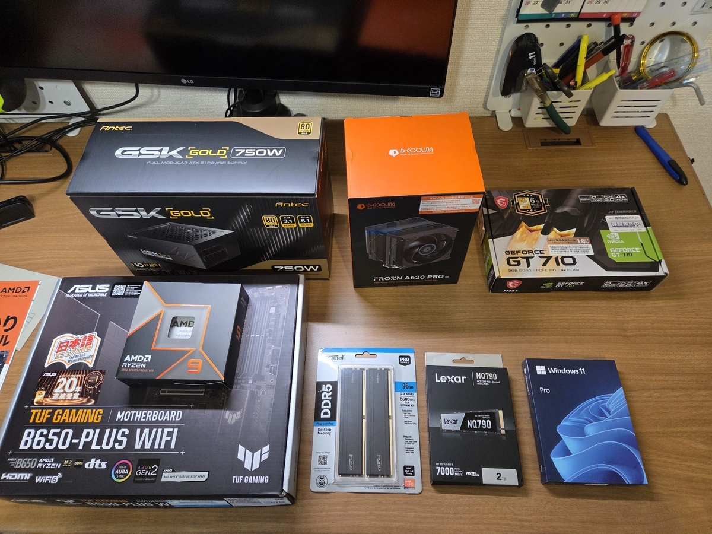

どうも、よしざきです。

タイトルの通りです。

## １．読んでよかったもの

### １．１．小説

#### 『さよならピアノソナタ（１）』（杉井光）

「参考になるから」と勧められて読みましたが、途中から普通に読み耽ってしまいました。
さて、テクニカルな話をすると<strong>「読者が明るくない題材をどう料理するか」</strong>という観点で読みました。
**①専門用語を普通に使ってもいい**
**②その代わり、続けて、直後に比喩で解説してイメージを膨らませる**
**③解説の聞き手は必須**
の3点ですね。
①は地の文（あるいは一人称視点）の問題だから書きながらどうにかできるとして、②と③は構成（書く前にどうにかする）の問題ですね。つまり、専門用語を解説できる一人称であると同時に専門用語を（読者にも分かるレベルに）喩えられる人物である必要がある。そして、どうしたら解説を実装できるかと言うと、聞き手が要る。聞き手は、単に教室のモブでもいいし、主要人物が持ってる知識の濃淡の差を使ってもいい。後者の方が私は好みかな。
まとめると、読者が明るくない題材の専門用語を解説するためには、そのための聞き手が要って、（私の好きなやり方で）聞き手を実装するためには、キャラクター間に情報の差を設ける必要がある、となりますね。
勉強になりました。前回の自分の小説の反省をすると、主要キャラクター間の情報の差が小さすぎた（ゆえに、聞き手を実装できない）という課題があったな。
前回の自分の小説の反省をすると、主要キャラクター間の情報の差が小さすぎた（ゆえに、聞き手を実装できない）という課題があったな。その観点でさらに考えると、『さよならピアノソナタ』でこの構図を成立させられた背景には、読者はロックかクラシックのどちらかは少なくとも聴いたことはあろう（ゆえに少しくらいイメージできるだろう）という前提がありますね。
マイナー競技だと、この前提をどうやって成立させるかが腕の見せ所になるでしょうね。要するに、マイナージャンルの中でのサブジャンルを素直に使っても解説には足りなくて、<strong>読者の知識と接続されている可能性の高いサブジャンル（あるいは別ジャンル）</strong>でどうイメージさせられるか……という。



### １．２．実用書

#### 『踊るのは新しい体』（太田充胤）

とても興味深く読みました！
書名の『踊るのは新しい体』に偽りなく、それを「踊る」「新しい」「体」と分解し、それぞれ論じながら互いを行き来する。その具合が良い意味でルーズで、読みながら発想を広げてくれました。
私は身体表現を用いる人々の小説を書いていて、その観点からだと、踊る人々の様々な有り様が記されているのが勉強になりましたね。踊る人々とは、従前そうだったようなダンスの訓練を受けた人々に限られず、それこそTikTokユーザのようなフツーの人々にも開かれている。一方には従来のダンサーのように、踊るための規範の体系（ダンスのジャンルや、ムーヴや、そういうもののデータベース）を拡げる人々がいる。他方には、フツーの人々がいて、彼らが踊る理由は、規範の体系を順守することそのものへの喜びのため、という構図（もちろん両者は対立する構造ではなく、グラデーションがある）は本書が新たに開いた地平な気がする。
本書はまさにその、**踊ることにまつわるグラデーションがどのように広がっているのか**、を論じた一冊でした。
恵投頂いた本でしたが、大変に良い本でした。ありがとうございました。



### １．３．トレーディング

#### 『ファイナンス機械学習』（マルコス・ロペス・デ・プラド）

まだ読みさしながら、**これから１、２年で読むトレーディング本の中で最も価値ある一冊になる**でしょうね。信頼できる友人らと勉強会を開いて、少しずつ読み進めています。本書は米国市場のデータを元に書かれている（つまり、Ｓ＆Ｐ５００のデータを前提にしている）んですが、私たちの勉強会の特徴は日本市場のデータを使っていることです。ざっと検索した限りでは、本書を日本市場のデータでスタディしている方々は公開インターネットにはいらっしゃらなかったですね。

さっそく本書を応用してデイトレシステムも作れたりもしたので、既にペイした感はありますね。



## ２．聴いてよかったもの

### ２．１．ジャズ

#### 『isles』（池本茂貴, isles）

ラージアンサンブルの音の厚みを楽しませてもらいました。私はピアノトリオを好んで聴いているんですけど、今年は幅を広げていきたい。そう思いました。気持ち良いので[聴いて](https://www.youtube.com/watch?v=StvkvOlW_0s)ね。

### ２．２．その他

#### 『Angels On The Dancefloor』（tofubeats）

新譜！

踊れる！！！

## ３．買ってよかったもの

### ３．１．ガジェット

#### 自作ＰＣ

つよいやつ。日常における待ち時間（計算時間）をとにかく短くしたくて。これのおかげで平日夜を有意義に使えているし、いい買い物しました。

ＣＰＵ：AMD Ryzen 9 9900X 12-Core Processor

メモリ：96GB



### ３．２．飲食物

#### **内堀醸造のりんご酢**

まろやかに甘い。人工甘味料っぽさがなく、マジで美味い（炭酸水で割って飲んでる）が、マジで高い。普段はもっと安いの飲んでます。



### ３．３．その他

#### Fullicon　ピルケース

毎日、薬とサプリを大量に飲むため。１週間に１回、５分ほどかけてこれに詰めるだけでその週の手間を完全に省ける。素晴らしいアイテムです。



下半期もいいものを読み、聴き、買いましょう。

おわり
