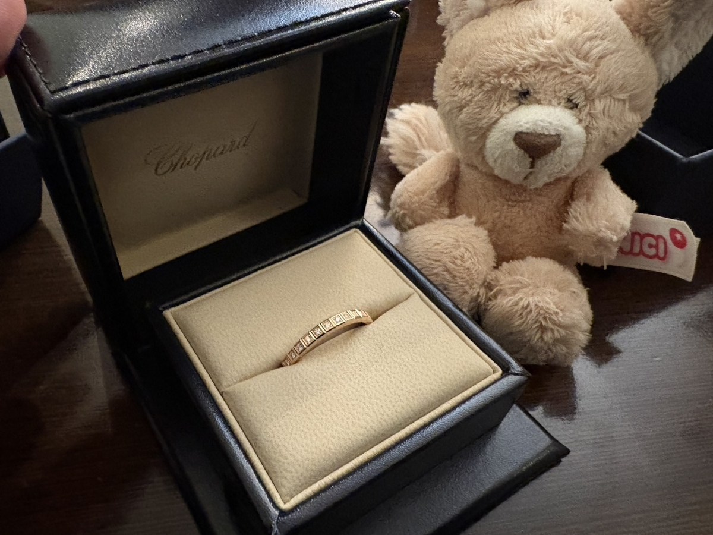
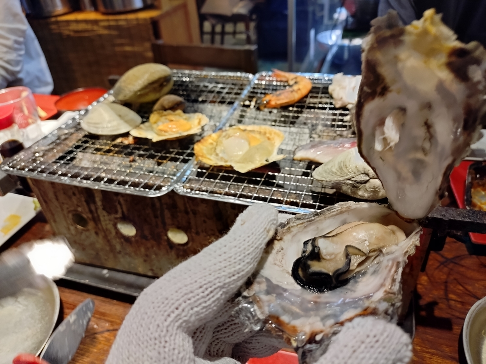
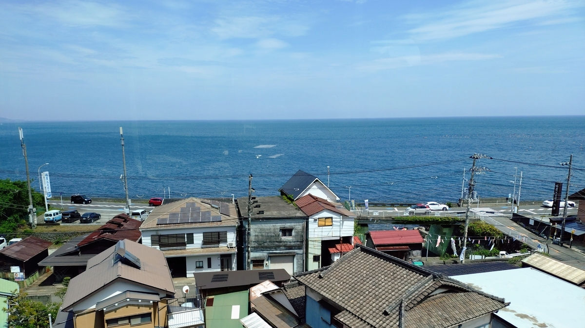
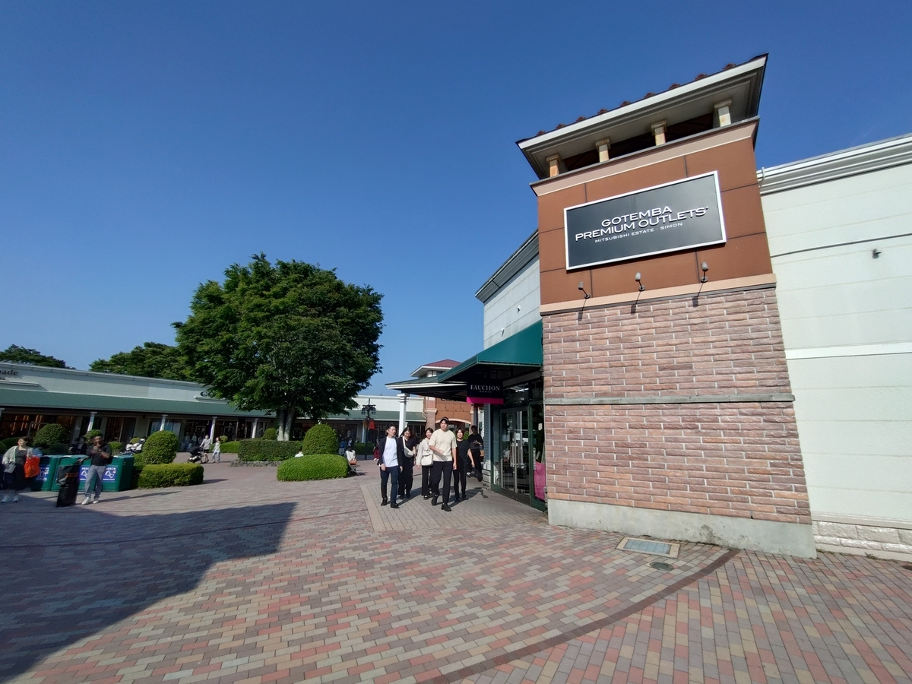
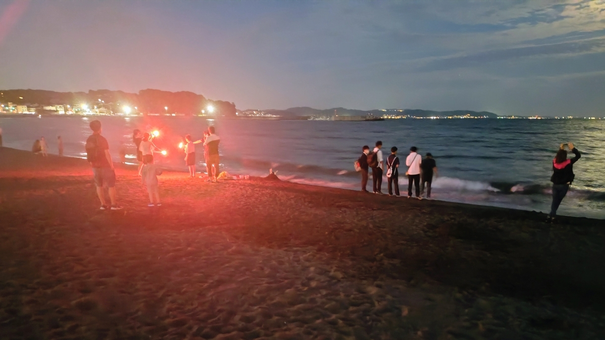
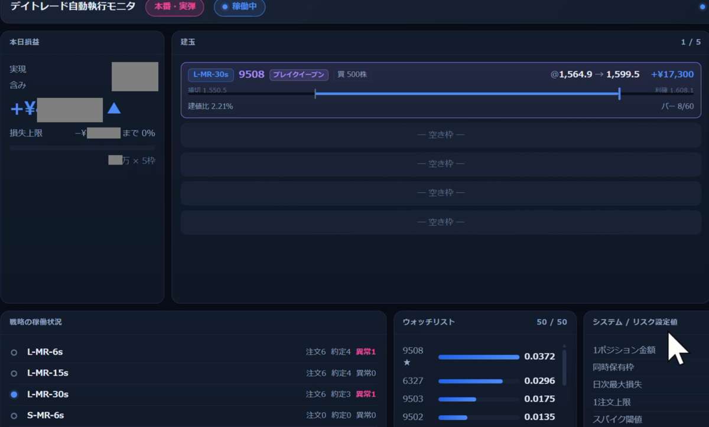

## 目次

１．２０２６年第二四半期の目標

２．２０２６年５・６月のまとめ

３．２０２６年５・６月に読んだ本（１０冊／年間６６冊）

４．２０２６年５・６月に聴いたジャズ（２枚／年間２６枚）

## １．２０２６年第二四半期の目標

### １．１．趣味：新人賞に応募する。

２０２５年に書いた小説（小学館ライトノベル大賞一次落ち）をリビルドして、他の新人賞に応募します。９月の小学館ライトノベル大賞が目標です。

**→×ダメや……。**

### １．２．健康：毎朝ラジオ体操を行い、毎夜エアロバイクを漕ぐ。

マンジャロはウソ。筋トレだけが真実。

**→×アカン……。**

### １．３．仕事：週５回『AI英会話スピーク』のレッスンを行う。

海外出張を経て、「もうちょっと英語話せた方が便利やなあ」痛感しました。とは言え、仕事のやる気が無くなっとる。どうしよう。あと、『英語のハノン』に微妙に飽きたという話もあり。

**→×終わり……。**

## ２．まとめ

### ２．１．身辺雑記

#### ２．１．１．家族

素敵な指輪を贈りました！　結婚５周年という名目です。

当初は、石の数のもうちょっと少ないやつを考えてた（予算の都合から）んですが、↑の写真のやつと並べたら、「ン！　石が多い方がいい！！！」ってなったので……。予算を大幅に超過しました。**でも、似合ってたのでＯＫです！**

#### ２．１．２．旅行

ゴールデンウィーク（もう２ヶ月も前ですね……）には、大学の同期連中と**神奈川は早川で海の恵み**を味わって参りました。こうしてみると、卒業から１０年近く経っても遊んでくれる縁が繋がっているというのはありがたいことです。７月には家族も交えて大学の同期連中とピザを食べてきます。

５月には他には、**御殿場アウトレットモール**で仕事着のポロシャツを大量に買い込み。家族はissei miyakeを買ってました。真っ黄色のポロシャツにブルージーンズを合わせたところ、「アメリカのホームドラマに出てくる配管工」みたいな格好になりましたがセーフです。

あとは、夜の**江ノ島**近辺にまた出かけたり。夜光虫が湧いたらしいんで夜に遠出したんですが、結局お目にかかれず。でも、花火を振り回すキッズがいたから全部オッケーです。太平洋側の浜辺ってこんなに美しいんだ。

#### ２．１．３．仕事

**転職活動、終わりません……。**

最終までは進んだりしたものの、ファーストウェーブは爆死。セカンドウェーブの６月はつんつるてん。７月に入ってからまた盛り返してきていますが。いつ決まるんや……。

#### ２．１．４．小説

なんも手つかずや。７月１０日ごろに電撃の一次発表ですね。９月末の小学館ライトノベル大賞は、転職で有休大量に取得してそこで一気に直すしかねえな……。

#### ２．１．４．聖杯・水晶玉

聖杯（個別株・ウィークリー）：勝ったとはいえ、さすがに相場とともに陰ってきたか。
水晶玉（指数先物・オプション取引）：同上。
ミュウツー（個別株・デイトレ）：ローンチ！！！

『ファイナンス機械学習』（マルコス・ロペス・デ・プラド）を信頼できる友人らと読みつつ、<strong>個別株のデイトレシステム〈ミュウツー〉を作り上げました。</strong>７月に入ってからですが、動作も安定しております。

〈ミュウツー〉とは、私が自力で見つけたアルファである〈ミュウのまつげ〉を遺伝的プログラミングで進化させたためにそのようなネーミングになりました。７月のClaude Fable 5がブラッシュアップしてくれたやつでいったん完成形かな。次のアルファを探しに出かけます。

さておき、ネーミングはアイロニカルなものになるように心がけていて（**メメントモリ！！！**）

〈聖杯〉：泥まみれになる。
〈水晶玉〉：割れて粉々になる。
〈ミュウツー〉：逆襲する。

といった感です。

ローンチ直後の６月は毎日のように〈ミュウツーの逆襲〉があり、実弾で試験運用していたものですから**損失もすごかった**んですが、７月に入ってから彼らを〈平定〉し、安定的に利益を出してくれています。

#### ２．２．１．本

<strong>『ミステリが最強の文芸である　"世界でいちばん"のトリック技法』（杉井光）</strong>かな。実作に紐付いた解説が豊富。こういうの読むと「書かなきゃ！」ってなるんですが、書けてないねえ……。



#### ２．２．３．ジャズ

５・６月は２枚か……。忙しくて腰を据えて聴けてないって感じですね。主にマイルス・デイヴィスかキース・ジャレットを流し聞きしていました。

## ３．２０２６年５・６月に読んだ本

**①『ミステリが最強の文芸である　"世界でいちばん"のトリック技法』（杉井光）**
小説の書き方について「ミステリ」（＝伏線）からアプローチした一冊。
「杉井、アンタまだ「出し惜しみ」あるやろ！！！」と思いながら読みましたが、とは言え、微に入り細に入り具体的で勉強になりました。特にいわゆる「伏線回収」に関するテクが手広く紹介されているのはありがたい。
・とにかく手数を多く
・伏線の手数のジャブで読者のガードを下げたところで本命の感動のストレートを入れる
・伏線回収ー感動ー伏線回収、のサンドイッチだと気持ちええ
・無理筋でも通る
あたりか。
具体例として本書はサンプル掌編を掲載しているのだが、とにかく手数の多さには目を見張った。読み流される前提でとにかく数と、意味ある情報を意味ある順序で置く大切さか。
あと、いわゆる「解説役」やね。
伏線を伏線として維持する（つまり、伏線は真相への仄めかしとして機能させつつ真相それ自体は明らかにしない）ためには、解説役はある程度は賢くと同時にある程度は愚かでなければなさそうだ。このバランスって意外と大事かもな。俺なんかは、手数について厳選してしまうので、もっと出し惜しみなしで、というか、ジャンクな情報込みで畳みかけた方がいいんだろうな、などと感じた。

**②『1日でできる！SPI3頻出問題集』（就職対策研究会）**
やったけどウェブテストはSPIじゃありませんでした……。

**③『kotoba 2026 Spring Issue No.63 あの人の読書習慣』（集英社）**
石破前首相と町田樹のインタビューを読みたくて。石破が三島好きなの味わいある。町田は内向的な青年時代、個人競技のプレイヤーとして自分と向き合う際に、好きな小説の登場人物だったらどうするかを想像しながら自己対話をしたとのこと。

**④『バーンスタインのデイトレード入門』（ジェイク・バーンスタイン）**
2003年刊。さすがに古い。とは言え、経験知的なアイデアも。高値／安値のそれぞれの移動平均とそのブレイクアウト、マーケットオープンからのN分始値／終値を支持線／抵抗線として使う、RSIを変数として他の関数に入れてみる、ギャップアップ／ギャップダウンの有用性。デイトレードの利益の源泉はボラティリティにある。それをどう引き出すか。

**⑤『データ駆動科学入門』（伊藤聡・赤井一郎）**
トレーディングのために誤差少ない株価変動モデルを作るために。
パラ読み。こういう概念があると知っておくのが大事な系の教科書。LASSO法でアルファをいい感じに設定してやればそれだけで誤差を小さくできるかと思っていたが（流石に舐めすぎだが）、思っていたより遙かに高度な操作で気絶しました。結局、説明変数をどう定義してあげて、どう重要度を振ってあげるか次第だと感じたのだが、それって高度にドメイン知識が必要なんですよね……。

**⑥『ボリンジャーバンドとMACDによるデイトレード　世界一シンプルな売買戦略』（マルクス・ヘイトコッター）**
タイトルの通りです。「PowerX」という名前のついている戦略らしい。部品取りのためにササッと眺めました。とりあえず試してみます。
→ササッと試したらむしろランダムで売り買いするよりも悪かったです……。

**⑦『VWAPトレード入門　出来高分析を習得すれば、仕掛けも手仕舞いもわかる』（トレーダー・デール）**
うーん。裁量型のデイトレーダー向けだと思うが、うまくいったトレードのチャートをチェリーピッキングしましたといった印象。

**⑧『価格帯別出来高を使ったサポレジトレード』（岩本祐介）**
基本的にチャートを読む裁量トレーダー向け。VWAP、VWMA、出来高デルタはいろいろ試してみよう。特に出来高デルタ。

**⑨『デイトレード』（オリバー・ベレレス、グレッグ・カプラ）**
心構え本。2000年の本で、まあ、何もかも牧歌的ですね。シストレには別にいらない本でした。

**⑩『22年版　板情報とチャートでデイトレに勝つ！』（東田一）**
エピソード的・定性的。シストレのアイデアにはならんかな。

## ４．２０２６年５・６月に聴いたジャズ

**①『Around the World with U』（Ulysses Owens Jr.）**
リーダーはドラムのユリシーズ・オーウェンス・ジュニア。リーダーは40代だが、他のセクション若手のショーケースとなっているらしい。ホーンセクションが伸びやか。こういうオーセンティックなジャズが2026年にも出続けるのって、文化ですよね。

**②『Newport Jazz Festival 1958』（Miles Davis）**
マイルス・デイヴィス100周年イヤーなので、彼の音楽をもっと聴こうと思い。

おわり
