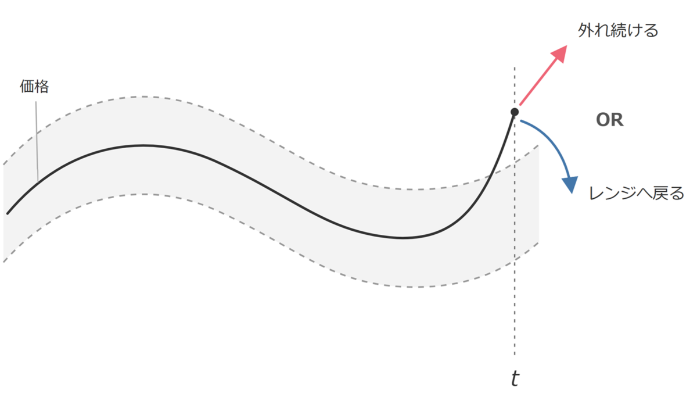

友人がトレード戦略を作るのに苦労しているので、私の戦略作りの四つの原則を書きます。

## トレード戦略の第一原則：どっちに賭ける？

**値動きが平均的なレンジから外れた瞬間、レンジから外れ続ける方に賭けるのか、レンジへ戻る方に賭けるのか？**

テクニカル指標を用いて統計的に勝ちに行く戦略は、この二つに大別されるはず[^1]。

|  |  |  |  |
| --- | --- | --- | --- |
| **賭ける方向** | **呼び方** | **賭けている現象** | **例** |
| **レンジから外れ続ける** | トレンドフォロー（順張り） | 情報の浸透速度の差、群衆の追随 | ブレイクアウト、モメンタム |
| **レンジへ戻る** | ミーンリバージョン（逆張り） | 過剰反応の修正、流動性の提供への報酬 | 押し目買い、ペアトレード、落ちるナイフ |

ＡＩに考えさせると指標[^2]とかロジックとか無限に考えてくれるのだが、その前に、自分がどっちに賭けるか決めないといけない。これなしに指標とロジックを弄り始めると迷子になる。まずどっちに賭けるか決める。

## トレード戦略の第二原則：どれくらいの時間で賭ける？

**「レンジから外れ続ける／レンジへ戻る」は、どれくらいの時間で発生するのか？**

時間軸によって支配的な力が変わる。

|  |  |  |
| --- | --- | --- |
| **時間軸** | **支配的な力** | **効く方向** |
| **長い（週～）** | 情報の浸透、マクロ経済 | レンジから外れ続ける |
| **短い（分～日中）** | 需給の偏り | レンジへ戻る |

これを踏まえると、「レンジから外れ続ける／レンジへ戻る」は単なる好みの問題ではない[^3]。自分がどの時間軸でトレードするか（したいか）によって決まる。

そして、**上述の「統計的に勝ちに行く」ためには回数を重ねる必要がある＝トレードの時間軸は短くなる＝レンジへ戻る＝逆張りがメイン戦略になる。**

## トレード戦略の第三原則：何に賭ける？

**「レンジから外れ続ける／レンジへ戻る」とは、何から生まれるのか？**

どちらに賭けるにしても、「レンジから外れる」というイベントが必要。**要するに、方向に賭けるためにはボラティリティが大きいことが必須。**

トレードの対象によって支配的な力が変わる。

|  |  |
| --- | --- |
| **トレードの対象** | **支配的な力** |
| **個別株** | 個別材料（決算、ニュース）、マクロ経済 |
| **指数先物** | マクロ経済 |
| **オプション** | マクロ経済 |
| **通貨** | マクロ経済 |
| **商品** | 商品の需給、マクロ経済 |

ところで、マクロ経済はゆっくり効くからボラティリティも小さい。**短い時間軸で戦う場合には、必然的に、個別株になる。商品もあり得るが。**

## トレード戦略の第四原則：どの道具で賭ける？

道具の役割は二つしかない。**「レンジ」から「外れた」を捉えるための道具。**

|  |  |
| --- | --- |
| **道具の役割** | **例** |
| **「レンジ」を定義する** | 移動平均、ＶＷＡＰ、ボリンジャーバンド、ＡＴＲ |
| **「外れた」を定義する** | 標準偏差、各種バー |

道具は一番最後に決まる。道具から出発するとたいてい詰む。

## まとめ：じゃあ、どうやって決めるねん。

デイトレで統計的に勝つためには、必然的に逆張りになるという話（第一原則が決まる）。短時間（第二原則）でやる。賭ける対象も個別株になるだろう（第三原則）。

そうすると、どの道具で賭けるか（第四原則）が勝負になる。

と、思いきや、実はそう単純ではない。

第二原則の「短時間」がどれくらい短いかについては、実はかなりバリエーションがある。ミリ以下はＨＦＴになるし、長いとマクロ的な雰囲気の影響力を受ける（例えば、指標を構成する銘柄は指標そのものから影響を受けるということ）。そうすると、シンプルな逆張りの場合には、自ずと**数分～数十分**になるのでは？という気がする。

第三原則の「個別株」は、実は４０００銘柄くらいある。どれをトレードするか（＝ユニバース）を決めるのもテクニックがいる。短時間で売買するためには、十分な流動性を有する必要がある（そもそも、売買したい価格でトレードする相手を見つけるために）。とはいえ、日経平均構成銘柄やＴＯＰＩＸ構成銘柄オンリーだと指数からの影響が大きすぎる気もする。**流動性を維持しつつ、指数への依存度を減らしつつ**、というと自ずと決まってしまうのでは？

第四原則はＡＩがいっしょに考えてくれがち。

印象論なのだが、ＡＩは「勝てるトレード戦略」を出せる。その上で、そのスイートスポットにどうやってアクセスするかが腕の見せ所という感じがする。有名な本やその著者やその手法の固有名詞をそのままぶち込むだけだと、いけるようないけないような、たぶんいけないやつが出てくる。<strong>ツイストする。</strong>そのツイストは（まだ）人間が考える必要あるっぽくて、そこ。第二原則・第三原則はＡＩが（まだ）かなり弱い気がする。

まとめると、デイトレなら逆張り戦略をやる。そして、シンプルな逆張りは、自ずと道具立てが決まっていく。それを素直に見つけられるか、ということ。

（おわり）

[^1]: ファンダメンタルズで売買する場合にはまた別。今回は省く。
[^2]: 移動平均、ＲＳＩ、そのほか無限に。
[^3]: 私自身はトレンドフォロー派からデイトレではミーンリバージョン派に趣旨替えした。
