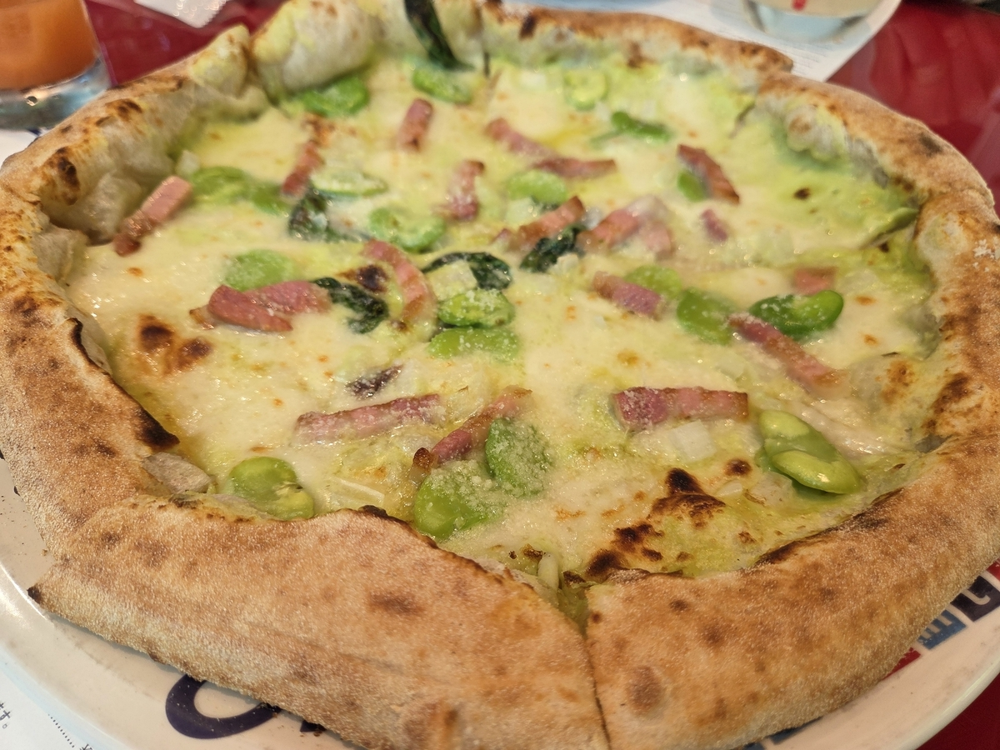
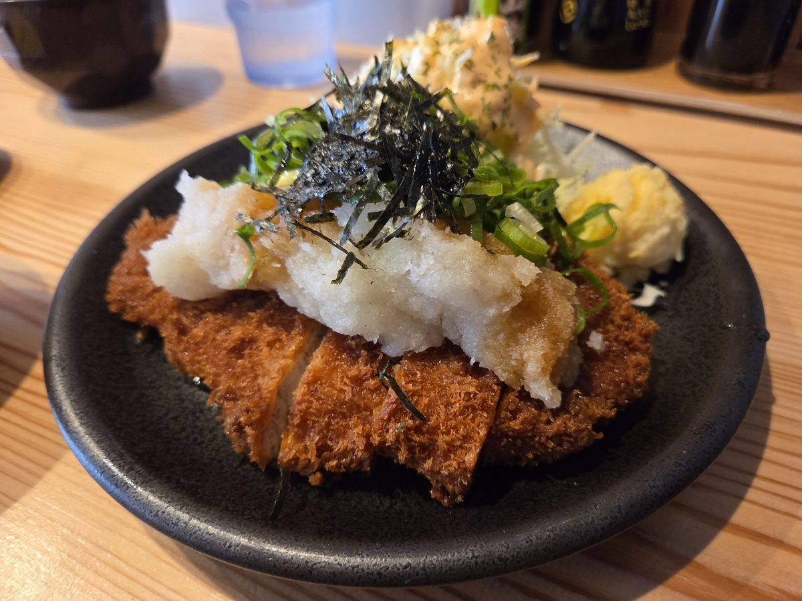
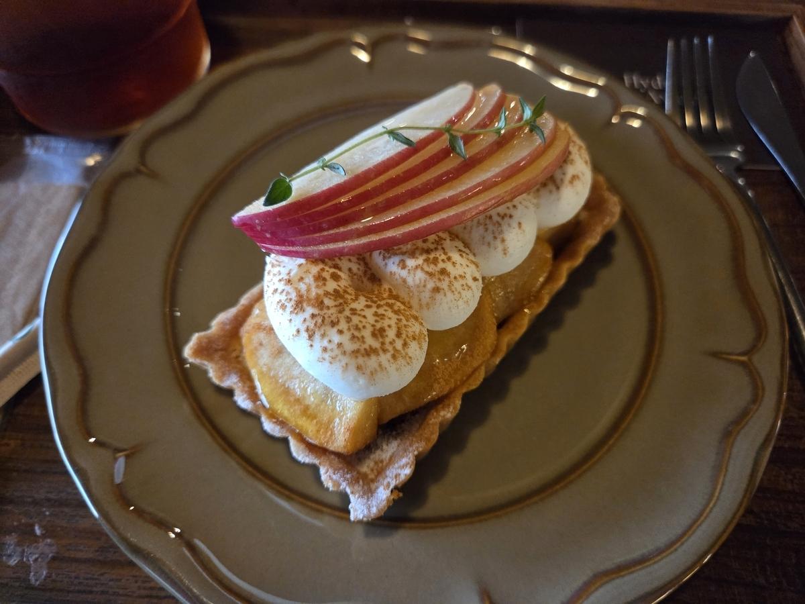
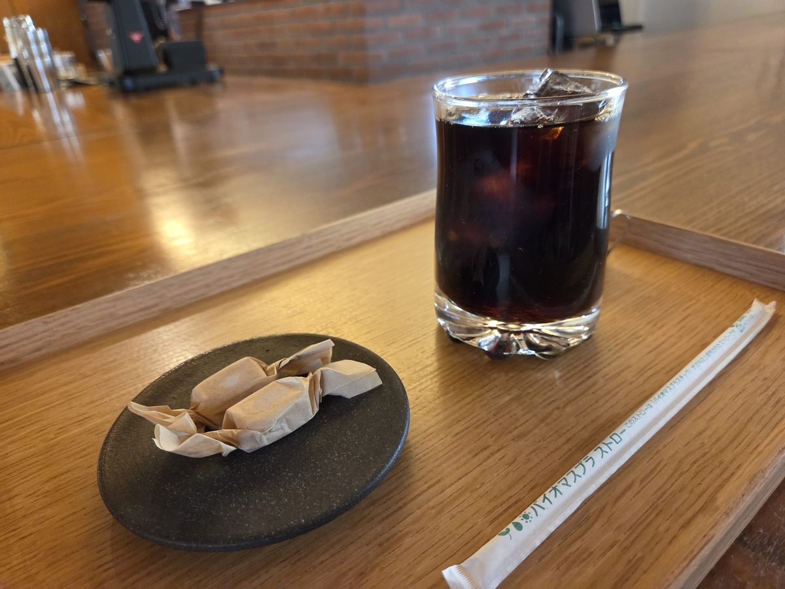
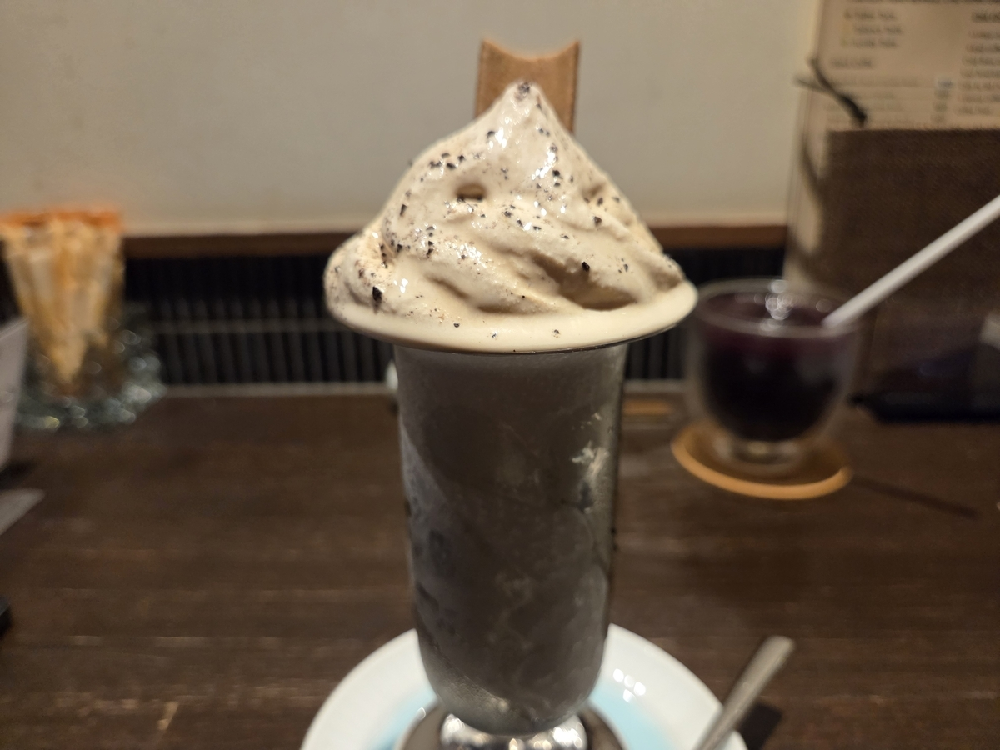
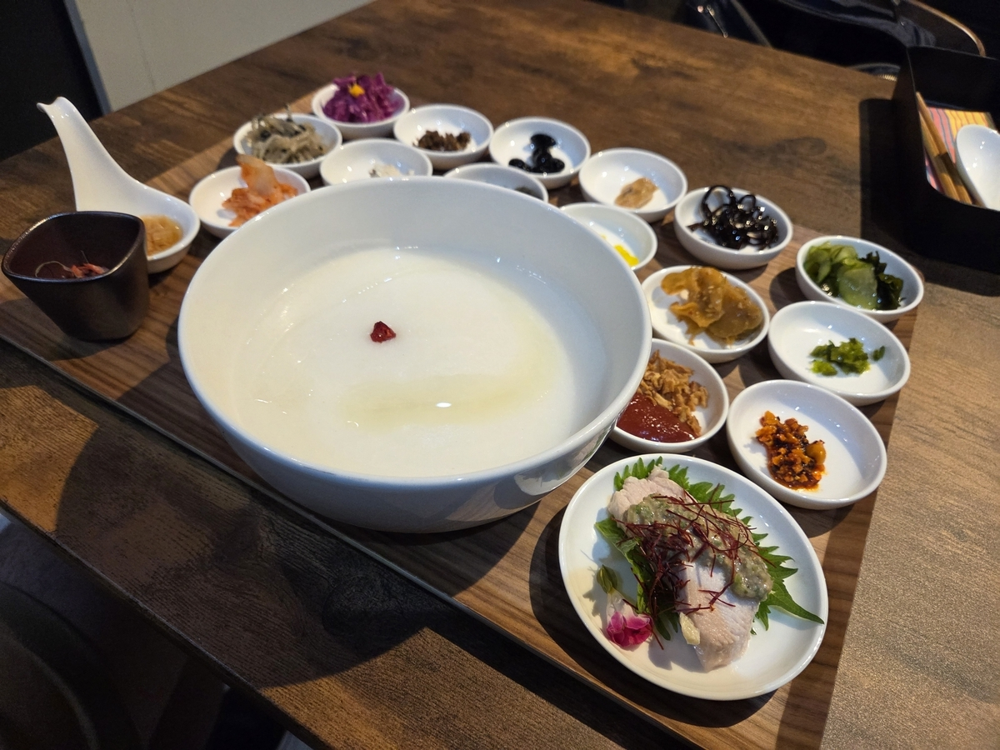
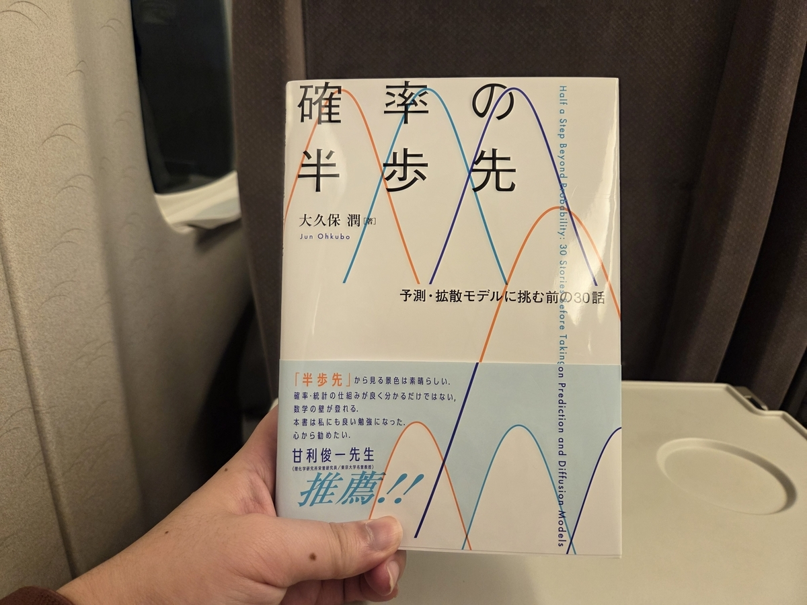

## 目次

１．２０２６年第３四半期の目標

２．２０２６年７月のまとめ

３．２０２６年７月に読んだ本（４冊／年間７０冊）

４．２０２６年７月に聴いたジャズ（５枚／年間３１枚）

## １．２０２６年第３四半期の目標

### １．１．趣味：新人賞に応募する

×：なんもやっとらん。

やっとらんくて、いま８月１日の夜に書いてるんですが、小説を読んでて、自分も書きたくなってる。

### １．２．健康：スナック菓子を買うのを一切やめ、毎夜エアロバイクを漕ぐ。

×：スナック菓子は２日に１回買い、エアロバイクは２日に１回漕いでる。

### １．３．仕事：転職を成功させる。

×：オアーーー。なんなら、小休止しようと思ってる（落ちすぎて気が狂ってきたので）

## ２．２０２６年７月のまとめ

### ２．１．家族・友人

**７月はよく家族・友人と遊んだ一ヶ月**でした。

映画『カウント・ベイシー』をジャズ好きの友人と観に行き、連載漫画を完結させた友人のお疲れ様会から始まり、家族と大学の友人を引き合わせたり、大学の先輩のサプライズバースデーパーティーに参加したり。



**サプライズバースデーパーティー**には企画人側として参加しました。極々プライベートな会なので詳細は割愛しますが、二段オチ型のサプライズ。一次会は「読書会」という名目で集合するものの、企画人側はターゲットよりも早く会場に集まってバルーンなどでの飾り付けやクラッカーを放つ位置のチェック、その他ダンドリをしておりました。ワクワクしましたね。企画の発起人がおっしゃっていたのは<strong>「こんな楽しいことに（ターゲット）は参加できないなんて彼に悪いね」</strong>。まさにまさにでした。当日のワイワイ準備はもちろん、企画用のＤｉｓｃｏｒｄサーバーでは何をしたらターゲットをサプライズできるか盛り上がっていました。二段オチの二段目は、二次会でのサプライズプレゼント。私も「かなり」奔走させていただきました。

というか、実は京都でやっておりまして、二泊三日で小旅行でした。ひたすら京都の好きな喫茶店を回って読書して食い倒れして。三日目なんかは<strong>（このままでは精神が京都に還ってしまい、東京に帰れなくなる……）</strong>と慌てて朝イチで東京の自室に戻りました。







### ２．２．小説

**電撃大賞は当然のように一次で落ちた**のであった。

### ２．３．トレーディング

**！！！聖杯解体宣言！！！**

初代〈聖杯〉のあまりの陰りに再検証したところ、ほとんどベータ（＝市場の動き）（むしろベータの増幅装置）だったことがわかり、まあ、十分に働いてくれたね、ということでお役御免に。ついでに〈水晶玉〉からも資金を引き揚げました。

じゃあその資金はどうしたのか。

デイトレ戦略〈ミュウツー〉、〈蛍の光〉および〈浮舟〉に回しました。全部フルオートにシステマチックなデイトレです。７月の最終週から文字通りフルオートで回ってます。**〈ミュウツー〉らを統べるシステム〈サカキ〉は、朝ＰＣが立ち上がると後は勝手に証券ソフトそのほか諸々を準備してくれて、市場が開いたら自動的に売り買いして、市場が閉じたらレポートを送ってくれる。**

<strong>８月の目標は「戦略・システムに手を加えない」</strong>です。安定的に動いている戦略・システムで、安定的なデータを取得し、十分なデータでもって分析する。それをやりたい。あと、フルコミットで投入してる可処分時間を徐々に減らしたい。そろそろ小説に戻ってもろて。



### ２．４．仕事

**転職も現職もカス**という状況です。

### ２．５．本

今月はトレーディング関係で４冊。<strong>『アルゴリズム取引』（足立高德）</strong>かな。システムトレードをやる金融業の中の人の視点が豊富で、類書はないと思います。また、板情報を数学で以てアルゴリズム的に取り扱う手法は初めて見た。トレーディングの背景知識ない読者の方にはなに書いてるかわからんかもしれんけど、まあ、とにかく、**実務に強い貴重な本**とご認識いただければ。



### ２．６．ジャズ

圧倒的に<strong>『Persona 5 Special Big Band Concert 2025』（Persona 5 Special Big Band）</strong>。キーボードがいい。[ここから](https://www.youtube.com/watch?v=mfbcBIWISkg)聴いてね。

### ２．７．そのほか

おれ、**起業しよう**と思ってるんだ……。

いや、転職も現職もカスという状況に気が狂ったというわけではなく、**法人格がないと買えないデータがあって**、ソイツを導入することでトレーディングで最強になりたいと思って……。まあ、そういうことを考えていると気が紛れるのでいいですね。８月は立て込んでるので動きは少ないだろうけど、**９月の月報では具体的なこと書いてる**可能性が高いです。

## ３．２０２６年７月に読んだ本

**①『イベントドリブントレード入門　価格変動の要因分析から導く出口戦略』（羽根英樹）**
かなり面白い。イベントドリブンの中でも、公募増資は頻度も高い上に需給バランスから不可避的に歪みが生じるので、再現性のあるトレードができそうだ。ちょっと検討してみよう。あと、浮動株の数を買えるの知らなかった。これも試す。

**②『情報と資産価格　AIによる株価予測の可能性』（前多康男）**
ムズカシ～！！！
基本的に効率的市場仮説とそれに対する反論、仮説の更新を追うのだが、とにかく理論と数式。AIはあんまなかったです。とは言え、理論を追う本って貴重なので本棚には残します。

**③『アルゴリズム取引による相場操縦　緊急差止命令に基づく抑止』（芳賀良）**
ここに「「「チャンス」」」あるかと思ったんですけど、ムズカシっす……。アルゴリズム取引そのものではなく、法制度に関する一冊ですね。

**④『アルゴリズム取引』（足立高德）**
いったん文字を追いました（数式は追ってません）。板情報の扱い方が詳しいのが特長。将来的にはきちんと数式を追わねば（シンプルに難しかった）。

## ４．２０２６年７月に聴いたジャズ

**①『Snatra/Basie: The Complete Reprise Studio Recordings』（Frank Sinatra, Count Basie）**
カウント・ベイシーの映画を観たので（その中で、フランク・シナトラとの交友についても触れられていた）。

**②『Persona 5 Special Big Band Concert 2025』（Persona 5 Special Big Band）**
まず、ビッグバンドの景気の良さがいい。その上で各楽器がしっかりソロパートを持っていて、聴かせどころがある。特に光るのはキーボード。この電子楽器のおかげで、ゲーム音楽のゲーム音楽らしさをたっぷりと味わえる。「Last Surprise」ですね。

**③『Blue Horizon』（Eric Miyashiro）**
聴きました。

**④『Live at Café Carlyle』（Stella Cole）**
ステラ・コールのライブ盤。スタンダード曲で一枚出せるのがアメリカのジャズ事情の豊かさって感じする。

**⑤『Golden Striker』（The Modern Jazz Quartet）**
MJQはサウンドに厚みがある。

（おわり）
