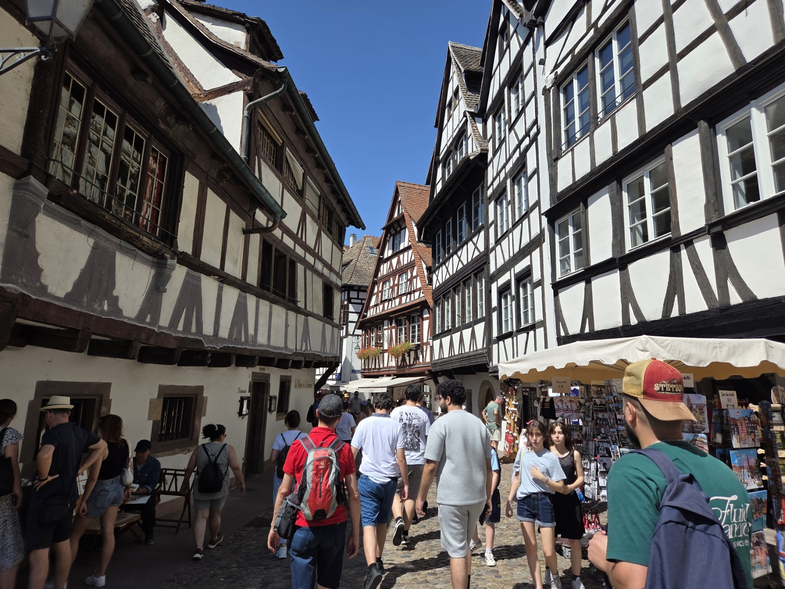
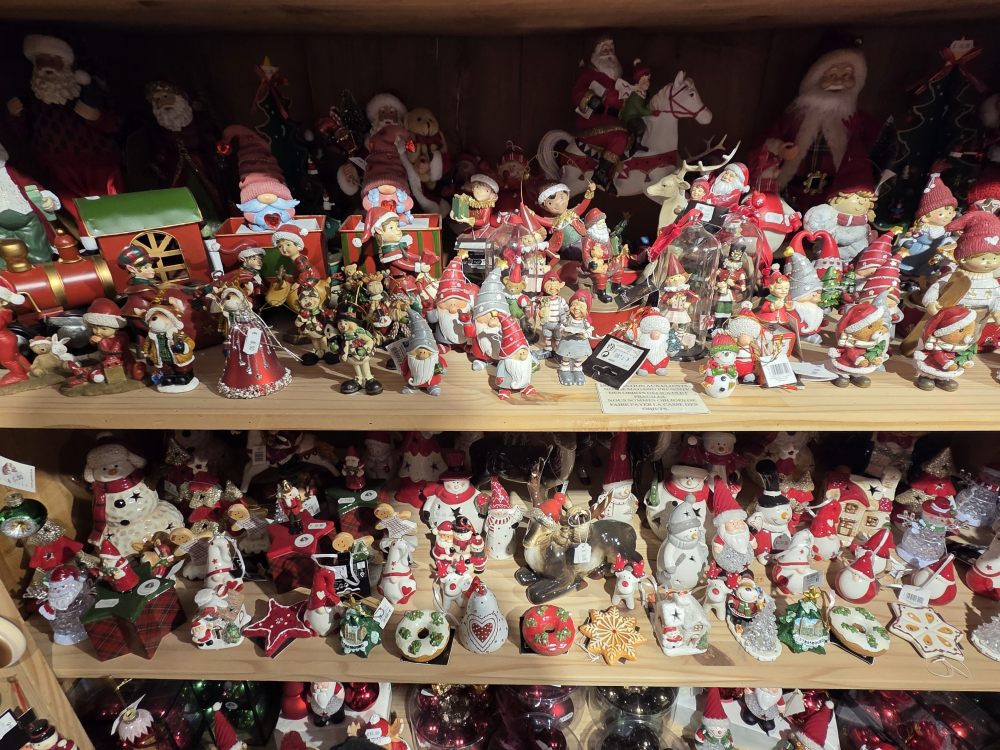
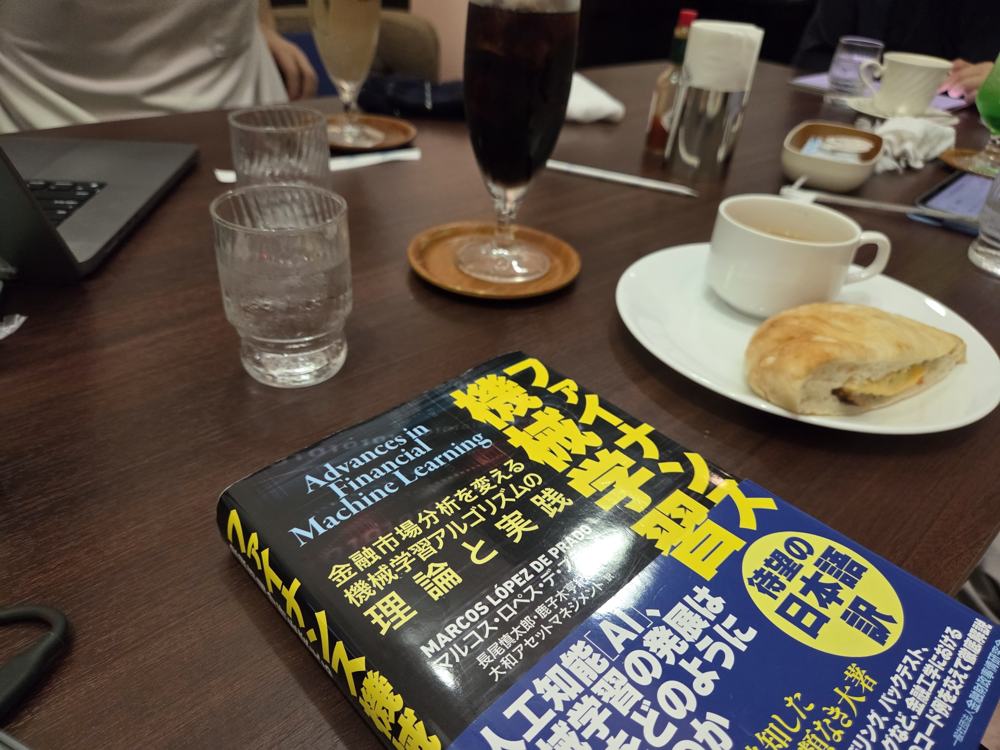

## 目次

１．２０２６年第３四半期の目標

２．２０２６年８月のまとめ

３．２０２６年８月に読んだ本（１３冊／年間８３冊）

４．２０２６年８月に聴いたジャズ（４枚／年間３５枚）

## １．２０２６年第３四半期の目標

### １．１．趣味：新人賞に応募する

○：『あそびのかんけい』（葵せきな）をキッカケに開眼、いま必死に直してます。

### １．２．健康：スナック菓子を買うのを一切やめ、毎夜エアロバイクを漕ぐ。

△：盆のヨーロッパ旅行まではよかったんだけどね。

### １．３．仕事：転職を成功させる。

×：小休止しました（落ちすぎて気が狂ったので）。

## ２．２０２６年８月のまとめ

### ２．１．家族・友人

盆休みでヨーロッパ旅行に行っていました。家族がヨーロッパの方と結婚し、そのパーティーがヨーロッパで開かれたため。
両親の通訳などに励み、あまり「ワイワイ！ヨーロッパ旅行！」って感じではなかったかな。




まあ、８月はその他も概ね遊び倒してたんですが、主催するDiscordサーバー「シストレ友の会」のメンバーで顔合わせするなど。


### ２．２．小説

**開眼**。

去年書いたやつを直しまくりっす。
『あそびのかんけい』の１巻に感動して、（いや、クネクネしている場合ではないな……！！！）と再起しました。
ブログ記事も書きました。
はてなブログでホットトピックに採用されてキモいコメントが来たので、「いっそ！」とはてなブログからGitHub Pagesにブログを移行しました。
はてな社にはお世話になったけど、なんか脇が甘いので……。


### ２．３．トレーディング

７月の月報では「*８月の目標は「戦略・システムに手を加えない」 です。安定的に動いている戦略・システムで、安定的なデータを取得し、十分なデータでもって分析する。それをやりたい。あと、フルコミットで投入してる可処分時間を徐々に減らしたい。そろそろ小説に戻ってもろて。* 」と宣言しました。
８月５日にちょっと手直ししてからは、３週間ノータッチで走らせ続けることができました。**もちろん黒字。**
手を入れたくなるのを耐えるのもシストレですね。

あとは、勉強会きっかけで〈蛍の光〉を超・強化しました。実運用が楽しみや。

### ２．４．仕事

先月に続き**転職も現職もカス**という状況です（２）。

### ２．５．本

今月はラノベの月。**『負けヒロインが多すぎる！（９）』（雨森たきび）** をようやく読み、 **『あそびのかんけい』（葵せきな）** に感動の萌え萌え。
マケイン９巻はすごい寂しい話でしたね。確かにラブコメではあるのだが、寂寥感がある。雨森たきびの手札が増えたのを感じました。
あそびのかんけいは萌え萌え。もう萌え萌えよ。半休取って杉並区コラボに馳せ参じたら当日１５時にはグッズ枯れてて爆笑しました。


### ２．６．ジャズ

**ラキーシャ・ベンジャミンの『Pursuance: The Coltranes』** がピカイチ。おかげでコルトレーンを聴き直しています。


### ２．７．そのほか

**起業**の話は、なかったことでお願いします。

## ３．２０２６年８月に読んだ本

**①『確率の半歩先』（大久保潤）**
なんとか30講追いかけました。学部生のときにあってほしかったけど、学部生のときにあっても真面目に読まなかっただろうな。

**②『倫敦スコーンの謎』（米澤穂信）**
存分に萌えました。上品だった。ありがとう。

**③『負けヒロインが多すぎる！（9）』（雨森たきび）**
読みました。寂しい話やったね。ここらで一回、1巻から読み直したいという気持ちもあるね。

**④『朝鮮漂流』（町田康）**
ひたすら良かった。

**⑤『ユニコーンレターストーリー』（北澤平祐）**
同じ日に生まれた幼なじみの男の子と女の子が、海を隔てて文通するティーンエイジを描く。各ページが温かみのあるイラストで彩られた一冊で、いや、本当にいい本でした。

**⑥『決算分析の地図　財務3表だけではつかめないビジネスモデルを視る技術』（村上茂久）**
眺めました。

**⑦『マリアビートル』（伊坂幸太郎）**
何度目かの再読。アクションと空間の使い方がピカイチ。

**⑧『777』（伊坂幸太郎）**
何度目かの再読。アクションと空間の使い方がピカイチ。

**⑨『あそびのかんけい』（葵せきな）**
爆裂に面白え……。
私はボドゲが好きで、大学時代はバイト代のかなりをAmazonドイツから直輸入ボドゲに費やし、サークルのみんなで英語のルルブを解読して遊んでて……。プレイヤーの思惑／感情がシステムのなかで表現されるのが好きだったんですよね。（この前書いた）自分の小説でもまさにこういうシーンを（カットしたものの）書いてまして。
本作、理想のラノベの一つです。よしざき、大絶賛。

**⑩『外資系コンサルの入社試験』（コンサルティングファーム研究会）**
眺めました。

**⑪『あそびのかんけい（2）』（葵せきな）**
ラストの畳みかけ、「ムホホ……」としか申し上げられませんぞ……。いや、本当に。「ムホホ……」以外の言葉を探すのが難しいですぞ。

**⑫『あそびのかんけい（3）』（葵せきな）**
すごい話だ……。

**⑬『あそびのかんけい（4）』（葵せきな）**
ちょっとえっちな話になるかと思いきや、急に潮目が変わったな。

## ４．２０２６年８月に聴いたジャズ

**①『Pursuance: The Coltranes』（Lakecia Benjamin）**
アメリカの気鋭サックス奏者ラキーシャ・ベンジャミンがコルトレーンに捧ぐ。特に『Love Supreme』から「Acknowledgement」（w/ Dee Dee Bridgewater）に趣がある。コルトレーンの原曲よりも「現代的」に感じるのだが、何が違うのだろうか？

**②『Whatchu Bringing?』（Dinner Party, Robert Grasper他）**
聴きました。

**③『Oneself Likeness』（Quasimode）**
悪い音楽ではないのだが「2000年代初頭の流行り」というニュアンスがどうもいまひとつ。

**④『We Dream』（Lakecia Benjamin）**
『Pursuance: The Coltrane』があまりに良く、これがきっかけでコルトレーンに触れ直す機会になったので、きちんと最新作も聴いてみた。芸風が広いわね。表題作「We Dream」や「Right Now」はボーカルもバキバキに決まってる。「Flame Keeper」は上原ひろみとのコラボ。
例によって柳樂先生の記事で知りました。
https://note.com/elis_ragina/n/nfff8f1cc6e72

（おわり）

