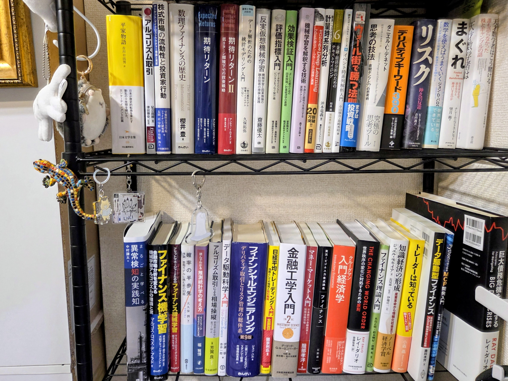

生成AIによる全面的な支援を受けたトレーディングシステムを運用しています。
AIは収益化できるトレーディングシステムは作れる。つまり、勝てます。
AI投資は、勝てまあす！！！！！！
というのが、私のスタンスです。
2026年6月からノーコードで作ったシステム、勝ちまくりです。

なのだが、**生成AIは収益化できる戦略を自発的に提案することはできない**とも思っている。
戦略と言ってもいろんな側面があるから「アイデア」に絞って書いてみる。  

まず、原理的に、生成AIが自発的に提案できるのは、「**多数派の手垢のついたアイデア**」だけ。生成AIって多数決屋さんなので。
ただ、トレーディングで勝つためには、その逆の「**少数派のフレッシュなアイデア**」と、その実装が必要。実装はもうやってくれる。
じゃあ生成AIは「少数派のフレッシュなアイデア」を知らないのかというと、そういう訳ではない。と思う。
生成AIはそのアイデアを知っている。知識はある。人間が聞けば教えてくれるし、人間が聞けば戦略への応用策も考えてくれる。
でも自発的な提案はしてくれない。そこに**ギャップ**がある。
したがって、2026年9月現在、人間が生成AIとともに戦略を作るために解くべき問題とは、「**いかにして生成AIが内部に持つ知識と生成AIが自発的に行う提案との間のギャップを埋めるか**」となる。
格好良く書くと「**いかにしてアイデアを自らの内に揃え、いかにしてそのアイデアを以てして生成AIの内の知識にアクセスし、いかにして生成AIに提案させるか**」となる。

平たく書くと、「**時代は勉強**」ということになる。
生成AIは知識を持っている。
でも、ユーザが知らない知識は提案しないし、実装もしない。
よしんば、提案してくれたとて、その良し悪しを人間が判断することはできない。
つまり、時代は勉強。


こう考えるようになった原体験がある。
私が持つ戦略の中で最強の戦略（2026年6月から9月までのプロフィットファクター：2.5以上）は、名著『**ファイナンス機械学習**』（マルコス・ロペス・デ・プラド）を素直に素直に実装したものである。

『ファイナンス機械学習』は2019年刊行と古く、何より名著なので、Claude Codeの知識には入っているらしい。「実装せえ」と命じたところ「*いい本っすよね～。じゃ、実装してみるっすよ～*」みたいな軽いノリで実装してくれた。が、私が命じるまで知ってるそぶりさえ見せなかった。
ところで、『**アルゴリズム取引**』（足立高德）という本がある。日本人が書いた本にしてはかなり珍しく、板情報の取扱いのノウハウが書かれている。2018年に朝倉書店から刊行されたマイナーな一冊だ。

『ファイナンス機械学習』でいい気になった私は、『アルゴリズム取引』に記されたノウハウもClaude Codeが簡単に実装してくれるだろうと思い込んでいたが、Claude Codeは知らなかった。少なくとも、ノウハウを簡単なワードやセンテンスで命じるだけでは再現できなかった。数式と背景知識までインプットしてようやくアウトプットを出してくれたが。
まとめると、
『ファイナンス機械学習』：私が勉強してアイデアに辿り着き、数センテンス命じるだけでClaude Codeが実装した（それまでClaude Codeは提案しなかった）。
『アルゴリズム取引』：私が勉強してアイデアに辿り着き、数式と背景知識をインプットして、ようやくClaude Codeが実装した（それまでClaude Codeは知らなかったし、提案もしなかった）。
となる。

ということを数日前にMastodonで書いていた。

書いていたところ、私淑するUKI氏＆Hoheto氏が折良く似た話題の動画を出されていた。

ので、乗っかった次第です。
**私も単純な指標では勝てないと思います**。
ただ、勉強することでシャープな指標を作れるようになり、そこにはまだアルファが残っていると信じる次第です。
時代は勉強。

（おわり）

