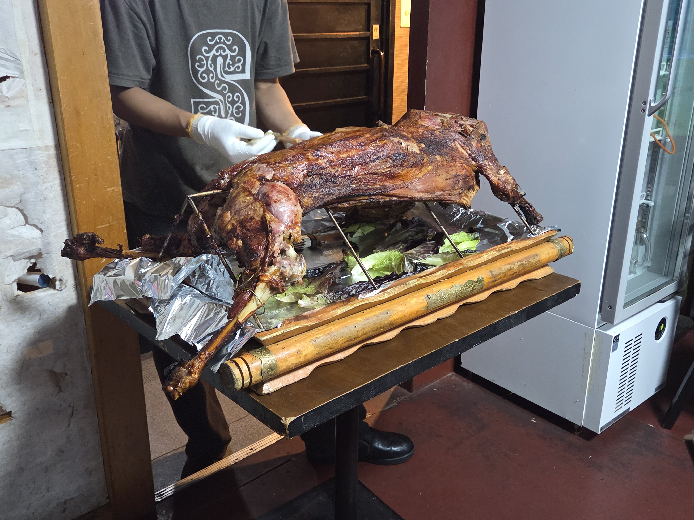

## 目次

１．２０２６年第３四半期の目標

２．２０２６年９月のまとめ

３．２０２６年９月に読んだ本（３冊／年間８６冊）

４．２０２６年９月に聴いたジャズ（３枚／年間３８枚）

## １．２０２６年第３四半期の目標

### １．１．趣味：新人賞に応募する

★：応募しました！

### １．２．健康：スナック菓子を買うのを一切やめ、毎夜エアロバイクを漕ぐ。

○：スナック菓子を買うのを一切やめ、エアロバイクは２日に１回漕いでる。

### １．３．仕事：転職を成功させる。

○：「波」また来てます。下半期が始まったからだね。

## ２．２０２６年９月のまとめ

### ２．１．家族・友人

９月は割とずっと小説を書いてた気がする。小説を書いたり、ちょこちょことシステムを直したり。
遊びに出かけたのは羊丸焼きの会＠スヨリトくらいかな。
大所帯の楽しい会でした。主催のゆりしーずさん、ありがとうございました。


あとは、最近は家族が冷凍弁当にハマっていて、私も同じレシピで生産を始めたり。
自炊って安いね（親元離れて何年目！？）

### ２．２．小説

応募完了。
今回、限られた時間の中でかなりよく直せたと信じている次第なのですが、それでも天井のようなものは感じていて、それはこの小説を当初設計した時のキャラクターや、キャラクターの声（ボイス）や、物語構造の天井なんだと思います。レベルアップするためには、新しく作る必要ありますね。痛感しました。

### ２．３．トレーディング

順調に動いています。

### ２．４．仕事

現職：世界の大勢また我に利あらず

### ２．５．本

統計学・機械学習関係の本を大量に買い込みました。まあ、いずれ。

### ２．６．ジャズ

石若駿の『Mabui』を聴いて下さい。よろしくお願いします。今年ベスト。


## ３．２０２６年９月に読んだ本

**①『評価指標入門』（高柳慎一）**
機械学習をビジネスに応用するにあたって、そもそもビジネスでは何を求められるのかから考える。
機械学習×ビジネスの観点からは、
目的関数：機械学習で学習して最小化／最大化を目指す関数
評価指標：自分たちが達成したいビジネス上の目標との近さを学習後に計るための指標
KPI：ビジネス上の目標の達成度合いを計るための指標
という整理がある。
この切り分けをミスると機械学習の目的関数をコネコネするだけに留まってビジネス上のKPIは達成されない。そのためには、二つを繋ぐ評価指標を適切に設定しなければならない。評価指標には、教科書的な様々な指標があるが、そもそもビジネスに適合するように自分で作ってもよい。
今まさに「自分で評価指標を上手く設定したい」というケースがあって、ちょうど刺さる。助かる。
読書メモ：

**②『技術書の読書術』（IPUSIRON、増井敏克）**
スコープは技術書に限られないかな。ゆえに、新しい発見はあんまなかったです。

**③『疲れ切った人のための勉強法』（堀田秀吾）**
ざくっとパラ読み。
「勉強とは机の前に座って長時間集中してやるものだ」という固定観念を解きほぐそうとする一冊。学生と違って、働いていれば勉強以外に時間・体力を消費するし、そんな中でもどうすれば勉強をできるのか、様々な研究結果を引きながら概観する。
・まずは勉強を細切れのカケラにしてもいいと気楽に構える
・むしろ細切れの勉強のカケラをスキマ時間に入れていく
・運動とセットだと勉強の効果は上がる
・休憩せえ
・休憩中にはスマホを触るな
・コンディションにマッチするように勉強法を切り替えろ
あたり学び。
私は十代の時には優秀な受験生だった。その当時のスタンスで勉強しようとしてザセツするパターンを繰り返しているので、上手いこと学び方を変えていきたいですね。
## ４．２０２６年９月に聴いたジャズ

**①『Scenes from a Velvet Room』（Stephan Maccio）**
聴きました。ダウナーでいいね。

**②『Duke Ellington & John Coltrane』（Duke Ellington, John Coltrane）**
聴きました。

**③『Mabui』（石若駿）**
最高です。今年ベストかな。（聴いたの結構前なので詳細は割愛）

（おわり）
